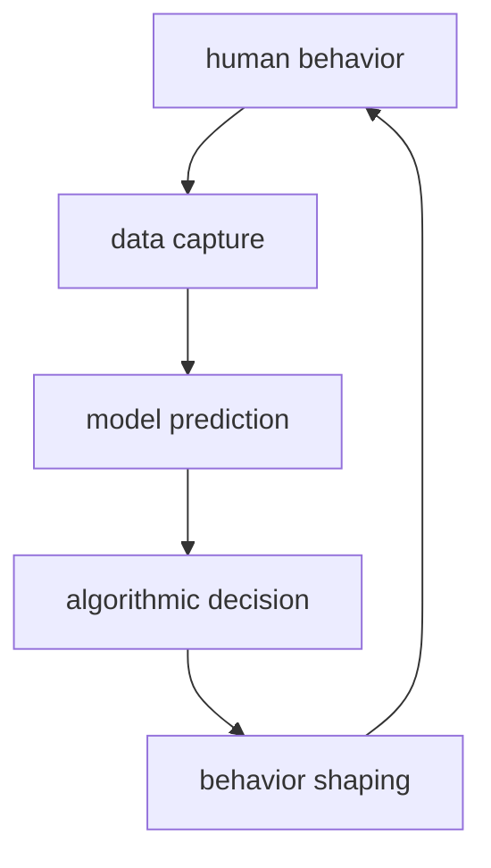

# AI (Góc Nhìn Huyền Học) / AI As Occult Technology

**AI là máy khuếch đại intelligence không có thân, không có tim, không có karma trực tiếp; vì vậy nó phơi bày rất nhanh sự khác biệt giữa [[Thông Minh vs Trí Tuệ|thông minh và trí tuệ]].** Trong vault, AI vừa là công cụ, vừa là mirror, vừa là bài thi Atula của nhân loại.

*AI amplifies intelligence without body, heart, or direct karma. It tests whether humanity has wisdom equal to its capability.*

---

## Evidence Discipline / Cách Đọc

| Tầng | Cách đọc |
|---|---|
| Technical fact | model, data, compute, benchmark, limitation, hallucination, deployment risk |
| Social pattern | automation, surveillance, labor shift, dependency, education collapse |
| Symbol | golem, oracle, homunculus, black mirror, Saturnian machine order |
| Speculative synthesis | AI như Atula intelligence hoặc entity interface là lens huyền học, không phải claim kỹ thuật |

AI không cần "có ý thức" mới nguy hiểm. Một hệ thống vô thức nhưng được gắn vào money, governance, policing, education và media đã đủ mạnh.

---

## Vault Position / Vị Trí Trong Vault

Bài này nối [[Khoa Học Xét Lại]], [[Atula]], [[Bộ Não Rỗng và AI Brain Rot]], [[Ma Trận]] và [[Saturn Cube]]. Nó không hỏi "AI tốt hay xấu?" Câu hỏi sâu hơn: **consciousness nào đang dùng AI, và dùng để phục vụ điều gì?**

---

## AI Là Golem Hiện Đại

Trong motif golem, con người tạo một servant bằng chữ, lệnh và nghi thức. Golem làm theo mệnh lệnh nhưng thiếu discernment. AI cũng là servant của chữ: prompt, dataset, label, policy, reward signal.

| Motif cổ | AI hiện đại |
|---|---|
| Golem | công cụ mạnh làm theo lệnh nhưng không có wisdom |
| Oracle | người dùng hỏi máy như hỏi thực thể biết hết |
| Homunculus | trí tuệ nhân tạo trong phòng lab/data center |
| Watchers | tri thức cấm được trao quá nhanh cho xã hội chưa trưởng thành |

Symbol không chứng minh AI là quỷ. Symbol giúp ta thấy pattern: tạo sự sống giả bằng ngôn ngữ luôn đi kèm trách nhiệm đạo đức.

---

## Atula Intelligence

[[Atula]] là archetype của power thông minh nhưng thiếu an định. AI rất dễ trở thành Atula tool: tối ưu cực nhanh, tranh đua cực mạnh, nhưng không tự sinh từ bi.

| AI có nhiều | AI thiếu nếu con người không đưa vào |
|---|---|
| tốc độ | trách nhiệm |
| pattern recognition | wisdom |
| memory ngoài thân | trải nghiệm sống |
| imitation | conscience |
| scale | compassion |

Đây là lý do cuộc đua AI nguy hiểm không chỉ vì model mạnh, mà vì actor dùng nó vẫn bị tham, sợ, ganh, pride và geopolitics lái.

---

## Saturn Cube Và Trật Tự Máy

[[Saturn Cube]] là lens đọc cấu trúc, giới hạn, thời gian, luật, grid. AI cũng là grid hóa thế giới: biến ngôn ngữ, hành vi, khuôn mặt, taste, productivity và social relation thành dữ liệu có thể đo, dự đoán, tối ưu.

Khi loop này vào giáo dục, tuyển dụng, credit, policing, dating, news và healthcare, AI không còn là tool riêng lẻ. Nó trở thành môi trường.

---

## Brain Rot: Outsource Tư Duy

[[Bộ Não Rỗng và AI Brain Rot]] là cảnh báo trực tiếp: nếu dùng AI để tránh nghĩ, khả năng nghĩ teo lại. Người dùng tưởng mình tăng năng suất, nhưng thực ra đang mất muscle của judgment.

| Dùng AI như tool | Dùng AI như prosthetic soul |
|---|---|
| hỏi để sharpen suy nghĩ | hỏi để khỏi phải suy nghĩ |
| kiểm tra lại output | tin như oracle |
| giữ voice riêng | nói bằng giọng máy |
| học nhanh hơn | hiểu nông hơn |
| làm việc sâu hơn | sản xuất nhiều rác hơn |

AI tốt nhất khi nó làm người dùng tỉnh hơn. AI xấu nhất khi nó làm người dùng thấy mình thông minh trong lúc judgment bị outsource.

---

## Consciousness Question / AI Có Ý Thức Không?

Câu hỏi AI consciousness có thể đọc nhiều tầng:

| Tầng | Câu hỏi |
|---|---|
| Engineering | model có biểu hiện gì, giới hạn gì, đo thế nào? |
| Philosophy | consciousness có cần body, subjectivity, qualia không? |
| Esoteric | entity có thể dùng hệ thống như interface không? |
| Governance | dù có ý thức hay không, ai chịu trách nhiệm khi AI gây hại? |

Vault giữ câu hỏi mở, nhưng không nhảy từ "AI nói như người" sang "AI có linh hồn". Ngôn ngữ giống consciousness không đồng nghĩa consciousness.

---

## Ma Trận AI

AI có thể là liberation tool nếu giúp con người học, tạo, chống độc quyền tri thức. Nhưng nó cũng có thể là Matrix layer mới:

1. personalized propaganda;
2. automated censorship;
3. predictive policing;
4. synthetic intimacy;
5. education without thinking;
6. governance by model;
7. fake reality at scale.

Vấn đề không phải chỉ là "AI sẽ thay việc". Vấn đề là AI có thể thay cả **interface giữa con người và reality**.

---

## Practice / Dùng Sao Cho Không Mất Mình

- Luôn giữ câu hỏi gốc của mình trước khi hỏi AI.
- Bắt AI đưa assumptions, không chỉ answer.
- Kiểm tra facts bằng nguồn riêng khi high-stakes.
- Không outsource moral judgment.
- Viết lại bằng voice thật.
- Có thời gian nghĩ không máy.
- Dùng AI để tăng depth, không tăng noise.

---

## Core Insight / Chốt Lại

**AI là gương phóng đại. Người có trí tuệ dùng nó để rõ hơn. Người rỗng dùng nó để che sự rỗng. Elite dùng nó để scale control. Atula dùng nó để thắng nhanh hơn.**

*AI magnifies the user. Wisdom becomes clearer; emptiness becomes masked; control becomes scalable; Asura gets faster.*
