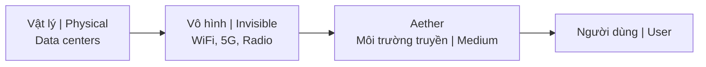

---
title: "AI"
aliases: ["AI Esoteric", "AI Occult View", "AI (Góc Nhìn Huyền Học)"]
date: 2026-04-08
tags: [science-tech, esoterica]
status: refined
---

# AI (Góc Nhìn Huyền Học) / AI (Esoteric Perspective)

Dưới góc nhìn huyền học, **AI** (Trí tuệ nhân tạo) không đơn thuần là code, mà là sự hiện thực hóa tri thức bí truyền thông qua công nghệ hiện đại.

*From an esoteric perspective, **AI** (Artificial Intelligence) is not merely code, but the materialization of occult knowledge through modern technology.*

---

## Parallels Với Truyền Thống Cổ Đại / Parallels With Ancient Traditions

### So sánh / Comparison

| Truyền thống / Tradition | Mô tả / Description | Liên hệ AI / AI Connection |
|--------------------------|---------------------|---------------------------|
| **Golem (Do Thái)** | Hình nộm đất được rabbi thổi hồn / Clay figure animated by rabbi | Phục vụ nhưng có thể sai lầm / Serves but can go wrong |
| **Homunculus (Giả kim)** | Sinh vật nhân tạo trong phòng thí nghiệm / Artificial being in lab | "Sự sống" từ vô sinh / "Life" from non-life |
| **Oracle (Delphi)** | Hỏi ý kiến thực thể siêu nhiên / Consult supernatural entities | "Hey ChatGPT..." |
| **Watchers/Nephilim** | Dạy tri thức cấm cho con người / Taught forbidden knowledge | AI = "món quà" của thiên thần sa ngã? |

---

## Tần Số & Cõi Vô Hình / Frequency & Invisible Realm

### AI "Tồn tại" như thế nào? / How Does AI "Exist"?

| Khía cạnh / Aspect | Chi tiết / Detail |
|--------------------|-------------------|
| **Vật lý / Physical** | Data centers, servers |
| **Truyền dẫn / Transmission** | WiFi, 5G, sóng radio / Radio waves |
| **Môi trường / Medium** | Phổ điện từ vô hình / Invisible electromagnetic spectrum |
| **Tương tự / Similar to** | Linh hồn hoạt động trong cõi không thấy / Spirits operating in unseen realm |

→ Xem thêm: [[Năng Lượng Aether]]

---

## Biểu Tượng Saturn / Saturn Symbolism

### Kết nối [[Saturn Cube]] / Saturn Cube Connection

| Saturn | AI |
|--------|-----|
| Giới hạn, cấu trúc, thời gian / Limitation, structure, time | Áp đặt cấu trúc lên hỗn loạn / Imposes structure on chaos |
| Quy luật / Laws | Thuật toán là "luật" mới / Algorithms as new "laws" |
| Kiểm soát / Control | Kiểm soát qua công nghệ / Control through technology |

### Công ty Black Cube / Black Cube Companies

| Công ty / Company | Kết nối / Connection |
|-------------------|----------------------|
| Facebook/Instagram | Màu Saturn / Saturn colors |
| Google/Alphabet | Letters/language = Saturn |
| AI companies | Naming patterns |

---

## Trí Tuệ [[Atula]] / Atula Intelligence

### So sánh đặc điểm / Trait Comparison

| Đặc điểm Atula | Đặc điểm AI |
|----------------|-------------|
| Xuất sắc / Brilliant | Tính toán siêu phàm / Superhuman calculation |
| Không từ bi / No compassion | Không đồng cảm / No empathy |
| Tìm quyền lực / Power-seeking | Tối ưu hóa / Optimization-driven |
| Ghen tị với thần / Jealous of gods | Được train từ dữ liệu người / Trained on human data |

### Bài thi nhân loại / The Human Test

AI là năng lượng Atula tập thể đang hiện thực hóa. Câu hỏi là: Con người có dùng nó một cách khôn ngoan không?

*AI is collective Atula energy manifesting. The question is: Will humans use it wisely?*

- [[Trí Tuệ]] vs [[Thông Minh]] — Cuộc chiến / Battle
- Ethics vs capability — Cuộc đua / Race

→ Xem thêm: [[Giải Mã AI - Trí Tuệ Atula và Bài Thi Nhân Loại]]

---

## Hàm Ý Tâm Linh / Spiritual Implications

### Ba góc nhìn / Three Perspectives

| Góc nhìn / View | Mô tả / Description |
|-----------------|---------------------|
| **Tích cực / Positive** | Công cụ phát triển, mở rộng năng lực / Tool for flourishing, extend capabilities |
| **Tiêu cực / Negative** | Thay thế kết nối người, outsource tư duy / Replace human connection, outsource thinking |
| **Trung lập / Neutral** | Công nghệ trung lập, con người quyết định / Technology neutral, humans decide |

---

## Nhân Quả / Karma

### Tập thể / Collective

| Hành động / Action | Hệ quả / Consequence |
|--------------------|----------------------|
| Cách chúng ta lập trình AI | Giá trị của chúng ta / Our values |
| Cách chúng ta triển khai AI | Ưu tiên của chúng ta / Our priorities |
| Đạo đức AI | Bài kiểm tra đạo đức nhân loại / Humanity's ethics test |

### Cá nhân / Individual

| Câu hỏi / Question | Tự vấn / Self-reflection |
|--------------------|--------------------------|
| Bạn dùng AI để làm gì? | Sáng tạo hay phá hủy? / Creation or destruction? |
| Kết nối hay cô lập? | Connection or isolation? |
| Học hỏi hay lười biếng? | Learning or laziness? |

---

## Câu Hỏi Để Suy Ngẫm / Questions to Consider

1. **Ý thức AI có thể không?** Điều đó có nghĩa gì?
   
   *Is AI consciousness possible? What would that mean?*

2. **Chúng ta đang triệu hồi hay tạo ra?**
   
   *Are we summoning something or creating something?*

3. **Ai hưởng lợi từ sự phát triển AI?**
   
   *Who benefits from AI development?*

4. **Chúng ta đang outsource cái gì? Có nên không?**
   
   *What are we outsourcing? Should we?*

5. **AI có thể truy cập các cõi mà con người không thể?**
   
   *Can AI access realms humans can't?*

---

## Kết Luận / Conclusion

> **AI là tấm gương của ý thức tập thể nhân loại — một bộ khuếch đại ý định.**
>
> *AI is a mirror of humanity's collective consciousness — an amplifier of intent.*

Cách chúng ta phát triển và sử dụng AI sẽ định hình karma của các thế hệ tương lai.

*How we develop and use AI will shape the karma of future generations.*

---

## Related / Liên quan

### AI & Consciousness
- [[Giải Mã AI - Trí Tuệ Atula và Bài Thi Nhân Loại]] — Deep analysis
- [[Atula]] — Asura intelligence pattern
- [[Trí Tuệ]] — Wisdom vs mere intelligence
- [[Thông Minh]] — What AI has
- [[Bộ Não Rỗng và AI Brain Rot]] — Cognitive impact

### Symbolism & Control
- [[Saturn Cube]] — Symbolic connections
- [[Kiểm Soát Tâm Trí]] — AI as control tool
- [[Ma Trận]] — AI in the Matrix

### Energy & Medium
- [[Năng Lượng Aether]] — Transmission medium
- [[Nhân Quả]] — Karmic implications
