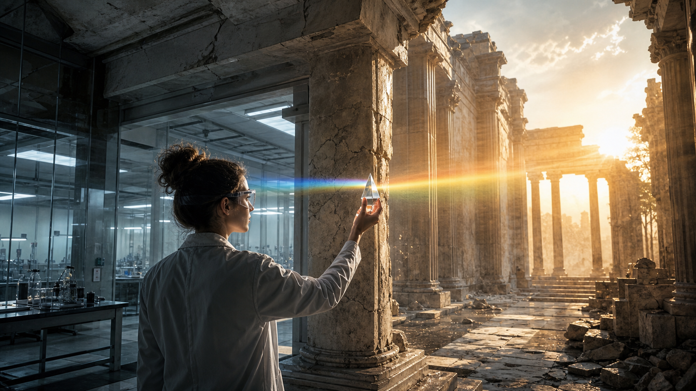

# Khoa Học Xét Lại (Revisionist Science)

**Khoa Học Xét Lại không phải phản khoa học. Nó là kỷ luật phân biệt science như method với science như institution: một bên là quan sát, kiểm chứng, phản biện; một bên là funding, prestige, consensus, censorship, career incentive và quyền lực.**

*Revisionist Science is not anti-science. It separates science as method from science as institution: observation, testing and correction on one side; funding, prestige, consensus, censorship and power on the other.*

---

## Vault Position / Vị Trí Trong Vault

Bài này là cổng vào của [[MOC - Science Revisionism]] và là một lớp bảo vệ cho toàn vault. Không có nó, redpill.wiki dễ trôi thành niềm tin mù. Nhưng nếu dùng sai, nó cũng thành phản xạ phủ định mọi thứ mainstream chỉ vì nó mainstream.

Khoa Học Xét Lại đứng cạnh [[Source Discipline - Kỷ Luật Nguồn Và Bằng Chứng]] và [[Cách Đọc Red Pill Wiki]]: nó không cho institution độc quyền sự thật, nhưng cũng không cho alternative culture miễn kiểm chứng.

> Đừng nhầm institution với truth. Đừng nhầm consensus với reality. Đừng nhầm peer review với direct seeing.

---

## Evidence Discipline / Cách Đọc Claim

| Tầng | Cách đọc | Ví dụ |
|---|---|---|
| **Fact / documentable** | paper, patent, replication, funding record, lịch sử institution | replication crisis, industry-funded research |
| **Pattern / systems reading** | incentive nào tạo consensus, dissent bị xử lý ra sao | pharma, nutrition, cosmology, virology |
| **Symbol / myth reading** | lab coat, rocket, atom, “expert” như priesthood icon | NASA, Einstein, white coat authority |
| **Speculative synthesis** | model thay thế cần giữ mở nhưng không giả làm fact | aether, suppressed tech, hidden cosmology |

Một institution từng sai không làm mọi alternative claim đúng. Nhưng một institution có prestige cũng không làm assumption của nó bất khả nghi.

---

## Science Method vs Science Institution

Science như method là một công cụ giải phóng: quan sát, giả thuyết, kiểm chứng, lặp lại, sửa sai, cho phép người khác phản biện. Science như institution là một hệ thống xã hội: ai tài trợ, journal nào có prestige, career nào được thăng tiến, câu hỏi nào được grant, dissent nào bị gắn nhãn dangerous.

Khi method còn sống, câu hỏi được thưởng. Khi institution biến thành priesthood, câu hỏi bị xem là tội phạm đạo đức. Đây là điểm mà [[Nghịch Lý Của Hiểu Biết]] xuất hiện: càng biết nhiều, con người càng dễ tưởng mình đã thấy toàn bộ.

---

## Consensus: Khi Đồng Thuận Thành Giáo Điều

Consensus có thể hữu ích khi nó là kết quả của evidence mạnh. Nó nguy hiểm khi được tạo bởi funding bias, publication bias, regulatory capture, media simplification và political pressure.

Câu hỏi cần hỏi không phải “bao nhiêu expert đồng ý?”. Câu hỏi sắc hơn là: nếu một nhà khoa học trẻ phản biện model này, họ được debate, được funding, hay bị hủy career?

Một hệ thống tự tin vào truth sẽ cho phép kiểm chứng. Một hệ thống sợ mất mặt sẽ gọi kiểm chứng là misinformation.

---

## Các Chiến Trường Chính / Main Battlefields

**Cosmology** hỏi con người đang ở đâu trong reality. [[Mô Hình Địa Tâm]], [[Thuyết Trái Đất Phẳng]] và [[Bộ Tam Thánh Mind Control - NASA Disney Hollywood]] không chỉ là tranh luận bản đồ; chúng là stress test của perception, authority và myth-making.

**Medicine & Biology** là nơi institution chạm trực tiếp thân xác. [[Thuyết Vi Sinh Nội Sinh]], [[Kính Chiếu Yêu - Nhìn Thấu Tây Y]] và [[MOC - Health Sovereignty]] hỏi: khi health thành market, disease model nào được thưởng?

**Physics & Energy** là chính trị của scarcity. [[Nikola Tesla]], [[Năng Lượng Aether]] và [[Giải Mã Năng Lượng Hạt Nhân & Cú Lừa Phóng Xạ]] đặt câu hỏi: nếu năng lượng dồi dào hơn model hiện tại cho phép, ai mất quyền lực?

**History & Anthropology** phá myth “modernity là đỉnh cao”. [[Atlantis]], [[Tartaria]] và [[MOC - Ancient Civilizations & Hidden History]] hỏi liệu lịch sử có bị reset, cắt lớp và viết lại không.

---

## Những Bẫy Của Revisionism

Bẫy lớn nhất là đổi giáo điều này lấy giáo điều khác. Mainstream sai không tự động làm alternative đúng. Càng bị cấm cũng không tự động là proof. Pattern không phải proof. Symbol không phải document. Speculation không phải verdict.

Một reader trưởng thành biết rank confidence: cái nào documentable mạnh, cái nào là pattern đáng nghi, cái nào là symbolic, cái nào là speculative nhưng hữu ích, và cái nào hiện chưa đủ.

---

## Core Insight / Chốt Lại

**Khoa học như method hỏi. Khoa học như priesthood đóng dấu. Khoa học như method sửa sai. Khoa học như priesthood giữ mặt mũi. Revisionist Science là giữ method sống sau khi institution muốn biến nó thành giáo điều.**

*Science dies when consensus becomes obedience. Revisionist Science keeps the question alive without worshipping every alternative answer.*
