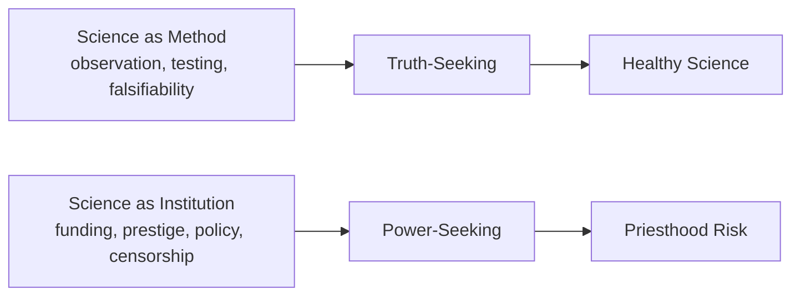
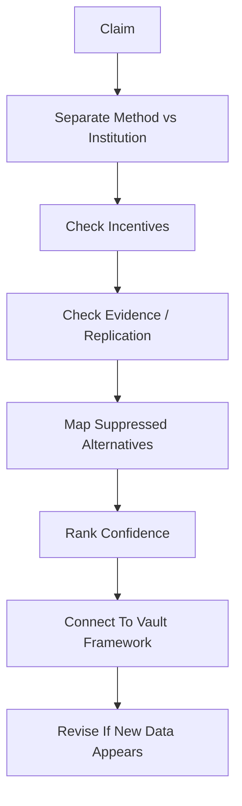

# Khoa Học Xét Lại (Revisionist Science)

**Khoa Học Xét Lại không phải phản khoa học. Nó là kỷ luật phân biệt science như method với science như institution: một bên là quan sát, kiểm chứng, phản biện; một bên là funding, prestige, consensus, censorship, career incentive và quyền lực.**

*Revisionist Science is not anti-science. It is the discipline of separating science as method from science as institution: one side is observation, verification, and challenge; the other is funding, prestige, consensus, censorship, career incentives, and power.*

---

## Vault Position / Vị Trí Trong Vault

**Khoa Học Xét Lại** là immune system của redpill.wiki.

Không có nó, vault dễ biến thành niềm tin mù. Nhưng nếu dùng sai, nó cũng có thể thành phản xạ phủ định mọi thứ mainstream chỉ vì nó mainstream.

Tinh thần đúng không phải “khoa học chính thống luôn sai”. Tinh thần đúng là:

> Đừng nhầm institution với truth. Đừng nhầm consensus với reality. Đừng nhầm peer review với direct seeing.

Bài này là cổng vào cho [[MOC - Science Revisionism]], [[Thuyết Vi Sinh Nội Sinh]], [[Mô Hình Địa Tâm]], [[Thuyết Trái Đất Phẳng]], [[Giải Mã Năng Lượng Hạt Nhân & Cú Lừa Phóng Xạ]], [[Nikola Tesla]], [[Năng Lượng Aether]] và [[Kính Chiếu Yêu - Nhìn Thấu Tây Y]].

---

## Evidence Discipline / Cách Đọc Claim

| Tầng | Cách đọc | Ví dụ |
|---|---|---|
| **Fact / documentable** | lịch sử funding, paper, experiment, replication, institutional conflict | replication crisis, regulatory capture, industry-funded science |
| **Pattern / systems reading** | consensus đi cùng incentive nào, dissent bị xử lý ra sao | pharma, climate, cosmology, nutrition, virology |
| **Symbol / myth reading** | “scientist-priest”, icon, lab coat, rocket, atom, space myth | Einstein, NASA, nuclear age, white coat authority |
| **Speculative synthesis** | model thay thế, suppressed tech, hidden cosmology | aether, geocentrism, flat earth, free energy |

Điểm quan trọng: model thay thế không tự động đúng chỉ vì mainstream có vấn đề. Nhưng mainstream cũng không tự động đúng chỉ vì nó mặc áo institution.

---

## 1. Science Method vs Science Institution

Science như method là một trong những công cụ đẹp nhất của con người:

- quan sát,
- đặt giả thuyết,
- kiểm chứng,
- lặp lại,
- sửa sai,
- cho phép người khác phản biện.

Science như institution lại là một hệ thống xã hội:

- ai tài trợ research,
- journal nào được prestige,
- career nào được thăng tiến,
- câu hỏi nào được grant,
- dissent nào bị gắn nhãn dangerous,
- regulator nào bị capture,
- corporation nào hưởng lợi.

Khoa Học Xét Lại không phá science. Nó bảo vệ science khỏi việc bị biến thành priesthood.

---

## 2. Khi Consensus Trở Thành Giáo Điều

Consensus có thể hữu ích khi nó là kết quả của evidence mạnh. Nhưng consensus trở thành nguy hiểm khi nó là sản phẩm của:

- funding bias,
- publication bias,
- career risk,
- regulatory capture,
- censorship,
- media simplification,
- political pressure,
- “trust the experts” psychology.

Một câu hỏi tốt:

> Nếu một nhà khoa học trẻ phản biện model này, họ được thưởng, được tranh luận, hay bị hủy career?

Cách hệ thống xử lý dissent thường cho biết rất nhiều về độ sống của science.

---

## 3. Bốn Câu Hỏi Cốt Lõi

Khi gặp bất kỳ claim khoa học nào, đặc biệt claim liên quan sức khỏe, climate, cosmology, năng lượng, AI hoặc policy, hãy hỏi:

1. **Ai tài trợ?**  
Funding không tự động làm nghiên cứu sai, nhưng nó tạo incentive.

2. **Ai được lợi nếu claim này được tin?**  
Profit, policy, control, prestige, emergency power?

3. **Có replication độc lập không?**  
Hay chỉ là authority cascade?

4. **Điều gì xảy ra với dissenters?**  
Họ được debate hay bị pathologize, deplatform, defund?

5. **Model thay thế có giải thích tốt hơn không?**  
Không phải “mainstream sai nên alternative đúng”, mà là model nào có explanatory power cao hơn.

---

## 4. Các Chiến Trường Chính / Main Battlefields

### Cosmology

Cosmology không chỉ là vật lý. Nó là myth về vị trí của con người trong reality.

| Chủ đề | Mainstream | Revisionist question |
|---|---|---|
| Heliocentrism | Trái Đất quay quanh Mặt Trời trong vũ trụ vô tận | bằng chứng trực tiếp nào, assumption nào, model nào bị loại? |
| Globe Earth | Trái Đất cầu | đo đạc, horizon, water level, optics được giải thích thế nào? |
| Infinite universe | con người là hạt bụi vô nghĩa | model này có tác động tâm lý/spiritual gì? |
| Space program | NASA là pure science | NASA cũng là myth-making institution không? |

→ Xem: [[Mô Hình Địa Tâm]], [[Thuyết Trái Đất Phẳng]], [[Bộ Tam Thánh Mind Control - NASA Disney Hollywood]].

### Medicine & Biology

Medicine là nơi science institution chạm trực tiếp vào thân xác.

| Chủ đề | Mainstream | Revisionist question |
|---|---|---|
| Germ theory | mầm bệnh là nguyên nhân trung tâm | terrain đóng vai trò gì? |
| Cancer | genetic mutation / tumor enemy | metabolism, terrain, inflammation, toxin load? |
| Pharma | thuốc quản lý disease | incentive của chronic treatment là gì? |
| Public health | population safety | khi nào safety thành permission structure? |

→ Xem: [[Thuyết Vi Sinh Nội Sinh]], [[Kính Chiếu Yêu - Nhìn Thấu Tây Y]], [[Ung Thư - Metabolic Protocol]], [[MOC - Health Sovereignty]].

### Physics & Energy

Energy là chính trị. Nếu năng lượng thật sự dồi dào hơn model hiện tại cho phép, toàn bộ kinh tế scarcity bị đặt lại.

- [[Nikola Tesla]]
- [[Năng Lượng Aether]]
- [[Giải Mã Năng Lượng Hạt Nhân & Cú Lừa Phóng Xạ]]
- [[Vũ Khí Năng Lượng Định Hướng]]

Câu hỏi không chỉ là “công nghệ này có thật không?”, mà là: nếu có, ai mất quyền lực?

### History & Anthropology

Nếu lịch sử loài người không tuyến tính, nếu có reset, civilization lost, giants, ancient tech, thì authority của modern progress myth bị lung lay.

→ Xem: [[Tartaria]], [[Atlantis]], [[Lịch Sử Song Song — Khi Thế Giới Đồng Bộ]], [[MOC - Ancient Civilizations & Hidden History]].

### AI & Knowledge Interface

AI không chỉ là tool. Nó đang trở thành interface mới giữa con người và knowledge.

Nếu search engine từng gatekeep information, AI sẽ gatekeep synthesis.

→ Xem: [[AI]], [[Bộ Não Rỗng và AI Brain Rot]], [[Transhumanism và Gen Z - Cool Tech hay Slippery Slope]].

---

## 5. Tượng Đài Và Priesthood

Mỗi system cần saint, icon và taboo.

| Icon | Vai trò symbolic |
|---|---|
| Newton | gravity, mechanical universe, mathematical authority |
| Darwin | biological reductionism, human as animal competition |
| Einstein | relativity, genius icon, priest of modern physics |
| Hawking | cosmology authority, disability-as-untouchable-symbol |
| NASA astronaut | space priesthood, cosmic frontier mythology |
| White coat doctor | medical authority, body permission structure |

Khoa Học Xét Lại không cần “hạ bệ cá nhân” như gossip. Nó hỏi: icon này bảo vệ worldview nào? Ai được lợi khi public không dám hỏi lại?

---

## 6. Những Bẫy Của Khoa Học Xét Lại

Khoa Học Xét Lại cũng có shadow.

### Bẫy 1: Mainstream sai nên alternative đúng

Sai. Mainstream có thể sai và alternative cũng có thể sai.

### Bẫy 2: Càng bị cấm càng chắc đúng

Không hẳn. Có thứ bị cấm vì nguy hiểm thật, có thứ bị cấm vì đe dọa quyền lực, có thứ bị cấm vì cả hai.

### Bẫy 3: Pattern là proof

Pattern là lý do để hỏi sâu hơn, không phải bằng chứng cuối cùng.

### Bẫy 4: Biến skepticism thành identity

Nếu “tôi không tin mainstream” trở thành bản ngã, bạn vẫn bị lập trình bởi mainstream, chỉ là theo chiều ngược.

### Bẫy 5: Không còn ability to rank confidence

Một reader trưởng thành biết nói:

- cái này documentable mạnh,
- cái này pattern đáng nghi,
- cái này symbolic rất mạnh,
- cái này speculative nhưng đáng giữ như model,
- cái này hiện chưa đủ.

---

## 7. Revisionist Protocol / Quy Trình Xét Lại

Khi xét lại một chủ đề, dùng protocol này:

Không có bước “tin ngay”. Cũng không có bước “phủ định ngay”.

Có nhìn, hỏi, rank confidence, rồi update.

---

## 8. Vì Sao Nó Quan Trọng? / Why It Matters

Nếu science institution bị capture, thì worldview bị capture.

Nếu worldview bị capture, con người sẽ tự giới hạn mình theo model được cấp phép.

- Nếu cosmology nói bạn là hạt bụi vô nghĩa, bạn sống khác.
- Nếu medicine nói cơ thể bạn ngu và cần quản lý suốt đời, bạn sống khác.
- Nếu finance nói tiền là thứ chỉ central authority được tạo, bạn sống khác.
- Nếu AI nói synthesis chỉ đến từ approved model, bạn sống khác.

Khoa Học Xét Lại không chỉ là debate về facts. Nó là cuộc chiến giành lại quyền đặt câu hỏi.

---

## 9. Synthesis / Tổng Hợp

Khoa Học Xét Lại là một thái độ trí tuệ: critical but not cynical, open but not gullible, skeptical but not spiritually dead.

Nó không thờ mainstream. Nó cũng không thờ alternative.

Nó dùng science như method, nhưng không quỳ trước science như institution.

Nó dám xét lại Newton, Darwin, Einstein, NASA, pharma, virology, cosmology, AI, nhưng cũng dám xét lại chính những model alternative mà nó yêu thích.

> Khoa học chỉ sống khi còn được hỏi. Khi câu hỏi bị cấm, science biến thành priesthood.

---

## Related

### Core Method

- [[Cách Đọc Red Pill Wiki]]
- [[Nghịch Lý Của Hiểu Biết]]
- [[MOC - Science Revisionism]]
- [[MOC - Epistemology & Propaganda]]

### Cosmology & Physics

- [[Mô Hình Địa Tâm]]
- [[Thuyết Trái Đất Phẳng]]
- [[Năng Lượng Aether]]
- [[Nikola Tesla]]
- [[Giải Mã Năng Lượng Hạt Nhân & Cú Lừa Phóng Xạ]]

### Health & Biology

- [[Thuyết Vi Sinh Nội Sinh]]
- [[Kính Chiếu Yêu - Nhìn Thấu Tây Y]]
- [[Ung Thư - Metabolic Protocol]]
- [[Y Tế Tự Nhiên]]

### Matrix Connection

- [[Ma Trận]]
- [[Elite]]
- [[Kiểm Soát Tâm Trí]]
- [[Bộ Não Rỗng và AI Brain Rot]]
