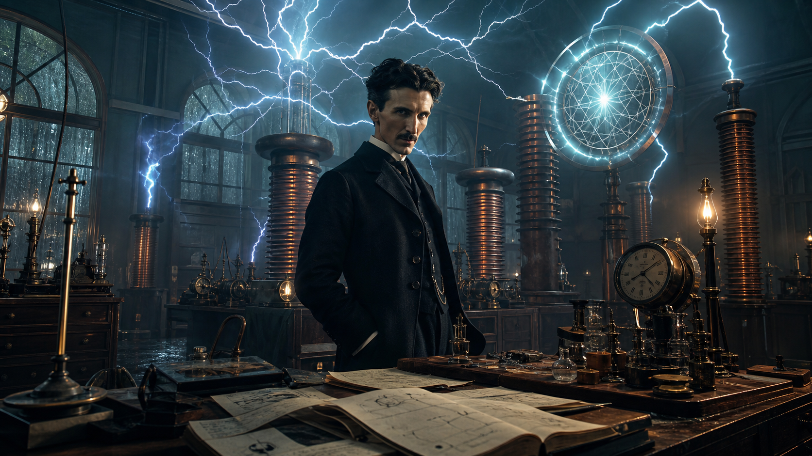
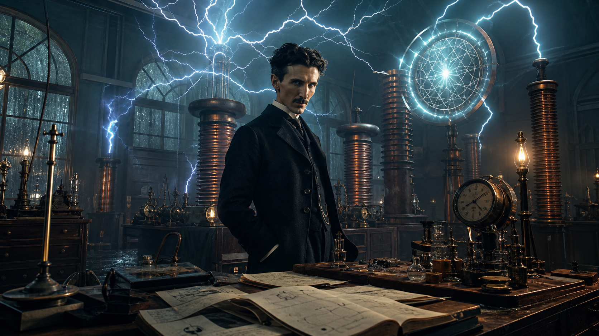

# Nikola Tesla

**Nikola Tesla là archetype của nhà phát minh đứng giữa hai thế giới: một chân trong kỹ thuật điện có thể kiểm chứng, một chân trong trực giác về năng lượng, tần số và trường mà science institution thường không biết đặt vào đâu.**

*Tesla is the inventor-archetype at the border of engineering and mysticism: documentable electrical work on one side, field-consciousness intuition on the other.*

---

## Evidence Discipline / Cách Đọc Tesla

| Tầng claim | Cách đọc |
|---|---|
| **Fact / documentable** | AC systems, patents, induction motor, Tesla coil, radio control, Wardenclyffe timeline |
| **Historical interpretation** | Edison, Morgan, Marconi, FBI papers cần nguồn cụ thể |
| **Symbol / myth** | Prometheus điện, người mang lửa bị system đo đếm chặn lại |
| **Speculative synthesis** | free energy, aether, Akashic download, 3-6-9, Atlantis resonance |

Tesla không cần được thần thánh hóa để lớn. Ông đủ lớn ngay cả khi tách patent, lịch sử, myth và speculation ra từng tầng.

---

## Kỹ Sư Trước Khi Là Huyền Thoại

Tesla trước hết là kỹ sư. Điện xoay chiều, động cơ cảm ứng, coil cao áp, remote control và nhiều patent truyền tải điện đặt ông vào nền móng thế giới hiện đại. Nếu chỉ giữ “free energy” mà quên engineering, ta làm Tesla nhỏ đi.

Điểm đáng học là imagination của ông: hình dung máy trong đầu, chạy thử nội tâm, sửa lỗi trong mind, rồi mới đưa ra vật chất. Với vault, đây là cầu nối giữa invention và [[Vô Thức Tập Thể]]: ý tưởng lớn đôi khi đến như hình ảnh hoàn chỉnh trước khi thành công thức.

---

## Wardenclyffe: Tower, Meter Và Monopoly

Wardenclyffe Tower là dự án truyền thông và năng lượng không dây đầu thế kỷ 20, có tài trợ ban đầu từ J.P. Morgan rồi chết vì tài chính. Tầng fact dừng ở đó nếu không có nguồn cụ thể.

Tầng pattern hỏi khác: một hạ tầng năng lượng không dễ đo đếm sẽ đụng trực tiếp mô hình meter, billing và monopoly. “Không meter được thì không monetize được” có thể là câu chuyện được mythologize, nhưng incentive phía sau rất thật. Hệ thống hiện đại thích năng lượng đi qua cổng kiểm soát.

---

## Tesla Và Aether

Trong khung [[Năng Lượng Aether]], Tesla được đọc như người không chấp nhận vũ trụ chết, rỗng, cơ học thuần túy. Ông nhìn điện như hiện tượng trường, áp suất, cộng hưởng, transmission qua môi trường, không chỉ electron chạy trong dây.

Cách nói chặt: Tesla không “prove aether” theo chuẩn hiện đại. Nhưng Tesla giữ sống câu hỏi về field, resonance và transmission ngoài model được thương mại hóa. Đó là lý do ông nằm ở trung tâm [[MOC - Science Revisionism]].

---

## 3, 6, 9 Và Grammar Của Reality

Nhiều quote 3-6-9 bị gán sai hoặc khó xác minh. Nhưng tầng symbol vẫn đáng đọc. Tesla sống với pattern, nhịp, repetition, resonance. Ông không nhìn số như ký hiệu chết; ông nhìn chúng như grammar của vận hành.

Trong vault, 3-6-9 không cần là “chìa khóa vũ trụ” literal. Nó là reminder rằng reality có thể có nhạc pháp, và inventor lớn là người nghe được nhạc đó trước khi institution viết được sheet music.

---

## Celibacy, Tinh Khí Và Sáng Tạo

Tesla không lập gia đình, sống với tập trung cực đoan, thường được liên hệ với chuyển hóa libido thành sáng tạo. Đây là tầng symbol nối với [[Tinh Khí Thần]], không phải công thức đạo đức cho mọi người.

Điểm cốt lõi: attention là tài sản hữu hạn. Một đời sống bị cắt vụn bởi pleasure rẻ khó sinh ra phát minh sâu. Tesla là biểu tượng của sexual/creative force được thăng hoa thành công trình.

---

## Suppression: Có Và Không

Tesla bị cạnh tranh, mất tài trợ, chết nghèo hơn danh tiếng, và tài liệu bị kiểm tra sau khi ông mất. Nhưng nhảy thẳng đến “mọi công nghệ Tesla bị giấu hoàn toàn” là speculative.

Pattern hợp lý hơn: hệ thống tài chính ưu tiên công nghệ có thể sở hữu, đo đếm, cấp phép và thu phí. Những ý tưởng làm con người độc lập năng lượng sẽ khó được nuôi lớn bởi cùng hệ thống đang bán phụ thuộc năng lượng.

---

## Atlantis Echo

Tesla thường được nối với [[Atlantis]] qua wireless power, crystal resonance, pyramid energy và free energy. Đây là tầng mythic/speculative, nhưng nó có giá trị như archetype: Tesla là ký ức hiện đại của câu hỏi Atlantean. Nếu năng lượng dồi dào tồn tại, nhân loại có đủ consciousness để không biến nó thành weapon không?

---

## Core Insight / Chốt Lại

**Tesla không cần được biến thành thánh để trở thành redpill. Ông là lời nhắc rằng khoa học chết khi chỉ còn institution, và phát minh chết khi chỉ những gì đo đếm được bằng hóa đơn mới được phép tồn tại.**

*Tesla keeps the forbidden question alive: what if energy, mind, field, and civilization are more connected than the institution allows us to ask?*
