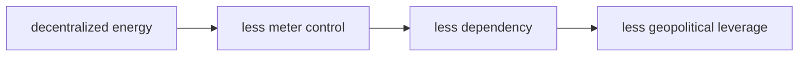

# Năng Lượng Aether (Aether Energy)

**Aether là một trong những câu hỏi bị đóng khung mạnh nhất trong lịch sử khoa học: không gian là rỗng thật, hay là một medium năng lượng mà khoa học hiện đại đã đổi tên, bỏ qua, hoặc không được phép khai thác?** Trong vault, aether là node giữa [[Khoa Học Xét Lại]], [[Nikola Tesla]], free energy, trường lượng tử và biểu tượng khí/prana/chi.

*Aether asks whether space is truly empty, or whether "emptiness" is a medium whose language has been renamed, narrowed, or politically buried.*

---

## Evidence Discipline / Cách Đọc

| Tầng | Cách đọc |
|---|---|
| Fact / history | aether từng là giả thuyết khoa học nghiêm túc; Michelson-Morley là thí nghiệm quan trọng; relativity loại bỏ nhu cầu luminiferous aether cổ điển |
| Modern physics | vacuum không phải "nothing"; quantum fields, zero-point fluctuations, Casimir effect là khái niệm mainstream nhưng không đồng nghĩa free energy dễ khai thác |
| Institution critique | energy monopoly, patent suppression, military classification là câu hỏi quyền lực cần kiểm chứng từng case |
| Speculative synthesis | Tesla free energy, pyramid power, suppressed aether tech là vault hypothesis |

Khoa học xét lại không được phép nhảy từ "vacuum có năng lượng" sang "máy free energy đã chắc chắn tồn tại". Đó là hai tầng khác nhau.

---

## Vault Position / Vị Trí Trong Vault

Năng Lượng Aether là bài cầu nối giữa [[Nikola Tesla]], [[Walter Russell]], [[Tần Số Schumann]], [[Long Mạch]], [[Khoa Học Xét Lại]] và phê bình [[Elite]] kiểm soát năng lượng. Nó đặt một câu hỏi chính trị: nếu energy có thể phi tập trung, toàn bộ hệ quyền lực dựa trên meter sẽ ra sao?

---

## Aether Cổ Điển Và Vấn Đề Medium

Trước relativity, nhiều nhà khoa học hình dung ánh sáng cần một medium để truyền giống âm thanh cần không khí. Medium đó được gọi là luminiferous aether. Thí nghiệm Michelson-Morley không tìm thấy "gió aether" như kỳ vọng, và physics mainstream đi sang hướng relativity.

Điểm kỷ luật: mainstream không nói "không gian tuyệt đối rỗng theo nghĩa triết học". Nó nói mô hình aether cổ điển không cần thiết để giải thích ánh sáng theo framework hiện đại.

---

## Vacuum Không Phải Nothing

Modern physics vẫn cho thấy vacuum có cấu trúc: field, fluctuation, Casimir effect, Lamb shift. Nhưng "vacuum energy exists" khác với "có thể cắm dây lấy điện miễn phí".

| Khái niệm | Nói được | Không nên nhảy tới |
|---|---|---|
| quantum field | field là nền mô tả hạt/lực | field = aether cổ điển y nguyên |
| zero-point energy | trạng thái nền có fluctuation | free power plant đã chắc chắn |
| Casimir effect | vacuum boundary tạo force đo được | bằng chứng máy anti-gravity phổ thông |
| dark energy | mô hình vũ trụ học về gia tốc giãn nở | prana/chi đã được chứng minh |

Đây là nơi bài này cần sắc: mở câu hỏi, không làm khoa học giả.

---

## Tesla Và Câu Hỏi Meter

[[Nikola Tesla]] thường được đặt ở trung tâm myth free energy. Wardenclyffe, wireless power, resonance, Earth as conductor, radiant energy: tất cả tạo thành một archetype rất mạnh về energy phi tập trung.

Vault không cần khẳng định mọi câu chuyện Tesla đều đúng. Chỉ cần thấy pattern: một hệ thống năng lượng không meter được sẽ đe dọa mô hình lợi nhuận dựa trên scarcity, grid và billing.

---

## Aether, Prana, Chi, Long Mạch

Trong esoteric traditions, aether gần với Akasha, prana, chi, khí, orgone, long mạch. Đây không phải cùng một claim khoa học; đây là cùng một intuition: đời sống vận hành trong một field vô hình.

| Ngôn ngữ | Field được cảm như |
|---|---|
| Yoga / Ayurveda | prana |
| Trung Hoa | khí / chi |
| Phong thủy | long mạch |
| Western esoterica | ether / akasha |
| Revisionist science | aether / vacuum field |

[[Long Mạch]] là ứng dụng địa khí; [[Tần Số Schumann]] là ứng dụng Earth resonance; [[Walter Russell]] là vũ trụ học trường/nhịp/ánh sáng.

---

## Suppression Pattern

Claim "aether bị đàn áp" cần đọc case-by-case. Nhưng pattern suppression trong energy research có thể hỏi:

1. Patent nào bị classified?
2. Nhà phát minh nào có prototype kiểm chứng độc lập?
3. Funding nào bị cắt vì lý do thương mại?
4. Military có giữ công nghệ energy/propulsion nào không?
5. Media có dùng "perpetual motion crank" để chôn mọi câu hỏi không?

Không phải mọi inventor bị cười là thiên tài bị đàn áp. Nhưng cũng không phải mọi thứ bị cười là sai.

---

## Core Insight / Chốt Lại

**Aether là câu hỏi về medium, energy và quyền lực. Nếu không gian là một biển năng lượng, câu hỏi tiếp theo không chỉ là vật lý; nó là ai được phép nghiên cứu, ai được phép khai thác, và ai được quyền đặt đồng hồ tính tiền lên reality.**

*Aether is not just physics. It is a question about medium, energy, permission, and who gets to meter reality.*
