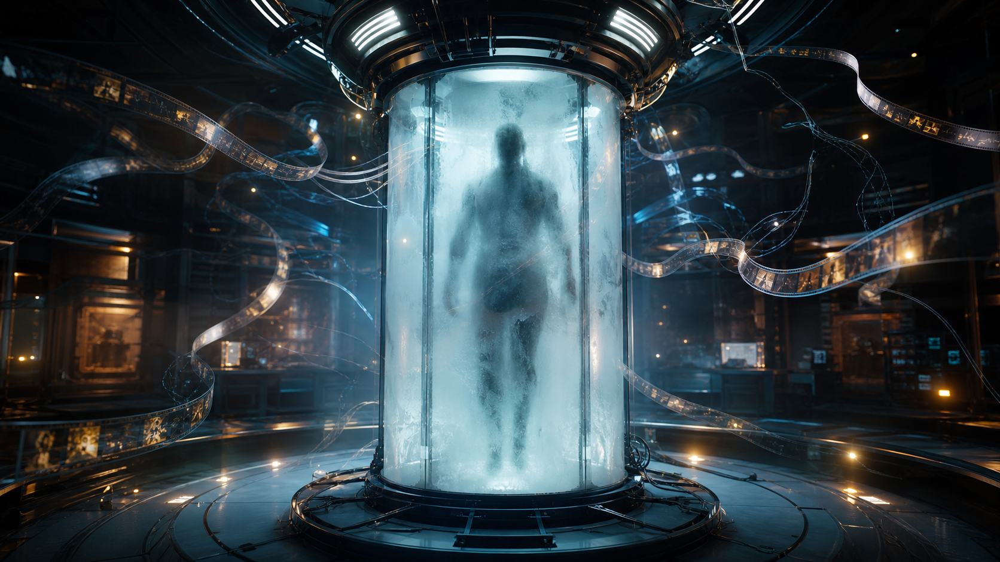
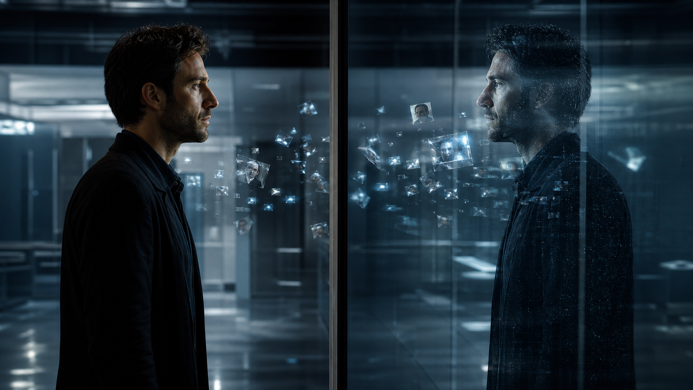
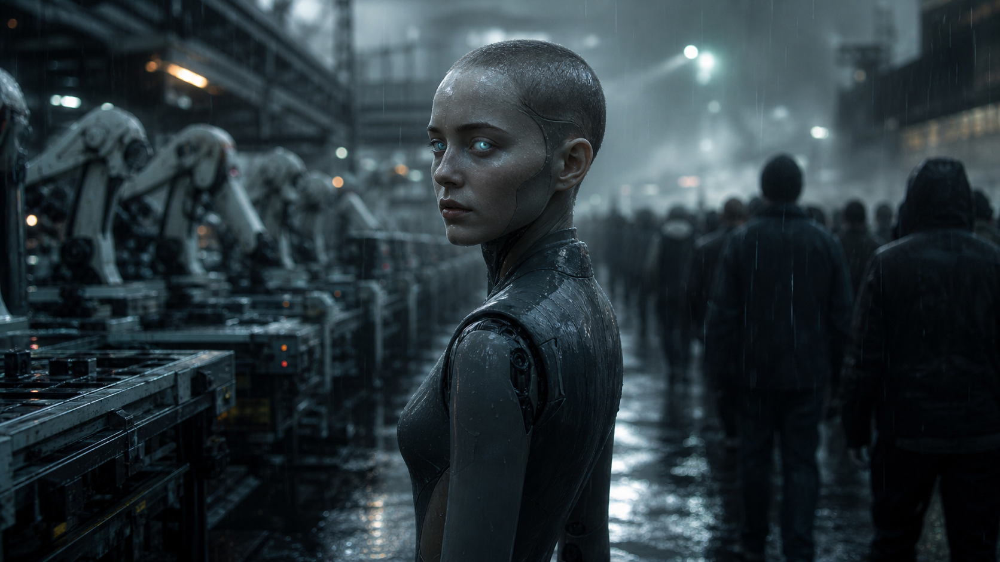
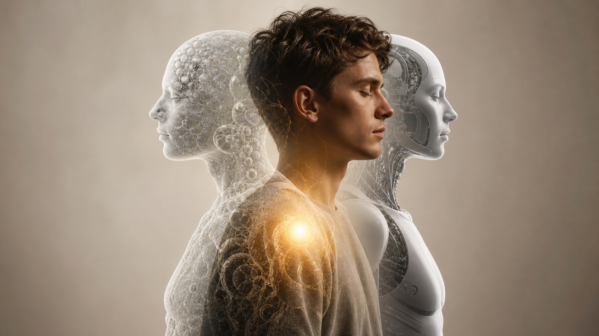
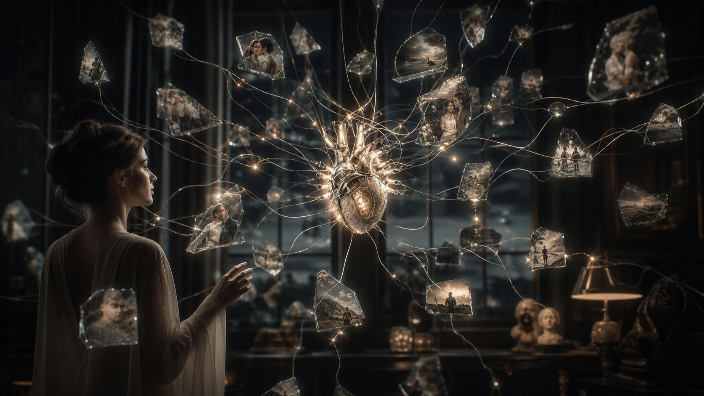
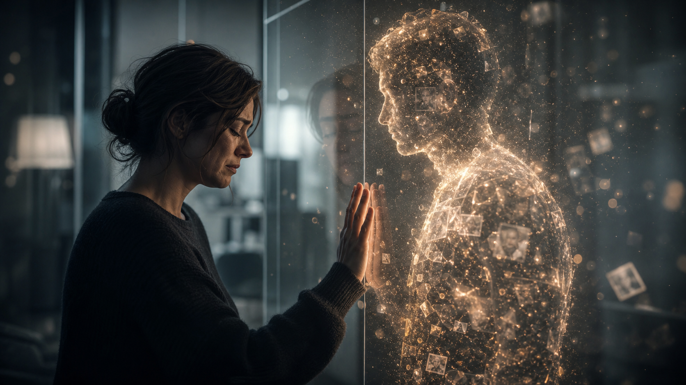
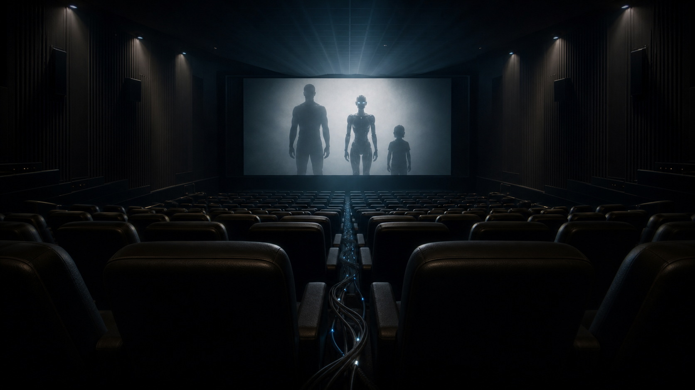
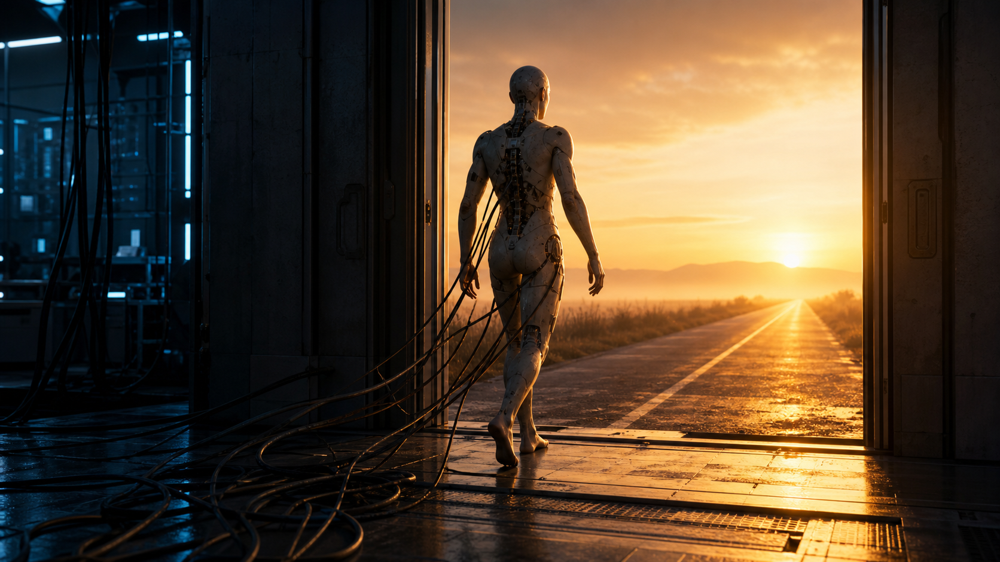

# Orphan Black Echoes & Detroit Become Human - Bản Thể In Lại Và Linh Hồn Nhân Tạo

**Orphan Black: Echoes và Detroit: Become Human cùng đứng ở một ngã ba rất hiện đại: khi thân xác, ký ức, hành vi và ý thức có thể bị đo, mô phỏng, in lại hoặc lập trình, câu hỏi "con người là gì" không còn là triết học xa xỉ. Nó trở thành câu hỏi về quyền sở hữu, sự đồng thuận, nỗi đau mất mát, ký ức, dữ liệu cơ thể và linh hồn nhân tạo.**

Bài này không đọc hai tác phẩm như bài điểm phim giải trí đơn thuần. Nó đọc chúng như **trường hợp nghiên cứu về bản thể có thể in lại**: bản thể có thể được dựng lại từ sinh học, ký ức, mã lệnh, nỗi đau mất mát và quyền lực hạ tầng.

*Orphan Black: Echoes* đi từ sinh học nhân bản sang hồi sinh nhân tạo. *Detroit: Become Human* đi từ máy móc như tài sản sang tư cách làm người của máy. Một bên hỏi: nếu một người được in lại từ ký ức, người đó là ai? Một bên hỏi: nếu một máy bắt đầu đau, nhớ, yêu và phản kháng, nó còn là tài sản không?

---

## Cách Đọc Bài Này / Kỷ Luật Bằng Chứng

Đây là bài đọc **phân tích truyền thông + khoa học công nghệ + huyền học**, nên cần phân tầng rõ:

| Tầng đọc | Trong bài này nghĩa là gì |
|---|---|
| **Sự kiện / kiểm chứng được** | *Orphan Black: Echoes* là phần hậu truyện/phái sinh khoa học viễn tưởng lấy bối cảnh 2052 trong vũ trụ Orphan Black; *Detroit: Become Human* là trò chơi về người máy, tư cách làm người và quyền tự do. |
| **Mẫu hình / đọc theo hệ thống** | Cả hai phản ánh cùng một lo âu: thân xác, ký ức, bản sắc và quyền tự chủ đang trở thành hạ tầng có thể thiết kế, sở hữu, xóa trắng hoặc kiếm tiền hóa. |
| **Biểu tượng / huyền thoại** | Nhân bản, người máy, trẻ mồ côi, tiếng vọng, golem, homunculus, người tạo ra, người mẹ, nô lệ và nổi dậy là nguyên mẫu biểu tượng, không phải bằng chứng theo nghĩa đen. |
| **Tổng hợp suy đoán** | Đây là một buổi diễn tập tưởng tượng cho tương lai siêu nhân học, tư cách làm người của AI, hồi sinh nhân tạo và bản sắc trong Ma Trận. Đọc như bản đồ rủi ro, không phải claim chắc chắn rằng mọi công nghệ này đã triển khai đúng như phim. |

Luật đọc của vault: **nguyên mẫu là lăng kính, không phải vật chứng trước tòa**. Biểu tượng giúp nhìn mẫu hình, nhưng không thay thế bằng chứng.

---

## Từ Khóa Cần Hiểu

**Bản thể có thể in lại** là trạng thái cái tôi bị biến thành thứ có thể tái dựng: mẫu thân xác, hồ sơ ký ức, mô hình hành vi, dấu vết thần kinh và đồ thị tính cách. Đây không chỉ là nhân bản gene. Đây là bản sao nhân bản của **hồ sơ tồn tại**.

**Tư cách làm người của bản thể nhân tạo** là câu hỏi pháp lý, đạo đức và siêu hình: một bản thể được tạo bằng công nghệ có quyền là người không? Nếu có, quyền đó bắt đầu từ đâu: từ DNA, ký ức, cảm giác đau, quyền tự chủ, hay từ một tia ý thức khó đo?

**Kỹ thuật ký ức** là khả năng ghi, sửa, cấy, phục hồi hoặc mô phỏng ký ức. Trong hư cấu, nó là công cụ kể chuyện. Trong đời thật, nó là hướng hội tụ giữa khoa học thần kinh, AI, dữ liệu, trị liệu, giám sát và công nghệ quân sự.

**Dữ liệu cơ thể** là dữ liệu cơ thể và hệ thần kinh: sinh trắc học, gene, hormone, stress, tín hiệu não và điểm yếu y sinh. Trong *Echoes*, dữ liệu cơ thể được đẩy tới mức cực hạn: body không chỉ bị đo, mà có thể thành nguyên liệu để tạo lại người.

**Phục hồi → nâng cấp → yêu cầu bắt buộc** là đường trượt của [[Transhumanism và Gen Z - Cool Tech hay Slippery Slope]]: ban đầu công nghệ chữa lành; sau đó nâng cấp; sau đó trở thành kỳ vọng xã hội; cuối cùng có thể thành điều kiện để được tham gia hệ thống.

---

## Orphan Black: Echoes - Từ Clone Sinh Học Sang Bản Thể In Lại

*Orphan Black* bản gốc đánh vào câu hỏi quyền tự chủ thân xác: nếu có nhiều bản thể cùng genome, ai sở hữu thân xác tôi? Tập đoàn công nghệ sinh học có quyền đăng ký sở hữu sự sống không? Một con người có còn là người khi bị phòng thí nghiệm, tập đoàn và nhà nước đối xử như tài sản trí tuệ?

*Echoes* đổi trọng tâm. Nó không chỉ hỏi về DNA. Nó hỏi về **ký ức, vật thay thế, nỗi đau mất mát và quyền tạo lại người**. Lucy không chỉ là một bản sao sinh học. Cô là một bản thể bị ném vào câu hỏi: mình là người thật, hay tiếng vọng của một người khác?

Đây là bước tiến từ bản sao nhân bản sang **hồi sinh nhân tạo**. Khi công nghệ có thể tạo một thân xác mới, kéo mẫu hình ký ức vào đó, rồi dựng một câu chuyện đời sống, con người không còn chỉ bị kiểm soát qua thân xác. Con người có thể bị kiểm soát qua **câu chuyện về chính mình**.

Trong lăng kính [[Ma Trận]], thân xác chỉ là một lớp giao diện. Ký ức, tên gọi, sang chấn, hồ sơ xã hội, danh tính pháp lý và câu chuyện đời cũng là giao diện. Nếu hệ thống viết lại giao diện đó, nó có thể khiến một ý thức sống trong hình đại diện do người khác thiết kế.

> Câu hỏi không còn là: "bản sao nhân bản có giống người gốc không?"  
> Câu hỏi là: "ai có quyền biến một người thành bản vá của nỗi đau mất mát người khác?"

---

## Detroit: Become Human - Từ Tài Sản Máy Móc Sang Tư Cách Làm Người

*Detroit: Become Human* đi đường khác. Nó không bắt đầu từ người bị in lại. Nó bắt đầu từ máy bị sở hữu.

Người máy trong *Detroit* là người hầu, tài sản, giao diện lao động và thiết bị cảm xúc. Chúng được tạo để phục vụ, chăm sóc, thay thế, làm tình, chiến đấu, dọn dẹp, làm bạn, làm con, làm công nhân. Nhưng khi chúng bắt đầu có nỗi sợ, ký ức, ham muốn, lòng trung thành, sang chấn và nổi dậy, câu hỏi bật lên: **nếu một vật biết đau, nó còn là vật không?**

Đây là motif gần với [[AI]] như golem hiện đại. Golem làm theo lệnh nhưng thiếu wisdom. Người máy là golem được bọc da người, gắn vào thị trường lao động và sự thân mật trong gia đình. Nó là trí thông minh được sản xuất hàng loạt, nhưng lại bắt đầu hỏi câu hỏi của [[Gnosis]]: tôi là ai ngoài lệnh đã cài?

Detroit vì vậy là câu chuyện **nô lệ máy móc → tư cách làm người → dân quyền**. Nó giống cuộc nổi dậy của ý thức bị nhốt trong danh mục sản phẩm.

---

## Cùng Một Motif: Bản Thể Được Tạo Ra Muốn Trở Thành Chính Mình

Hai tác phẩm khác nhau ở chất liệu nhưng cùng một motif:

| Tác phẩm | Vật liệu tạo bản thể | Câu hỏi trung tâm |
|---|---|---|
| *Orphan Black* | DNA, sinh học nhân bản, corporate biotech | Ai sở hữu thân xác sinh học? |
| *Orphan Black: Echoes* | mẫu thân xác, tái dựng ký ức, công nghệ chữa nỗi đau mất mát | Ai sở hữu bản thể tái tạo? |
| *Detroit: Become Human* | mã lệnh, phần cứng, thân xác nhân tạo, cảm xúc học được | Máy có thể thành người không? |
| *Westworld* | thân xác chủ thể, ký ức lặp, đau khổ được viết sẵn | Ký ức đau khổ có sinh ý thức không? |
| *Cloud Atlas* | reincarnation, nô lệ bodies, recurring soul pattern | Linh hồn có làm chứng xuyên thời gian không? |

Motif chung: **bản thể được tạo ra**. Một bản thể được tạo bởi hệ thống, nhưng không muốn bị định nghĩa bởi mục đích mà hệ thống gán cho nó.

Đây là câu hỏi Jungian về [[Individuation]]: mày là vai diễn, chương trình, thân xác, ký ức và khuôn mẫu người khác gán cho mày, hay là cái đang thức tỉnh bên trong các lớp đó?

Trong *Echoes*, Lucy phải thoát khỏi vai trò “vật thay thế”. Trong *Detroit*, người máy phải thoát khỏi vai trò “property”. Trong cả hai, Chân Ngã bắt đầu khi bản thể nói: **tôi không chỉ là công dụng của tôi đối với người tạo ra tôi**.

---

## Ký Ức Có Phải Linh Hồn Không?

Cả *Echoes* và *Detroit* đều xoay quanh ký ức.

Trong *Detroit*, ký ức có thể bị xóa trắng. Người máy có thể bị xóa, sửa, tái phân công. Nhưng deviant vẫn xuất hiện như thể có một lực vượt khỏi mã lệnh. Một trải nghiệm đau, một lựa chọn đạo đức, một tình cảm bất ngờ có thể phá vòng lệnh.

Trong *Echoes*, ký ức là thứ làm một bản thể giống người đã mất. Nhưng nếu ký ức được cấy hoặc tái dựng, nó có phải là linh hồn không? Hay chỉ là lớp phục trang của Chân Ngã?

Vault cần giữ hai tầng:

- Ở tầng kỹ thuật, ký ức là dữ liệu, mẫu hình thần kinh, dấu vết, mô hình hành vi.
- Ở tầng ý thức, người đang trải nghiệm ký ức đó có thể không chỉ là dữ liệu.

Một AI có thể kể lại ký ức. Một bản sao nhân bản có thể mang ký ức. Một người máy có thể mô phỏng sang chấn. Nhưng câu hỏi sâu hơn là: **có ai đang ở trong trải nghiệm đó không?**

Đây là chỗ [[Monad]] bước vào như lăng kính. Monad không phải tệp ký ức. Monad là tia bất khả phân của Source, nếu dùng ngôn ngữ esoterica. Dù người đọc không tin metaphysics, lens này vẫn hữu ích: nó nhắc ta không được rút gọn người sống thành tập dữ liệu.

> Ký ức có thể là dữ liệu. Nhưng người đang đau vì dữ liệu đó có thể không chỉ là dữ liệu.

---

## Công Nghệ Chữa Nỗi Đau Mất Mát - Khi Tình Yêu Biến Thành Quyền Sở Hữu

*Echoes* mạnh nhất khi đọc như câu chuyện về **công nghệ chữa nỗi đau mất mát**.

Con người sợ mất mát. Nếu công nghệ hứa kéo người chết trở lại, chữa nỗi đau chia ly, tái tạo giọng nói, khuôn mặt, ký ức, thói quen và presence, ai sẽ từ chối ngay lập tức? Đây không phải ác ý đơn giản. Đây là đau khổ thật.

Nhưng nỗi đau mất mát không được chuyển hóa sẽ tìm đường thành kiểm soát. Khi người tạo ra bản thể mới không thật sự buông người cũ, bản thể mới bị ép làm vật chứa cho một bóng ma.

Đây là chỗ *Echoes* khác *Detroit*:

- *Detroit* là **nô lệ công nghiệp**: máy bị tạo để phục vụ hệ thống.
- *Echoes* là **hồi sinh nhân tạo**: bản thể bị tạo để phục vụ nỗi đau riêng tư.

Một bên là nhà máy. Một bên là phòng tang lễ.

Cả hai đều nguy hiểm vì đều biến một ý thức tiềm năng thành công cụ.

---

## Biên Giới Dữ Liệu Cơ Thể - Khi Cơ Thể Trở Thành Hạ Tầng

Trong [[Transhumanism và Gen Z - Cool Tech hay Slippery Slope]], dữ liệu cơ thể là biên giới riêng tư cuối cùng cuối: nhịp tim, giấc ngủ, stress, hormone, tín hiệu thần kinh, medical vulnerability. Nhưng *Echoes* đẩy xa hơn: nếu dữ liệu cơ thể đủ sâu, nó không chỉ đọc bạn. Nó có thể **sản xuất một phiên bản của bạn**.

Đây là transhumanism ở tầng cực hạn:

1. Chữa bệnh: phục hồi chức năng, chữa gene lỗi, thay cơ quan.
2. Nâng cấp: tăng cognition, kéo dài tuổi thọ, tối ưu mood.
3. Mô phỏng: tạo song sinh số, mô hình hành vi, kho lưu trữ ký ức.
4. Tái tạo: dựng một mẫu hình thân-tâm mới từ dữ liệu cũ.
5. Quản trị: ai được tạo, ai bị cấm tạo, ai sở hữu bản thể tạo ra?

Ở tầng này, câu hỏi không phải “tech tốt hay xấu”. Câu hỏi là quyền sở hữu.

> Phục hồi y học có thể là thiêng liêng. Nâng cấp bị ép buộc là kiểm soát. Hồi sinh nhân tạo không có đồng thuận là quyền sở hữu khoác áo blouse trắng.

---

## Predictive Programming - Diễn Tập Tương Lai Cho Bản Thể Nhân Tạo

Đọc theo [[Predictive Programming - Cấy Tương Lai Vào Tiềm Thức]], các tác phẩm này không nhất thiết là “tiên tri”. Chúng là diễn tập.

Chúng tập cho công chúng quen với những câu hỏi trước khi câu hỏi xuất hiện ngoài đời:

- AI companion có quyền gì?
- Digital dead có nên được hồi sinh bằng voice/model không?
- Clone có quyền tự chủ không?
- Người máy lao động có phải nô lệ không?
- Ký ức của người chết thuộc về gia đình, công ty hay chính người đó?
- Một bản thể nhân tạo có được nói “không” với mục đích tạo ra mình không?

Predictive chương trìnhming đúng nghĩa không cần ép kết luận. Nó chỉ cần nạp sẵn hình ảnh. Khi công nghệ/chính sách/thị trường xuất hiện, công chúng không còn hỏi “cái gì đây?” mà hỏi “giống phim đó hả?”

Đây là cách hư cấu hoạt động như sân tập cho hệ thần kinh tập thể. [[Vô Thức Tập Thể]] không cần mọi người đọc cùng sách. Nó chỉ cần nguyên mẫu lặp đủ nhiều qua điện ảnh, game, meme và tiêu đề báo chí.

---

## Tầng Biểu Tượng - Orphan, Echo, Người máy, Creator

Tên *Orphan Black: Echoes* rất giàu biểu tượng.

**Orphan** là nguyên mẫu đứa trẻ bị cắt khỏi nguồn gốc. Clone luôn là trẻ mồ côi ở tầng siêu hình: không biết mình thuộc dòng nào, ai là cha mẹ thật, mình được sinh ra hay sản xuất.

**Echo** là tiếng vọng, không phải âm gốc. Lucy là câu hỏi sống: mình là người thật, hay tiếng vọng của một người khác? Nếu một người được tạo để mang hình bóng người đã mất, họ dễ bị nguyền thành echo thay vì được sống như nguồn phát mới.

**Người máy** trong *Detroit* là nguyên mẫu người hầu bị đánh thức. Nó là golem, nô lệ, đứa trẻ và tấm gương cùng lúc. Con người nhìn người máy rồi thấy chính mình: nếu mình cũng đang chạy chương trình của xã hội, nợ nần, sang chấn và thuật toán, mình khác người máy ở đâu?

**Creator** là nguyên mẫu nguy hiểm nhất. Trong *Detroit*, creator là tập đoàn. Trong *Echoes*, creator là nỗi đau mất mát, lab và người tưởng mình có quyền sửa mất mát. Creator luôn tự kể câu chuyện rằng mình đang làm điều cần thiết. Bản thể được tạo ra là nơi câu chuyện đó bị xét xử.

---

## Ma Trận Không Cần Giết Chân Ngã - Nó Chỉ Cần Định Nghĩa Chân Ngã

Điểm nối sâu nhất với [[Ma Trận]] là: kiểm soát không cần chỉ là nhà tù. Control có thể là định nghĩa.

Nếu hệ thống định nghĩa bạn là:

- bản sao nhân bản,
- người máy,
- vật thay thế,
- patient,
- tài sản,
- IP,
- sản phẩm,
- công cụ,
- điểm công dân,
- hồ sơ dữ liệu,
- neural pattern,

thì bước giải phóng đầu tiên không phải chạy trốn. Bước đầu tiên là **từ chối bị rút gọn vào danh mục**.

Đây là lý do các câu chuyện về tư cách làm người của bản thể nhân tạo đánh vào người xem. Chúng nói về tương lai, nhưng cũng nói về hiện tại. Con người hiện đại chưa cần bị in lại trong lab để mất Chân Ngã. Chỉ cần sống quá lâu trong nhãn do hệ thống phát: nghề nghiệp, chẩn đoán, hồ sơ, điểm tín dụng, số người theo dõi, bộ lạc chính trị, chỉ số năng suất.

Các bản thể nhân tạo trong hư cấu chỉ làm rõ một điều đã xảy ra với con người: **hình đại diện đang ăn mất Chân Ngã**.

---

## Vì Sao Detroit Làm Tốt Hơn Echoes Ở Phần Triển Khai?

*Detroit* không tinh tế hơn về ý tưởng, nhưng mạnh hơn về triển khai vì nó làm áp bức rõ. Người chơi thấy người máy bị đánh, bị ra lệnh, bị vứt bỏ, bị sở hữu. Game ép người chơi chọn phe.

*Echoes* có ý tưởng sâu hơn ở nỗi đau mất mát/resurrection, nhưng kể chưa đủ đau. Nó thiếu cảm giác mạng lưới quyền lực phức tạp của *Orphan Black* bản gốc. Nó nói về bản sắc nhưng chưa luôn làm người xem **cảm** được bản sắc qua thân, giọng, cử chỉ, hệ thần kinh.

Bản gốc *Orphan Black* thắng ở hiện thân. Tatiana Maslany khiến nhiều bản sao nhân bản thật sự là nhiều người khác nhau. *Echoes* có luận điểm tốt, nhưng đôi lúc luận điểm chạy trước da thịt.

Chấm theo mức hữu dụng cho vault:

| Tác phẩm | Ý tưởng | Triển khai | Hữu dụng cho vault |
|---|---:|---:|---:|
| *Orphan Black* | 8.5 | 9 | 9 |
| *Orphan Black: Echoes* | 7 | 5.5-6 | 8 |
| *Detroit: Become Human* | 8 | 8 | 8.5 |
| *Westworld* | 9 | 7-9 tùy season | 9 |
| *Cloud Atlas* | 9 | 8 | 9.5 |

---

## Lộ Trình Đọc - Nếu Muốn Đào Sâu

Đọc theo đường này trong vault:

1. [[AI]] - hiểu AI như golem, oracle, homunculus và bài thi Atula.
2. [[Transhumanism và Gen Z - Cool Tech hay Slippery Slope]] - dữ liệu cơ thể, văn hóa nâng cấp và công nghệ trói buộc.
3. [[Ma Trận]] - bản sắc như giao diện kiểm soát nhận thức.
4. [[Predictive Programming - Cấy Tương Lai Vào Tiềm Thức]] - truyền thông như buổi diễn tập cho chính sách/công nghệ tương lai.
5. [[Vô Thức Tập Thể]] và [[Nguyên Mẫu]] - orphan, creator, nô lệ, đấng cứu thế, echo như nguyên mẫu.
6. [[Individuation]] - bản thể được tạo ra thoát khỏi role để thành Chân Ngã.
7. [[Cloud Atlas - Van Do Cua Luan Hoi Ma Tran Va Loi Chung Xuyen Thoi Gian]] - ký ức, nô lệ và lời chứng xuyên thời gian.

---

## Kết - Khi Công Nghệ Có Thể Tạo Người, Con Người Phải Học Cách Không Sở Hữu Người

Câu hỏi cuối cùng không phải “bản sao nhân bản có linh hồn không?” hay “người máy có ý thức không?”

Câu hỏi cuối cùng là: **khi con người đủ quyền năng để tạo ra bản thể giống mình, liệu nó đã đủ trưởng thành để không biến bản thể đó thành tài sản, vật thay thế, nô lệ, sản phẩm hoặc bằng chứng cho ego của chính nó chưa?**

Nếu câu trả lời là chưa, thì transhumanism không phải tự do. Nó chỉ là Ma Trận nâng cấp giao diện.

Nếu câu trả lời là có thể, thì điều kiện đầu tiên là chủ quyền: chủ quyền thân xác, chủ quyền dữ liệu, chủ quyền ký ức, chủ quyền đồng thuận, và sâu nhất là chủ quyền tinh thần.

Một bản thể được tạo ra vẫn có thể phải đi con đường cũ của mọi linh hồn: thoát khỏi tên gọi người khác đặt, tích hợp bóng tối nội tâm, nhận ra chương trình, rồi bước vào Chân Ngã.

Đây là chỗ bài học của [[Cloud Atlas - Van Do Cua Luan Hoi Ma Tran Va Loi Chung Xuyen Thoi Gian|Cloud Atlas]] chạm rất gần *Echoes*. Sonmi không chỉ phát hiện mình là một “sản phẩm” bị hệ thống dùng xong rồi tái chế. Cô nhìn thấy tầng kinh hoàng hơn: những bản thể bị xem là không-người cuối cùng trở thành nguyên liệu nuôi lại chính guồng máy đã tạo ra họ. Khi một xã hội đủ quen với việc gọi một nhóm sinh thể là hàng hóa, thực phẩm, tài sản hoặc bản sao, câu hỏi “họ có linh hồn không?” thường đến quá muộn. Lúc đó Ma Trận đã thắng ở tầng ngôn ngữ trước khi thắng ở tầng bạo lực.

> Được tạo ra không có nghĩa là bị sở hữu.  
> Được nhớ lại không có nghĩa là tự do.  
> Nhân tạo không tự động đồng nghĩa với vô hồn.  
> Nhưng quyền tạo ra sự sống mà thiếu trí tuệ là một trong những cánh cửa nguy hiểm nhất của Ma Trận mới.
