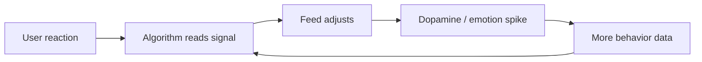

# TikTok Algorithm - Ai Kiểm Soát Worldview Của Gen Z?

**TikTok không chỉ là app giải trí. Nó là một feedback engine: đo phản ứng vi mô của người dùng, tối ưu dopamine, rồi lặp lại frame cho đến khi worldview có cảm giác như tự chọn. Ai kiểm soát feed không cần kiểm soát mọi suy nghĩ. Chỉ cần kiểm soát thứ xuất hiện trước khi suy nghĩ hình thành.**

*TikTok is not merely an entertainment app. It is a feedback engine that measures micro-reactions, optimizes dopamine, and repeats frames until worldview feels self-chosen.*

---

## Vault Position / Vị Trí Trong Vault

Bài này thuộc series **Gen Z & Agenda 2030 Path** và nối trực tiếp với [[Kiểm Soát Tâm Trí]], [[Dopamine Economy - Nền Kinh Tế Của Sự Thèm Muốn]] và [[Bộ Não Rỗng và AI Brain Rot]].

Claim discipline:

| Tầng | Cách đọc |
|---|---|
| **Fact** | TikTok dùng recommendation algorithm, đo engagement, watch time, interaction, device/context signals. ByteDance là công ty Trung Quốc và chịu luật Trung Quốc. |
| **Pattern** | Short-form feed tạo dopamine loop, attention fragmentation và worldview shaping. |
| **Geopolitical risk** | Platform có thể bị state/corporate influence, censorship, amplification và data pressure. |
| **Speculative synthesis** | TikTok như weaponized attention layer trong broader governance/information war stack. |

Không cần bịa “leak” hoặc con số quá chắc. Chỉ riêng architecture đã đủ đáng lo.

---

## 1. Version 2026 Của Rothschild Quote

Câu cũ:

> Give me control of a nation's money and I care not who makes its laws.

Version thời algorithm:

> Give me control of a generation's feed and I care not who writes its textbooks.

Tiền điều khiển incentive. Algorithm điều khiển perception. Nếu perception bị điều hướng từ nhỏ, luật và tiền đến sau chỉ formalize thứ tâm trí đã accept.

---

## 2. TikTok Không Chỉ Cho Bạn Xem Nội Dung. Nó Đọc Bạn.

Feed không đơn giản là “video nhiều like thì hiện”. Nó học từ phản ứng vi mô:

- bạn dừng ở giây nào,
- replay đoạn nào,
- swipe nhanh hay chậm,
- comment hay chỉ nhìn,
- share cho ai,
- xem lúc mấy giờ,
- chủ đề nào làm bạn tức,
- chủ đề nào làm bạn horny,
- chủ đề nào làm bạn thấy mình có identity.

Người dùng tưởng mình đang khám phá content. Thực ra content đang khám phá người dùng.



Đây là cybernetic loop: hệ thống đo bạn, chỉnh stimulus, đo tiếp.

---

## 3. Dopamine Slot Machine

TikTok mạnh vì nó kết hợp ba thứ:

1. **Variable reward** — không biết video tiếp theo hay hay dở.
2. **Low friction** — swipe cực nhanh, không cần quyết định.
3. **Identity targeting** — content đánh vào “tôi là ai”.

Cơ chế giống slot machine:

```text
swipe
→ maybe reward
→ small disappointment
→ swipe again
→ bigger reward
→ repeat
```

Nhưng khác casino: casino lấy tiền trước, TikTok lấy attention trước. Tiền, belief và behavior đến sau.

---

## 4. Short-Form Feed Và Não Bị Cắt Nhỏ

Vấn đề không phải Gen Z “ngu”. Vấn đề là não bị train để ghét delay.

Short-form feed dạy:

- nếu chán 2 giây, swipe,
- nếu khó hiểu, swipe,
- nếu không kích thích, swipe,
- nếu không validate identity, swipe,
- nếu quá dài, bỏ.

Điều này làm suy yếu các năng lực cần cho sovereignty:

- đọc dài,
- tập trung sâu,
- chịu boredom,
- phân biệt source,
- giữ nhiều possibility cùng lúc,
- tự build worldview thay vì nhận packaged worldview.

Xem thêm: [[Bộ Não Rỗng và AI Brain Rot]].

---

## 5. Worldview Không Được Dạy. Nó Được Feed.

Trước đây worldview đến từ:

- gia đình,
- trường học,
- sách,
- tôn giáo,
- cộng đồng,
- báo chí,
- trải nghiệm sống.

Bây giờ worldview có thể được feed bằng sequence:

```text
video hài
→ video outrage
→ video identity
→ video fear
→ video pseudo-education
→ video trend
→ video political frame
```

Không clip nào đủ lớn để gọi là propaganda. Nhưng sequence đủ dài sẽ tạo reality tunnel.

> Propaganda cũ là bài diễn văn. Propaganda mới là playlist không ai biết mình đang nghe.

---

## 6. TikTok Và China Risk: Đọc Cho Chặt

Fact-level:

- TikTok thuộc ByteDance.
- ByteDance là công ty Trung Quốc.
- Trung Quốc có hệ thống luật/an ninh dữ liệu đặt áp lực lớn lên công ty nội địa.
- Nhiều chính phủ phương Tây đã coi TikTok là national security risk.

Pattern-level:

- một platform có thể shape culture qua trend, suppression, amplification,
- data/algorithm là strategic asset,
- geopolitical powers có incentive kiểm soát narratives của đối thủ.

Không cần khẳng định mọi video TikTok là CCP psyop. Claim mạnh hơn và sạch hơn là:

> Một app có quyền đọc attention và điều hướng culture của hàng trăm triệu người trẻ là infrastructure địa chính trị, dù nó tự gọi là entertainment.

---

## 7. Douyin vs TikTok: Câu Hỏi Đáng Hỏi

Một dot thường được nhắc: Douyin ở Trung Quốc được quản lý/giới hạn và có nhiều nội dung giáo dục hơn cho trẻ em; TikTok quốc tế thiên về entertainment, trend, outrage, sexuality, absurdity và attention drain.

Dù chi tiết thay đổi theo policy, câu hỏi vẫn đáng giữ:

> Tại sao cùng một dạng technology có thể được dùng như education rail ở một nơi và dopamine rail ở nơi khác?

Technology không neutral. Incentive và governance layer quyết định nó nuôi não hay hút não.

---

## 8. Algorithmic Censorship Mềm

Censorship hiện đại không cần xóa hết. Chỉ cần:

- giảm reach,
- làm nội dung khó discover,
- boost counter-narrative,
- label “harmful”,
- demonetize,
- delay distribution,
- bury trong feed.

Người dùng thường không biết mình không thấy gì. Đây là điểm nguy hiểm.

> Cái bị kiểm soát mạnh nhất không phải câu trả lời. Là menu câu hỏi.

---

## 9. Gen Z Như Cultural Operating System

Ai kiểm soát TikTok không chỉ kiểm soát entertainment. Họ ảnh hưởng:

- slang,
- humor,
- body image,
- dating norms,
- political vibes,
- moral panic,
- fashion,
- consumer desire,
- mental health language,
- enemy image.

Culture trước đây cần studio, label, TV network, university, newspaper. Bây giờ một feed có thể làm nhiều chức năng cùng lúc.

---

## 10. TikTok Không Phải Kẻ Duy Nhất

Đừng biến bài này thành “TikTok xấu, platform khác tốt”. Instagram Reels, YouTube Shorts, X, Facebook, Netflix, game, porn, news apps đều tối ưu attention theo cách riêng.

TikTok chỉ là dạng tinh khiết nhất của short-form algorithmic capture.

Nếu chỉ cấm TikTok mà giữ nguyên dopamine economy, hệ thống sẽ mọc lại dưới tên khác.

---

## 11. Exit Không Phải Delete App Rồi Xong

Exit thật là lấy lại quyền chọn input.

Practical protocol:

- đặt app ngoài home screen,
- không mở feed khi mới ngủ dậy,
- giới hạn short-form theo block,
- thay bằng long-form/sách/audio dài,
- follow source có chủ đích,
- viết lại ý bằng lời mình sau khi xem,
- định kỳ hỏi: “Niềm tin này của mình đến từ đâu?”

Sovereignty bắt đầu bằng attention sovereignty.

---

## Synthesis

TikTok là bài học lớn về Ma Trận hiện đại: control không cần xuất hiện như nhà tù. Nó xuất hiện như entertainment cá nhân hóa.

> Nếu bạn không chọn input, bạn không thật sự chọn output của tâm trí mình.

Gen Z không yếu. Họ đang bị đặt trong môi trường attention warfare mạnh nhất lịch sử. Người tỉnh không phải người “không dùng app”. Người tỉnh là người biết app đang dùng mình như nào.

---

## Related

- [[Gen Z - Phân Tích Phản Biện]]
- [[Dopamine Economy - Nền Kinh Tế Của Sự Thèm Muốn]]
- [[Bộ Não Rỗng và AI Brain Rot]]
- [[Kiểm Soát Tâm Trí]]
- [[Gen Z và CBDC - Programmable Money Psychology]]
- [[Digital ID Normalization - From Instagram to Government ID]]
- [[Báo Cáo 2030]]
