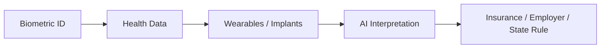

# Transhumanism và Gen Z - Cool Tech hay Slippery Slope

**Transhumanism được bán như tự do nâng cấp bản thân. Nhưng nếu hạ tầng nâng cấp nằm trong tay Big Tech, military, insurance, employer và state, câu hỏi không còn là “con người có nên mạnh hơn không?” Câu hỏi là: ai sở hữu layer nằm giữa cơ thể, tâm trí và máy móc?**

*Transhumanism is sold as the freedom to upgrade the self. But if the upgrade infrastructure is controlled by Big Tech, military, insurance, employers and states, the real question is who owns the layer between body, mind and machine.*

---

## Vault Position / Vị Trí Trong Vault

Bài này nằm trong series **Gen Z & Agenda 2030 Path** và nối với [[AI]], [[Digital ID Normalization - From Instagram to Government ID]] và [[Privacy]].

Không nên đọc transhumanism bằng phản xạ “tech xấu”. Medical technology có thể cứu người thật. Prosthetics, cochlear implants, pacemaker, brain-computer interface cho người liệt: đây là các use case đáng tôn trọng.

Rủi ro nằm ở pipeline:

```text
medical restoration
→ optional enhancement
→ competitive pressure
→ insurance/employer expectation
→ social access requirement
```

Khi “nâng cấp” chuyển từ quyền chọn sang điều kiện tham gia xã hội, cool tech thành control tech.

---

## 1. Transhumanism Là Gì?

Transhumanism là phong trào/triết lý muốn dùng công nghệ để vượt giới hạn sinh học:

- kéo dài tuổi thọ,
- tăng nhận thức,
- chỉnh gene,
- nối não với máy,
- augment giác quan,
- thay thế bộ phận cơ thể,
- merge với AI,
- upload/extend mind.

Ở tầng myth, nó là giấc mơ cổ xưa: vượt chết, vượt đau, vượt giới hạn thân xác.

Ở tầng systems, nó là câu hỏi về ownership của body data, neural data và upgrade infrastructure.

---

## 2. Gen Z Dễ Accept Vì Đã Sống Như Cyborg Mềm

Gen Z chưa cần chip để thành cyborg. Smartphone đã là external brain:

- memory outsource cho cloud,
- navigation outsource cho GPS,
- attention outsource cho feed,
- identity outsource cho profile,
- social life outsource cho platform,
- desire outsource cho recommendation,
- knowledge outsource cho AI/search.

Implant chỉ là internalization của một dependency đã có.

> Khi điện thoại đã là một phần của nervous system, chip không còn nghe quá xa lạ.

---

## 3. Cool Aesthetic Là Gateway

Transhumanism đến với Gen Z qua aesthetic:

- cyberpunk,
- gaming upgrade,
- biohacking,
- quantified self,
- wearable tech,
- anime/sci-fi,
- Neuralink hype,
- body modification culture,
- “optimize yourself”.

Trong game, upgrade luôn tốt: stat cao hơn, reaction nhanh hơn, memory mạnh hơn, ít sleep hơn.

Nhưng đời thật không phải game. Upgrade luôn có owner, maintenance cost, data policy, security risk và dependency.

---

## 4. Medical → Enhancement → Mandatory

Pipeline đáng chú ý:

### Phase 1: Medical restoration

- giúp người liệt điều khiển máy,
- phục hồi giác quan,
- hỗ trợ bệnh thần kinh,
- thiết bị theo dõi sức khỏe.

Public response: “Làm sao phản đối công nghệ cứu người?”

### Phase 2: Optional enhancement

- tăng focus,
- mood regulation,
- memory support,
- sleep optimization,
- productivity implants/wearables.

Public response: “Ai muốn thì dùng, optional mà.”

### Phase 3: Competitive expectation

- job yêu cầu enhanced productivity,
- insurance giảm phí nếu monitoring,
- school/work ưu tiên verified cognitive tools,
- unenhanced bị xem là backward.

Public response: “Không ai ép, nhưng không dùng thì tụt lại.”

### Phase 4: Access requirement

- implant/biometric để access service,
- health/security compliance,
- neural/biometric identity,
- behavior monitoring.

Public response: “Vì an toàn chung.”

Đây là slippery slope thật: không phải vì từng bước chắc chắn xấu, mà vì mỗi bước có lý do tốt riêng.

---

## 5. Body Data Là Data Sâu Nhất

Platform data đã nguy hiểm. Body/neural data còn sâu hơn:

- nhịp tim,
- hormone/stress signal,
- sleep,
- movement,
- mood,
- attention,
- neural patterns,
- impulse,
- medical vulnerability,
- reproductive data.

Nếu financial data cho biết bạn làm gì, body data cho biết bạn sắp làm gì hoặc dễ bị tác động bởi gì.

> Surveillance của hành vi là tầng ngoài. Surveillance của nervous system là tầng trong.

---

## 6. Digital ID Và Transhumanism Gặp Nhau Ở Biometrics

[[Digital ID Normalization - From Instagram to Government ID]] là bước trước của transhumanist access layer.



Một khi body data được chuẩn hóa, các bên có incentive dùng nó:

- insurance pricing,
- workplace productivity,
- mental health monitoring,
- public safety,
- anti-fraud,
- school performance,
- military readiness.

Câu hỏi: ai được quyền nói “data này chỉ để giúp bạn” và ai kiểm chứng?

---

## 7. Enhancement Inequality

Nếu upgrade thật sự tăng năng lực, người giàu sẽ mua trước.

Kết quả:

- cognitive inequality,
- healthspan inequality,
- productivity inequality,
- military/police enhancement,
- elite longevity,
- unenhanced underclass.

Transhumanism được bán như democratization of ability, nhưng có thể thành class divide sinh học.

> Người giàu không chỉ sở hữu asset. Họ có thể sở hữu body upgrade stack.

---

## 8. AI Merger: Cứu Người Hay Hấp Thụ Người?

Neural interface thường được frame là để con người không bị AI bỏ lại.

Nhưng “merge with AI” có hai cách đọc:

- human gains tool,
- human becomes endpoint of system.

Nếu AI layer nằm ngoài quyền kiểm soát cá nhân, thì merge không phải tự do. Nó là integration vào một operating system lớn hơn.

Redpill question:

> Bạn dùng AI để mở rộng ý thức, hay AI dùng interface để đọc và shape ý thức của bạn?

---

## 9. Claim Discipline

Không nên claim mọi implant là Mark of the Beast hoặc mọi BCI là control grid. Đó là bay quá nhanh.

Cách đọc chặt:

| Tầng | Câu hỏi |
|---|---|
| **Medical fact** | Công nghệ này chữa bệnh gì thật? risk/benefit ra sao? |
| **Data governance** | Ai sở hữu data? ai truy cập? retention bao lâu? |
| **Consent** | Optional thật hay bị ép qua employer/insurance/social pressure? |
| **Security** | Hack/failure/abuse thì sao? |
| **Equity** | Ai được upgrade, ai bị bỏ lại? |
| **Exit** | Có thể tháo, revoke, dùng alternative không? |

---

## 10. Sovereign Tech vs Captive Tech

Không phải mọi tech đều là Ma Trận. Có tech giúp con người tự do hơn.

Sovereign tech có đặc điểm:

- user-owned,
- open/auditable,
- revocable,
- minimal data,
- local control,
- không bắt buộc,
- không gắn access rights,
- không monopoly.

Captive tech thì ngược lại:

- locked ecosystem,
- opaque model,
- subscription dependency,
- data extraction,
- remote update,
- compliance gate,
- insurance/employer/state integration.

Transhumanism cần được đánh giá bằng tiêu chí này, không bằng hype.

---

## Synthesis

Transhumanism chạm vào giấc mơ rất thật: chữa bệnh, vượt đau, mở rộng khả năng, sống lâu hơn, hiểu não hơn.

Nhưng giấc mơ đó có thể bị capture.

> Medical restoration is sacred.  
> Coerced enhancement is control.  
> Body data without sovereignty is the final privacy frontier.

Gen Z sẽ là thế hệ đứng trước câu hỏi này sớm nhất:

> Nâng cấp để tự do hơn, hay nâng cấp để tương thích hơn với hệ thống?

---

## Related

- [[Gen Z - Phân Tích Phản Biện]]
- [[Digital ID Normalization - From Instagram to Government ID]]
- [[Gen Z và CBDC - Programmable Money Psychology]]
- [[Climate Anxiety as Control - Fear-Based Compliance]]
- [[AI]]
- [[Privacy]]
- [[Báo Cáo 2030]]
