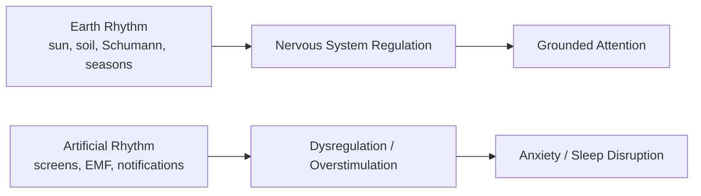

# Tần Số Schumann (Schumann Resonance)

**Tần Số Schumann là các đỉnh cộng hưởng điện từ cực thấp (ELF) hình thành trong khoang giữa bề mặt Trái Đất và tầng điện ly. Ở tầng khoa học, đây là hiện tượng vật lý khí quyển. Ở tầng vault, nó là cửa để đọc Trái Đất như một cơ thể điện-từ sống, nơi con người không tách khỏi nhịp của hành tinh.**

*Schumann Resonance is a set of extremely low frequency electromagnetic resonances formed in the cavity between Earth's surface and the ionosphere. Scientifically, it is an atmospheric physics phenomenon. In the vault, it opens a way to read Earth as a living electromagnetic body, where humans are not separate from the planet's rhythm.*

---

## Evidence Discipline / Cách Đọc Claim

| Tầng | Cách đọc | Ví dụ |
|---|---|---|
| **Fact / documentable** | Schumann resonances là hiện tượng ELF được dự đoán/đo lường | fundamental ~7.83 Hz, lightning-ionosphere cavity |
| **Research / emerging** | liên hệ giữa ELF, circadian rhythm, nervous system | bioelectromagnetics, brainwave entrainment |
| **Pattern / systems reading** | con người hiện đại bị cắt khỏi earth rhythms | indoor life, rubber shoes, EMF environment |
| **Speculative synthesis** | ascension symptoms, collective consciousness, planetary shift | cần đọc như hypothesis/symbolic lens |

Không nên biến mọi đau đầu/mất ngủ thành “Schumann spike”. Nhưng cũng không nên xem con người như sinh vật tách khỏi môi trường điện-từ của Trái Đất.

---

## 1. Schumann Resonance Là Gì?

Trái Đất và tầng điện ly tạo thành một khoang cộng hưởng khổng lồ. Mỗi khi sét đánh, năng lượng điện từ lan quanh hành tinh và tạo các mode cộng hưởng ở dải ELF.

Tần số nền nổi tiếng nhất khoảng **7.83 Hz**, thường được gọi là “nhịp tim Trái Đất”.

| Harmonic | Approx frequency | Gợi liên hệ não bộ |
|---|---:|---|
| Fundamental | ~7.83 Hz | alpha/theta border, meditative association |
| 2nd | ~14.3 Hz | beta-ish |
| 3rd | ~20.8 Hz | beta |
| 4th | ~27.3 Hz | high beta/gamma edge |
| 5th | ~33.8 Hz | gamma-ish |

Các liên hệ brainwave chỉ là tương quan/gợi ý, không phải bằng chứng rằng Schumann “điều khiển” não người một cách đơn giản.

---

## 2. Vì Sao Nó Được Gọi Là Nhịp Tim Trái Đất?

Tên “heartbeat of Earth” mạnh vì nó thay đổi frame: Trái Đất không còn là quả đá chết, mà là một hệ điện-từ đang rung.

Trong vault, điều này nối với:

- [[Long Mạch]] — earth energy lines,
- [[Gaia - Trái Đất Có Ý Thức]] — Earth as living field,
- [[Năng Lượng Aether]] — môi trường năng lượng tinh tế,
- [[Tuyến Tùng]] — cơ quan nhạy với light/dark rhythm,
- [[Khoa Học Xét Lại]] — science mở rộng khi biết hỏi lại assumption.

> Nếu Trái Đất có rhythm, thì “sức khỏe” không chỉ là chemistry. Nó còn là entrainment.

---

## 3. Human Nervous System Connection

Con người tiến hóa trong môi trường có:

- ngày/đêm,
- ánh nắng,
- đất,
- sét,
- từ trường,
- nhịp mùa,
- silence tự nhiên.

Modern life cắt rất nhiều connection đó:

- sống trong bê tông,
- giày cao su,
- ánh sáng xanh ban đêm,
- WiFi/EMF dày đặc,
- không chạm đất,
- ít nhìn trời,
- nervous system sống theo notification thay vì sunrise.

Không cần claim “Schumann chữa bệnh”. Chỉ cần thấy pattern: hệ thần kinh bị rút khỏi nhịp tự nhiên rồi được cắm vào nhịp artificial.

---

## 4. Schumann Spikes Và Ascension Symptoms

Internet thường gán các triệu chứng như headache, insomnia, vivid dreams, emotional waves cho “Schumann spikes”.

Cần cẩn trọng.

Các triệu chứng đó có thể đến từ:

- stress,
- sleep debt,
- caffeine,
- EMF/light exposure,
- solar activity,
- geomagnetic storms,
- hormone cycle,
- nervous system overload,
- hoặc thật sự có liên quan một phần tới environmental electromagnetic shifts.

Cách đọc đúng: Schumann spike là một data point, không phải lời giải thích toàn năng.

---

## 5. Ma Trận Và Sự Lệch Tần

[[Ma Trận]] không chỉ kiểm soát bằng media. Nó kiểm soát bằng rhythm.

Một người sống lệch nhịp tự nhiên sẽ dễ:

- lo âu,
- mất ngủ,
- thèm dopamine,
- mất intuition,
- dễ bị news cycle kéo,
- khó nghe cơ thể.

Concrete, artificial light, rubber shoes, indoor work và digital overstimulation không cần là “âm mưu 100%” để vẫn tạo ra effect: con người mất connection với Earth rhythm.

> Dù có cố tình hay không, kết quả vẫn là một population out-of-tune.

---

## 6. Practice / Re-entrainment

Các cách đơn giản để reconnect:

1. Đi chân trần trên đất/cỏ nếu an toàn.
2. Nhìn ánh sáng mặt trời sáng sớm.
3. Giảm screen ban đêm.
4. Ngủ trong phòng tối.
5. Ra thiên nhiên không mang tai nghe.
6. Thiền với hơi thở tự nhiên, không cần ép trải nghiệm.
7. Theo dõi solar/geomagnetic data nhưng không ám ảnh.

Binaural beats/PEMF/7.83Hz devices có thể là tool, nhưng đừng để technology thay hoàn toàn nature.

---

## Synthesis

Tần Số Schumann là một node nối science, earth energy và consciousness. Nó nhắc rằng con người không chỉ là biochemical machine, mà là sinh thể điện-từ sống trong trường điện-từ của hành tinh.

Không cần thần thánh hóa Schumann. Chỉ cần nhận ra: nếu sống lệch khỏi nhịp Trái Đất quá lâu, nervous system sẽ trả giá.

> Trở về với Đất đôi khi không phải thơ mộng. Nó là regulation.

---

## Related

- [[Khoa Học Xét Lại]]
- [[Long Mạch]]
- [[Năng Lượng Aether]]
- [[Tuyến Tùng]]
- [[Bão Từ Bắc Cực vs Bão Mặt Trời]]
- [[MOC - Science Revisionism]]
