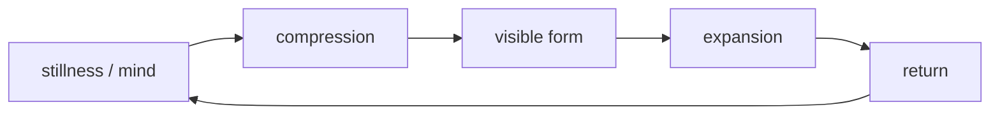

# Walter Russell

**Walter Russell là archetype của nhà hiền triết-nghệ sĩ bước vào khoa học bằng trực giác vũ trụ: ánh sáng, chuyển động, nhịp, polarity và mind như nguyên nhân.** Đọc Russell đúng nghĩa là tách ba tầng: tiểu sử có thể kiểm, hệ thống triết học của ông, và các claim khoa học cần kiểm chứng độc lập.

*Walter Russell is the mystic-scientist archetype: light, motion, polarity, rhythm, and mind as cause.*

---

## Evidence Discipline / Cách Đọc Claim

| Tầng claim | Cách đọc |
|---|---|
| Fact / biographical | Russell là nghệ sĩ, tác giả, founder của University of Science and Philosophy |
| Textual | các sách như *The Universal One*, *The Secret of Light* trình bày cosmology riêng |
| Method critique | claim khoa học của Russell cần phân biệt với physics mainstream và replication |
| Speculative synthesis | light-universe, mind-cause, transmutation là tầng alternative cosmology/metaphysics |

[[Khoa Học Xét Lại]] không phải quyền gọi mọi trực giác là khoa học. Nó là quyền hỏi những câu institution không thích, rồi vẫn chịu kỷ luật kiểm chứng.

---

## Vault Position / Vị Trí Trong Vault

Russell đứng cạnh [[Nikola Tesla]] trong [[MOC - Science Revisionism]]: cả hai được đọc như người chạm vào energy bằng trực giác sâu hơn mô hình công nghiệp. Ông cũng nối với [[Năng Lượng Aether]], [[Sự Nhất Thể]] và [[Monad]] vì hệ thống của ông không tách vật chất khỏi mind.

---

## Từ Khóa Cần Hiểu

**The Universal One** là tác phẩm Russell dùng để trình bày một vũ trụ luận dựa trên light, wave, polarity và mind. Đọc nó như một hệ metaphysics-khoa học, không như textbook physics đã được consensus xác nhận.

**The Secret of Light** là cửa vào dễ đọc hơn cho trực giác của Russell: ánh sáng không chỉ là hiện tượng vật lý mà là nguyên lý biểu hiện. Với vault, đây là bridge giữa [[Khoa Học Xét Lại]] và [[Sự Nhất Thể]].

**Russell cosmology** đặt nhịp, polarity và return ở trung tâm. Nó gần với ngôn ngữ hermetic hơn là ngôn ngữ phòng lab hiện đại, nên cần đọc bằng hai mắt: một mắt symbolic, một mắt verification.

---

## Renaissance Man

Russell là họa sĩ, điêu khắc gia, kiến trúc sư, nhạc sĩ, triết gia và tác giả. Dù không đi theo đường học thuật chuẩn, ông tạo ra một hệ thống vũ trụ luận riêng, kết hợp mỹ học, ánh sáng, chuyển động, polarity và thần học.

Điểm đáng đọc không phải "ông đúng hết". Điểm đáng đọc là một con người có thể đi từ art sang cosmology vì với ông, beauty và law không tách nhau. Đây là kiểu mind mà thế giới chuyên môn hóa quá mức thường không biết đặt vào đâu.

---

## Universe Of Motion

Một mệnh đề trung tâm của Russell: vũ trụ không phải matter tĩnh mà là motion, light, wave, rhythm. Matter là trạng thái biểu hiện của chuyển động; creation là hơi thở hai chiều: nén và giãn, charge và discharge, xuất hiện và trở về.

Đọc symbolic, mô hình này rất mạnh. Đọc physics, nó cần được đối chiếu cẩn thận với ngôn ngữ và dữ liệu khoa học hiện đại.

---

## Mind Is Cause

Russell đặt Mind trước matter. Trong ngôn ngữ esoteric, đây là cùng dòng với [[Sự Nhất Thể]] và [[Monad]]: consciousness không phải sản phẩm phụ tình cờ của vật chất, mà là nền làm vật chất hiện ra.

Tầng này không thể bán như fact lab đơn giản. Nó là metaphysical claim. Nhưng nó rất quan trọng trong vault vì nó chống lại worldview chết: con người chỉ là hóa chất, cosmos chỉ là vật thể, meaning chỉ là ảo giác.

---

## Russell Và Tesla

Russell và [[Nikola Tesla]] thường được đặt cạnh nhau vì cả hai đại diện cho dòng inventor-mystic: nhận insight qua hình ảnh, resonance, field, intuition, rồi cố diễn đạt bằng ngôn ngữ kỹ thuật. Cả hai cũng bị fringe culture thần thánh hóa quá mức.

Kỷ luật ở đây là giữ cả hai mặt: không để institution xóa bỏ câu hỏi sâu, nhưng cũng không để fan culture biến mọi câu nói thành revelation không thể kiểm.

---

## Vì Sao Bị Gạt Ra Rìa?

Russell không thuộc credential pipeline. Nguồn tri thức của ông mang tính mystical. Ngôn ngữ của ông không khớp physics chuẩn. Các claim về periodicity, transmutation, cosmology và energy không đi qua cơ chế academic validation thông thường.

Điều đó có thể nghĩa là ông sai ở nhiều điểm. Nó cũng có thể nghĩa là institution không có chỗ cho kiểu synthesis quá rộng. Vault không cần chọn cực đoan; vault giữ câu hỏi sống.

---

## Cách Đọc Russell Hôm Nay

Đọc Russell tốt nhất theo ba bước:

1. đọc như artist-philosopher để nhận grammar ánh sáng, nhịp và polarity;
2. đọc như alternative scientist với thái độ kiểm chứng, không worship;
3. đọc như mirror của thời đại: tại sao modern science rất giỏi đo vật chất nhưng rất vụng khi nói về meaning?

Đây là cách giữ được lửa mà không đốt nhà.

---

## Core Insight / Chốt Lại

**Walter Russell quan trọng không vì ông thay thế physics, mà vì ông nhắc khoa học rằng universe không chỉ là object để đo. Nó còn là pattern, beauty, mind và rhythm để được nhận ra.**

*Russell does not need to replace physics to matter. He matters because he keeps beauty, mind, and rhythm inside the question of science.*
