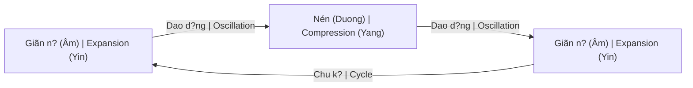

# Walter Russell (1871–1963)

**Walter Russell** là nhà bác h?c, ngh? si và tri?t gia M? - m?t trong nh?ng ngu?i hi?u bi?t sâu s?c nh?t v? b?n ch?t vu tr? thông qua tr?i nghi?m tâm linh tr?c ti?p.

> "The universe is not a universe of matter, but a universe of motion."

## Ti?u S? Phi Thu?ng

### Renaissance Man
- Painter, sculptor, architect
- Musician, philosopher
- Scientist (self-taught)
- Figure skater champion
- No formal education past 9

### Cosmic Illumination (1921)
- 39-day mystical experience
- Complete understanding of universe
- Downloaded knowledge directly
- Similar to [[Nikola Tesla|Tesla's]] visions

## Core Teachings

### 1. The Universe is Light
- Everything is light in motion
- Matter = compressed light
- Energy = expanded light
- No "solid" matter exists

### 2. Two-Way Universe
- Everything oscillates
- Compression ? Expansion
- Centripetal ? Centrifugal
- Breathing universe

### 3. Wave Theory

### 4. Mind is Cause
- Consciousness creates matter
- Thought is the only force
- Will in motion = creation
- [[S? Nh?t Th?]] - All is Mind

## Scientific Contributions

### Periodic Table
- Predicted elements before discovery
- Different arrangement than Mendeleev
- Based on octave waves
- Some later confirmed

### Cosmology
- Challenged Big Bang
- Universe is eternal
- Pulsating (breathing) model
- Modern echoes in cyclic cosmology

### Transmutation
- Elements can be transformed
- Through understanding wave mechanics
- Not random, but lawful
- Alchemical implications

## Published Works

| Work | Year | Focus |
|------|------|-------|
| *The Universal One* | 1926 | Cosmology |
| *The Secret of Light* | 1947 | Light physics |
| *The Message of the Divine Iliad* | 1948-49 | Spiritual |
| *Atomic Suicide?* | 1957 | Nuclear warning |

## Why Marginalized?

### Challenges to Mainstream
- No academic credentials
- Mystical source of knowledge
- Contradicts establishment physics
- Free energy implications

### Similar to Tesla
- Both had visions
- Both understood energy deeply
- Both suppressed/ignored
- Both ahead of their time

## Legacy

### University of Science and Philosophy
- Founded by Russell and wife Lao
- Swannanoa, Virginia
- Still operating today

### Modern Interest
- Alternative science community
- Electric universe theory echoes
- Consciousness research
- Sacred geometry connections

## Quotes

> "Mediocrity is self-inflicted. Genius is self-bestowed."

> "The electric universe is a thought-wave universe."

> "Knowledge is cosmic. It does not evolve or have its beginnings in the brain."

## Related

- [[Khoa H?c Chân Chính và Thu?ng Ð?]]
- [[S? Nh?t Th?]] - Core teaching
- [[Nikola Tesla]] - Contemporary mystic-scientist
- [[Nang Lu?ng Aether]] - Similar concepts
- [[Monad]] - Light/consciousness as source
