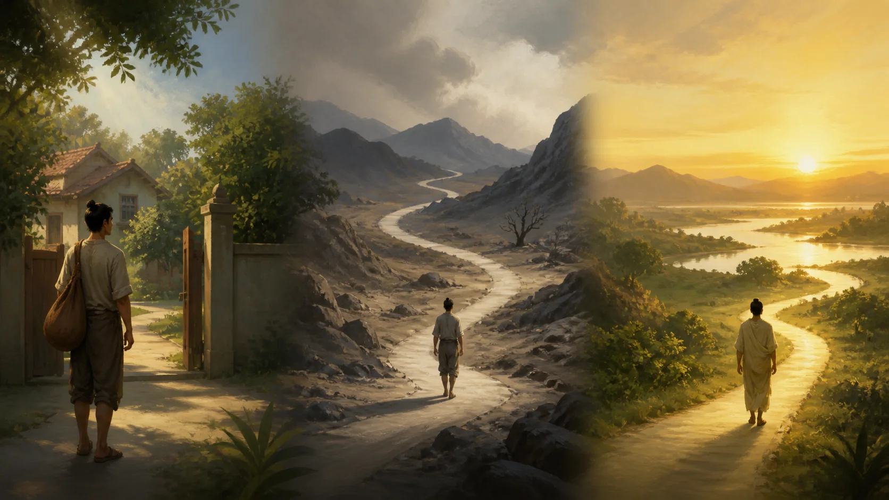
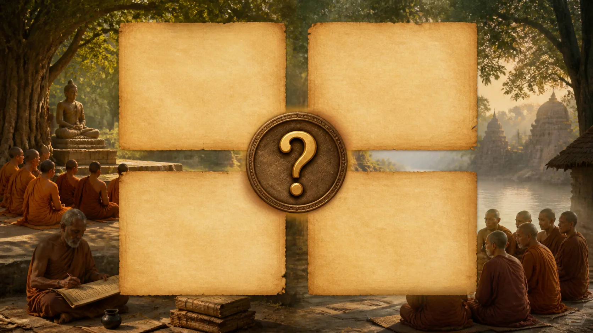

# Đức Phật Lịch Sử Và Câu Hỏi Ngài Muốn Giải Quyết

<!-- vault-voice-opening:v1 -->

Nếu bỏ hết tượng vàng, phép màu và lớp sương huyền thoại, ta còn gặp được ai? Bài này bắt đầu từ một con người đã già, bệnh, chứng kiến mất mát và đặt một câu hỏi rất thực: có cách nào sống mà không bị sinh–già–bệnh–chết kéo đi trong vô thức không?

Đi tìm Đức Phật lịch sử không phải để làm Ngài nhỏ lại. Nó giúp ta thấy giáo pháp không rơi từ trời xuống như một bộ tín điều. Nó mọc lên từ việc nhìn thẳng vào điều ai cũng gặp nhưng phần lớn chúng ta cố trì hoãn nhìn.

## 1. Hai Chân Dung Cần Được Giữ Cạnh Nhau

<!-- vault-voice-section:v1 -->
Giữ hai chân dung cạnh nhau giúp mình không phải chọn giữa một nhân vật lịch sử khô cứng và một Đức Phật đã bị huyền thoại hóa đến mức không còn chạm được. Khi hỏi “Đức Phật là ai?”, ta thường gộp hai câu hỏi khác loại. Câu thứ nhất thuộc lịch sử: có một con người tên Gotama từng sống, từ bỏ đời gia chủ, giảng dạy và lập cộng đồng ở miền bắc tiểu lục địa Ấn Độ hay không? Câu thứ hai thuộc đời sống tôn giáo: các cộng đồng Phật giáo hiểu con người ấy là ai, Ngài đã thành tựu điều gì và sự thành tựu ấy có ý nghĩa gì? Hai câu hỏi liên hệ chặt chẽ nhưng không thể dùng cùng một thước đo.

Trong bài này, **Buddha — đọc gần đúng “Bút-đa” — bậc tỉnh thức** là một danh hiệu. Nhân vật lịch sử thường được gọi là Gotama trong Pāli, Gautama trong Sanskrit, hoặc Siddhattha Gotama trong truyền thống về sau. Gọi Ngài là “Đức Phật” đã hàm ý một cách hiểu tôn giáo về giác ngộ; gọi “Gotama lịch sử” nhấn mạnh đối tượng có thể khảo cứu bằng văn bản học, khảo cổ và lịch sử xã hội. Không tên gọi nào tự nó giải quyết được câu hỏi lịch sử.

Đồng thuận rộng trong giới nghiên cứu là đằng sau các truyền thống văn bản có một vị sa-môn và đạo sư lịch sử hoạt động ở vùng trung lưu sông Hằng, thường được đặt khoảng thế kỷ V–IV trước Công nguyên. Tuy nhiên, niên đại sinh và mất chính xác vẫn còn tranh luận. Không có tiểu sử phi Phật giáo nào được viết đồng thời với cuộc đời Ngài, cũng không có bản ghi lời nói tại chỗ. Những nguồn còn lại đã đi qua truyền khẩu, tuyển chọn, định hình cộng đồng và biên tập.

**Samaṇa — đọc gần đúng “sa-ma-na” — sa-môn, người sống đời xuất ly** là bối cảnh xã hội quan trọng. Gotama không xuất hiện trong khoảng trống. Các kinh mô tả một thế giới có nhiều đạo sư, lối khổ hạnh, tranh luận về nghiệp, tái sinh, tri thức và giải thoát. Việc Ngài rời gia đình vì thế vừa là biến cố cá nhân vừa thuộc một phong trào tôn giáo rộng hơn. Câu hỏi riêng của Ngài sẽ được hiểu rõ hơn nếu ta đọc nó như một cuộc truy tìm giữa những lựa chọn có thật của thời đại, không phải như một huyền thoại cô lập.

Mục tiêu của bài không phải viết một “cuộc đời Đức Phật” đầy đủ. Những chuyện về đản sinh, lời tiên tri, bốn cảnh tượng, chiến thắng Māra hay các phép lạ có vai trò lớn trong ký ức Phật giáo, nhưng nhiều chi tiết nằm trong tiểu sử và chú giải muộn. Ta chỉ hỏi hẹp hơn: các tầng Kinh sớm tự trình bày cuộc truy tìm của Gotama ra sao, vấn đề Ngài muốn giải quyết là gì, và lịch sử có thể nói đến đâu?

## 2. Ba Cửa Sổ Kinh Sớm: [Cuộc tìm cầu cao quý](https://suttacentral.net/mn26), [Khổ hạnh và con đường giác ngộ](https://suttacentral.net/mn36) Và [Những ngày cuối của Đức Phật](https://suttacentral.net/dn16)

> [!quote] Kinh về cuộc tìm cầu cao quý — Trung Bộ Kinh
> Đoạn trích đối chiếu người đang chịu sinh, già, bệnh, chết, sầu và ô nhiễm với việc tìm Nibbāna: sự an ổn không sinh, không già, không bệnh, không chết, không sầu và không ô nhiễm.
>
> **Pāli**
> *Katamā ca, bhikkhave, ariyā pariyesanā? Idha, bhikkhave, ekacco attanā jātidhammo samāno jātidhamme ādīnavaṁ viditvā ajātaṁ anuttaraṁ yogakkhemaṁ nibbānaṁ pariyesati, attanā jarādhammo samāno jarādhamme ādīnavaṁ viditvā ajaraṁ anuttaraṁ yogakkhemaṁ nibbānaṁ pariyesati, attanā byādhidhammo samāno byādhidhamme ādīnavaṁ viditvā abyādhiṁ anuttaraṁ yogakkhemaṁ nibbānaṁ pariyesati, attanā maraṇadhammo samāno maraṇadhamme ādīnavaṁ viditvā amataṁ anuttaraṁ yogakkhemaṁ nibbānaṁ pariyesati, attanā sokadhammo samāno sokadhamme ādīnavaṁ viditvā asokaṁ anuttaraṁ yogakkhemaṁ nibbānaṁ pariyesati, attanā saṅkilesadhammo samāno saṅkilesadhamme ādīnavaṁ viditvā asaṅkiliṭṭhaṁ anuttaraṁ yogakkhemaṁ nibbānaṁ pariyesati. Ayaṁ, bhikkhave, ariyā pariyesanā.*
>
> **Dịch Việt rút gọn**
> Này các tỳ-kheo, thế nào là cuộc tìm cầu cao quý? Ở đây, một người vốn chịu sinh, thấy nguy hại trong cái chịu sinh, tìm Niết-bàn—sự an ổn tối thượng khỏi ách, không sinh … Đây gọi là cuộc tìm cầu cao quý.
>
> <small>Nguồn kiểm chứng: <a href="https://suttacentral.net/mn26">MN 26, đoạn 12.1–12.3</a> · <i>Ariyapariyesanā Sutta</i></small>

<!-- vault-voice-section:v1 -->
Ba bài Kinh này không kể một biography hiện đại, nhưng chúng cho ba góc đủ gần để thấy câu hỏi nào đã đẩy Gotama lên đường. [Cuộc tìm cầu cao quý — Trung Bộ Kinh](https://suttacentral.net/mn26) thường được gọi là bài kinh về cuộc tìm cầu cao quý. Văn bản đặt vào lời Gotama một đối lập rất sáng: người đang bị sinh, già, bệnh, chết, sầu và ô nhiễm có thể tiếp tục tìm những gì cũng chịu cùng số phận ấy; hoặc nhận ra nguy hiểm và tìm cái không sinh, không già, không bệnh, không chết, không sầu, không ô nhiễm. Đây là khung tự thuật trong một bài giảng được truyền lại, không phải nhật ký do Gotama viết. Dẫu vậy, nó cho thấy cộng đồng sớm nhớ trọng tâm cuộc tìm kiếm không phải là sáng lập một tôn giáo hay giải thích toàn bộ vũ trụ, mà là thoát khỏi cấu trúc sinh–già–chết và nắm giữ.

Trong [Cuộc tìm cầu cao quý](https://suttacentral.net/mn26), Gotama đến học Āḷāra Kālāma và Uddaka Rāmaputta. Ngài đạt đến trình độ mà mỗi vị thầy công nhận, nhưng thấy thành tựu ấy chưa dẫn tới ly tham, đoạn diệt, an tịnh và giác ngộ trọn vẹn. Chi tiết này có thể giữ ký ức về môi trường tu tập đương thời; ta không có tài liệu độc lập để viết tiểu sử chắc chắn cho hai vị thầy. Giá trị gần nhất của đoạn văn là cách nó định nghĩa tiêu chuẩn: một trạng thái cao không đủ chỉ vì tinh tế hoặc hiếm có; nó phải giải quyết gốc rễ của trói buộc.

> [!quote] Kinh về khổ hạnh và con đường giác ngộ — Trung Bộ Kinh
> Gotama nhận ra khổ hạnh cay nghiệt không đem lại tri kiến giải thoát; ký ức về sơ thiền khiến Ngài thấy có thể tồn tại một con đường khác đến giác ngộ.
>
> **Pāli**
> *Na kho panāhaṁ imāya kaṭukāya dukkarakārikāya adhigacchāmi uttari manussadhammā alamariyañāṇadassanavisesaṁ. Siyā nu kho añño maggo bodhāyā’ti? Tassa mayhaṁ, aggivessana, etadahosi: ‘abhijānāmi kho panāhaṁ pitu sakkassa kammante sītāya jambucchāyāya nisinno vivicceva kāmehi vivicca akusalehi dhammehi savitakkaṁ savicāraṁ vivekajaṁ pītisukhaṁ paṭhamaṁ jhānaṁ upasampajja viharitā. Siyā nu kho eso maggo bodhāyā’ti? Tassa mayhaṁ, aggivessana, satānusāri viññāṇaṁ ahosi: ‘eseva maggo bodhāyā’ti.*
>
> **Dịch Việt rút gọn**
> Nhưng bằng lối khổ hạnh cay nghiệt này, ta không đạt pháp vượt người hay tri kiến xứng bậc thánh. Liệu có con đường khác đến giác ngộ? … Rồi sự nhận biết theo sau ký ức ấy khởi lên: đây chính là con đường đến giác ngộ.
>
> <small>Nguồn kiểm chứng: <a href="https://suttacentral.net/mn36">MN 36, đoạn 30.5–31.5</a> · <i>Mahāsaccaka Sutta</i></small>

[Khổ hạnh và con đường giác ngộ — Trung Bộ Kinh](https://suttacentral.net/mn36) trình bày một khung tự thuật khác, tập trung vào khổ hạnh cực đoan. Gotama kể những thực hành nín thở và giảm ăn đến mức thân thể suy kiệt. Ngài kết luận con đường ấy không đưa đến tri kiến cao thượng, rồi nhớ lại một trạng thái an tĩnh thời trẻ và hỏi liệu đó có thể là con đường giác ngộ. Sự chuyển hướng quan trọng không phải lời cổ vũ hưởng thụ. Nó là sự bác bỏ ý tưởng rằng đau đớn tự thân thanh tẩy, đồng thời thừa nhận thân được nuôi dưỡng vừa đủ là điều kiện cho công việc của tâm.

[Khổ hạnh và con đường giác ngộ](https://suttacentral.net/mn36) còn đặt cuộc giác ngộ trong một cấu trúc ba minh và sự nhận ra giải thoát. Người đọc hiện đại có thể tiếp nhận cấu trúc ấy theo đức tin, tạm treo phán đoán, hoặc nghiên cứu như ngôn ngữ tôn giáo của văn bản. Phương pháp lịch sử không thể xác nhận trực tiếp một kinh nghiệm nội tâm cổ đại, càng không thể dùng khoa học tự nhiên để chứng minh nó. Nhưng ta có thể xác định chức năng của lời kể: nó tuyên bố rằng vấn đề được giải quyết nhờ hiểu biết và đoạn trừ các lậu hoặc, chứ không nhờ địa vị, nghi lễ hay tự hành xác.

> [!quote] Kinh về những ngày cuối của Đức Phật — Trường Bộ Kinh
> Đức Phật nói với Ānanda rằng sau khi Ngài qua đời, Pháp và Luật đã được giảng dạy, quy định sẽ là người thầy của cộng đồng.
>
> **Pāli**
> *“siyā kho panānanda, tumhākaṁ evamassa: ‘atītasatthukaṁ pāvacanaṁ, natthi no satthā’ti. Na kho panetaṁ, ānanda, evaṁ daṭṭhabbaṁ. Yo vo, ānanda, mayā dhammo ca vinayo ca desito paññatto, so vo mamaccayena satthā.*
>
> **Dịch Việt**
> Này Ānanda, các ông có thể nghĩ: “Lời dạy đã mất thầy; chúng ta không còn thầy.” Không nên nhìn như vậy. Pháp và Luật ta đã dạy và quy định sẽ là thầy của các ông sau khi ta qua đời.
>
> <small>Nguồn kiểm chứng: <a href="https://suttacentral.net/dn16">DN 16, đoạn 6.1.2–6.1.5</a> · <i>Mahāparinibbāna Sutta</i></small>

[Những ngày cuối của Đức Phật — Trường Bộ Kinh](https://suttacentral.net/dn16) mở cửa sổ thứ ba: ký ức văn chương về hành trình cuối, lời dạy cuối, việc qua đời, tang lễ và phân chia xá-lợi. **Parinibbāna — đọc gần đúng “pa-ri-níp-ba-na” — sự Niết-bàn hoàn toàn khi một bậc giải thoát qua đời** là thuật ngữ truyền thống; nó không nên bị giản lược thành “chết” nhưng cũng không cho phép ta mô tả một nơi chốn sau chết. [Những ngày cuối của Đức Phật](https://suttacentral.net/dn16) là văn bản nhiều tầng và có mục đích cộng đồng rõ rệt. Nó lưu những địa danh, thiết chế và mối quan tâm có thể hữu ích cho lịch sử, song không phải biên bản do một nhân chứng chép liên tục trong chuyến đi.

Một lời chỉ dẫn nổi bật trong [Những ngày cuối của Đức Phật](https://suttacentral.net/dn16) là sau khi Như Lai qua đời, Dhamma và Vinaya sẽ là thầy. **Dhamma — đọc gần đúng “Đăm-ma” — giáo pháp, chân lý hoặc hiện tượng tùy văn cảnh**; **Vinaya — đọc gần đúng “Vi-na-ya” — kỷ luật tu viện**. Câu này đặt việc bảo tồn lời dạy và quy tắc ở trung tâm bản sắc cộng đồng.

Ba văn bản không ghép thành một cuốn phim liên tục. Chúng là ba cách kể có mục tiêu giảng dạy: cuộc tìm cầu, phép thử khổ hạnh và hồi kết của người thầy. Đọc chúng cùng nhau giúp nhận ra một đường nét ổn định mà không giả định mọi câu đều đồng thời: một người từ bỏ đời sống quen thuộc, thử các con đường có sẵn, đặt tiêu chuẩn giải thoát rất cao, tuyên bố tìm thấy con đường, dạy nó cho người khác và để lại một cộng đồng dựa vào Pháp–Luật.

## 3. Câu Hỏi Không Phải “Vũ Trụ Là Gì?” Mà Là “Khổ Chấm Dứt Thế Nào?”

<!-- vault-voice-section:v1 -->
Nếu bắt đầu sai câu hỏi, mình có thể dùng cả đời để tìm một câu trả lời mà Đức Phật chưa từng đặt làm trung tâm. **Nibbāna — đọc gần đúng “níp-ba-na” — Niết-bàn, sự tắt tham, sân và si** là tên mà truyền thống dùng cho mục tiêu giải thoát. [Cuộc tìm cầu cao quý](https://suttacentral.net/mn26) diễn tả mục tiêu bằng chuỗi phủ định: không sinh, không già, không bệnh, không chết, không sầu, không ô nhiễm. Những từ ấy không phải bản thiết kế vật lý về một cõi khác. Chúng đánh dấu sự tương phản giữa cái bị điều kiện và mục tiêu không còn bị trói bởi chính cơ chế gây khổ.

Câu hỏi của Gotama vì vậy mang tính chữa trị: điều gì khiến một hữu tình, dù biết mình mong manh, vẫn bám vào những gì mong manh; sự bám ấy tạo khổ ra sao; có thể kết thúc nó không; và phải huấn luyện thế nào? Các bài về Tứ Thánh Đế về sau sẽ trình bày cấu trúc chẩn đoán này rõ hơn. Ở đây chỉ cần thấy câu hỏi ban đầu không phải “làm sao tin đúng một tín điều”, mà là “làm sao biết và sống theo cách khiến sự trói buộc thật sự kết thúc”.

Điều đó không có nghĩa Kinh tạng không nói về vũ trụ, chư thiên, nghiệp hay tái sinh. Nó có nói, và những nội dung ấy thuộc thế giới quan của văn bản. Nhưng nhiều bài kinh từ chối sa vào các câu hỏi không đưa tới mục tiêu thực hành. Trọng lực của giáo pháp nằm ở dukkha và sự đoạn tận dukkha. Việc dựng một hệ thống siêu hình hoàn chỉnh mà không thay đổi tham, sân, si sẽ trượt khỏi tiêu chuẩn mà chính [Cuộc tìm cầu cao quý](https://suttacentral.net/mn26) và [Khổ hạnh và con đường giác ngộ](https://suttacentral.net/mn36) đặt ra.

Ta cũng không nên biến câu hỏi ấy thành một dự án “hạnh phúc” mơ hồ. Khổ mà Gotama nhắm tới bao gồm sinh, già, bệnh, chết, sầu và sự lệ thuộc vào cái biến đổi. Nó sâu hơn việc giảm căng thẳng, dù giảm căng thẳng có thể là lợi ích phụ của thực hành. Ngược lại, nói “đời là khổ” như một phán quyết bi quan cũng quá thô. Văn bản thừa nhận lạc và những tầng an tĩnh; vấn đề là chúng có bị nắm giữ, có vô thường, và có đủ để chấm dứt trói buộc hay không.

Từ góc nhìn lịch sử, ta không thể quan sát trực tiếp khoảnh khắc một người cổ đại đặt câu hỏi trong tâm. Ta chỉ có thể nhận diện câu hỏi mà truyền thống văn bản sớm nhất còn lại nhất quán đặt vào trung tâm. Đây là suy luận có giới hạn nhưng hữu ích: nếu nhiều bài giảng, công thức và quy tắc của cộng đồng xoay quanh cùng một dự án giải thoát, dự án ấy có khả năng phản ánh hạt nhân hoạt động của người sáng lập, ngay cả khi hình thức văn chương đã phát triển.

## 4. Luật, Vi Diệu Pháp, Chú Giải Và Tiểu Sử Muộn

<!-- vault-voice-section:v1 -->
Đến đây cần đổi kính đọc, vì Kinh, Luật, Vi Diệu Pháp và tiểu sử muộn không làm cùng một công việc. Lớp **Kinh sớm** trong bài này là các bài như [Cuộc tìm cầu cao quý](https://suttacentral.net/mn26), [Khổ hạnh và con đường giác ngộ](https://suttacentral.net/mn36) và những phần sớm có thể nhận diện trong [Những ngày cuối của Đức Phật](https://suttacentral.net/dn16). “Sớm” là đánh giá tương đối qua so sánh văn bản, ngôn ngữ, học thuyết và các bản song song; nó không có nghĩa bản viết còn lại được tạo trong đời Đức Phật. Những bài này cho tiếng nói gần nhất mà ta hiện có với phong trào ban đầu, nhưng vẫn là sản phẩm của truyền thừa cộng đồng.

Lớp **Luật tạng** kể nhiều sự kiện về Đức Phật trong quá trình giải thích vì sao một quy tắc được thiết lập. Luật cho thấy lý tưởng về một người thầy xử lý xung đột, phản ứng trước hành vi cụ thể và xây thiết chế. Tuy nhiên, truyện duyên khởi của giới luật cũng có chức năng chuẩn hóa. Không phải cứ có nhiều chi tiết là lịch sử chắc hơn. Bài 3 sẽ đọc cấu trúc Luật kỹ hơn; ở đây điều cần nhớ là Luật vừa chứa ký ức xã hội vừa là văn bản quy phạm.

Lớp **Vi Diệu Pháp** không phải nguồn chính để dựng tiểu sử Gotama. Bảy bộ Abhidhamma của Theravāda phân tích các pháp và quan hệ theo một kiến trúc hệ thống hơn. Truyền thống Theravāda xem Vi Diệu Pháp là lời Phật theo nghĩa kinh điển, nhưng nghiên cứu lịch sử thường đặt sự định hình của lớp này sau nhiều chất liệu Kinh và Luật. Vì thế, dùng phân loại Vi Diệu Pháp để làm rõ tư tưởng Theravāda là hợp lệ khi gắn nhãn; dùng nó như bản ghi trực tiếp điều Gotama lịch sử đã nói là bước vượt quá chứng cứ.

Lớp **chú giải và tiểu sử muộn** đem lại chân dung phong phú hơn: các đời trước của Bồ-tát, điềm lạ lúc sinh, quá trình trưởng thành, đại xuất gia và cuộc chiến với Māra được kết nối thành một đời sống trọn vẹn. *Nidānakathā*, phần dẫn nhập của chú giải Jātaka, và *Buddhacarita* của Aśvaghoṣa là những cột mốc quan trọng của truyền thống tiểu sử, không phải tài liệu đồng thời. Chúng diễn đạt cách các cộng đồng hiểu phẩm tính của Phật và lý tưởng Bồ-tát; giá trị tôn giáo và văn học ấy không phụ thuộc vào việc mọi chi tiết đều được sử học xác nhận.

Các **biên niên sử hậu kỳ** như *Dīpavaṃsa* và *Mahāvaṃsa* tập trung nhiều vào truyền thừa, hội nghị và sự đến Sri Lanka của Phật giáo. Chúng được biên soạn nhiều thế kỷ sau các sự kiện được kể, phục vụ ký ức của tăng đoàn và vương quyền Sri Lanka. Chúng là chứng cứ trực tiếp về cách cộng đồng thời biên soạn hiểu quá khứ, và là chứng cứ gián tiếp, cần phê bình, về quá khứ xa hơn.

Trong **Theravāda hiện đại**, các bài giảng thường kể đời Phật như khuôn mẫu tu tập: thấy già bệnh chết để tỉnh mộng, bỏ hai cực đoan, giác ngộ rồi dạy vì lòng bi. Đây là diễn giải có sức sống. Nhưng người viết cần nói “truyền thống kể” khi dựa vào tiểu sử muộn, “Kinh trình bày” khi dựa vào một văn bản xác định, và “nghiên cứu đề nghị” khi dùng tái dựng lịch sử. Ba động từ nhỏ giữ cho niềm tôn kính không phải trả giá bằng sự nhập nhằng.

## 5. Sử Học Có Thể Biết Gì — Và Không Thể Biết Gì?

<!-- vault-voice-section:v1 -->
Sử học không cho mình camera quay ngược thời gian; nó cho một cách cân mức chắc chắn thay vì lấp khoảng trống bằng niềm tin. Nhà nghiên cứu không có một “bản gốc” duy nhất để mở ra. Họ so sánh Nikāya Pāli với các Āgama Hán dịch, mảnh Sanskrit và tài liệu thuộc nhiều dòng truyền thừa. Khi những nguồn tách biệt chia sẻ một cấu trúc, khả năng cấu trúc ấy có trước sự chia rẽ bộ phái tăng lên. Nhưng tương đồng vẫn không tự động đưa ta về đúng từng chữ của người thầy; công thức truyền khẩu có thể được chuẩn hóa rất sớm, và nhiều cộng đồng có thể thừa hưởng cùng một lớp biên tập.

Bhikkhu Anālayo, trong các nghiên cứu so sánh Trung Bộ, cho thấy việc đặt các bản song song cạnh nhau có thể nhận diện cả lõi chung lẫn phát triển riêng. Richard Gombrich nhấn mạnh đọc giáo lý trong bối cảnh tư tưởng Ấn Độ cổ và tìm những lối chơi chữ, phản biện Bà-la-môn giáo có thể đã bị người truyền sau hiểu khác. Gregory Schopen cảnh báo giới nghiên cứu không nên lấy văn bản quy phạm làm ảnh chụp đời sống tu viện; bia ký và khảo cổ nhiều khi cho một bức tranh khác. Ba hướng ấy bổ sung nhau: so sánh văn bản, phục dựng bối cảnh tư tưởng và kiểm tra bằng vật chứng.

Một số nét có mức khả tín tương đối cao: tồn tại một đạo sư Gotama; Ngài gắn với cộng đồng sa-môn vùng Magadha–Kosala; chủ trương một con đường huấn luyện nhằm giải thoát khỏi khổ; thu hút cả xuất gia lẫn tại gia; và để lại một cộng đồng có kỷ luật. Những chi tiết như ngày sinh chính xác, trình tự từng tuần sau giác ngộ, lời nói nguyên văn trong một cuộc gặp, hay toàn bộ lộ trình hành trình cuối có độ chắc thấp hơn. Mức tin cậy không chỉ có hai giá trị “thật” và “giả”.

Sử học cũng có giới hạn nguyên tắc trước tuyên bố giác ngộ. Nó có thể khảo sát khái niệm, hành vi, cộng đồng và ảnh hưởng; nó không có thiết bị để quay lại kinh nghiệm chủ quan của Gotama. Nói “sử học chưa chứng minh giác ngộ” là đúng nhưng chưa đủ: loại công cụ này vốn không trực tiếp phán quyết cứu cánh tôn giáo. Ngược lại, niềm tin rằng Ngài giác ngộ không được dùng để tự động xác nhận mọi dữ kiện địa lý hay niên đại trong truyền thống.

## 6. Đọc Cuộc Đời Như Một Bản Đồ Thực Hành Có Kiểm Soát

<!-- vault-voice-section:v1 -->
Một tiểu sử chỉ đáng giữ nếu nó quay lại soi cách mình đang sống, không chỉ làm quá khứ thêm trang nghiêm. Đọc lịch sử tốt không làm cuộc đời Gotama xa đi; nó làm bài học chính xác hơn. [Khổ hạnh và con đường giác ngộ](https://suttacentral.net/mn36) chẳng hạn không bảo người đọc thử mọi cực đoan để chứng minh ý chí. Nó cho thấy một phương pháp phải được đánh giá theo kết quả giải thoát, và thân thể bị phá hủy có thể làm hỏng điều kiện nhận biết. Ta có thể áp dụng nguyên tắc ấy bằng cách hỏi một thực hành đang giảm tham, sân, si hay chỉ tạo bản sắc “người tu giỏi”. Đây là suy luận thực hành từ văn bản, không phải một câu trích nguyên văn.

[Cuộc tìm cầu cao quý](https://suttacentral.net/mn26) đặt một tấm gương khác: ta thường tìm an toàn trong những gì tự chúng già, hỏng và mất. Nhận ra điều ấy không buộc ta bỏ trách nhiệm với người thân hay vật chất. Nó mời phân biệt chăm sóc với chiếm hữu, sử dụng với đồng nhất, yêu thương với đòi hỏi cái hữu hạn phải bảo đảm vĩnh viễn. Cách áp dụng cụ thể cần đạo đức và bối cảnh; không nên dùng câu chuyện xuất gia của Phật để gây áp lực khiến mọi người từ bỏ đời sống gia đình.

[Những ngày cuối của Đức Phật](https://suttacentral.net/dn16) nhắc về tính hữu hạn ngay trong cộng đồng do người thầy lập. Nếu Pháp–Luật là điểm tựa sau khi người thầy mất, thái độ trưởng thành không phải tìm một quyền lực cá nhân không thể chất vấn. Người học cần văn bản, cộng đồng, thực hành và khả năng kiểm tra. Tuy vậy, câu ấy cũng không phải giấy phép để mỗi người chọn tùy ý điều hợp sở thích rồi gọi là lời Phật. Truyền thừa có kỷ luật nằm giữa sùng bái cá nhân và chủ nghĩa cá nhân tùy tiện.

## 7. Kỷ Luật Khẳng Định, Đọc Tiếp Và Nguồn

> [!quote] Văn bản nói gì
> [Cuộc tìm cầu cao quý](https://suttacentral.net/mn26) trình bày cuộc tìm cầu từ cái chịu sinh–già–chết tới cái không bị cùng điều kiện; [Khổ hạnh và con đường giác ngộ](https://suttacentral.net/mn36) kể việc từ bỏ khổ hạnh cực đoan vì nó không dẫn đến tri kiến giải thoát; [Những ngày cuối của Đức Phật](https://suttacentral.net/dn16) lưu ký ức văn chương về hành trình cuối và việc lấy Dhamma–Vinaya làm thầy sau khi Phật qua đời.

> [!info] Truyền thống giải thích gì
> Theravāda hiểu Gotama là một Sammāsambuddha, bậc tự mình khám phá con đường đã thất truyền và chỉ dạy lại; các chú giải và tiểu sử hậu kỳ nối nhiều mảnh kể thành một cuộc đời hoàn chỉnh, giàu biểu tượng và phép lạ.

> [!example] Bài này suy luận gì
> Lõi có khả năng lịch sử là một đạo sư sa-môn đã đặt sự chấm dứt khổ và trói buộc làm tiêu chuẩn cho con đường. Suy luận này dựa trên sự hội tụ của nhiều lớp văn bản, không phải tuyên bố rằng ta đã phục dựng nguyên văn hay toàn bộ tâm trạng của Ngài.

> [!warning] Điều chưa chứng minh
> Chưa có tiểu sử đồng thời ngoài Phật giáo; ngày tháng chính xác, trình tự mọi sự kiện và tính lịch sử của từng chi tiết kỳ diệu chưa được chứng minh. Sử học cũng không chứng minh hoặc bác bỏ trực tiếp trạng thái giác ngộ nội tâm.

<!-- vault-voice-section:v1 -->
Cuối bài, điều quan trọng là biết câu nào đứng trên văn bản, câu nào đứng trên pattern lịch sử và câu nào chỉ là diễn giải làm việc. Đọc tiếp: [[theravada/02 - Theravāda Là Gì - Truyền Thừa, Phạm Vi Và Những Hiểu Lầm|Theravāda Là Gì — Truyền Thừa, Phạm Vi Và Những Hiểu Lầm]]. Sau đó là Tam Tạng Pāli — Hình Thành Kinh Điển, Luật, Kinh Và Vi Diệu Pháp. Các bài chưa xuất bản được ghi bằng chữ thường, không tạo đường dẫn.

**Nguồn Kinh và bộ sưu tập**

- [Cuộc tìm cầu cao quý — Trung Bộ Kinh](https://suttacentral.net/mn26), [Khổ hạnh và con đường giác ngộ — Trung Bộ Kinh](https://suttacentral.net/mn36), [Những ngày cuối của Đức Phật — Trường Bộ Kinh](https://suttacentral.net/dn16). Các liên kết mở trang diễn ngôn, có thể chọn Pāli và bản dịch; bài này diễn giải ngắn, không sao chép dài.
- [Majjhima Nikāya](https://suttacentral.net/pitaka/sutta/middle/mn) và [Dīgha Nikāya](https://suttacentral.net/pitaka/sutta/long/dn) trên SuttaCentral để thấy vị trí của các bài trong bộ sưu tập.

**Nghiên cứu lịch sử được nêu tên**

- Bhikkhu Anālayo, *A đối chiếu Study of the Majjhima-nikāya*, Dharma Drum Publishing, 2011, nghiên cứu đối chiếu các bản song song; bài chỉ dẫn thư mục, không liên kết bản sao không rõ quyền.
- Richard Gombrich, *What the Buddha Thought*, Equinox, 2009; xem [thông tin thư mục của nhà xuất bản](https://www.equinoxpub.com/home/what-buddha-thought/).
- Gregory Schopen, *Bones, Stones, and Buddhist Monks*, University of Hawai‘i Press, 1997; xem [thông tin thư mục của nhà xuất bản](https://uhpress.hawaii.edu/title/bones-stones-and-buddhist-monks-collected-papers-on-the-archaeology-epigraphy-and-texts-of-monastic-buddhism-in-india/).

Pāli trên SuttaCentral được dùng như văn bản nguồn công khai; các bản dịch lưu trên từng trang có giấy phép riêng. Văn xuôi tiếng Việt ở đây là tổng hợp mới, các cách dịch nghĩa là bản dịch làm việc đã đối chiếu, không chép dài bản dịch có bản quyền.
