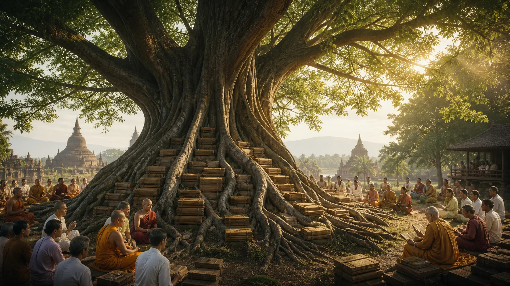
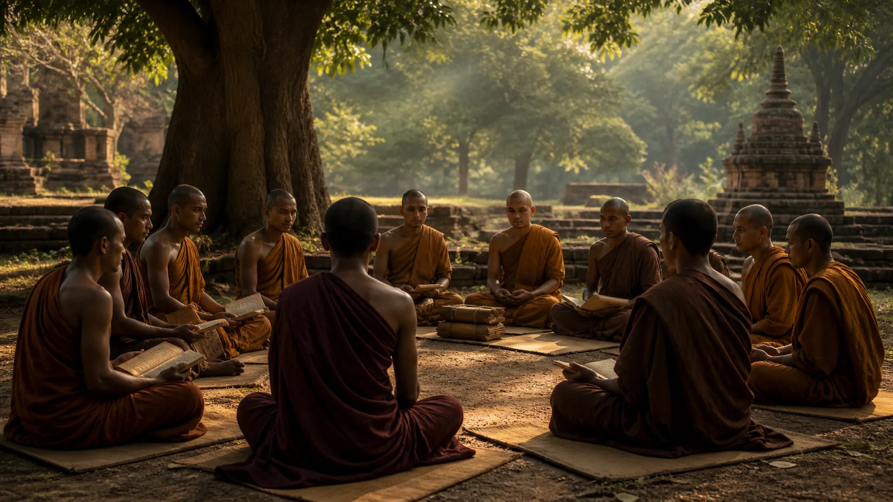
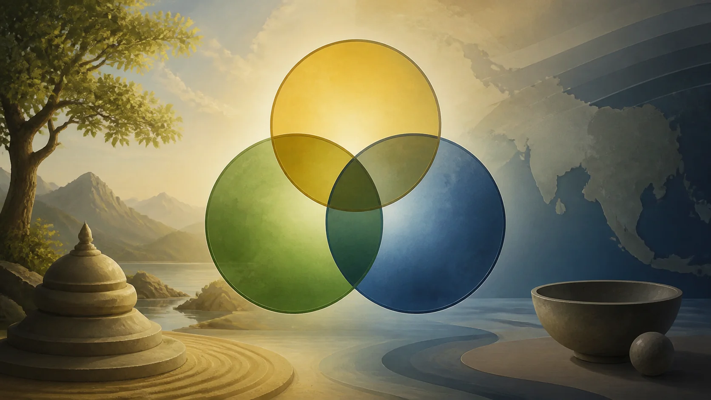
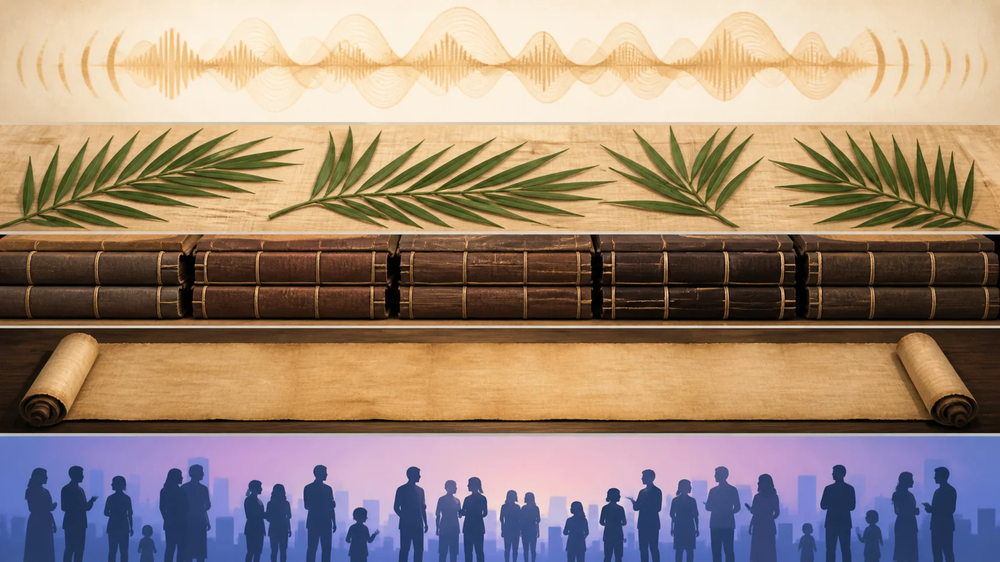

# Theravāda Là Gì — Truyền Thừa, Phạm Vi Và Những Hiểu Lầm

## 1. Một Tên Gọi, Không Phải Một Hóa Thạch

**Theravāda — đọc gần đúng “Thê-ra-va-đa” — giáo pháp hay đường lối của các Trưởng lão** là tên của một truyền thống Phật giáo sống. `Thera` nghĩa là trưởng lão; `vāda` trong tên gọi có thể mang nghĩa lời dạy, chủ trương hoặc truyền thống. Dịch gọn là “Giáo pháp của các Trưởng lão” hữu ích hơn việc cố biến tên này thành một tuyên bố rằng mọi thành viên đều già nhất, nguyên thủy nhất hoặc không từng thay đổi.

Ngày nay Theravāda có vị trí nổi bật tại Sri Lanka, Myanmar, Thái Lan, Lào và Campuchia, đồng thời hiện diện ở Bangladesh, Nepal, Ấn Độ, Malaysia, Indonesia và các cộng đồng toàn cầu. Các truyền thống giới đàn, nghi lễ, giáo dục và thiền không hoàn toàn giống nhau. Một tu viện rừng Thái, một học viện Vi Diệu Pháp Myanmar và một ngôi chùa đô thị Sri Lanka có thể cùng nhận Tam Tạng Pāli là kinh điển nhưng tổ chức đời sống rất khác. “Theravāda” vì vậy chỉ một gia đình lịch sử có điểm quy chiếu chung, không phải một khối đồng nhất.

Điểm quy chiếu quan trọng nhất là **Tipiṭaka — đọc gần đúng “Ti-pi-ta-ka” — Tam Tạng**, bộ kinh điển Pāli gồm Luật, Kinh và Vi Diệu Pháp. Cùng với đó là ngôn ngữ Pāli, truyền thừa thọ giới, các chú giải, nghi lễ, thiết chế và lịch sử địa phương. Nếu chỉ định nghĩa Theravāda bằng vài ý niệm trừu tượng, ta bỏ mất thân thể xã hội của truyền thống. Nếu chỉ định nghĩa bằng thiết chế, ta lại bỏ mất mục tiêu giải thoát mà văn bản đặt ở trung tâm.

Theravāda hiện đại không phải bản sao đông cứng của cộng đồng trong đời Đức Phật. Qua hơn hai thiên niên kỷ, truyền thống đã đi qua triều đình và làng xã, chiến tranh và thuộc địa, suy giảm và phục hưng, văn hóa bản địa và mạng lưới toàn cầu. Kinh điển tạo giới hạn và ngôn ngữ chung, nhưng mỗi thế hệ vẫn lựa chọn điều gì được giảng nhiều, cách tổ chức đào tạo, và cách trả lời hoàn cảnh mới. “Có lịch sử” không đồng nghĩa “sai lệch”; nó có nghĩa truyền thừa luôn diễn ra qua con người và thể chế.

Muốn hiểu đúng, ta phải giữ hai mệnh đề cùng lúc. Một: Theravāda bảo tồn một kho văn bản Pāli rất cổ, trong đó nhiều bài Kinh và phần Luật có bản song song ở các truyền thống khác. Hai: Theravāda như ta biết là kết quả của lịch sử Sri Lanka và Đông Nam Á, cùng các lần chuẩn hóa, phục hưng và trao đổi xuyên vùng. Bỏ mệnh đề thứ nhất khiến truyền thống mất chiều sâu; bỏ mệnh đề thứ hai biến nó thành huyền thoại bất biến.

## 2. Từ Pháp–Luật Đến Ký Ức Về Các Hội Nghị

Trong [DN 16](https://suttacentral.net/dn16), Đức Phật được kể là chỉ định **Dhamma — “Đăm-ma” — Pháp, giáo pháp** và **Vinaya — “Vi-na-ya” — Luật, kỷ luật tu viện** làm thầy sau khi Ngài qua đời. Văn bản không nói “Theravāda” theo nghĩa quốc gia và thể chế hiện đại. Nó đặt nền cho một cộng đồng nhận diện mình bằng điều được dạy và khuôn phép chung. Cặp “Pháp–Luật” có lẽ gần hơn với tự nhận thức ban đầu so với các nhãn bộ phái về sau.

[Cullavagga XI](https://suttacentral.net/pli-tv-kd21) của Luật tạng kể hội nghị tại Rājagaha: Mahākassapa chủ trì, Ānanda tụng đọc Pháp và Upāli tụng đọc Luật. [Cullavagga XII](https://suttacentral.net/pli-tv-kd22) kể tranh chấp tại Vesālī về mười thực hành và một cuộc phân xử của các trưởng lão. Trong truyền thống Theravāda, đây là hội nghị thứ nhất và thứ hai, những mắt xích quyết định của bảo tồn chính thống.

Đọc sử học đòi hỏi một câu kép: đây là các lời kể canonical quan trọng về cách cộng đồng hiểu việc truyền thừa; chi tiết của chúng không có chứng thực đương thời độc lập. Các bản Luật thuộc những bộ phái khác cũng kể hội nghị nhưng có khác biệt về nhân vật, trật tự và vấn đề. Sự hội tụ cho thấy ký ức về tập hợp, tụng đọc và tranh chấp rất cổ; sự khác biệt cảnh báo ta không thể phục dựng một biên bản duy nhất với độ chắc như sự kiện hiện đại.

“Hội nghị thứ ba” dưới vua Aśoka và vai trò của Moggaliputta Tissa đặc biệt quan trọng trong ký ức Theravāda, gắn với thanh lọc Tăng đoàn, *Kathāvatthu* và các phái đoàn truyền giáo. Nhưng câu chuyện chi tiết chủ yếu đến từ nguồn Theravāda như *Dīpavaṃsa*, *Mahāvaṃsa* và chú giải Luật, được định hình về sau. Các sắc dụ Aśoka xác nhận vị vua bảo trợ Tăng đoàn, quan tâm đến hòa hợp và nhắc một số văn bản, nhưng không xác nhận toàn bộ kịch bản biên niên. Hai loại chứng cứ phải được đặt cạnh nhau, không dùng một loại lấp khoảng trống của loại kia.

**Saṅgha — đọc gần đúng “Sang-ga” — Tăng đoàn hoặc cộng đồng bậc Thánh tùy văn cảnh** truyền thừa bằng con người cụ thể. Truyền khẩu không phải một chuỗi thì thầm tùy hứng. Công thức lặp, tụng theo nhóm, phân chia chuyên môn và kiểm tra tập thể có thể tạo độ ổn định đáng kể. Tuy nhiên, ổn định không phải bất biến tuyệt đối. Việc sắp xếp, mở rộng và giải thích vẫn diễn ra, nhất là khi cộng đồng phân tán và hình thành các bộ phái.

Vì vậy, câu “Tam Tạng được kết tập nguyên vẹn ngay tại hội nghị đầu tiên” thuộc tuyên bố truyền thống, không phải kết luận đã được sử học chứng minh. Câu ngược lại “truyền khẩu thì chắc chắn hỗn loạn” cũng thiếu căn cứ. Lập trường thận trọng là nhận cả năng lực bảo tồn có kỷ luật lẫn dấu vết tăng trưởng nhiều lớp mà so sánh văn bản cho thấy.

## 3. Sri Lanka Và Sự Thành Hình Của Một Truyền Thừa

Các biên niên Sri Lanka kể rằng Mahinda, con vua Aśoka, đưa giáo pháp đến đảo vào thế kỷ III trước Công nguyên, gặp vua Devānampiya Tissa và thiết lập Tăng đoàn tại Mahāvihāra. Saṅghamittā mang nhánh cây Bồ-đề và thiết lập truyền thừa Tỳ-kheo-ni. Những câu chuyện này tạo bản sắc mạnh mẽ và có một khung lịch sử phù hợp với mạng lưới Aśoka, nhưng chi tiết đối thoại và trình tự đến từ nguồn muộn. Chúng cần được gọi là ký ức biên niên, không phải báo cáo cùng thời.

Trong nhiều thế kỷ, Sri Lanka không chỉ “nhận” một gói giáo pháp từ Ấn Độ mà trở thành trung tâm định hình Theravāda. Các tu viện như Mahāvihāra, Abhayagiri và Jetavana cạnh tranh về bảo trợ, học thuật và khuynh hướng. Dòng Mahāvihāra cuối cùng có ảnh hưởng quyết định tới diện mạo kinh điển và chú giải Pāli được truyền đến nay. Lịch sử ấy phức tạp hơn câu chuyện một dòng thuần nhất đi thẳng không gián đoạn.

Truyền thống ghi việc Tam Tạng và chú giải được viết xuống tại Sri Lanka khoảng thế kỷ I trước Công nguyên, thường gắn với thời vua Vaṭṭagāmaṇi và Aluvihāra. Viết xuống không phải lúc kinh điển được “phát minh”; nó đánh dấu chuyển biến từ bảo tồn chủ yếu bằng tụng đọc sang thêm một phương tiện vật chất. Mặt khác, ta không còn bản thảo thế kỷ I trước Công nguyên để đối chiếu trực tiếp, nên niên đại và chi tiết sự kiện vẫn dựa nhiều vào biên niên hậu kỳ.

Khoảng thế kỷ V, Buddhaghosa đến Sri Lanka và soạn các chú giải Pāli dựa trên truyền thống giải thích địa phương, nổi bật là *Visuddhimagga*. Công trình của ông tạo một tổng hợp có ảnh hưởng sâu rộng về giới, định, tuệ và cách đọc kinh. Nó là trụ cột Theravāda, nhưng cách Đức Phật lịch sử nhiều thế kỷ. Gọi một phân tích của Buddhaghosa là “cách chú giải Theravāda” chính xác hơn gọi thẳng là “Kinh nói”.

Từ Sri Lanka, các hình thức Theravāda liên tục trao đổi với Đông Nam Á. Những truyền thừa thọ giới được nhập, mất, phục hồi và tái nhập giữa các vương quốc. Tại Pagan, Sukhothai, Ayutthaya, Lan Xang và Angkor hậu kỳ, Phật giáo Pāli tương tác với tín ngưỡng địa phương, nghi lễ cung đình và các dạng Phật giáo có trước. Không có một ngày duy nhất “Theravāda đến Đông Nam Á”; có nhiều làn sóng, mạng lưới và cuộc tái cấu trúc kéo dài hàng thế kỷ.

## 4. Pāli: Ngôn Ngữ Kinh Điển, Không Phải Băng Ghi Âm

Pāli là ngôn ngữ kinh điển và học thuật chung của Theravāda. Tên “Pāli” ban đầu liên quan đến “dòng văn bản” rồi trở thành tên ngôn ngữ. Đây là một ngôn ngữ Ấn-Arya trung kỳ có nhiều đặc điểm phương ngữ, đã được chuẩn hóa qua truyền thừa. Không có cơ sở chắc chắn để nói Pāli đúng nguyên dạng phương ngữ Gotama nói trong mọi hoàn cảnh.

Điều này không làm Pāli mất giá trị. Một ngôn ngữ truyền thừa có thể bảo tồn cấu trúc cổ, từ vựng và công thức rất gần lớp giảng dạy ban đầu dù không phải bản ghi âm. So sánh Pāli với các bản Hán dịch từ ngôn ngữ Ấn Độ khác và mảnh Sanskrit cho phép nhận diện những lõi chung. Chính khoảng cách ngôn ngữ khiến việc so sánh có sức mạnh: các điểm chung không thể chỉ do một người sao chép bản Pāli hiện còn.

Người mới đôi khi nghĩ có hai lựa chọn: hoặc Pāli là “ngôn ngữ của Phật” nguyên vẹn, hoặc bản kinh không đáng tin. Đây là thế lưỡng phân giả. Lời dạy cổ đại luôn đi qua trí nhớ, phương ngữ, dịch thuật và chuẩn hóa. Câu hỏi tốt là một đoạn có các bản song song nào, khác biệt ở đâu, và kết luận nào chịu được những khác biệt ấy. Độ tin cậy được xây từ hội tụ chứng cứ, không từ tưởng tượng về một văn bản không qua trung gian.

Pāli cũng không chỉ nằm trong sách. Tụng đọc, học ngữ pháp, giảng giải và nghi lễ đã nối các cộng đồng khác tiếng mẹ đẻ. Một nhà sư Myanmar và một nhà sư Sri Lanka có thể phát âm khác nhưng cùng nhận ra một đoạn Luật. Vai trò này gần với một ngôn ngữ chung thiêng và học thuật, đồng thời không xóa các ngôn ngữ địa phương mà giáo pháp được sống và giảng dạy.

Trong series này, lần đầu một thuật ngữ xuất hiện sẽ có cách đọc gần đúng và nghĩa làm việc. Cách đọc giúp người Việt bắt đầu, không tuyên bố một chuẩn phát âm duy nhất. Nghĩa được điều chỉnh theo văn cảnh; chẳng hạn Dhamma không phải lúc nào cũng chỉ “giáo pháp”, và Saṅgha không phải lúc nào cũng chỉ toàn thể người xuất gia.

## 5. Theravāda Không Đồng Nghĩa Điều Gì?

Theravāda không đồng nghĩa toàn bộ **Phật giáo sớm**. Nhiều trường phái cổ cùng bảo tồn Kinh và Luật; Theravāda là một truyền thừa còn tồn tại, trong khi Sarvāstivāda, Dharmaguptaka, Mahāsāṃghika và các truyền thống khác để lại văn bản, giới luật hoặc ảnh hưởng riêng. Khi một ý có trong cả Nikāya Pāli và Āgama tương ứng, ta có cơ sở gọi nó thuộc di sản chung sớm. Khi một ý chỉ nằm trong Vi Diệu Pháp hay chú giải Theravāda, cần gọi đúng lớp.

Theravāda cũng không đồng nghĩa “Phật giáo nguyên thủy” nếu cụm từ ấy ngụ ý bản sao không đổi từ đời Phật. Có thể nói Theravāda bảo tồn nhiều chất liệu sớm mà không phủ nhận lịch sử phát triển của chính nó. Từ “nguyên thủy” còn dễ tạo một thang giá trị đơn giản, trong đó truyền thống khác bị xem là biến dạng. Nghiên cứu nghiêm túc cần mô tả từng tuyên bố và nguồn thay vì trao huy chương cổ nhất cho toàn bộ một cộng đồng.

“Nam tông” là tên quen trong tiếng Việt, hữu ích về địa lý truyền bá nhưng không hoàn toàn chính xác. Sri Lanka nằm về phía nam Ấn Độ, song các mạng lưới Theravāda không chỉ đi theo một hướng nam; và “Bắc tông” gom nhiều truyền thống khác biệt. Trong bài học chuyên môn, Theravāda là tên ưu tiên; “Phật giáo Nam tông” có thể dùng như cách gọi phổ biến với lời giải thích.

**Hīnayāna** không phải từ đồng nghĩa trung tính của Theravāda. Từ này xuất hiện trong văn liệu Đại thừa với nghĩa phê phán một “cỗ xe thấp/kém”, thường nhắm đến lập trường được kiến tạo trong tranh luận chứ không phải tên tự gọi chính xác của Theravāda hiện đại. Dùng nó cho người hay cộng đồng Theravāda vừa sai lịch sử vừa mang sắc thái hạ thấp. Khi nghiên cứu văn bản cổ có thuật ngữ ấy, cần dịch và giải thích đúng văn cảnh tranh luận.

Theravāda không chỉ là “thiền Vipassanā”. **Vipassanā — đọc gần đúng “vi-pát-sa-na” — quán, thấy rõ** là một phương diện quan trọng, nhưng truyền thống còn có giới luật, bố thí, tụng niệm, học Kinh, định, nghi lễ, quan hệ cộng đồng và nhiều mục tiêu tu học. Phong trào thiền cư sĩ toàn cầu thế kỷ XIX–XX đã làm một số kỹ thuật nổi bật; lấy sản phẩm của cuộc phục hưng hiện đại làm toàn bộ lịch sử sẽ che khuất phần còn lại.

Cuối cùng, Theravāda không đồng nhất với một dân tộc, quốc gia hay quan điểm chính trị. Các thiết chế Theravāda từng liên hệ mật thiết với nhà nước và bản sắc dân tộc, đôi khi tạo công ích, đôi khi bị huy động trong xung đột. Phê bình một biểu hiện chính trị không tự động bác bỏ kinh điển; tôn kính kinh điển cũng không buộc ta miễn phê bình hành vi của tổ chức hay cá nhân.

## 6. Kinh, Luật, Vi Diệu Pháp, Chú Giải Và Hiện Đại

Ở lớp **Kinh sớm**, DN 16 cho một nguyên tắc tự nhận diện bằng Pháp–Luật và lưu ký ức về những chuẩn kiểm tra lời dạy. Các Nikāya chứa nhiều giáo pháp song song với bộ sưu tập ngoài Theravāda. Đây là nơi ưu tiên khi hỏi một ý có khả năng thuộc di sản chung sớm hay không, dù “Kinh sớm” vẫn gồm nhiều tầng.

Ở lớp **Luật**, Cullavagga XI–XII kể các hội nghị và tranh chấp. Luật tạo đường biên cho cộng đồng xuất gia, bảo tồn cơ chế thọ giới, xử lý vi phạm và hòa hợp. Luật của Theravāda là một trong nhiều Vinaya cổ. Việc một cộng đồng giữ Luật Pāli là dấu hiệu truyền thừa quan trọng; các điều dành cho người xuất gia không được áp nguyên xi lên cư sĩ.

Ở lớp **Vi Diệu Pháp**, Theravāda có bảy bộ canonical và một kiến trúc phân tích riêng. Truyền thống kể nguồn gốc cao quý của Vi Diệu Pháp và xem nó thuộc Phật ngôn; học thuật hiện đại thường thấy đây là hệ thống hóa phát triển sau các lớp Kinh ban đầu. Hai câu thuộc hai bình diện. Người học có thể tôn trọng thẩm quyền canonical trong Theravāda mà vẫn ghi nhãn niên đại tương đối.

Ở lớp **chú giải**, Buddhaghosa và những người kế tục đã nối văn bản, thực hành, ngữ pháp và hệ thống học. Nhiều khái niệm mà người hiện đại nghĩ là “hiển nhiên trong Phật giáo” thực ra có hình thức rõ nhất ở chú giải. Chú giải không phải thứ phụ có thể bỏ hết, cũng không nên hòa tan vào Kinh. Ghi nguồn giúp thấy một ý đã được hình thành và sử dụng thế nào.

Ở lớp **biên niên hậu kỳ**, *Dīpavaṃsa*, *Mahāvaṃsa* và các phần nối tiếp tổ chức ký ức về vua, xá-lợi, giới đàn và đảo Sri Lanka. Chúng thiết yếu để hiểu ý thức lịch sử Theravāda, nhưng khoảng cách thời gian và mục tiêu chính trị–tôn giáo đòi hỏi phê bình nguồn.

Ở lớp **Theravāda hiện đại**, các cuộc cải cách dưới thuộc địa, phong trào thiền, in ấn, giáo dục cư sĩ, nữ giới tu học và truyền bá toàn cầu đã thay đổi trọng tâm. “Trở về Kinh nguyên thủy” đôi khi chính là một chương trình hiện đại được hỗ trợ bởi sách in, dịch thuật và lý tưởng duy lý. Nhận ra điều này không làm chương trình ấy giả; nó giúp ta hiểu tại sao một cách đọc trở nên nổi bật ở một thời điểm.

## 7. Kỷ Luật Khẳng Định, Đọc Tiếp Và Nguồn

> [!quote] Văn bản nói gì
> DN 16 đặt Dhamma–Vinaya làm điểm tựa sau khi Phật qua đời. Cullavagga XI kể cuộc tụng đọc Pháp và Luật tại Rājagaha; Cullavagga XII kể tranh chấp Vesālī và cách các trưởng lão phân xử. Đây là lời kể canonical của Luật Theravāda.

> [!info] Truyền thống giải thích gì
> Biên niên và chú giải Theravāda trình bày chuỗi hội nghị, phái đoàn thời Aśoka, Mahinda đến Sri Lanka, việc viết Tam Tạng và dòng Mahāvihāra như lịch sử bảo tồn chính thống. Truyền thống xem Pāli Tipiṭaka là Phật ngôn và Vi Diệu Pháp có thẩm quyền canonical.

> [!example] Bài này suy luận gì
> Theravāda nên được hiểu là một truyền thống sống: bảo tồn chất liệu rất cổ nhưng được định hình qua Sri Lanka, Đông Nam Á và các cuộc phục hưng hiện đại. Bản sắc bền nhờ mạng lưới văn bản, giới đàn và thực hành, không nhờ sự bất biến tuyệt đối.

> [!warning] Điều chưa chứng minh
> Chưa chứng minh được mọi chi tiết của ba hội nghị hay phái đoàn truyền giáo đúng như biên niên kể; Pāli không được chứng minh là phương ngữ nguyên dạng của Gotama; Theravāda không được chứng minh là đại diện duy nhất hoặc nguyên xi của toàn bộ Phật giáo sớm.

Đọc trước: [[theravada/01 - Đức Phật Lịch Sử Và Câu Hỏi Ngài Muốn Giải Quyết|Đức Phật Lịch Sử Và Câu Hỏi Ngài Muốn Giải Quyết]]. Đọc tiếp: [[theravada/03 - Tam Tạng Pāli - Hình Thành Kinh Điển, Luật, Kinh Và Vi Diệu Pháp|Tam Tạng Pāli — Hình Thành Kinh Điển, Luật, Kinh Và Vi Diệu Pháp]]. Cách Đọc Kinh Pāli Mà Không Biến Thành Tín Điều hiện chưa xuất bản nên không tạo đường dẫn.

**Nguồn canonical và bộ sưu tập**

- [DN 16: Mahāparinibbāna Sutta](https://suttacentral.net/dn16); [Theravāda Vinaya Piṭaka](https://suttacentral.net/pitaka/vinaya/pli-tv-bi-vb); [Cullavagga XI](https://suttacentral.net/pli-tv-kd21); [Cullavagga XII](https://suttacentral.net/pli-tv-kd22). Các trang diễn ngôn và chương Luật là liên kết chính xác trên SuttaCentral.
- [Pāli Tipiṭaka](https://suttacentral.net/pitaka) để thấy các bộ sưu tập mà Theravāda nhận làm kinh điển.

**Biên niên và nghiên cứu lịch sử được nêu tên**

- *Mahāvaṃsa*, [bản Pāli Unicode tại GRETIL](https://gretil.sub.uni-goettingen.de/gretil/2_pali/3_chron/mahava_u.htm); được dùng như biên niên hậu kỳ, không như chứng thực đồng thời.
- L. S. Cousins, [The Dating of the Historical Buddha: A Review Article](https://journals.ub.uni-heidelberg.de/index.php/jiabs/article/view/8797), về vấn đề niên đại và truyền thống nguồn.
- Richard Gombrich, *Theravāda Buddhism: A Social History from Ancient Benares to Modern Colombo*, Routledge; [thông tin sách](https://www.routledge.com/Theravada-Buddhism-A-Social-History-from-Ancient-Benares-to-Modern-Colombo/Gombrich/p/book/9780415365093).
- Peter Skilling, [Theravāda in History](https://www.academia.edu/13606173/Therav%C4%81da_in_History), khảo sát việc dùng tên và bản sắc lịch sử; liên kết là bản tác giả chia sẻ.

Pāli nguồn được dẫn trực tiếp; bản dịch trên SuttaCentral có giấy phép theo từng ấn bản. Bài chỉ diễn giải và dịch nghĩa ngắn bằng văn xuôi mới. Sách và bài nghiên cứu được dẫn để định danh luận điểm, không sao chép đoạn dài.
