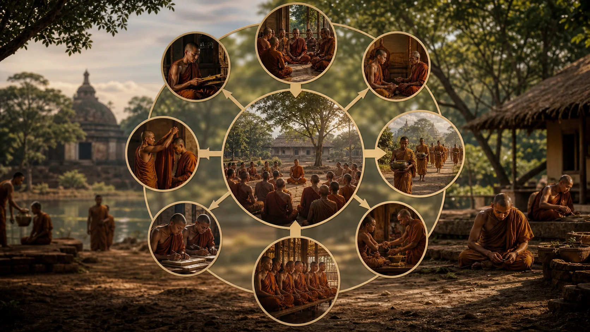
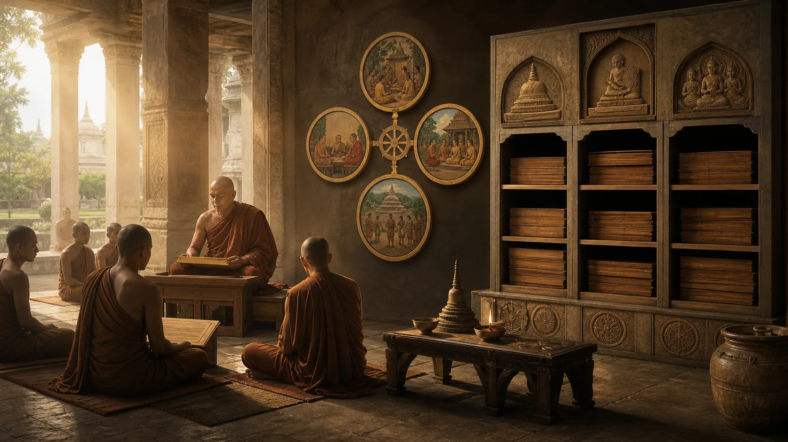

# Tam Tạng Pāli — Hình Thành Kinh Điển, Luật, Kinh Và Vi Diệu Pháp

## 1. “Ba Giỏ” Là Một Bản Đồ, Không Phải Ba Chiếc Hộp Xuất Hiện Cùng Lúc

**Tipiṭaka — đọc gần đúng “Ti-pi-ta-ka” — Tam Tạng, ba giỏ hay ba kho văn bản** là kinh điển Pāli của Theravāda. Ba tạng là **Vinaya — “Vi-na-ya” — Luật, kỷ luật tu viện**; **Sutta — “Sút-ta” — Kinh, bài giảng**; và **Abhidhamma — “A-bi-đăm-ma” — Vi Diệu Pháp, hệ thống phân tích giáo pháp**. Cách chia này cho người học một bản đồ thực dụng, nhưng bản đồ hoàn chỉnh không nên bị chiếu ngược về ngày đầu như thể ba giá sách đã được đóng nhãn sẵn.

“Kinh điển” ở đây nghĩa là tập hợp văn bản được một truyền thống công nhận có thẩm quyền đặc biệt. Nó không đồng nghĩa từng câu có cùng tác giả, cùng niên đại hoặc cùng thể loại. Một quy tắc tu viện, một bài kệ cổ, một đối thoại dài và một bảng phân loại tâm đều có thể thuộc kinh điển Theravāda mà vẫn thuộc những tầng hình thành khác nhau. Thẩm quyền tôn giáo và niên đại lịch sử là hai trục, không phải một.

Tam Tạng Pāli là bộ kinh điển Phật giáo cổ đầy đủ nhất còn tồn tại trong một ngôn ngữ Ấn Độ. Điều này làm nó vô giá cho thực hành Theravāda và nghiên cứu Phật giáo sớm. Nhưng “đầy đủ nhất còn tồn tại” không có nghĩa “kinh điển duy nhất từng có”. Hán tạng bảo tồn các Āgama và nhiều Luật từ những trường phái khác; Sanskrit, Gāndhārī và Tây Tạng bảo tồn thêm mảnh và bộ sưu tập. Đối chiếu chúng giúp phân biệt tài sản chung sớm với phát triển riêng của một dòng.

Tên gọi “Pāli Canon” phổ biến trong học thuật nhưng Pāli chính xác hơn là ngôn ngữ của bộ sưu tập, không phải tên một giáo phái ban đầu. Người Theravāda đã bảo tồn và chuẩn hóa bộ văn bản này qua Sri Lanka và Đông Nam Á. Bản in hiện đại lại là một giai đoạn mới: các kỳ kết tập, ấn bản quốc gia và công nghệ số có thể khác nhau về chính tả, phân đoạn và cách đánh số dù chia sẻ phần lớn nội dung.

Một bản đồ tốt phải trả lời bốn câu: mỗi tạng làm gì; những bộ nào nằm trong đó; bằng cách nào văn bản được bảo tồn; và ta có thể nói gì về quá trình định hình. Nó cũng phải chống hai lối tắt: coi truyền khẩu là sao chép hoàn hảo không biến đổi, hoặc coi truyền khẩu là tin đồn ngẫu nhiên. Các đặc điểm của chính văn bản cho thấy một kỹ thuật tập thể có tổ chức, đồng thời cho thấy dấu vết biên tập và tăng trưởng.

## 2. Truyền Khẩu, Hội Nghị Và Việc Viết Xuống

> **Pāli — DN 16, dn16:1.1.1**
>
> *Evaṁ me sutaṁ—*
>
> **Bản dịch làm việc:** Tôi đã được nghe như vầy—

Nhiều bài Kinh mở bằng công thức **evaṃ me sutaṃ — đọc gần đúng “ê-văm mê su-tăm” — tôi đã được nghe như vầy**. Công thức đặt lời kể trong một chuỗi nghe và truyền, không phải tuyên bố người đọc đang cầm bản thảo do Phật viết. Các đoạn lặp, danh sách số, cấu trúc đối xứng và cụm từ cố định hỗ trợ ghi nhớ. Nhóm tụng đọc có thể sửa lỗi cá nhân; phân công theo bộ giúp xây chuyên môn. “Truyền khẩu” ở đây là một công nghệ xã hội.

> **Pāli — Cullavagga XI, pli-tv-kd21:1.7.1–1.7.2**
>
> *Atha kho āyasmā mahākassapo saṅghaṁ ñāpesi: “Suṇātu me, āvuso, saṅgho. Yadi saṅghassa pattakallaṁ, ahaṁ upāliṁ vinayaṁ puccheyyan”ti.*
>
> **Bản dịch làm việc:** Bấy giờ Tôn giả Mahākassapa trình với Tăng chúng: “Xin Tăng chúng lắng nghe. Nếu Tăng chúng thấy đã đến lúc, tôi sẽ hỏi Upāli về Luật.”

> **Pāli — Cullavagga XI, pli-tv-kd21:1.8.18–1.8.19**
>
> *Eteneva upāyena pañcapi nikāye pucchi. Puṭṭho puṭṭho āyasmā ānando vissajjesi.*
>
> **Bản dịch làm việc:** Theo cùng phương thức ấy, ngài hỏi về cả năm Nikāya. Mỗi khi được hỏi, Tôn giả Ānanda đều trả lời.

[Cullavagga XI](https://suttacentral.net/pli-tv-kd21) kể rằng sau parinibbāna, các trưởng lão tập hợp tại Rājagaha; Upāli trả lời về Luật, Ānanda trả lời về Pháp. [Cullavagga XII](https://suttacentral.net/pli-tv-kd22) kể cuộc xử lý tranh chấp Vesālī. Các truyện ấy giải thích thẩm quyền của việc tụng chung và hình ảnh một cộng đồng tự kiểm soát. Chúng không liệt kê rõ một Tam Tạng hoàn chỉnh giống mọi ấn bản hiện nay, và không thể tự mình chứng minh toàn bộ văn bản được cố định nguyên văn trong một lần họp.

Các truyền thống khác có phiên bản hội nghị riêng. So sánh cho thấy ký ức chung về nhu cầu bảo tồn Pháp–Luật và về các bất đồng sớm, nhưng cũng cho thấy câu chuyện được kể theo lợi ích dòng truyền thừa. Một sử gia có thể xem hội nghị là hạt nhân sự kiện được văn chương hóa; mức chắc của từng nhân vật và câu thoại thấp hơn mức chắc rằng cộng đồng cần cơ chế tụng đọc, phân xử và xác lập ranh giới.

Biên niên Sri Lanka ghi Tam Tạng cùng chú giải được viết xuống vào khoảng thế kỷ I trước Công nguyên trong bối cảnh đói kém, chiến tranh và lo sợ người ghi nhớ qua đời. Thường sự kiện được gắn với Aluvihāra dưới vua Vaṭṭagāmaṇi. Đây là mốc truyền thống hợp lý trong lịch sử chuyển phương tiện, nhưng các bản thảo vật chất còn lại trẻ hơn nhiều. Nói “được truyền thống ghi là viết xuống” chính xác hơn nói “khảo cổ đã tìm thấy bản chép đầu tiên”.

Việc viết không chấm dứt truyền khẩu. Tụng đọc tiếp tục là phương pháp học và nghi lễ, trong khi bản thảo lá bối cần chép lại vì khí hậu. Mỗi lần chép mở khả năng sai khác, nhưng đối chiếu nhiều dòng bản có thể phát hiện chúng. Đến thời in ấn, các ấn bản Miến Điện, Thái, Sinhala và Pali Text Society góp phần chuẩn hóa mới. SuttaCentral ngày nay lại phân đoạn văn bản để tìm kiếm và đối chiếu; phân đoạn số là công cụ hiện đại, không phải cấu trúc vật chất của bản cổ.

Vì thế, không có khoảnh khắc đơn nhất mà mọi câu trong ba tạng từ trạng thái hoàn toàn lỏng biến thành trạng thái vĩnh viễn cố định. Có một quá trình: ghi nhớ lời dạy và quy tắc; tổ chức bộ sưu tập; tranh luận ranh giới; truyền qua cộng đồng; viết xuống; chú giải; chép, in và số hóa. Quá trình ấy không phủ nhận khả năng bảo tồn cổ xưa. Nó giải thích bằng phương tiện nào sự bảo tồn đã diễn ra.

## 3. Luật Tạng: Kiến Trúc Của Một Cộng Đồng

[Vinaya Piṭaka](https://suttacentral.net/pitaka/vinaya) không đơn giản là danh sách điều cấm. Nó gồm giới bổn cho Tỳ-kheo và Tỳ-kheo-ni, giải thích trường hợp, các thủ tục của Tăng đoàn, quy định về thọ giới, an cư, y phục, thuốc men, xử lý tranh chấp và nhiều câu chuyện. Luật cho thấy giáo pháp cần một hình thức xã hội để tồn tại: ai thuộc cộng đồng, quyết định hợp lệ thế nào, hành vi nào phá niềm tin, và cách phục hồi hòa hợp.

Phần **Suttavibhaṅga — đọc gần đúng “Sút-ta-vi-bhăng-ga” — phân tích giới bổn** đặt từng giới trong truyện duyên khởi rồi giải thích từ, ngoại lệ và mức vi phạm. **Khandhaka — đọc gần đúng “Khan-đa-ka” — các chương hay phẩm lớn** gồm Mahāvagga và Cullavagga, bao quát thiết chế và truyện lịch sử cộng đồng. **Parivāra — đọc gần đúng “Pa-ri-va-ra” — phần phụ tập, ôn tập** tổ chức lại vật liệu Luật theo câu hỏi và bảng phân loại.

Truyện duyên khởi giúp nhớ và giải thích quy tắc, nhưng không phải hồ sơ pháp lý đồng thời theo nghĩa hiện đại. Một mô thức phổ biến là hành vi xảy ra, dư luận phê phán, Đức Phật hỏi và ban giới; các trường hợp sau dẫn đến điều chỉnh. Mô thức ấy truyền đạt nguyên tắc Luật phát sinh theo tình huống. Sử gia có thể khai thác dấu vết đời sống, song phải kiểm tra với Luật khác, bia ký và khảo cổ.

Luật Theravāda là Luật của một dòng, không phải bản Luật duy nhất còn dấu tích. Các truyền thống Dharmaguptaka, Mūlasarvāstivāda, Mahāsāṃghika và khác có cấu trúc tương tự cùng nhiều khác biệt. Lõi chung của một số quy tắc có thể rất cổ; số lượng, cách kể và chi tiết phản ánh lịch sử riêng. Việc so sánh khiến bức tranh Phật giáo sớm phong phú hơn, không nhất thiết làm một cộng đồng mất quyền dùng Luật của mình.

Một sai lầm thực hành là áp toàn bộ giới xuất gia cho cư sĩ. Mục tiêu và cam kết khác nhau: người tại gia thường thọ năm hoặc tám giới trong bối cảnh xác định; người xuất gia sống theo giới bổn và thủ tục Tăng đoàn. Cư sĩ có thể học nguyên tắc đạo đức từ Luật, nhưng không nên tự kết tội mình bằng một điều chưa từng thọ. Ngược lại, gọi Luật là “thủ tục cổ không liên quan” bỏ qua cách kỷ luật bảo vệ cộng đồng và đào tạo tâm.

Luật cũng là nguồn quan trọng cho lịch sử phụ nữ Phật giáo vì lưu truyền thọ giới Tỳ-kheo-ni, quy tắc và câu chuyện về cộng đồng nữ. Tuy nhiên, văn bản mang dấu của xã hội gia trưởng và quá trình biên tập. Các tranh luận phục hồi giới đàn hiện đại không thể giải quyết bằng một câu riêng lẻ; chúng cần Luật học, lịch sử truyền thừa và quyết định cộng đồng có trách nhiệm.

## 4. Kinh Tạng: Năm Nikāya Và Nhiều Thể Loại

[Sutta Piṭaka](https://suttacentral.net/pitaka/sutta) là kho bài giảng, đối thoại, kệ, truyện và hướng dẫn tu tập. **Nikāya — đọc gần đúng “Ni-ca-ya” — bộ sưu tập** là đơn vị chính. Năm Nikāya Pāli không được xếp đơn giản theo niên đại; tiêu chí gồm độ dài, chủ đề, cấu trúc số và truyền thống bộ sưu tập.

[Dīgha Nikāya](https://suttacentral.net/pitaka/sutta/long/dn), Trường Bộ, có các bài dài. Chúng thường chứa tường thuật quy mô lớn, tranh luận với quan điểm đương thời, mô tả con đường tuần tự và ký ức cộng đồng như DN 16. Độ dài tạo không gian tổng hợp nhưng cũng cho phép nhiều lớp văn chương. Không nên giả định một bài dài là muộn toàn bộ hoặc sớm toàn bộ chỉ vì kích thước.

[Majjhima Nikāya](https://suttacentral.net/pitaka/sutta/middle/mn), Trung Bộ, gồm các bài độ dài vừa với nhiều văn cảnh giảng dạy. MN 26 và MN 36 của bài 1 nằm ở đây. [Saṃyutta Nikāya](https://suttacentral.net/pitaka/sutta/linked/sn), Tương Ưng Bộ, nhóm bài theo chủ đề, nhân vật hay khái niệm; sự lặp công thức cho phép thấy một giáo lý vận hành qua nhiều tình huống. [Aṅguttara Nikāya](https://suttacentral.net/pitaka/sutta/numbered/an), Tăng Chi Bộ, sắp theo số mục từ một trở lên, đặc biệt phù hợp truyền khẩu và giáo huấn thực dụng.

[Khuddaka Nikāya](https://suttacentral.net/pitaka/sutta/minor/kn), Tiểu Bộ, là tập hợp đa dạng nhất: *Dhammapada*, *Udāna*, *Sutta Nipāta*, truyện tiền thân, thơ trưởng lão và nhiều sách khác. Danh mục Tiểu Bộ có khác biệt giữa các truyền thống Theravāda quốc gia. Một số tác phẩm chứa chất liệu ngôn ngữ rất cổ; một số cho thấy phát triển muộn. Nhãn “Tiểu” không có nghĩa không quan trọng hoặc mọi thành phần cùng thời.

Kinh thường được trình bày như lời Phật, nhưng cũng có bài do đệ tử giảng rồi được Ngài xác nhận hoặc được cộng đồng bảo tồn vì thẩm quyền giáo pháp. Các thể loại gồm văn xuôi, kệ, đối thoại, liệt kê, dụ ngôn và truyện khung. Khi giải thích, phải hỏi ai nói, với ai, trước vấn đề gì và trong thể loại nào. Cắt một câu khỏi văn cảnh rồi biến thành định nghĩa phổ quát là cách đọc dễ sai.

Các bộ Āgama Hán dịch tương ứng với bốn Nikāya chính và nhiều văn bản riêng trong Tiểu Bộ là nguồn so sánh thiết yếu. Sự tương đồng rộng cho thấy phần lớn cấu trúc Kinh có trước khi các dòng truyền thừa xa nhau; khác biệt cho thấy truyền miệng và biên tập. “Có bản song song” làm tăng khả năng cổ, nhưng không phải phép thử duy nhất. Ngôn ngữ, học thuyết, thể loại và vị trí trong nhiều bộ cũng phải được cân nhắc.

## 5. Vi Diệu Pháp: Kinh điển Nhưng Là Một Lớp Hệ Thống Riêng

[Abhidhamma Piṭaka](https://suttacentral.net/pitaka/abhidhamma) của Theravāda gồm bảy bộ: *Dhammasaṅgaṇī* phân loại các pháp; *Vibhaṅga* phân tích các chủ đề; *Dhātukathā* bàn về các giới; *Puggalapaññatti* phân loại hạng người; *Kathāvatthu* trình bày các điểm tranh luận; *Yamaka* dùng cấu trúc cặp; và *Paṭṭhāna* khảo sát các quan hệ điều kiện. Mô tả một dòng cho mỗi sách chỉ là định hướng, không thay thế việc đọc cấu trúc thực tế.

Vi Diệu Pháp chuyển trọng tâm từ bài giảng gắn với người nghe sang ma trận phân tích. Nhiều đơn vị bắt nguồn từ Kinh—uẩn, xứ, giới, căn, giác chi—nhưng được tái tổ chức, định nghĩa và kết nối có hệ thống. Đây là lý do vừa có tính liên tục vừa có tính riêng: vật liệu không xuất hiện từ hư vô, song phương pháp và kiến trúc không giống một đối thoại Kinh.

Trong truyền thống Theravāda, Abhidhamma thuộc kinh điển và được quy về Đức Phật, với câu chuyện Ngài giảng ở cõi trời rồi truyền cốt yếu cho Sāriputta. *Kathāvatthu* lại gắn với Moggaliputta Tissa thời Aśoka trong ký ức hội nghị thứ ba. Truyền thống có những cách điều hòa nguồn gốc này. Nghiên cứu lịch sử thường xem văn học Abhidhamma phát triển qua nhiều thế hệ và các bộ phái sở hữu hệ thống Abhidharma khác nhau.

Không cần chọn giữa “thuộc kinh điển nên mọi chi tiết phải có từ ngày đầu” và “phát triển muộn nên vô giá trị”. Vị trí trong kinh điển nói về thẩm quyền trong Theravāda; phân lớp lịch sử nói về quá trình hình thành. Một hệ thống muộn hơn có thể là thành tựu phân tích sâu sắc, giúp học và hành, nhưng khi một khái niệm như sát-na tâm chỉ đạt hình thức rõ trong văn học hậu kỳ, bài viết phải dẫn đúng nguồn.

Chú giải và cẩm nang hậu kỳ tiếp tục hệ thống hóa. *Visuddhimagga* của Buddhaghosa kết nối tu tập với phân tích; *Abhidhammattha-saṅgaha* trình bày bản đồ tâm–tâm sở rất có ảnh hưởng. Chúng không thuộc Abhidhamma Piṭaka dù thường được học cùng. Trộn kinh điển, chú giải và cẩm nang thành một khối “Vi Diệu Pháp” làm mất lịch sử của khái niệm.

Người mới nên dùng Vi Diệu Pháp như một bản đồ có quy ước, không như kính hiển vi vật lý chứng minh các hạt tâm. Các phân loại mô tả kinh nghiệm và quan hệ theo mục tiêu giải thoát của truyền thống. Không có lý do dùng cơ học lượng tử hay khoa học thần kinh để “chứng minh” sát-na tâm hoặc hai mươi bốn duyên. So sánh hiện đại, nếu có, chỉ là cộng hưởng khái niệm và phải nằm ở lớp riêng.

## 6. Đọc Canon Theo Tầng Mà Không Làm Nó Vỡ Vụn

Phân lớp không nhằm chọn vài câu “nguyên thủy” rồi vứt phần còn lại. Nó giúp trả lời đúng loại câu hỏi. Muốn biết một giáo lý có nền chung sớm, ưu tiên Kinh và Luật có bản song song. Muốn hiểu quy tắc Tăng đoàn Theravāda, đọc Luật Pāli trong toàn bộ thủ tục. Muốn hiểu phân tích tâm của Theravāda, đọc Abhidhamma và chú giải với đúng thuật ngữ. Muốn biết cộng đồng tưởng nhớ lịch sử thế nào, đọc biên niên. Mỗi nguồn có thẩm quyền trong phạm vi khác nhau.

Một quy trình ngắn gồm năm bước. Trước hết xác định mã văn bản và bộ sưu tập, thay vì chỉ dẫn một câu trên mạng. Kế đó đọc người nói, người nghe, vấn đề và phần trước–sau. Thứ ba kiểm tra thuật ngữ Pāli và ít nhất một bản dịch khác khi nghĩa gây tranh luận. Thứ tư tìm bản song song hoặc cách dùng ở nơi khác. Cuối cùng ghi rõ đâu là văn bản, đâu là chú giải, đâu là nghiên cứu và đâu là suy luận của người viết.

Ngay cả trong một bài Kinh cũng có thể có lớp. Một đoạn kệ có thể cổ hơn truyện khung; một danh sách có thể được mở rộng; một kết thúc có thể phản ánh nhu cầu cộng đồng. Nhận định như vậy cần luận cứ so sánh, không được dựa vào cảm giác “đoạn này nghe không giống Phật”. Phê bình văn bản là phương pháp, không phải quyền tùy ý cắt bỏ điều khó chịu.

Ấn bản cũng quan trọng. Mã đoạn trên SuttaCentral giúp liên kết chính xác, trong khi Pali Text Society dùng số trang và các ấn bản quốc gia có cách đánh số khác. Khi trích, nên ghi mã kinh hoặc sách, đoạn nếu có, ngôn ngữ, người dịch và liên kết. Đối với bản dịch có bản quyền, diễn giải bằng lời mới và trích thật ngắn. Pāli nguồn và bản dịch không mặc nhiên cùng giấy phép chỉ vì cùng được lưu trên một trang.

“Không chắc” là một kết quả có giá trị. Có những câu hỏi chưa thể quyết: chính xác khi nào một sách đạt hình thức hiện tại, phần nào được thêm ở đâu, một tên trong truyện có chỉ người thật hay không. Ghi độ không chắc bảo vệ người đọc khỏi sự tự tin giả và bảo vệ truyền thống khỏi những lời biện hộ mong manh. Đức tin không cần ngụy trang thành khảo cổ; khảo cứu cũng không cần ngụy trang thành phán quyết về cứu cánh.

Trong thực hành, bản đồ Tam Tạng ngăn hai sai lầm đối nghịch. Người chỉ đọc một tuyển tập danh ngôn có thể tưởng giáo pháp là những câu truyền cảm hứng rời rạc. Người cố đọc từ trang đầu đến trang cuối như tiểu thuyết có thể kiệt sức trước lặp lại và phân loại. Hiểu chức năng từng tạng cho phép chọn văn bản theo câu hỏi và dần xây năng lực đọc có nguồn.

## 7. Kỷ Luật Khẳng Định, Đọc Tiếp Và Nguồn

> [!quote] Văn bản nói gì
> Luật Cullavagga kể các trưởng lão tụng đọc Pháp–Luật và giải quyết tranh chấp. Tam Tạng Pāli hiện hành gồm Luật tạng, Kinh tạng với năm Nikāya, và Vi Diệu Pháp tạng với bảy bộ. Nội dung và cấu trúc cụ thể có thể xem trên từng trang bộ sưu tập.

> [!info] Truyền thống giải thích gì
> Theravāda quy việc bảo tồn về các hội nghị, xem ba tạng là Phật ngôn có thẩm quyền trong kinh điển, kể việc viết xuống ở Sri Lanka khoảng thế kỷ I trước Công nguyên, và giải thích nguồn gốc Vi Diệu Pháp qua Đức Phật cùng Sāriputta. Chú giải tổ chức sâu thêm cách đọc các tạng.

> [!example] Bài này suy luận gì
> Truyền khẩu Phật giáo là kỹ thuật tập thể có kỷ luật, đủ sức bảo tồn chất liệu rất cổ nhưng không loại trừ tăng trưởng và biên tập. “Kinh điển” và “cùng niên đại” phải tách nhau; đối chiếu liên truyền thống là công cụ mạnh để nhận diện lớp chung sớm.

> [!warning] Điều chưa chứng minh
> Chưa có bằng chứng rằng một hội nghị duy nhất cố định nguyên văn ba tạng đúng hình thức hiện nay. Chưa có bản thảo còn lại từ lần viết xuống được biên niên kể. Không chứng minh được mọi phần Kinh–Luật cùng tuổi, hoặc hệ thống Vi Diệu Pháp hoàn chỉnh đã tồn tại trong đời Đức Phật.

Đọc trước: [[theravada/02 - Theravāda Là Gì - Truyền Thừa, Phạm Vi Và Những Hiểu Lầm|Theravāda Là Gì — Truyền Thừa, Phạm Vi Và Những Hiểu Lầm]]. Đọc tiếp: Cách Đọc Kinh Pāli Mà Không Biến Thành Tín Điều. Bài đọc tiếp chưa xuất bản nên được giữ dưới dạng chữ thường.

**Nguồn kinh điển và bộ sưu tập chính xác**

- [Toàn bộ Pāli Tipiṭaka](https://suttacentral.net/pitaka); [Vinaya Piṭaka](https://suttacentral.net/pitaka/vinaya); [Sutta Piṭaka](https://suttacentral.net/pitaka/sutta); [Abhidhamma Piṭaka](https://suttacentral.net/pitaka/abhidhamma).
- [Dīgha Nikāya](https://suttacentral.net/pitaka/sutta/long/dn), [Majjhima Nikāya](https://suttacentral.net/pitaka/sutta/middle/mn), [Saṃyutta Nikāya](https://suttacentral.net/pitaka/sutta/linked/sn), [Aṅguttara Nikāya](https://suttacentral.net/pitaka/sutta/numbered/an), [Khuddaka Nikāya](https://suttacentral.net/pitaka/sutta/minor/kn).
- [Cullavagga XI](https://suttacentral.net/pli-tv-kd21) và [Cullavagga XII](https://suttacentral.net/pli-tv-kd22), lời kể Luật tạng về hai hội nghị đầu trong truyền thống Theravāda.

**Nghiên cứu lịch sử và thư mục được nêu tên**

- Oskar von Hinüber, *A Handbook of Pāli Literature*, de Gruyter, 1996; [thông tin thư mục](https://www.degruyter.com/document/doi/10.1515/9783110814989/html), khảo sát thể loại và niên đại tương đối của văn học Pāli.
- Rupert Gethin, *The Foundations of Buddhism*, Oxford University Press, 1998; [thông tin sách](https://global.oup.com/academic/product/the-foundations-of-buddhism-9780192892232), tổng quan cấu trúc kinh điển và tư tưởng.
- Bhikkhu Anālayo, [*The Historical Value of the Pāli Discourses*](https://doi.org/10.1163/001972412X620187), *Indo-Iranian Journal* 55 (2012), về giá trị và giới hạn của Kinh Pāli cho sử học.
- L. S. Cousins, [*Pāli Oral Literature*](https://bs.dila.edu.tw/wp-content/uploads/2023/01/104e5adb8e5b9b4e5baa6e58d9ae5a3abe78fad1.pali-oral-literature.pdf), về đặc điểm truyền khẩu; dẫn để định danh lập luận, không sao chép dài.
- [Pali Text Society](https://palitextsociety.org/), thư mục ấn bản Pāli; dùng để định hướng ấn bản, không coi bản dịch là tự do sao chép.

Pāli nguồn trên SuttaCentral được dẫn theo bộ sưu tập và chương. Giấy phép bản dịch tùy trang và người dịch; bài này dùng văn xuôi tiếng Việt mới, chỉ dịch nghĩa thuật ngữ và công thức ngắn. Nguồn học thuật được trích tên, tác phẩm và liên kết, không chép đoạn dài.
