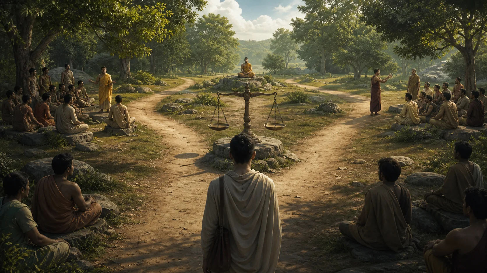

# Cách Đọc Kinh Pāli Mà Không Biến Thành Tín Điều

## 1. Đọc Kinh Là Một Kỹ Năng, Không Phải Một Cuộc Thi Tin Hay Không Tin

Một câu Kinh có thể bị làm phẳng theo hai cách đối nghịch. Cách thứ nhất là coi mọi dòng trong Tam Tạng như một mệnh đề không cần văn cảnh: đã là “lời Phật” thì chỉ còn việc chấp nhận. Cách thứ hai là lấy sở thích cá nhân làm tòa án cuối cùng: câu nào hợp cảm giác thì giữ, câu nào gây khó chịu thì gạt bỏ. Cả hai đều tránh công việc đọc. Một bên giao phán đoán cho nhãn thẩm quyền; bên kia đồng nhất phán đoán với phản ứng tức thời.

**Sutta — đọc gần đúng “Sút-ta” — bài kinh hay bài giảng** không phải một thể loại duy nhất theo nghĩa văn học hiện đại. Trong các Nikāya có đối thoại, liệt kê để ghi nhớ, dụ ngôn, kệ, tranh luận, truyện khung và hướng dẫn thực hành. Một câu nói với người xuất gia đang mắc tà kiến không tự động là chỉ dẫn giống hệt cho một cư sĩ mới học. Một hình ảnh chữa một lỗi cụ thể không nhất thiết là định nghĩa bao trùm toàn bộ giáo pháp.

**Dhamma — đọc gần đúng “Đăm-ma” — Pháp, giáo pháp, phẩm tính hay hiện tượng tùy văn cảnh** cũng nhắc ta rằng dịch thuật không phải thay từng từ bằng một từ Việt cố định. Người đọc cần hỏi từ này đang làm gì trong câu, công thức này xuất hiện ở đâu khác, và bản dịch đã chọn nghĩa nào trong số những nghĩa có thể. Học vài từ Pāli không biến ai thành nhà ngữ văn, nhưng đủ để nhận ra khi một lập luận dựa quá nhiều vào một lựa chọn dịch.

Mục tiêu của bài là xây một lối đọc vừa tôn trọng văn bản vừa cho phép khảo sát. Ba bài kinh đóng vai ba phép kiểm. MN 22 cho thấy giáo pháp có thể bị nắm sai và ngay cả khi nắm đúng cũng không nên biến thành tài sản bản ngã. MN 95 phân biệt việc gìn giữ một điều là thật với việc tự mình biết nó là thật, rồi mô tả một tiến trình học và kiểm chứng. AN 3.65 bác sự lệ thuộc đơn thuần vào truyền khẩu, tin đồn và uy tín, nhưng vẫn dùng tiêu chuẩn đạo đức, hậu quả và đánh giá của người có trí. Không bài nào trao giấy phép cho chủ nghĩa tùy ý.

Trong truyền thống học thuật Theravāda, **pariyatti — đọc gần đúng “pa-ri-yát-ti” — học hiểu giáo pháp qua văn bản** thường được đặt cạnh thực hành và chứng ngộ. Cách phân ba được hệ thống hóa trong truyền thống hậu kỳ; bài này không giả rằng mọi chi tiết của nó là công thức nguyên văn Kinh sớm. Giá trị của nó nằm ở lời nhắc: đọc không thay thực hành, nhưng thực hành thiếu năng lực đọc dễ bị một thầy, một bản dịch hoặc một cảm giác dẫn sai.

## 2. Bảy Câu Hỏi Trước Khi Rút Một “Chân Lý” Khỏi Bài Kinh

Trước hết, xác định **ai nói**. Nhiều bài do Đức Phật giảng, nhưng cũng có bài do Sāriputta, Ānanda, một Tỳ-kheo-ni, một gia chủ hoặc một người đối thoại trình bày. Có trường hợp Đức Phật xác nhận lời đệ tử; có trường hợp đối phương nêu quan điểm để bị chất vấn. Bỏ tên người nói có thể biến ý kiến đang bị phản bác thành giáo lý.

Thứ hai, hỏi **nói với ai**. Người nghe có cam kết, vốn từ và vấn đề khác nhau. Một chỉ dẫn cho Bà-la-môn đang hỏi về chân lý, một nhóm cư dân hoang mang trước nhiều đạo sư, và một Tỳ-kheo hiểu sai giáo pháp không thể bị đọc như ba chương của cùng một sách giáo khoa dành cho người mới. Đối tượng không giới hạn mọi ứng dụng về sau, nhưng nó đặt ranh giới cho suy diễn.

Thứ ba, nhận diện **vấn đề đang được xử lý**. Một bài kinh thường có lực phản ứng: sửa tà kiến, giải quyết tranh chấp, hướng dẫn thiền, khuyến khích bố thí, hoặc mô tả cứu cánh. Câu “đừng dựa vào truyền thống” trong bài xử lý sự bất định giữa nhiều người giảng khác với tuyên bố “mọi truyền thống đều vô giá trị”. Tìm câu hỏi gốc trước khi dùng câu trả lời.

Thứ tư, nhận diện **thể loại và công thức**. Danh sách lặp tạo thuận lợi cho truyền khẩu; dụ ngôn làm nổi một quan hệ; kệ nén nghĩa để dễ nhớ; truyện khung đặt giáo huấn vào một cảnh. Dụ ngôn chiếc bè trong MN 22 không có nghĩa Dhamma hoàn toàn tùy tiện như một món đồ dùng xong là vứt. Điểm so sánh là chức năng vượt qua và nguy cơ mang vác, không phải mọi thuộc tính của chiếc bè.

Thứ năm, xem **phần trước và sau**. Trích dẫn trên mạng thường loại bỏ câu định nghĩa đối tượng, chuỗi điều kiện hoặc kết luận đạo đức. Hãy đọc ít nhất toàn bài khi bài ngắn, hoặc một đơn vị lập luận hoàn chỉnh khi bài dài. Dò các từ nối—“do vậy”, “nhưng”, “khi”, “vì”—để không biến mệnh đề có điều kiện thành tuyệt đối.

Thứ sáu, kiểm tra **Pāli, bản dịch và cách dùng song song**. Không cần dịch lại toàn bài. Chọn từ đang gánh lập luận, xem Pāli phân đoạn, đối chiếu hai bản dịch có tên người dịch, rồi tìm từ ấy trong vài văn cảnh. Bhikkhu Anālayo dùng so sánh các bản song song Pāli và Hán để phân biệt lõi chung với phát triển riêng; phương pháp ấy đòi dữ liệu và năng lực ngôn ngữ, không phải trò chọn dị bản mình thích.

Cuối cùng, hỏi **lời dạy này được kiểm tra bằng loại kết quả nào**. Một tuyên bố lịch sử cần chứng cứ lịch sử; một hướng dẫn đạo đức cần xét ý hướng, hành vi và hậu quả; một chỉ dẫn thiền cần thực hành đủ điều kiện và quan sát có kỷ luật. Không dùng cảm giác an lạc trong một buổi ngồi để chứng minh niên đại văn bản, cũng không dùng niên đại muộn để kết luận một thực hành tất yếu vô dụng.

## 3. MN 22: Nắm Con Rắn Đúng Chỗ Và Không Vác Chiếc Bè

> **Pāli — MN 22, đoạn `mn22:10.3–10.7`**
>
> *Te taṁ dhammaṁ pariyāpuṇitvā tesaṁ dhammānaṁ paññāya atthaṁ na upaparikkhanti. Tesaṁ te dhammā paññāya atthaṁ anupaparikkhataṁ na nijjhānaṁ khamanti. Te upārambhānisaṁsā ceva dhammaṁ pariyāpuṇanti itivādappamokkhānisaṁsā ca. Yassa catthāya dhammaṁ pariyāpuṇanti tañcassa atthaṁ nānubhonti. Tesaṁ te dhammā duggahitā dīgharattaṁ ahitāya dukkhāya saṁvattanti.*
>
> **Bản dịch làm việc:** Học Pháp ấy rồi, họ không dùng trí tuệ khảo sát ý nghĩa. … Những pháp bị nắm sai ấy đưa đến bất lợi và khổ đau lâu dài cho họ.

[MN 22, Alagaddūpama Sutta](https://suttacentral.net/mn22) mở trong một xung đột cụ thể. Tỳ-kheo Ariṭṭha giữ quan điểm rằng những điều Đức Phật gọi là chướng ngại không nhất thiết gây chướng ngại cho người thực hiện. Các Tỳ-kheo khác cố làm ông từ bỏ quan điểm; Đức Phật chất vấn và quở trách cách hiểu ấy. Dụ ngôn con rắn và chiếc bè nằm trong mạch sửa một sự nắm bắt sai, không phải lời mời giải cấu trúc mọi giới hạn đạo đức.

Người học có thể ghi nhớ lời dạy, tụng đọc và nói hay về nó mà vẫn không khảo sát ý nghĩa bằng trí tuệ. MN 22 ví tình trạng ấy với người bắt rắn bằng thân hoặc đuôi: con rắn quay lại cắn. Vấn đề không nằm ở con rắn “xấu”, mà ở cách tiếp cận sai mục đích và sai kỹ thuật. Tương tự, giáo pháp bị dùng để tranh thắng, xây danh tính hoặc hợp thức hóa dục vọng có thể gây hại chính người cầm nó.

**Yoniso manasikāra — đọc gần đúng “yô-ni-xô ma-na-xi-ca-ra” — tác ý có căn nguyên, chú ý thấu nguồn và điều kiện** là một cách làm việc với lời dạy thay vì chỉ tích lũy chữ. Dịch “suy nghĩ hợp lý” là chưa đủ, vì thuật ngữ trong Kinh liên hệ việc đặt chú ý đúng chỗ để các phẩm chất thiện sinh và các lậu hoặc giảm. Nó không đồng nghĩa tin điều dễ chịu, cũng không phải chỉ vận dụng logic hình thức.

Dụ ngôn chiếc bè tiếp tục chỉnh một loại nắm khác. Người vượt sông nhờ bè không đội bè lên đầu sau khi đã sang bờ. Dhamma được dạy như phương tiện vượt qua, không để nắm giữ. Câu này thường bị rút thành “hãy bỏ mọi giáo lý”, nhưng chính dụ ngôn giả định người ấy phải đóng bè đúng, dùng tay chân nỗ lực và sang đến bờ kia. Vứt bè giữa dòng vì ghét phương tiện không phải không chấp; đó là chưa hoàn thành chức năng.

MN 22 dùng một công thức mạnh về việc buông cả “pháp”, huống gì “phi pháp”. Phạm vi chính xác của *dhammā* tại đây được các bản dịch diễn đạt khác nhau. Điều chắc hơn là hướng của đoạn: đừng biến ngay cả giáo huấn đúng thành sở hữu để dựng “tôi” và “của tôi”. Điều không được phép suy ra là thiện và bất thiện không còn khác nhau, hoặc bất kỳ diễn giải nào cũng ngang nhau. Chính phần mở đầu đã cho thấy một diễn giải có thể bị đánh giá là xuyên tạc và dẫn đến hại lâu dài.

## 4. MN 95: Giữ Một Mệnh Đề Là Thật Chưa Phải Biết Nó Là Thật

> **Pāli — MN 95, đoạn `mn95:15.12–15.15`**
>
> *iti vadaṁ saccamanurakkhati, na tveva tāva ekaṁsena niṭṭhaṁ gacchati: ‘idameva saccaṁ, moghamaññan’ti. Ettāvatā kho, bhāradvāja, saccānurakkhaṇā hoti, ettāvatā saccamanurakkhati, ettāvatā ca mayaṁ saccānurakkhaṇaṁ paññapema; na tveva tāva saccānubodho hotī”ti.*
>
> **Bản dịch làm việc:** Nói như vậy là gìn giữ sự thật, nhưng chưa đi đến kết luận một chiều rằng: “Chỉ điều này là thật, điều khác là sai.” … Đến mức ấy vẫn chưa phải là tự mình nhận biết sự thật.

[MN 95, Caṅkī Sutta](https://suttacentral.net/mn95) là đối thoại với Bà-la-môn trẻ Kāpaṭhika trong một cuộc gặp có nhiều nhân vật và vấn đề về thẩm quyền Veda. Điểm then chốt là phân biệt **bảo tồn chân lý** với **khám phá chân lý**. Một người có thể nói trung thực rằng “đây là niềm tin của tôi” hoặc “đây là điều truyền thống tôi trao lại” mà không tuyên bố chỉ điều ấy là thật và mọi điều khác sai. Kỷ luật ngôn ngữ này không hạ thấp đức tin; nó ngăn mức xác quyết vượt quá nền chứng cứ.

MN 95 nêu nhiều nền tảng khiến người ta chấp nhận một điều: đức tin, sở thích, truyền khẩu, cân nhắc lý lẽ và sự chấp nhận sau suy xét. Bài kinh nhận xét điều được chấp nhận trên mỗi nền tảng có thể đúng hoặc sai. Đây không phải phủ định lý trí ngang với mê tín. Nó chỉ ra rằng cảm giác thuyết phục—kể cả sau một chuỗi suy luận—chưa đồng nhất với tri kiến giải thoát. Lập luận cần thiết để sàng lọc, nhưng kết luận về một con đường tu còn phải đi qua quan sát người dạy, học, thực hành và thành tựu.

Tiến trình được mô tả không phải “tự mình thử mọi thứ” trong cô lập. Người tìm hiểu quan sát vị thầy về các trạng thái bắt nguồn từ tham, sân và si; khi có lòng tin thích đáng thì đến gần, lắng nghe, ghi nhớ, khảo sát nghĩa, chấp nhận sau cân nhắc, khởi ý muốn, nỗ lực, cân nhắc và trực chứng. Các mắt xích cho thấy thẩm quyền có vai trò nhưng không tuyệt đối: người dạy cần được quan sát; lời dạy cần được hiểu; người học cần thực hành.

**Kusala — đọc gần đúng “cu-sa-la” — thiện, khéo, có lợi cho hướng giải thoát** và **akusala — đọc gần đúng “a-cu-sa-la” — bất thiện, không khéo, dẫn tới hại và trói buộc** không đơn giản là nhãn “tốt/xấu” theo thị hiếu. Khi khảo sát một thầy hoặc một cách đọc, câu hỏi là tham, sân, si có chi phối không; lời ấy có lừa dối, gây hại hoặc gia cố chấp thủ không; và kết quả có phù hợp mục tiêu đoạn khổ không.

MN 95 cũng giúp đặt giới hạn cho câu “hãy tự chứng”. Một trải nghiệm riêng được định hình bởi kỳ vọng, ngôn ngữ, ký ức và quan hệ quyền lực. Vì vậy cần phản hồi theo thời gian, chuẩn đạo đức và đối chiếu văn bản–cộng đồng. “Tôi cảm thấy rất sâu” là dữ liệu về một trạng thái, chưa đủ chứng minh vị thầy đúng, toàn bộ vũ trụ quan đúng hay mình đã đạt cứu cánh.

## 5. AN 3.65: Không Tin Mù Quáng Cũng Không Phong Cảm Giác Làm Giáo Chủ

[AN 3.65, Kesamutti Sutta](https://suttacentral.net/an3.65), thường gọi Kālāma Sutta, nói với người Kālāma ở Kesaputta. Họ kể rằng nhiều sa-môn, Bà-la-môn đến tán dương học thuyết mình và hạ thấp học thuyết khác; họ hoài nghi ai nói thật. Đây là văn cảnh của sự cạnh tranh thẩm quyền, không phải bài giảng tổng quát rằng mọi nhận thức cá nhân đều đáng tin ngang nhau.

Bài kinh khuyên không đi đến kết luận chỉ vì truyền khẩu, truyền thống, tin đồn, bộ sưu tập văn bản, suy luận trừu tượng, suy diễn, cân nhắc bề ngoài, một quan điểm có vẻ hợp lý, uy tín người nói, hay ý nghĩ “đây là thầy ta”. Danh sách không bảo phải sống mà không dùng bất cứ nguồn nào trong số ấy. Nếu hiểu như vậy, chính việc nghe Đức Phật cũng bị loại. Từ khóa là “chỉ vì”: các nguồn này không tự mình hoàn tất việc thẩm định.

> **Pāli — AN 3.65, đoạn `an3.65:4.2–4.3; an3.65:26.2–26.3`**
>
> *Yadā tumhe, kālāmā, attanāva jāneyyātha: ‘ime dhammā akusalā, ime dhammā sāvajjā, ime dhammā viññugarahitā, ime dhammā samattā samādinnā ahitāya dukkhāya saṁvattantī’ti, atha tumhe, kālāmā, pajaheyyātha. … Yadā tumhe, kālāmā, attanāva jāneyyātha: ‘ime dhammā kusalā, ime dhammā anavajjā, ime dhammā viññuppasatthā, ime dhammā samattā samādinnā hitāya sukhāya saṁvattantī’ti, atha tumhe, kālāmā, upasampajja vihareyyātha.*
>
> *Yadā tumhe, kālāmā, attanāva jāneyyātha: ‘ime dhammā kusalā, ime dhammā anavajjā, ime dhammā viññuppasatthā, ime dhammā samattā samādinnā hitāya sukhāya saṁvattantī’ti, atha tumhe, kālāmā, upasampajja vihareyyātha.*
>
> **Bản dịch làm việc:** Này các Kālāma, khi chính các ông biết: “Những pháp này là bất thiện, đáng chê trách, bị người có trí quở trách; khi được thực hiện và duy trì, chúng dẫn đến tổn hại và khổ đau”, thì hãy từ bỏ chúng. … Khi chính các ông biết: “Những pháp này là thiện, không đáng chê trách, được người có trí tán thán; khi được thực hiện và duy trì, chúng dẫn đến lợi ích và an lạc”, thì hãy đi vào và an trú trong chúng.

Ngay sau đó, tiêu chuẩn tích cực không phải “điều gì đúng với bạn”. Người Kālāma được hỏi khi tự biết các phẩm chất là bất thiện, đáng chê, bị người trí quở trách, và khi thực hiện dẫn đến hại–khổ, họ có nên từ bỏ không. Tham, sân, si được dùng làm phép thử cụ thể; không tham, không sân, không si được xét cùng hậu quả an lạc. Bài kinh phối hợp nhận biết của người học, đánh giá liên chủ thể của người có trí và hệ quả đạo đức quan sát được.

“Tự biết” ở đây vì vậy không phải phản ứng “tôi thích”. Người đang giận có thể cảm thấy trả đũa hoàn toàn chính đáng; người lệ thuộc một nhóm có thể cảm thấy phục tùng là an toàn; người mê một trải nghiệm có thể bỏ qua tổn hại dài hạn. Phép thử cần thời gian, sự thành thật và khả năng nhận sai. Nếu một diễn giải khiến ta miễn trách nhiệm, khinh người hoặc hợp thức hóa tham ái, việc nó đem cảm giác giải phóng tức thời chưa đủ làm bằng chứng.

Cuối bài còn trình bày bốn sự an ổn cho người sống với tâm không thù hận: dù có hay không có đời sau và quả của hành động, người ấy vẫn có những lý do để sống không ác. Đoạn này là cách thực hành trong văn cảnh người nghe, không nhất thiết là lời đình chỉ mọi quan điểm thuộc kinh điển về nghiệp và tái sinh. AN 3.65 mở một lộ trình từ hoài nghi chính đáng đến huấn luyện đạo đức; nó không dừng ở hoài nghi.

## 6. Một Quy Trình Đọc Và Kiểm Chứng Có Thể Lặp Lại

Chọn một câu hỏi nhỏ thay vì “Kinh nói gì về cuộc đời?”. Ví dụ: AN 3.65 cho phép dựa vào trải nghiệm đến mức nào? Mở toàn bài ở trang có mã kinh, chọn văn bản Pāli phân đoạn và ghi tên bản dịch dùng để đối chiếu. Tóm tắt người nói, người nghe, vấn đề và kết luận bằng năm câu của chính mình. Nếu không thể tóm tắt, chưa nên trích một dòng làm khẩu hiệu.

Đánh dấu từ gánh lập luận, nhưng chỉ tra những từ cần thiết. So sánh cách hai người dịch xử lý, tìm vài lần dùng khác, rồi ghi mức chắc: “văn bản nói rõ”, “cách dịch có khác”, “bài này suy luận”. Cách ghi ba cột ngăn diễn giải cá nhân lén mang giọng kinh điển. Khi cần lịch sử hình thành hoặc bản song song, dẫn một học giả có tác phẩm cụ thể; không viết “giới học giả đồng thuận” nếu chưa xác lập phạm vi và nguồn.

Biến mệnh đề thực hành thành thử nghiệm đạo đức có giới hạn. Chẳng hạn, trong một tuần quan sát khi nói từ sân: thân căng thế nào, lời có bóp méo không, quan hệ chịu hệ quả gì, và việc dừng lại ảnh hưởng tâm ra sao. Không cố tạo trạng thái nguy hiểm, không tự ý bỏ điều trị, và không dùng một tuần để tuyên bố chân lý phổ quát. Mục đích là cho văn bản tiếp xúc đời sống mà không giả làm thí nghiệm khoa học.

Đưa kết quả trở lại ba kiểm tra của các bài kinh. MN 22 hỏi ta đang dùng lời dạy để vượt qua hay để tranh thắng và xây bản ngã. MN 95 hỏi mức xác quyết có vượt mức điều mình thật sự biết không, và thầy–pháp–thực hành đã được khảo sát ra sao. AN 3.65 hỏi phẩm chất ấy có bắt nguồn từ tham, sân, si, bị người có trí chê trách và dẫn đến hại không. Ba phép kiểm bổ sung nhau: công cụ, nhận thức và đạo đức.

Sau cùng, cho phép sửa bản đọc. Thay đổi quan điểm trước bản Pāli, văn cảnh rộng hơn hoặc hậu quả rõ hơn không phải thất bại đức tin. Đó là dấu hiệu phương pháp đang hoạt động. Nhưng cũng đừng lấy “mọi thứ còn mở” làm cớ trì hoãn việc từ bỏ điều rõ ràng gây hại. Tính khiêm tốn nhận thức và quyết đoán đạo đức có thể cùng tồn tại.

## 7. Kỷ Luật Khẳng Định, Đọc Tiếp Và Nguồn

> [!quote] Văn bản nói gì
> MN 22 cảnh báo việc học Dhamma mà không khảo sát nghĩa, ví sự nắm sai với bắt rắn sai chỗ, và ví giáo pháp với bè để vượt qua chứ không để mang vác. MN 95 phân biệt bảo tồn chân lý với biết chân lý và trình bày một tiến trình khảo sát người dạy, nghe, hiểu, thực hành. AN 3.65 không cho phép chỉ dựa vào truyền thống hay uy tín, rồi dùng bất thiện–thiện, hậu quả và đánh giá của người trí làm tiêu chuẩn.

> [!info] Truyền thống giải thích gì
> Theravāda phát triển các truyền thống học Pāli, chú giải và mối quan hệ giữa học pháp, hành pháp, chứng pháp. Những công cụ ấy có thẩm quyền trong truyền thống nhưng phải được gắn đúng lớp; một cách giải của chú giải không tự động là câu chữ của Kinh sớm.

> [!example] Bài này suy luận gì
> Ba bài kinh có thể kết hợp thành phương pháp: đọc theo văn cảnh, giữ mức xác quyết tương xứng, kiểm tra thầy và bản dịch, rồi đánh giá thực hành qua tham–sân–si và hậu quả. Đây là tổng hợp sư phạm của bài, không phải danh sách bảy bước nguyên văn trong một kinh.

> [!warning] Điều chưa chứng minh
> Không chứng minh được cảm giác cá nhân là thẩm quyền cuối cùng, rằng mọi bản dịch tương đương, hoặc AN 3.65 phủ nhận toàn bộ truyền thống. Một trải nghiệm riêng cũng không chứng minh niên đại, nguồn gốc hay chân lý phổ quát của mọi tuyên bố trong Kinh.

Đọc trước: [[theravada/03 - Tam Tạng Pāli - Hình Thành Kinh Điển, Luật, Kinh Và Vi Diệu Pháp|Tam Tạng Pāli — Hình Thành Kinh Điển, Luật, Kinh Và Vi Diệu Pháp]]. Đọc tiếp: [[theravada/05 - Tứ Thánh Đế - Chẩn Đoán, Nguyên Nhân, Khả Năng Chữa Và Con Đường|Tứ Thánh Đế — Chẩn Đoán, Nguyên Nhân, Khả Năng Chữa Và Con Đường]].

**Nguồn kinh điển chính xác**

- [MN 22: Alagaddūpama Sutta](https://suttacentral.net/mn22), [MN 95: Caṅkī Sutta](https://suttacentral.net/mn95), [AN 3.65: Kesamutti Sutta](https://suttacentral.net/an3.65). Trang SuttaCentral cho phép chọn Pāli phân đoạn và bản dịch; bài này không sao chép dài bản dịch lưu trên trang.

**Nghiên cứu và công cụ được nêu tên**

- Bhikkhu Anālayo, *A đối chiếu Study of the Majjhima-nikāya*, Dharma Drum Publishing, 2011, dùng để định danh phương pháp đối chiếu bản song song, không chép nội dung dài.
- K. R. Norman, *A Philological Approach to Buddhism*, ấn bản thứ hai, Pali Text Society, 2006; [thông tin ấn bản của nhà xuất bản](https://palitextsociety.org/product/a-philological-approach-to-buddhism/), về giá trị của phương pháp ngữ văn khi đọc văn bản Phật giáo.
- [SuttaCentral Editions](https://suttacentral.net/editions) ghi ấn bản, người dịch và giấy phép theo tài nguyên; phải kiểm tra trang cụ thể thay vì suy từ tên nền tảng.

Pāli làm việc là văn bản phân đoạn trên SuttaCentral, truy cập ngày 2026-08-18. Các cách dịch thuật ngữ và tóm tắt trên đây là bản dịch làm việc của redpill.wiki đã đối chiếu; bản dịch của Sujato, Bhikkhu Bodhi và Ṭhānissaro Bhikkhu chỉ được dùng để kiểm tra nghĩa, không sao chép dài.
