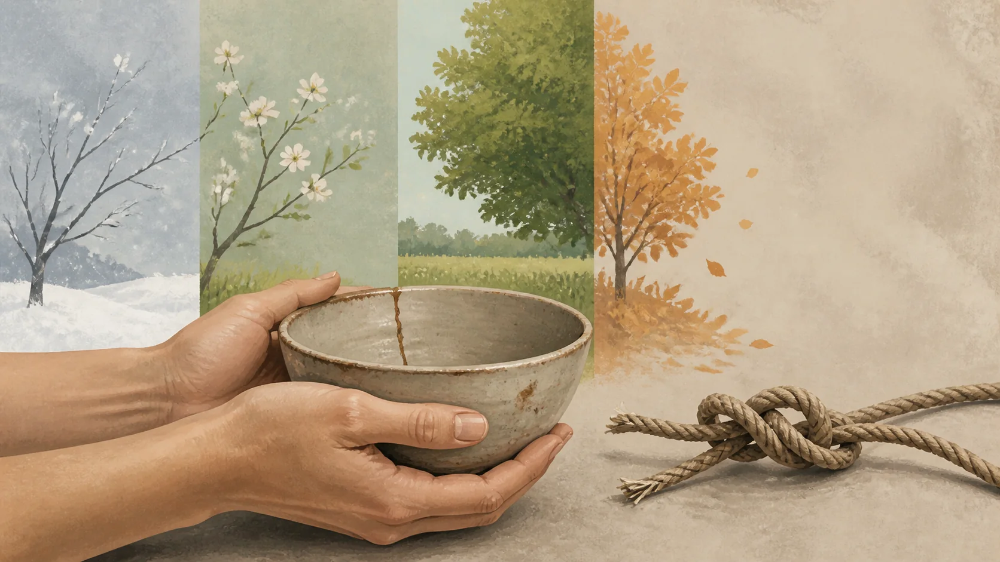
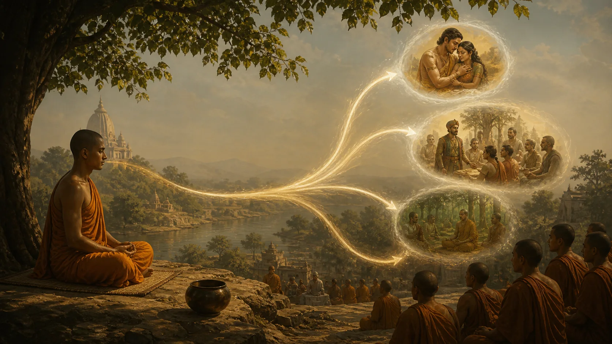
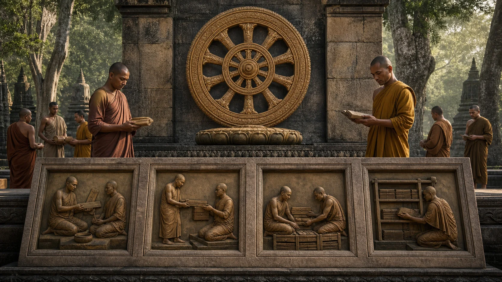

# Tứ Thánh Đế — Chẩn Đoán, Nguyên Nhân, Khả Năng Chữa Và Con Đường

## 1. Bốn Sự Thật Không Phải Bốn Khẩu Hiệu

> **Pāli — SN 56.11, sn56.11:4.1–4.5**
>
> *Idaṁ kho pana, bhikkhave, dukkhaṁ ariyasaccaṁ … saṅkhittena pañcupādānakkhandhā dukkhā. Idaṁ kho pana, bhikkhave, dukkhasamudayaṁ ariyasaccaṁ … kāmataṇhā, bhavataṇhā, vibhavataṇhā.*
>
> **Bản dịch làm việc:** Này các Tỳ-kheo, đây là sự thật cao quý về dukkha … tóm lại, năm thủ uẩn là dukkha. Đây là sự thật cao quý về nguồn sinh của dukkha … dục ái, hữu ái và phi hữu ái.

> **Pāli — SN 56.11, sn56.11:5.2; sn56.11:6.2; sn56.11:7.2; sn56.11:8.2**
>
> *‘Taṁ kho panidaṁ dukkhaṁ ariyasaccaṁ pariññeyyan’ti me, bhikkhave, pubbe …pe… udapādi.*
>
> *‘Taṁ kho panidaṁ dukkhasamudayaṁ ariyasaccaṁ pahātabban’ti me, bhikkhave, pubbe …pe… udapādi.*
>
> *‘Taṁ kho panidaṁ dukkhanirodhaṁ ariyasaccaṁ sacchikātabban’ti me, bhikkhave, pubbe …pe… udapādi.*
>
> *‘Taṁ kho panidaṁ dukkhanirodhagāminī paṭipadā ariyasaccaṁ bhāvetabban’ti me, bhikkhave, pubbe …pe… udapādi.*
>
> **Bản dịch làm việc:** Này các Tỳ-kheo, đối với tôi đã khởi lên sự nhận biết rằng: “Sự thật cao quý về dukkha này cần được hiểu đầy đủ; sự thật cao quý về nguồn sinh của dukkha này cần được từ bỏ; sự thật cao quý về sự đoạn diệt dukkha này cần được chứng ngộ; sự thật cao quý về con đường đưa đến đoạn diệt dukkha này cần được phát triển.”

Tứ Thánh Đế thường được nhớ bằng bốn từ: khổ, tập, diệt, đạo. Cách ghi ấy hữu ích nhưng dễ biến một cấu trúc thực hành thành bảng tín điều. [SN 56.11, Dhammacakkappavattana Sutta](https://suttacentral.net/sn56.11) không chỉ nêu bốn nội dung. Với mỗi nội dung, bài kinh gắn một nhiệm vụ và tuyên bố nhiệm vụ đã hoàn thành. Như vậy có ba vòng nhận biết đối với mỗi đế—nhận ra sự thật, nhận ra việc phải làm, nhận ra việc đã làm xong—thành “ba vòng, mười hai phương diện” trong chính cấu trúc bài.

**Ariyasacca — đọc gần đúng “a-ri-ya-xát-cha” — sự thật cao quý hay sự thật của bậc Thánh** là cụm có nhiều khả năng phân tích ngữ pháp. *Ariya* có thể chỉ điều cao quý hoặc điều được những người cao quý thấu triệt; không nên dựng một khẳng định từ nguyên cứng từ bản dịch tiếng Việt. Điều không mơ hồ là chức năng: đây là những sự thật mà sự hiểu trọn vẹn được bài kinh gắn với giác ngộ.

Bốn đế là **dukkha — đọc gần đúng “đúc-kha” — khổ, bất toại nguyện, sức ép của kinh nghiệm bị chấp thủ**; **samudaya — “sa-mu-đa-ya” — sự sinh khởi hay nguồn sinh**; **nirodha — “ni-rô-đa” — sự đoạn diệt**; và **magga — “mắc-ga” — con đường**. Các nghĩa này là nghĩa làm việc. *Dukkha* không thể luôn thay bằng “đau”; *nirodha* không phải đàn áp; *magga* không chỉ là một niềm tin đúng.

Ẩn dụ y khoa—chẩn đoán, nguyên nhân, khả năng chữa và phương pháp—là cách sắp xếp sư phạm hữu ích, không phải câu nguyên văn trong SN 56.11. Nó làm rõ rằng bốn đế có quan hệ: nếu chỉ nói về bệnh mà không có chữa trị, giáo pháp thành bi quan; nếu nói chữa trị mà không chẩn đoán cơ chế, nó thành lời trấn an; nếu có đường nhưng không đi, nó thành bản đồ trang trí.

Theo truyện khung của kinh điển, SN 56.11 là bài giảng tại Isipatana cho nhóm năm người và là lần bánh xe Pháp được chuyển. Truyền thống gọi đây là bài pháp đầu tiên. Bài có vị trí nền tảng trong ký ức Phật giáo. Tuy nhiên, việc kinh điển đặt bài ở đầu sự nghiệp giảng dạy và câu hỏi sử học về nguyên văn, thứ tự sự kiện là hai cấp tuyên bố khác nhau. Bài này dùng SN 56.11 làm nguồn giáo lý, không biến truyện khung thành biên bản đồng thời.

## 2. Đế Thứ Nhất: Dukkha Phải Được Hiểu Đầy Đủ

SN 56.11 liệt kê sinh, già, bệnh, chết; sầu, bi, khổ, ưu, não; gặp điều không ưa, xa điều ưa, muốn mà không được. Rồi bài tóm tắt: năm uẩn bị chấp thủ là dukkha. Danh sách bao gồm đau đớn hiển nhiên nhưng đi xa hơn đau cảm giác. Một đời có khoái lạc, tình thân và thành tựu vẫn nằm dưới sức ép vì những gì được nắm làm nền an toàn đều đổi thay và không hoàn toàn theo ý.

**Khandha — đọc gần đúng “khan-đa” — uẩn, nhóm kết tập** gồm sắc, thọ, tưởng, hành và thức. Trong công thức Tứ Đế, điểm chính xác là *pañcupādānakkhandhā*: năm uẩn chịu sự chấp thủ hay năm thủ uẩn. **Upādāna — đọc gần đúng “u-pa-đa-na” — thủ, nắm giữ và nhận làm căn cứ bản sắc** làm rõ vì sao câu này không phải tuyên bố thân hay cảm thọ tự nó là tội lỗi. Chính cấu trúc bị nắm giữ làm kinh nghiệm thành nơi đòi hỏi “hãy là tôi, của tôi, và đừng đổi”.

Nói “đời là khổ” vừa quá rộng vừa quá nghèo. Quá rộng nếu hiểu mọi giây phút đều đau đớn: Kinh nhận biết lạc thọ, hỷ và an tĩnh. Quá nghèo nếu chỉ hiểu khổ là lúc buồn: ngay khoái lạc có điều kiện cũng không bảo đảm được, có thể nuôi khát và sợ mất. Một cách đọc chặt hơn là: những gì chịu điều kiện và bị chấp thủ không thể cung cấp sự thỏa mãn bền vững mà sự chấp thủ đòi hỏi.

Nhiệm vụ với đế thứ nhất là **pariññeyya**—cần được biết toàn diện, thường dịch “liễu tri”. Không phải ghét bỏ dukkha, tự trách vì đau, hoặc lập tức loại mọi cảm giác khó chịu. Hiểu đầy đủ đòi thấy biểu hiện, điều kiện và cách tâm thêm lớp “tôi” vào trải nghiệm. Đau thân có thể hiện diện; sợ, chống cự, tưởng tượng tương lai và bản sắc nạn nhân có thể làm mạng khổ dày hơn. Phân tích này không đổ lỗi cho người bệnh: nhiều đau khổ có nguyên nhân sinh học và xã hội thật, cần chăm sóc tương ứng.

MN 141 do Sāriputta giảng triển khai từng đế và định nghĩa các thành phần. Bài kinh phân tích dukkha bằng cùng nhóm hiện tượng và giải thích “muốn mà không được” trong liên hệ với những gì chịu sinh, già, bệnh, chết. Cách triển khai nhắc rằng “hiểu” không chỉ thuộc triết học. Nó là học nhìn thẳng vào điều tâm muốn kiểm soát nhưng không thể ra lệnh.

## 3. Đế Thứ Hai: Nguồn Sinh Phải Được Từ Bỏ

SN 56.11 xác định nguồn sinh của dukkha là **taṇhā — đọc gần đúng “tan-ha” — ái, cơn khát** dẫn đến tái hữu, đi cùng thích thú và tham, tìm vui chỗ này chỗ kia. Ba dạng được nêu: dục ái, hữu ái và phi hữu ái. *Kāma-taṇhā* chạy theo khoái cảm giác quan; *bhava-taṇhā* khát trở thành hoặc tiếp tục một bản sắc; *vibhava-taṇhā* khát không trở thành, muốn tiêu diệt điều đang có. Dạng cuối cho thấy từ bỏ ái không đồng nghĩa cưỡng ép mọi ham muốn bằng ghét bỏ.

Không phải mọi ý muốn đều taṇhā theo cùng nghĩa. Muốn học, muốn giữ giới hay muốn giúp người có thể được đánh giá theo nguồn gốc và hướng đi. Nếu đồng nhất mọi động lực với nguyên nhân khổ, ngay nhiệm vụ phát triển con đường trở nên bất khả. Vấn đề là cơn khát nắm đối tượng như nguồn thỏa mãn và bản sắc, được tham, sân, si nuôi dưỡng.

Taṇhā và upādāna liên hệ nhưng không phải hai từ thay thế. Ái nghiêng về khát và tìm; thủ là sự bám, chiếm hữu hoặc chấp thành quan điểm–bản ngã. Trong duyên khởi, ái làm duyên cho thủ. Bài này chỉ dùng quan hệ ấy để làm rõ cơ chế; bài duyên khởi riêng sẽ cần đọc toàn chuỗi và các cách giải thích cạnh tranh.

Nhiệm vụ với đế thứ hai là **pahātabba**—phải được từ bỏ. “Từ bỏ” không phải tuyên bố “tôi không được muốn” rồi đẩy xung lực xuống dưới ý thức. Nó đòi nhận ra ái khi sinh, không cấp nhiên liệu, hiểu sự quyến rũ và nguy hiểm, và nuôi điều kiện đối nghịch. Đè nén bằng sân có thể chỉ chuyển dục ái thành phi hữu ái: ta khát được trở thành người không còn khát.

Nguồn sinh không phải lời giải thích độc quyền cho mọi tổn thương. Tai nạn, bạo lực, nghèo đói, bệnh tật và cấu trúc xã hội có chuỗi nguyên nhân thực tế; nói với nạn nhân rằng “khổ do ái của bạn” có thể vừa sai văn cảnh vừa tàn nhẫn. Tứ Đế phân tích dukkha theo dự án giải thoát khỏi chấp thủ. Nó không miễn nghĩa vụ chữa bệnh, ngăn bạo lực hoặc thay đổi điều kiện bất công.

## 4. Đế Thứ Ba: Nirodha Phải Được Chứng Ngộ

> **Pāli — SN 56.11, sn56.11:4.6–4.10**
>
> *Idaṁ kho pana, bhikkhave, dukkhanirodhaṁ ariyasaccaṁ—yo tassāyeva taṇhāya asesavirāganirodho cāgo paṭinissaggo mutti anālayo. … Ayameva ariyo aṭṭhaṅgiko maggo.*
>
> **Bản dịch làm việc:** Này các Tỳ-kheo, đây là sự thật cao quý về sự đoạn diệt dukkha: chính là sự ly tham và đoạn diệt hoàn toàn ái ấy, từ bỏ, buông ra, giải thoát và không còn nương tựa vào nó. … Đó chính là Bát Chánh Đạo.

SN 56.11 định nghĩa sự đoạn diệt dukkha qua việc ly tham và đoạn diệt hoàn toàn chính cơn ái ấy: từ bỏ, buông bỏ, giải thoát khỏi nó và không còn dựa vào nó. Ngôn ngữ tập trung vào cơ chế được chấm dứt, không mô tả việc giết một cái tôi. Vì vậy đọc nirodha như hư vô hóa con người là đưa vào văn bản một chủ thể bất biến rồi tưởng tượng chủ thể ấy bị xóa.

**Nibbāna — đọc gần đúng “níp-ba-na” — Niết-bàn, sự tắt tham, sân và si** là cứu cánh mà truyền thống liên hệ với nirodha. Ẩn dụ “tắt” không tự cho phép kết luận đây là một địa điểm, một chất thể vũ trụ hay hư vô tuyệt đối. Các bài Kinh dùng nhiều mô tả phủ định và tích cực; tranh luận bản thể học về Nibbāna vượt quá phạm vi Tứ Đế căn bản. Điều SN 56.11 đòi là nhận biết khả năng ái chấm dứt và dukkha không còn được sản xuất theo cơ chế ấy.

Nhiệm vụ là **sacchikātabba**—phải được tự mình chứng ngộ hay hiện thực hóa. Không thể hoàn thành đế thứ ba chỉ bằng đồng ý rằng Niết-bàn tồn tại. Nhưng cũng không nên gọi bất cứ phút bình yên nào là chứng Niết-bàn. Một xung lực có thể tạm lắng do tránh đối tượng, mệt mỏi hoặc định; đoạn tận gốc tham, sân, si là tuyên bố mạnh hơn. Kinh nghiệm cần được đánh giá theo mức giải thoát bền và các tiêu chuẩn của con đường.

Ngay trong đời thường, người học có thể quan sát một mô hình nhỏ mà không phóng đại thành cứu cánh: khi một sự nắm giữ được thấy rõ và buông, sức ép do nó tạo giảm. Đây là minh họa thực hành, không phải bằng chứng rằng người quan sát đã chứng đế thứ ba trọn vẹn. Giữ hai cấp độ giúp thực hành có điểm vào mà danh xưng thành tựu không bị rẻ hóa.

Đế thứ ba khiến Tứ Đế không phải triết lý bi quan. Chẩn đoán có mục đích vì sự chấm dứt được tuyên bố là khả thi. Nhưng “khả thi” trong văn bản không tương đương một bảo đảm rằng chỉ cần suy nghĩ tích cực hay hiểu khái niệm là đạt. Nó dẫn thẳng sang đế thứ tư: điều kiện phải được phát triển.

## 5. Đế Thứ Tư: Magga Phải Được Phát Triển

Đường dẫn đến đoạn diệt là Bát Chánh Đạo: chánh kiến, chánh tư duy hay ý hướng, chánh ngữ, chánh nghiệp, chánh mạng, chánh tinh tấn, chánh niệm và chánh định. SN 56.11 nêu danh sách; MN 141 định nghĩa từng chi ngắn gọn. Bài 8 sẽ đọc chi tiết với SN 45.8 và MN 117. Ở đây, điểm quyết định là nhiệm vụ: **bhāvetabba**—phải được tu tập, làm cho phát triển.

Con đường không phải giá phải trả cho một quyền lực ban cứu rỗi. Nó là mạng điều kiện làm suy yếu nguyên nhân khổ và làm khả năng chứng ngộ chín. Chánh kiến giúp nhận đúng vấn đề; ý hướng định hướng hành động; lời nói, hành vi và sinh kế giảm xung đột cùng hối hận; tinh tấn, niệm và định đào luyện khả năng thấy. Các chi hỗ trợ nhau, nên không cần chờ “xong đạo đức” mới bắt đầu chú ý hay chờ “xong trí tuệ” mới sửa lời.

Nhiệm vụ bốn đế khác nhau và không nên đảo. Dukkha cần hiểu, không phải ghét và thủ tiêu bằng mọi giá. Ái cần từ bỏ, không phải nghiên cứu vô hạn rồi nuôi tiếp. Đoạn diệt cần chứng, không phải “phát triển Niết-bàn” như sản phẩm của cái tôi. Con đường cần phát triển, không phải chỉ tôn kính. Bốn động từ là bộ phận của giáo lý, không phải phần phụ sau bốn danh từ.

Trong SN 56.11, Đức Phật tuyên bố tri kiến về bốn đế với ba vòng, mười hai phương diện đã được thanh tịnh thì mới tuyên bố giác ngộ viên mãn. Điều này đặt chuẩn cao cho chữ “hiểu Tứ Đế”. Thuộc lòng bốn mục là nhận diện bản đồ; thấy nhiệm vụ; thực hiện nhiệm vụ và biết việc đã hoàn tất là các cấp khác.

## 6. Dùng Bốn Đế Như Khung Điều Tra, Không Như Công Thức Áp Lên Người Khác

Chọn một sự việc có cường độ vừa, chẳng hạn bực khi bị phê bình. Ở ô thứ nhất, mô tả dukkha mà không kể lại bản án: nóng mặt, co bụng, lặp câu nói, sợ mất hình ảnh. Tách cảm thọ, tưởng, ý định và câu chuyện “tôi bị xúc phạm”. Mục tiêu là hiểu cấu trúc, không phủ nhận việc lời phê bình có thể bất công.

Ở ô thứ hai, tìm cơn khát: muốn người kia rút lời, muốn mình luôn được nhìn nhận đúng, muốn cảm giác khó chịu biến mất ngay, hoặc muốn trở thành người thắng tranh luận. Không gọi mọi nhu cầu ranh giới là ái. Nếu bị lạm dụng, hành động bảo vệ có thể cần thiết. Hãy hỏi phần nào là đáp ứng sáng suốt và phần nào là sự nắm giữ đang nhân khổ.

Ở ô thứ ba, quan sát lúc không cấp nhiên liệu: không diễn tập phản công, không đồng nhất hoàn toàn với hình ảnh, cho cảm giác thay đổi. Sự giảm sức ép là ví dụ giới hạn của buông, không phải tuyên bố chứng Niết-bàn. Ở ô thứ tư, chọn chi con đường cần phát triển: kiểm tra cách hiểu, đặt ý hướng không hại, nói đúng lúc, giữ niệm nơi thân, hoặc tạo định trước khi phản hồi.

Lặp lại sẽ cho thấy bốn đế không nhất thiết diễn ra như bốn phút tách biệt. Chánh niệm thuộc con đường giúp hiểu dukkha; hiểu làm ái mất sức; một thoáng buông xác nhận hướng; chánh kiến được củng cố. Hệ thống có trật tự logic nhưng vận hành phản hồi.

Đừng dùng khung này để chẩn đoán người khác từ xa: “anh khổ vì chấp”, “chị bệnh vì ái”. Tứ Đế trước hết là công việc người học thực hiện với kinh nghiệm và hành động của mình. Trong chăm sóc sức khỏe tâm thần hoặc y khoa, giáo pháp có thể hỗ trợ ý nghĩa và cách liên hệ với đau, nhưng không thay chuyên môn, thuốc hay an toàn.

## 7. Kỷ Luật Khẳng Định, Đọc Tiếp Và Nguồn

> [!quote] Văn bản nói gì
> SN 56.11 trình bày dukkha, nguồn sinh, sự đoạn diệt và con đường; giao cho chúng bốn nhiệm vụ lần lượt là hiểu đầy đủ, từ bỏ, chứng ngộ và phát triển. MN 141 triển khai định nghĩa, trong đó năm thủ uẩn tóm tắt dukkha và ái gồm dục ái, hữu ái, phi hữu ái.

> [!info] Truyền thống giải thích gì
> Theravāda xem SN 56.11 là bài chuyển Pháp luân đầu tiên và dùng Tứ Đế làm kiến trúc trung tâm của giáo pháp. Các hệ thống hậu kỳ phân tích sâu uẩn, ái, lộ trình và các tầng chứng; chi tiết ấy cần dẫn đúng nguồn khi được dùng.

> [!example] Bài này suy luận gì
> Ẩn dụ chẩn đoán–nguyên nhân–khả năng chữa–phương pháp giúp thấy bốn đế là hệ thống nhiệm vụ, và nhật ký bốn ô là bài tập sư phạm hiện đại. Chúng diễn giải cấu trúc Kinh, không phải lời dịch nguyên văn.

> [!warning] Điều chưa chứng minh
> Truyện khung của kinh điển chưa tự chứng minh nguyên văn lịch sử của bài pháp đầu tiên. Tứ Đế không chứng minh rằng mọi đau đớn chỉ do thái độ cá nhân, rằng bệnh hay bất công không cần can thiệp, hoặc một thoáng nhẹ nhõm đồng nghĩa chứng Nibbāna.

Đọc trước: [[theravada/04 - Cách Đọc Kinh Pāli Mà Không Biến Thành Tín Điều|Cách Đọc Kinh Pāli Mà Không Biến Thành Tín Điều]]. Đọc tiếp: [[theravada/08 - Bát Chánh Đạo - Tám Chi Phần Của Một Hệ Thống|Bát Chánh Đạo — Tám Chi Phần Của Một Hệ Thống]].

**Nguồn kinh điển chính xác**

- [SN 56.11: Dhammacakkappavattana Sutta](https://suttacentral.net/sn56.11), nguồn cho bốn đế, bốn nhiệm vụ và ba vòng–mười hai phương diện.
- [MN 141: Saccavibhaṅga Sutta](https://suttacentral.net/mn141), bài Sāriputta triển khai các định nghĩa và các chi của con đường.

**Đối chiếu thuật ngữ và nghiên cứu**

- Rupert Gethin, *The Foundations of Buddhism*, Oxford University Press, 1998, dùng để định hướng quan hệ Tứ Đế–con đường; đây là dẫn thư mục, không sao chép dài.
- Bhikkhu Bodhi, [*The Noble Eightfold Path: Way to the End of Suffering*](https://www.accesstoinsight.org/lib/authors/bodhi/waytoend.html), Buddhist Publication Society, đối chiếu thuật ngữ và cấu trúc truyền thống.
- [SuttaCentral Editions](https://suttacentral.net/editions), nơi kiểm tra người dịch, ấn bản và giấy phép của từng tài nguyên.

Pāli làm việc là văn bản phân đoạn SuttaCentral, truy cập ngày 2026-08-18. Bản dịch Sujato, Bhikkhu Bodhi và Ṭhānissaro Bhikkhu được dùng để đối chiếu ngắn. Văn xuôi tiếng Việt và các bản dịch nghĩa trong bài là bản dịch làm việc của redpill.wiki, không sao chép dài bản dịch có bản quyền.
