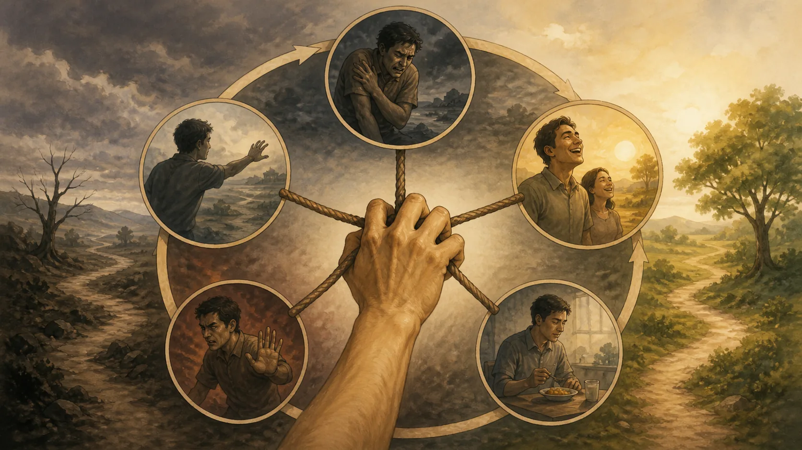
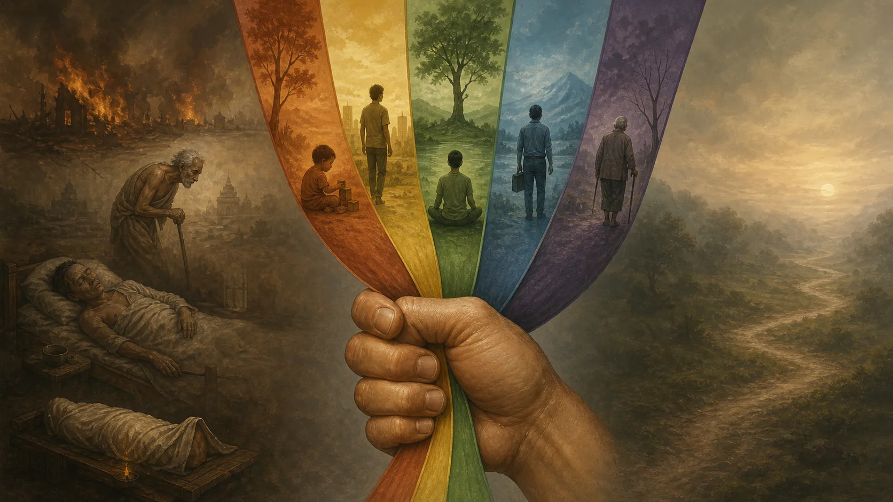
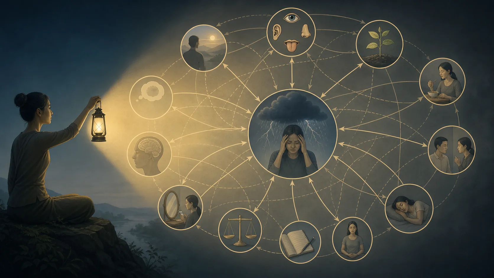
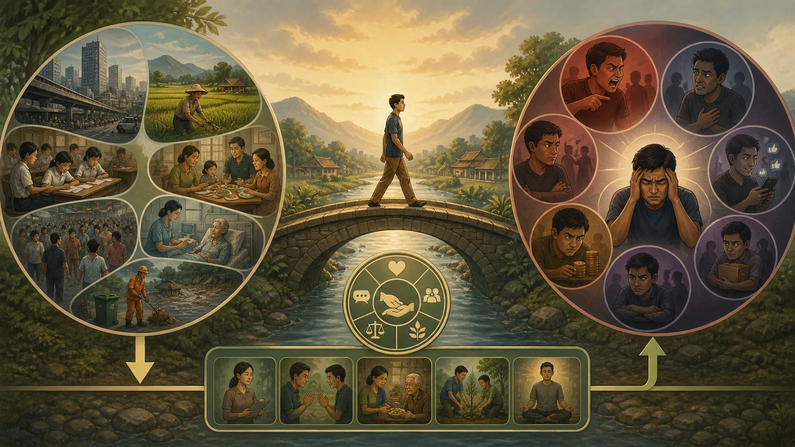

# Dukkha — Khổ Không Chỉ Là Đau Đớn

## 1. Một Từ Không Nằm Gọn Trong “Đau” Hay “Bi Kịch”

**Dukkha — đọc gần đúng “đúc-kha” — khổ, tính bất toại nguyện hoặc sức ép của kinh nghiệm hữu vi khi bị chấp thủ** là một từ phải giữ theo văn cảnh. Nếu dịch nó thành “đau đớn”, ta bỏ mất vấn đề của khoái lạc đang đổi thay. Nếu dịch thành “khốn khổ” hay “misery”, ta khiến giáo pháp dường như tuyên bố mọi khoảnh khắc sống đều u ám. Nếu để nguyên Pāli mà không giải thích, ta lại biến một từ thực hành thành mật mã.

[SN 56.11, Dhammacakkappavattana Sutta](https://suttacentral.net/sn56.11) đặt dukkha trong sự thật cao quý thứ nhất. Bài kinh kể sinh, già, bệnh, chết; sầu, bi, đau thân, ưu và não; gặp điều không ưa, xa điều ưa, muốn mà không được. Sau danh sách ấy là câu tóm tắt có phạm vi rất chính xác: năm uẩn bị chấp thủ là dukkha. Vì vậy, văn bản vừa nhận diện những đau đớn dễ thấy vừa chỉ tới cấu trúc rộng hơn khiến kinh nghiệm không thể gánh nổi yêu cầu “hãy làm tôi thỏa mãn và đừng thay đổi”.

Câu “đời là khổ” tiện để ghi nhớ nhưng nguy hiểm nếu được coi là bản dịch đầy đủ. Kinh Pāli nói đến lạc thọ, hỷ, an lạc của định, tình bạn tốt và lợi ích của đời sống có giới. Vấn đề không phải phủ nhận niềm vui. Vấn đề là một niềm vui có điều kiện không thể trở thành sở hữu vĩnh viễn chỉ vì ta muốn vậy. Nó có thể lành mạnh, đáng trân trọng và vẫn vô thường.

Điều này cũng ngăn hai cực đoan diễn giải. Cực thứ nhất là bi quan hóa: nhìn người đang hạnh phúc rồi bảo họ chưa hiểu rằng tất cả chỉ là khốn khổ. Cực thứ hai là làm nhẹ: biến dukkha thành chút “stress” mà vài mẹo chú ý sẽ xử lý. Phạm vi canonical gồm đau thân, mất mát, cái chết và sự chấp thủ căn bản; nó sâu hơn một tâm trạng nhưng không xóa sự khác biệt giữa một ngày bình an và một thảm họa.

Bài học này dùng hai cửa sổ. SN 56.11 cho biết dukkha gồm những gì và giao nhiệm vụ nào đối với nó. [SN 22.59, Anattalakkhaṇa Sutta](https://suttacentral.net/sn22.59) khảo sát sắc, thọ, tưởng, hành, thức dưới ba dấu: vô thường, dukkha và không thích hợp để xem là “của tôi, tôi, tự ngã của tôi”. Đọc cùng nhau, hai bài tránh cả chủ nghĩa yếm thế lẫn sự trừu tượng hóa.

## 2. Từ Danh Sách Đời Sống Đến Năm Thủ Uẩn

Danh sách của SN 56.11 bắt đầu từ các thực tại không cần triết học để xác nhận. Sinh đặt một hữu tình vào điều kiện dễ tổn thương; già làm năng lực suy đổi; bệnh phá kế hoạch; chết chia lìa mọi sở hữu. Sầu và bi là phản ứng trước mất mát; đau thân và ưu tâm không hoàn toàn trùng nhau; “não” gợi mức bức bách sâu. Gặp điều ghét, xa điều yêu và không đạt điều muốn đưa dukkha vào đời thường, nơi lịch trình, quan hệ và danh dự không tuân lệnh.

Nhưng bài kinh không dừng ở một bảng tai họa. **Khandha — “khan-đa” — uẩn, nhóm kết tập của kinh nghiệm** gồm **rūpa** (sắc, phương diện thân–vật chất), **vedanā** (thọ, sắc thái dễ chịu, khó chịu hay trung tính), **saññā** (tưởng, nhận dạng), **saṅkhāra** (hành, các tạo tác hay hoạt động tạo điều kiện tùy văn cảnh) và **viññāṇa** (thức, nhận biết phân biệt). Cụm trong Tứ Đế là *pañcupādānakkhandhā*: năm thủ uẩn, tức năm nhóm trong tư cách bị nắm giữ.

**Upādāna — “u-pa-đa-na” — thủ, bám giữ, chiếm làm của mình hoặc làm căn cứ cho quan điểm và bản sắc** là từ quyết định. Nó không cho phép kết luận rằng thân thể, cảm thọ hoặc nhận thức tự chúng là tội lỗi. Một cơn đau vẫn đau khi không có triết lý về cái tôi; nhưng ý nghĩ “điều này không được xảy đến với tôi”, sợ hãi về tương lai và câu chuyện mình đã bị phá hủy có thể tạo thêm tầng sức ép. Ngược lại, không chấp thủ không phải thuốc tê và không bảo đảm đau thân biến mất.

SN 22.59 vận dụng phép hỏi có cấu trúc: cái gì vô thường thì đưa đến dễ chịu hay dukkha? Cái vô thường, dukkha và chịu biến đổi có thích hợp để xem là “của tôi, tôi, tự ngã của tôi” không? Câu hỏi được lặp qua năm uẩn. Lập luận không nói mọi giây của sắc hay thọ đều là cảm giác đau. Nó cho thấy những gì đổi và không dưới quyền điều khiển không thích hợp làm nền tự ngã chắc chắn.

Điểm “không dưới quyền” cũng cần chính xác. Ta có thể huấn luyện thân, điều chỉnh chú ý, trị bệnh và tạo thói quen; Kinh không phủ nhận năng lực tác động tương đối. Nhưng không ai ban lệnh tối hậu rằng thân chỉ khỏe, cảm giác chỉ vui, nhận dạng không sai, tạo tác luôn như ý và thức không gián đoạn. Có ảnh hưởng không đồng nghĩa chủ quyền tuyệt đối.

Do đó, dukkha vận hành ở giao điểm giữa điều kiện và yêu sách. Thế giới hữu vi đổi; uẩn đổi; tâm chấp thủ đòi cái đổi phải làm nền bất biến. Cách nói này không biến mọi nguyên nhân xã hội thành tâm lý. Chiến tranh, nghèo đói, bạo lực và bệnh cần được hiểu ở cấp nguyên nhân riêng. Giáo lý chỉ bổ sung câu hỏi: trong kinh nghiệm ấy, sự nắm giữ tiếp tục tạo sức ép như thế nào?

## 3. Ba Phương Diện Là Bản Đồ Hệ Thống Hóa Hậu Kỳ

Truyền thống Theravāda thường trình bày ba dạng: **dukkha-dukkhatā**, nỗi khổ của đau trực tiếp; **vipariṇāma-dukkhatā**, dukkha do biến đổi; và **saṅkhāra-dukkhatā**, dukkha gắn với tính bị điều kiện hay cấu tạo. Đây là bản đồ giải thích hữu ích, nhưng phải gắn nhãn: cách phân loại ba thuật ngữ là sự hệ thống hóa được triển khai trong truyền thống phân tích và chú giải, không phải danh sách ba mục được SN 56.11 nêu nguyên dạng.

Dukkha-dukkhatā dễ nhận nhất: đau răng, đói, bị thương, tang tóc, sợ hãi. Không nên dùng giáo lý để phủ nhận cấp này. Người đau cần thuốc, an toàn, thực phẩm, công lý hoặc người lắng nghe; một bài giảng về vô thường có thể sai thời điểm. Tuệ không thay thế chăm sóc, dù cách liên hệ với đau có thể làm nó bớt bị nhân lên.

Vipariṇāma-dukkhatā soi niềm vui có điều kiện. Một cuộc gặp quý vì sẽ kết thúc không có nghĩa nó giả. Nhưng nếu ta đòi nó kéo dài, sự đổi thay bộc lộ điểm không thỏa mãn. Thành công đổi thành áp lực duy trì; sức trẻ suy; lời khen hôm qua không bảo đảm danh tiếng ngày mai. Dukkha không nằm ở việc niềm vui “xấu”, mà ở chỗ nó không thể hoàn thành lời hứa vĩnh cửu mà sự bám giữ gán cho nó.

Saṅkhāra-dukkhatā khó hơn. **Saṅkhāra — “sang-kha-ra” — hành, tạo tác, hoặc cái được tạo điều kiện** đổi nghĩa theo vị trí. Trong năm uẩn, nó thường chỉ nhóm tạo tác tâm; trong mệnh đề “mọi saṅkhāra vô thường”, phạm vi là các pháp hữu vi. Vì vậy không nên dịch máy móc thành “hành” rồi kết luận. Ở bản đồ ba dạng, ý chính là những gì tùy thuộc điều kiện thì không tự đứng vững và không thể làm chỗ nương tuyệt đối.

Ba phương diện không phải ba hộp kín. Một bệnh gây đau trực tiếp, làm mất niềm vui cũ và phơi bày sự phụ thuộc của thân vào vô số điều kiện. Một tình yêu có thể cho lạc thật, chứa khả năng chia lìa và trở thành chỗ ta dựng bản sắc. Bản đồ giúp đặt câu hỏi khác nhau trên cùng kinh nghiệm; nó không phải phép tính để xếp hạng ai khổ “cao” hơn.

Theo Rupert Gethin, dukkha trong cấu trúc Phật giáo phải được hiểu cùng năm thủ uẩn và nhiệm vụ của Tứ Đế, chứ không chỉ qua một tương đương từ điển. Bhikkhu Anālayo, trong các nghiên cứu so sánh kinh sớm, nhấn mạnh giá trị của việc đọc công thức trong ngữ cảnh thực hành. Những học giả được nêu tên ở đây giúp định hướng cách đọc; họ không thay thế nguồn canonical và không được biến thành “khoa học đã chứng minh đạo Phật”.

## 4. Nhiệm Vụ Là Liễu Tri, Không Phải Ghét Bỏ

Trong SN 56.11, nhiệm vụ đối với sự thật về dukkha là *pariññeyya*: cần được biết đầy đủ, liễu tri. **Pariññā — “pa-rin-nha” — sự hiểu biết trọn vẹn** không phải chỉ đặt nhãn “đây là khổ”. Nó đòi nhận diện biểu hiện, điều kiện, sức hấp dẫn, nguy hiểm và cách thoát khỏi sự nắm giữ. Động từ này sửa một lỗi thực hành phổ biến: nghe “khổ” rồi sinh ác cảm với chính kinh nghiệm.

Nếu đau xuất hiện và tâm ra lệnh “một Phật tử giỏi không được đau”, đau đã được thêm hổ thẹn. Nếu vui xuất hiện và tâm nói “vui là nguy hiểm, phải phá”, người học đã dùng sân để chống một pháp vô thường. Liễu tri không phải tận hưởng vô trách nhiệm, cũng không phải tẩy màu đời sống. Nó là thấy đúng cái gì đang xảy ra, cái gì do điều kiện, cái gì được thêm bởi chấp thủ và hành động nào giảm hại.

Một phương pháp quan sát có thể gồm bốn câu hỏi. Thứ nhất, dữ kiện trực tiếp là gì: áp lực trong ngực, lạc thọ, hình ảnh, câu tự thoại? Thứ hai, điều gì đang thay đổi mà tâm muốn đóng băng? Thứ ba, uẩn nào đang được nhận làm “tôi” hoặc “của tôi”? Thứ tư, hành động đạo đức nào cần làm trong thế giới, thay vì chỉ chỉnh thái độ? Đây là khung biên tập hiện đại dựa trên Kinh, không phải kỹ thuật được SN 56.11 truyền nguyên văn.

Ví dụ, mất việc có hậu quả vật chất thật: thu nhập giảm, bảo hiểm mất, gia đình bất an. Liễu tri không bảo người mất việc rằng vấn đề chỉ là bản ngã. Nó phân biệt việc phải làm—tìm hỗ trợ, bảo vệ quyền lợi, lập kế hoạch—với các lớp “tôi hoàn toàn vô giá trị”, “đời tôi đã kết thúc”, hoặc khát phải phục hồi hình ảnh ngay. Hai cấp có thể được xử lý song song.

Trong chăm sóc người khác, kỷ luật này càng quan trọng. Không dùng dukkha để thắng tranh luận với người đang tang chế. Không chẩn đoán chấp thủ từ xa. Không lấy bình thản làm thước đo đạo đức duy nhất: một người phản ứng mạnh trước bất công có thể đang thấy điều cần sửa. Thực hành hướng đến giảm tham, sân, si và tổn hại, không đào tạo sự thờ ơ đẹp mắt.

Hiểu đầy đủ cũng có tính lặp lại. Ta có thể hiểu khái niệm hôm nay nhưng vẫn bị một lời chê cuốn đi ngày mai. SN 56.11 phân biệt nhận ra đế, nhận ra nhiệm vụ và biết nhiệm vụ đã hoàn tất. Vì thế, thuộc định nghĩa là khởi điểm; sự hiểu phải được kiểm tra trong thân, lời nói, lựa chọn và mức bám giữ.

## 5. Vô Thường, Dukkha Và Không Phải Tự Ngã

SN 22.59 nối **anicca — “a-nít-cha” — vô thường** với dukkha và **anattā — “a-nát-ta” — không phải tự ngã, không thích hợp xem là tự ngã**. Ba phép nhìn hỗ trợ nhau nhưng không phải ba từ đồng nghĩa. Vô thường nói đến sinh–diệt và đổi thay; dukkha nói đến sự không thể làm nền thỏa mãn chắc chắn; anattā thẩm tra quyền sở hữu và đồng nhất hóa.

Một cảm giác dễ chịu là vô thường; khi bị đòi phải kéo dài, nó bộc lộ dukkha; vì nó đổi ngoài quyền tối hậu, nó không thích hợp để tuyên bố “đây là tôi”. Nhưng mục đích không phải suy ra “không có kinh nghiệm” hoặc “không ai chịu trách nhiệm”. Kinh vẫn nói bằng ngôn ngữ quy ước về người hành động và quả của hành động. Phân tích nhắm vào việc nhận uẩn làm tự ngã thường hằng, không xóa nhân quả hay đạo đức.

Cũng không nên đảo lập luận thành một siêu hình học bí mật: vì năm uẩn không phải tự ngã nên chắc phải có “chân ngã” nằm ngoài chúng. SN 22.59 không giới thiệu một thực thể như vậy. Bài kinh hướng đến yếm ly, ly tham và giải thoát qua việc không nắm các uẩn là tôi hoặc của tôi. Thêm một chủ thể vĩnh cửu phía sau là đi xa hơn điều nguồn này nói.

Tương tự, “vô thường nên dukkha” không có nghĩa mọi thay đổi đều đau. Một cơn sốt hạ là thay đổi đáng mừng; một thói quen xấu chấm dứt là lợi ích. Quan hệ nằm ở khả năng nương tựa tuyệt đối: ngay trạng thái tốt cũng không thể bị sở hữu bằng mệnh lệnh. Thấy vậy có thể làm lòng biết ơn tinh tế hơn, không nhất thiết làm đời mất màu.

Ở cấp thực hành, ta có thể quan sát một lời khen. Thọ dễ chịu sinh; tưởng nhận dạng “họ công nhận mình”; hành dựng ý muốn được khen tiếp; thức nhận biết đối tượng. Nếu toàn chuỗi thành “giá trị của tôi”, nỗi sợ mất danh tiếng đi kèm lạc. Không cần từ chối lời khen. Chỉ cần thấy nó là sự kiện có điều kiện, đáp lại tử tế và không giao căn tính cho nó quản trị.

Đây là nơi dukkha trở thành công cụ chẩn đoán chứ không phải thế giới quan u tối. Nó hỏi: ta đang yêu cầu điều gì từ một cấu trúc không thể đáp ứng yêu cầu ấy? Câu hỏi không buộc bỏ mọi quan hệ hay dự án; nó thay cách tham dự—có trách nhiệm, chăm sóc, nhưng ít chiếm hữu hơn.

## 6. Một Bài Thực Hành Không Phủ Nhận Thế Giới

Chọn một tình huống cường độ vừa, không phải chấn thương đang cấp tính. Viết hai cột. Cột “điều kiện thực” ghi những gì cần phản ứng bên ngoài: hóa đơn, lời nói gây hại, thiếu ngủ, bệnh, thời hạn. Cột “cách tâm nắm” ghi đòi hỏi, đồng nhất và tưởng tượng: “nếu thất bại lần này tôi là kẻ thất bại”, “người ấy phải luôn làm tôi an toàn”. Việc tách cột không chia thân và tâm tuyệt đối; nó ngăn giáo lý bị dùng để xóa thực tại.

Sau đó đánh dấu ba sắc thái. Đau trực tiếp ở đâu? Điều dễ chịu nào đang đổi hoặc có nguy cơ mất? Hệ thống điều kiện nào khiến trải nghiệm không tự đứng riêng? Không cần ép mọi tình huống có đủ ba. Mục đích là tăng độ phân giải, không hoàn thành biểu mẫu.

Tiếp theo hỏi nhiệm vụ nào thuộc dukkha: hiểu. Đừng vội “buông” như mệnh lệnh. Ở lại đủ lâu để biết cảm thọ, câu chuyện, phản ứng thân và hành vi sắp xảy ra. Nếu nguy hiểm, ưu tiên ra khỏi nguy hiểm; nếu bệnh, tìm chăm sóc; nếu bất công, cân nhắc hành động tập thể. Hiểu đầy đủ bao gồm hiểu điều kiện xã hội và trách nhiệm, không chỉ nội tâm.

Cuối cùng, thử nới một tuyên bố sở hữu. Thay “nỗi giận này là tôi” bằng “đang có trạng thái giận do các điều kiện”; thay “niềm vui này phải ở lại” bằng “đây là lạc thọ đáng biết ơn và đang đổi”. Đây không phải thần chú phủ định cảm xúc. Nếu cách nói khiến ta tê liệt hoặc xa lạ với chính mình, hãy dừng và trở về nhận biết thân cùng hỗ trợ thích hợp.

Đánh giá bài tập bằng hậu quả: tham, sân, si và hại có giảm không? Ta có rõ hơn về việc cần làm không? Ta có mềm hơn với nỗi đau của người khác không? Một vẻ bình tĩnh đi cùng trốn trách nhiệm không phải dấu hiệu đủ. Dukkha được liễu tri phải làm hiểu biết chính xác và đáp ứng đạo đức hơn.

Không gọi một lần nhẹ nhõm là giải thoát. Một phản ứng có thể lắng vì mệt, phân tâm hoặc đối tượng biến mất. Con đường đòi đào luyện lặp lại và sự đoạn tận có tiêu chuẩn mạnh hơn. Bài tập này chỉ là cửa vào để nhận ra phạm vi của đế thứ nhất.

## 7. Kỷ Luật Khẳng Định, Đọc Tiếp Và Nguồn

> [!quote] Văn bản nói gì
> SN 56.11 liệt kê sinh, già, bệnh, chết, các dạng sầu đau, gặp điều không ưa, xa điều ưa, muốn mà không được, rồi tóm tắt dukkha bằng năm thủ uẩn; nhiệm vụ là hiểu đầy đủ. SN 22.59 khảo sát năm uẩn như vô thường, dukkha và không thích hợp để xem là “của tôi, tôi, tự ngã của tôi”.

> [!info] Truyền thống giải thích gì
> Truyền thống Theravāda hệ thống hóa dukkha-dukkhatā, vipariṇāma-dukkhatā và saṅkhāra-dukkhatā để phân biệt đau trực tiếp, sức ép do đổi thay và tính bất toại của pháp hữu vi. Cách phân ba này hữu ích nhưng không được trình bày như danh sách nguyên văn của SN 56.11.

> [!example] Bài này suy luận gì
> Mô hình “điều kiện thực/cách tâm nắm” và nhật ký ba sắc thái là công cụ sư phạm hiện đại. Bài suy luận rằng liễu tri dukkha nên tăng cả độ chính xác nội tâm lẫn năng lực đáp ứng bệnh, bạo lực và bất công, thay vì thu mọi nguyên nhân về thái độ.

> [!warning] Điều chưa chứng minh
> Hai bài kinh không chứng minh rằng mọi đời sống là misery, mọi niềm vui là giả, mọi đau đớn do chấp thủ cá nhân, hay bình thản đồng nghĩa giác ngộ. Chúng cũng không chứng minh một “chân ngã” nằm sau năm uẩn hoặc cho phép bỏ điều trị và công lý xã hội.

Đọc trước: [[theravada/05 - Tứ Thánh Đế - Chẩn Đoán, Nguyên Nhân, Khả Năng Chữa Và Con Đường|Tứ Thánh Đế — Chẩn Đoán, Nguyên Nhân, Khả Năng Chữa Và Con Đường]]. Đọc tiếp: Ái, Thủ Và Hữu — Cơ Chế Tự Nuôi Của Khổ. Bài 07 chưa xuất bản nên được giữ dưới dạng chữ thường, không tạo đường dẫn.

**Nguồn canonical chính xác**

- [SN 56.11: Dhammacakkappavattana Sutta](https://suttacentral.net/sn56.11), nguồn cho phạm vi dukkha, năm thủ uẩn và nhiệm vụ liễu tri.
- [SN 22.59: Anattalakkhaṇa Sutta](https://suttacentral.net/sn22.59), nguồn cho phép khảo sát năm uẩn qua vô thường, dukkha và không phải tự ngã.

**Đối chiếu thuật ngữ và nghiên cứu có tên**

- Rupert Gethin, *The Foundations of Buddhism*, Oxford University Press, 1998, về Tứ Đế, uẩn và phạm vi của dukkha.
- Bhikkhu Anālayo, *The Dawn of Abhidharma*, Hamburg Buddhist Studies, 2014, dùng thận trọng để phân biệt chất liệu kinh sớm với xu hướng hệ thống hóa.
- Bhikkhu Bodhi, *The Connected Discourses of the Buddha*, Wisdom Publications, 2000, dùng để đối chiếu thuật ngữ và cấu trúc hai bài thuộc Saṃyutta Nikāya.
- [SuttaCentral Editions](https://suttacentral.net/editions), thông tin ấn bản, người dịch và giấy phép theo từng tài nguyên.

Pāli làm việc là văn bản Bilara phân đoạn trên SuttaCentral, truy cập ngày 2026-08-18. Các bản dịch của Bhikkhu Sujato, Bhikkhu Bodhi và Ṭhānissaro Bhikkhu chỉ được dùng để đối chiếu; toàn bộ văn xuôi tiếng Việt và các dịch nghĩa ngắn là bản dịch làm việc của redpill.wiki, không sao chép dài bản dịch bên ngoài.
