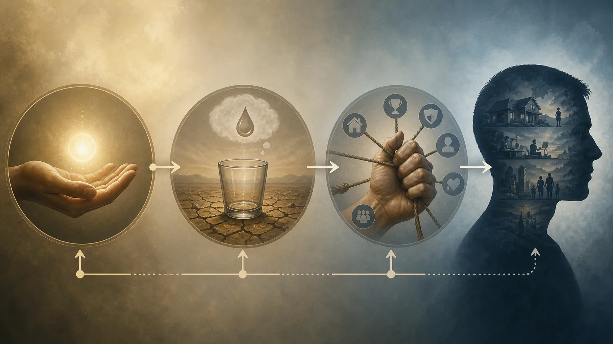
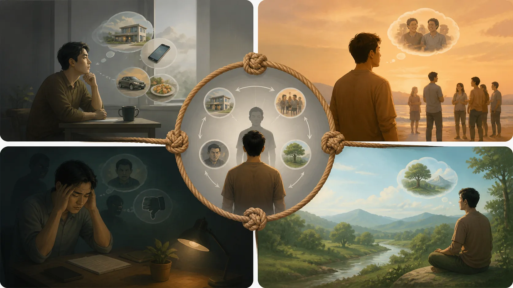

# Ái, Thủ Và Hữu — Cơ Chế Tự Nuôi Của Khổ

## 1. Ba Mắt Xích, Không Phải Ba Từ Đồng Nghĩa

> **Pāli — SN 12.2, đoạn `sn12.2:2.8–2.10`**
> *vedanāpaccayā taṇhā; taṇhāpaccayā upādānaṁ; upādānapaccayā bhavo;*
>
> **Bản dịch làm việc:** “Do thọ làm duyên nên có ái; do ái làm duyên nên có thủ; do thủ làm duyên nên có hữu.”

**Taṇhā — đọc gần đúng “tan-ha” — ái, cơn khát**; **upādāna — “u-pa-đa-na” — thủ, sự bám giữ hoặc chiếm làm căn cứ**; và **bhava — “bha-va” — hữu, tiến trình trở thành hay tồn tại theo văn cảnh** thường bị gộp thành “ham muốn”. Gộp như vậy làm mất cơ chế. Cơn khát hướng về đối tượng chưa phải toàn bộ sự nắm giữ; sự nắm giữ chưa phải toàn bộ tiến trình hiện hữu mà nó làm điều kiện.

[SN 12.2, Vibhaṅga Sutta](https://suttacentral.net/sn12.2) định nghĩa từng chi trong duyên khởi: thọ làm duyên cho ái, ái làm duyên cho thủ, thủ làm duyên cho hữu, hữu làm duyên cho sinh. [DN 15, Mahānidāna Sutta](https://suttacentral.net/dn15) triển khai một mạng phụ thuộc rộng, trong đó ái liên hệ tìm cầu, thu hoạch, quyết định, ham muốn, quyến luyến, chiếm hữu, keo kiệt và phòng vệ; từ phòng vệ có thể sinh xung đột. [MN 148, Chachakka Sutta](https://suttacentral.net/mn148) đặt tiến trình sát kinh nghiệm giác quan: do căn và đối tượng, thức tương ứng sinh; sự gặp của ba là xúc; xúc làm duyên cho thọ; từ thọ có thể sinh ái.

Ba nguồn không nên bị ép thành một sơ đồ duy nhất không còn khác biệt. SN 12.2 cho định nghĩa chuẩn của chuỗi. DN 15 nhấn mạnh tính mạng lưới và hậu quả xã hội của ái. MN 148 cho kính hiển vi trên sáu căn. Đọc cùng nhau cho thấy cơ chế vừa xảy ra trong khoảnh khắc tiếp xúc vừa có thể ổn định thành thói quen, căn tính, tranh chấp và dòng hiện hữu.

“Cơ chế tự nuôi” là ẩn dụ của bài này, không phải câu dịch Pāli. Khi lạc thọ được xem là bảo đảm, ái tìm lặp lại; khi đối tượng thành “của tôi”, thủ bảo vệ; khi sự bảo vệ củng cố kiểu người “tôi là”, hữu cung cấp bối cảnh cho các lần khát tiếp theo. Vòng phản hồi giải thích vì sao chỉ đạt đối tượng không nhất thiết chấm dứt sức ép.

Tuy vậy, giáo lý không cho phép phán rằng mọi người đang chịu đau đều “tự tạo khổ”. Điều kiện vật chất, hành vi của kẻ khác, nghiệp lực theo nghĩa kinh điển và nhiều nguyên nhân ngoài kiểm soát đều cần phân biệt. Phân tích ái–thủ–hữu nhắm đến phần cơ chế có thể được hiểu và tu tập; nó không phải bản án đạo đức dành cho nạn nhân.

## 2. Taṇhā: Cơn Khát Có Ba Hướng

SN 12.2 định nghĩa sáu nhóm ái theo đối tượng: ái đối với sắc, thanh, hương, vị, xúc chạm và pháp. Trong công thức Tứ Đế của SN 56.11, ái được chia theo ba hướng: **kāma-taṇhā**, dục ái; **bhava-taṇhā**, hữu ái; và **vibhava-taṇhā**, phi hữu ái. Hai cách chia trả lời hai câu hỏi khác nhau: ái bám vào miền đối tượng nào, và cơn khát muốn khoái cảm, muốn trở thành hay muốn không còn trở thành ra sao.

Dục ái không chỉ là ham muốn tình dục. **Kāma — “ca-ma” — dục lạc giác quan hoặc đối tượng dục theo văn cảnh** bao gồm sự thèm sắc, tiếng, mùi, vị và xúc dễ chịu. Một bữa ăn có thể được thưởng thức mà không cần biến thành cuộc săn không đáy. Điểm cần quan sát là cơn khát đòi lặp, tăng liều, hoặc dùng đối tượng để lấp một căn tính bất an.

Hữu ái là khát được là một ai đó, tiếp tục một trạng thái hoặc xác nhận một bản sắc: người thành công, người đúng, người đặc biệt, người thanh tịnh. Nó không khiến mọi dự án hay cam kết trở thành lỗi. Xây nghề, nuôi con hoặc học Pháp có thể được thúc đẩy bởi nhiều ý định. Taṇhā được nhận qua cách tâm chiếm mục tiêu làm điều kiện giá trị tuyệt đối và co rút khi hình ảnh bị đe dọa.

Phi hữu ái là khát tiêu hủy, thoát bằng xóa bỏ: “tôi phải làm cảm giác này biến mất ngay”, “giá như con người kia không tồn tại”, hoặc ở mức nguy hiểm là muốn chính mình không còn. Nó cho thấy từ bỏ ái không thể được thực hiện bằng cách ghét ái. Cưỡng ép tâm thành trống rỗng có thể chỉ là một dạng cơn khát khác.

Không phải mọi **chanda — ý muốn, dự định hay sự quan tâm** đều đồng nghĩa taṇhā. Kinh điển có ngôn ngữ về mong muốn phát triển thiện pháp và nỗ lực đúng. Tiêu chuẩn thực hành không phải “không muốn gì”, mà là xem động lực bắt rễ ở tham–sân–si hay ở hiểu biết, không hại và xuất ly. Một người muốn rời quan hệ bạo lực không nên bị bảo rằng mong muốn ấy là ái phải dập tắt.

MN 148 đặc biệt hữu ích vì đặt ái sau thọ. **Vedanā — “vê-đa-na” — cảm thọ, sắc thái lạc, khổ hoặc trung tính** không phải cảm xúc phức tạp. Khi không hiểu, lạc thọ dễ kéo theo muốn thêm; khổ thọ kéo theo muốn tống khứ; trung tính kéo theo tìm kích thích. Nhưng “làm duyên” không có nghĩa định mệnh: nơi có niệm và thấy đúng, thọ có thể được biết mà chuỗi không được tiếp nhiên liệu theo lối cũ.

## 3. Upādāna: Khi Khát Thành Chiếm Hữu Và Căn Tính

> **Pāli — SN 12.2, đoạn `sn12.2:6.1–6.4`**
> *Katamañca, bhikkhave, upādānaṁ? Cattārimāni, bhikkhave, upādānāni— kāmupādānaṁ, diṭṭhupādānaṁ, sīlabbatupādānaṁ, attavādupādānaṁ. Idaṁ vuccati, bhikkhave, upādānaṁ.*
>
> **Bản dịch làm việc:** “Này các tỳ-kheo, thủ là gì? Có bốn loại thủ: dục thủ, kiến thủ, giới cấm thủ và ngã luận thủ. Này các tỳ-kheo, đó được gọi là thủ.”

SN 12.2 nêu bốn loại thủ: dục thủ, kiến thủ, giới cấm thủ và ngã luận thủ. Thủ vì vậy rộng hơn việc bám một món đồ. Nó có thể nắm khoái lạc, một quan điểm, một nghi thức được xem là cứu cánh tự động, hoặc một học thuyết về tự ngã. Điểm chung là sự gia cố: điều được muốn trở thành chỗ dựa phải bảo vệ.

**Diṭṭhi — “đít-thi” — kiến, quan điểm hoặc cách thấy** không tự động xấu; Bát Chánh Đạo bắt đầu bằng chánh kiến. Kiến thủ là quan điểm bị nắm theo cách nuôi đồng nhất và tranh chấp. Ta không còn chỉ xét “mệnh đề này đúng đến đâu”, mà cảm thấy “nếu mệnh đề bị sửa, tôi bị tiêu diệt”. DN 15 nối chiếm hữu và phòng vệ với tranh luận, xung đột, bạo lực; đây là chiều xã hội quan trọng của thủ.

Giới cấm thủ không nên bị giản lược thành “mọi nghi lễ đều mê tín”. Vấn đề là nắm quy tắc và nghi thức như phương tiện tự đủ để thanh tịnh, tách khỏi hiểu biết và chuyển hóa. Giữ giới đúng hướng không phải giới cấm thủ; ngược lại, dùng việc tuân thủ để dựng căn tính cao hơn người khác có thể biến phương tiện thành chỗ bám.

Ngã luận thủ là nắm các học thuyết về cái tôi. Nó có thể thô như tuyên bố một linh hồn bất biến, hoặc tinh tế như lấy trạng thái thiền, vai trò đạo đức hay câu chuyện tổn thương làm bản chất cố định. Điều này không phủ nhận tính liên tục quy ước, hồ sơ pháp lý hoặc ký ức. Nó thẩm tra bước từ “đang có quá trình này” sang “đây là bản thể thật của tôi và phải được duy trì”.

Gọi upādāna là “ái tăng cường” là diễn giải làm việc hữu ích, nhưng không nên coi hai chi chỉ khác nhau về lượng. Định nghĩa kinh điển phân biệt đối tượng và chức năng. Taṇhā khát và tìm; upādāna lấy, giữ, dựng vị trí. Trong một cuộc tranh luận, muốn được công nhận có thể là ái; xem học thuyết là “phe của tôi” và tấn công mọi sửa đổi cho thấy thủ.

Thủ cũng có thể bám vào việc “buông”. Một người dựng hình ảnh mình không sở hữu gì, khinh người có gia đình hoặc tài sản, rồi bảo vệ hình ảnh ấy. Vì thế, phép thử không chỉ nhìn bề ngoài từ bỏ. Hãy hỏi điều gì xảy ra khi đối tượng, vai trò hay phương pháp bị thay đổi: có khả năng xem xét lại không, hay toàn hệ căn tính lập tức huy động phòng vệ?

## 4. Bhava: “Hữu” Phải Được Dịch Theo Văn Cảnh

SN 12.2 định nghĩa ba loại hữu: dục hữu, sắc hữu và vô sắc hữu. Trong ngôn ngữ vũ trụ học và tái sinh, chúng chỉ các miền hay phương thức hiện hữu. Do đó dịch bhava chỉ là “thói quen tâm lý” sẽ làm nghèo nguồn. Nhưng dịch cứng mọi lần thành một kiếp sống hoàn chỉnh cũng có thể che chức năng tiến trình của từ “trở thành”.

Trong chuỗi duyên khởi, thủ làm duyên cho hữu và hữu làm duyên cho sinh. Các truyền thống Theravāda hậu kỳ thường diễn giải chuỗi qua ba đời: vô minh và hành thuộc quá khứ, một số chi thuộc hiện tại, sinh–già–chết thuộc tương lai; đồng thời các truyền thống giảng dạy hiện đại có thể nhấn mạnh tiến trình có thể quan sát ngay trong kinh nghiệm. Cách chia ba đời phải được gắn nhãn chú giải, không đặt vào miệng SN 12.2 như câu giải thích nguyên văn.

Bhikkhu Bodhi trình bày bhava với cả phương diện nghiệp tạo sinh và phương diện hiện hữu phát sinh, dựa trên truyền thống Theravāda. Bhikkhu Anālayo lưu ý khi nghiên cứu duyên khởi rằng các công thức cần được đọc trong nhiều văn cảnh kinh sớm, tránh biến một mô hình diễn giải thành độc quyền. Sue Hamilton, qua nghiên cứu năm uẩn và kinh nghiệm, giúp thấy ngôn ngữ tiến trình không nhất thiết là một tuyên bố giản đơn về “con người chỉ là tâm lý”. Đây là các quan điểm học thuật có tên, không phải đồng thuận vô danh.

Ở cấp quan sát hiện tại, có thể nói thận trọng về “trở thành một căn tính”. Khi bị phê bình, ái muốn phục hồi vị thế; thủ nắm quan điểm “tôi là người đúng”; một phương thức hữu hình thành, trong đó nhận thức, lời nói và lựa chọn được tổ chức quanh vai trò người bị xúc phạm. Đây là phép ứng dụng cục bộ, không chứng minh rằng bhava kinh điển chỉ có nghĩa ấy hoặc rằng tái sinh đã được giải quyết bằng tâm lý học.

Ở cấp đạo đức, hữu giải thích sức bền của khuôn hành vi. Mỗi lần phòng vệ cho căn tính, ta tạo điều kiện để lần phản ứng sau dễ hơn. Nhưng không nên biến mô tả thành định mệnh cơ học. Chuỗi duyên khởi là phụ thuộc điều kiện; khi điều kiện đổi, kết quả có thể đổi. Giới, niệm, định và tuệ đưa các điều kiện mới vào hệ.

Giữ nhiều thang đo giúp tránh hai lỗi đối nghịch: siêu hình hóa mọi khoảnh khắc thành truyện ba đời đã chốt, hoặc hiện đại hóa mọi thuật ngữ thành ngôn ngữ tự trợ giúp. Bài này dùng “hữu/trở thành” tùy câu, luôn nói rõ đang ở văn cảnh kinh điển, chú giải hay ứng dụng hiện đại.

## 5. Xúc, Thọ Và Điểm Có Thể Học Không Tiếp Nhiên Liệu

> **Pāli — MN 148, đoạn `mn148:8.3–8.8`**
> *Cakkhuñca paṭicca rūpe ca uppajjati cakkhuviññāṇaṁ, tiṇṇaṁ saṅgati phasso, phassapaccayā vedanā; sotañca paṭicca sadde ca uppajjati sotaviññāṇaṁ, tiṇṇaṁ saṅgati phasso, phassapaccayā vedanā; ghānañca paṭicca gandhe ca uppajjati ghānaviññāṇaṁ, tiṇṇaṁ saṅgati phasso, phassapaccayā vedanā; jivhañca paṭicca rase ca uppajjati jivhāviññāṇaṁ, tiṇṇaṁ saṅgati phasso, phassapaccayā vedanā; kāyañca paṭicca phoṭṭhabbe ca uppajjati kāyaviññāṇaṁ, tiṇṇaṁ saṅgati phasso, phassapaccayā vedanā; manañca paṭicca dhamme ca uppajjati manoviññāṇaṁ, tiṇṇaṁ saṅgati phasso, phassapaccayā vedanā.*
>
> **Bản dịch làm việc:** “Do mắt và sắc, nhãn thức sinh; sự gặp nhau của ba là xúc; do xúc có thọ. Do tai và âm thanh, nhĩ thức sinh; sự gặp nhau của ba là xúc; do xúc có thọ. Do mũi và mùi, tỷ thức sinh; sự gặp nhau của ba là xúc; do xúc có thọ. Do lưỡi và vị, thiệt thức sinh; sự gặp nhau của ba là xúc; do xúc có thọ. Do thân và vật được chạm, thân thức sinh; sự gặp nhau của ba là xúc; do xúc có thọ. Do ý và pháp, ý thức sinh; sự gặp nhau của ba là xúc; do xúc có thọ.”

MN 148 mô tả sáu bộ sáu: sáu căn, sáu đối tượng, sáu thức, sáu xúc, sáu thọ và sáu ái. **Phassa — “phát-sa” — xúc, sự gặp nhau có điều kiện của căn, đối tượng và thức tương ứng** làm duyên cho thọ. Cấu trúc này kéo việc tu tập khỏi những khẩu hiệu lớn về “ham muốn” và đặt nó tại một âm thanh vừa nghe, một hình ảnh vừa thấy, một ý nghĩ vừa xuất hiện.

Thọ không phải lỗi. Lạc thọ không cần bị phạt; khổ thọ không phải thất bại; thọ trung tính không chứng tỏ vô minh. Vấn đề là khuynh hướng dưới vô minh: chạy theo lạc, chống khổ, bỏ qua trung tính. MN 148 liên hệ sự mê thích và bám với nguồn tăng trưởng của năm thủ uẩn; khi không mê thích, sự bám và khuynh hướng có thể được từ bỏ.

“Điểm can thiệp” là cách nói sư phạm. Nó không có nghĩa một chủ thể đứng ngoài chuỗi và bấm nút tự do tuyệt đối. Niệm, hiểu biết, môi trường an toàn, thói quen đạo đức và hỗ trợ cộng đồng đều là điều kiện. Một người kiệt sức, nghiện chất hoặc đang chịu đe dọa có ít khoảng lựa chọn hơn; nhận điều đó làm thực hành nhân ái và thực tế hơn.

Thử với thông báo trên điện thoại. Xúc xảy ra qua mắt và hình; thọ có thể dễ chịu; ái muốn mở thêm; thủ xuất hiện khi dòng cập nhật thành “thứ tôi không thể thiếu”; hữu củng cố căn tính luôn phải được kết nối. Ta có thể nhận lạc thọ, chờ ba hơi thở và quyết định theo ý hướng đã đặt. Đây là ví dụ hiện đại, không phải bằng chứng MN 148 nói về công nghệ.

Với đau do lời xúc phạm, khổ thọ sinh và phi hữu ái muốn tống người kia hoặc cảm giác đi. Thủ nắm câu chuyện “tôi luôn bị xem thường”; hữu tổ chức phản ứng quanh vai trò ấy. Nhưng nếu lời nói là lạm dụng thực, việc đặt ranh giới vẫn cần. Không tiếp nhiên liệu cho thù hận không đồng nghĩa tiếp tục ở nơi nguy hiểm.

Khả năng không nối thọ thành ái được đào luyện, không phải lời khuyên “hãy chọn khác đi” cho mọi người trong mọi hoàn cảnh. Giới giảm những tình huống gây hối hận; định tăng ổn định; tuệ nhận điều kiện; cộng đồng tạo bảo vệ. Cơ chế có tính cá nhân nhưng không phải chủ nghĩa cá nhân.

## 6. Thực Hành Mà Không Đổ Lỗi Cho Nạn Nhân

Vẽ hai vòng giao nhau. Vòng thứ nhất ghi điều kiện bên ngoài: hành vi của người khác, quyền lực, tiền bạc, sức khỏe, luật lệ, lịch sử. Vòng thứ hai ghi chuỗi có thể quan sát: xúc, thọ, ái, thủ, kiểu trở thành. Ở phần giao, ghi hành động vừa giảm hại bên ngoài vừa không nuôi tham–sân–si: tìm nơi an toàn, nói sự thật có bằng chứng, nhờ hỗ trợ, hoặc trì hoãn phản ứng trả đũa.

Chọn một tình huống vừa sức. Ghi đối tượng và căn liên quan. Gọi đúng thọ là lạc, khổ hay trung tính thay vì lập tức kể cảm xúc phức tạp. Hỏi cơn khát đang hướng tới hưởng, trở thành hay xóa bỏ. Hỏi cái gì đã thành “của tôi”: quan điểm, hình ảnh, nghi thức, khoái cảm. Cuối cùng, mô tả kiểu người hoặc thế giới mà sự nắm ấy đang sản xuất.

Không dùng bài tập giữa cơn hoảng loạn nghiêm trọng nếu nó làm trạng thái xấu hơn. Khi có nguy cơ tự hại, bạo lực hoặc bệnh cấp, ưu tiên trợ giúp chuyên môn và an toàn. Giáo pháp không phải phép thử xem ai đủ mạnh để tự chữa. Tương tự, người hỗ trợ không nên tra hỏi nạn nhân về “ái của bạn” trước khi bảo vệ họ.

Sau khi bản đồ rõ, thay một điều kiện nhỏ: giảm tiếp xúc kích hoạt không cần thiết, đặt ý hướng trước khi mở ứng dụng, gọi tên thọ, nhớ hậu quả của phòng vệ, hoặc trao đổi với người hướng dẫn có đạo đức. Quan sát chuỗi có đổi không. Thành công không phải cảm giác biến mất ngay, mà là ít tự động hơn và hành động ít hại hơn.

Trong quan hệ xã hội, DN 15 gợi một phép kiểm rộng: ái và chiếm hữu đang dẫn tới phòng vệ nào, phòng vệ tới xung đột nào? Điều đó không nói mọi chiến tranh chỉ do tâm tham cá nhân; chính sách, tài nguyên và thể chế vẫn có phân tích riêng. Nhưng nó chỉ ra cách tâm chiếm hữu có thể vận hành qua tập thể và hợp thức hóa bạo lực.

Thực hành đúng làm trách nhiệm tinh tế hơn. Ta không chịu trách nhiệm cho mọi điều xảy đến, nhưng chịu trách nhiệm trong mức có thể cho cách mình nuôi hoặc tháo một chuỗi. Phân biệt hai mệnh đề ấy là hàng rào chống đổ lỗi và chống buông xuôi.

## 7. Kỷ Luật Khẳng Định, Đọc Tiếp Và Nguồn

> [!quote] Văn bản nói gì
> SN 12.2 định nghĩa sáu nhóm ái, bốn loại thủ và ba loại hữu trong chuỗi duyên khởi. DN 15 trình bày mạng điều kiện nối ái, tìm cầu, chiếm hữu, phòng vệ và xung đột. MN 148 đặt xúc–thọ–ái trong sáu miền giác quan và phân biệt sự mê thích với sự từ bỏ mê thích.

> [!info] Truyền thống giải thích gì
> Theravāda chú giải thường phân bố các chi duyên khởi qua ba đời và phân tích bhava thành phương diện nghiệp cùng phương diện tái sinh. Đây là hệ thống giải thích hậu kỳ có ảnh hưởng, không phải cách duy nhất có thể gán nguyên văn cho mọi đoạn Kinh.

> [!example] Bài này suy luận gì
> “Cơ chế tự nuôi”, mô hình căn tính hiện tại và bài tập hai vòng là tổng hợp biên tập để quan sát phản hồi giữa thọ, khát, chiếm hữu và trở thành. Chúng không thu hẹp bhava vào tâm lý học và không thay phân tích nguyên nhân vật chất–xã hội.

> [!warning] Điều chưa chứng minh
> Các nguồn không chứng minh rằng mọi đau khổ do thái độ của nạn nhân, mọi mong muốn là taṇhā, bhava chỉ là một trạng thái tâm hiện tại, hay chuỗi duyên khởi là cơ chế tuyến tính tất định. Chúng cũng không cho phép dùng “buông chấp” để yêu cầu ai ở lại nơi bạo lực.

Đọc trước: [[theravada/06 - Dukkha - Khổ Không Chỉ Là Đau Đớn|Dukkha — Khổ Không Chỉ Là Đau Đớn]]. Đọc tiếp: Năm Uẩn — Con Người Được Lắp Ráp Như Thế Nào. Bài 11 chưa xuất bản nên được giữ dưới dạng chữ thường, không tạo đường dẫn.

**Nguồn kinh điển chính xác**

- [SN 12.2: Vibhaṅga Sutta](https://suttacentral.net/sn12.2), định nghĩa các chi duyên khởi, sáu ái, bốn thủ và ba hữu.
- [DN 15: Mahānidāna Sutta](https://suttacentral.net/dn15), triển khai quan hệ phụ thuộc và chuỗi từ ái, tìm cầu, chiếm hữu đến phòng vệ, xung đột.
- [MN 148: Chachakka Sutta](https://suttacentral.net/mn148), phân tích sáu căn, đối tượng, thức, xúc, thọ và ái.

**Đối chiếu thuật ngữ và nghiên cứu có tên**

- Bhikkhu Bodhi, *The Connected Discourses of the Buddha*, Wisdom Publications, 2000, đối chiếu SN 12.2 và thuật ngữ duyên khởi.
- Bhikkhu Anālayo, *Rebirth in Early Buddhism and Current Research*, Wisdom Publications, 2018, đối chiếu phạm vi tái sinh và cách đọc kinh sớm.
- Sue Hamilton, *Identity and Experience: The Constitution of the Human Being According to Early Buddhism*, Luzac Oriental, 1996, về kinh nghiệm, uẩn và căn tính.
- [SuttaCentral Editions](https://suttacentral.net/editions), thông tin ấn bản, người dịch và giấy phép theo từng tài nguyên.

Pāli làm việc là văn bản Bilara phân đoạn trên SuttaCentral, truy cập ngày 2026-08-18. Các bản dịch của Bhikkhu Sujato, Bhikkhu Bodhi và Maurice Walshe chỉ được dùng để đối chiếu; văn xuôi tiếng Việt và dịch nghĩa ngắn là bản dịch làm việc của redpill.wiki, không sao chép dài bản dịch bên ngoài.
