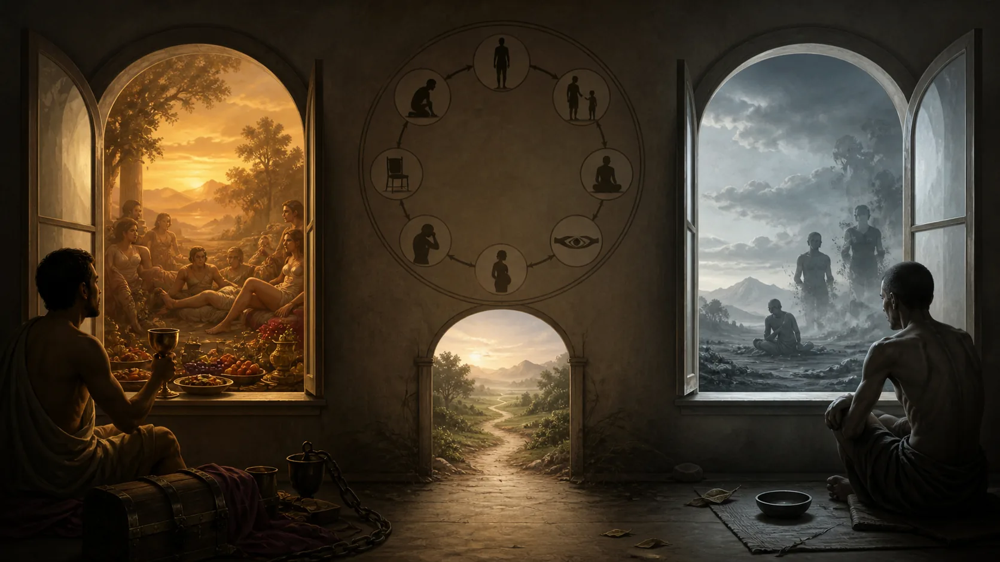
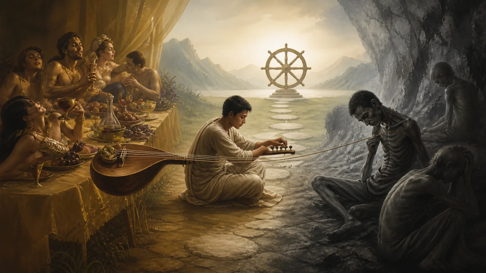

# Trung Đạo — Không Phải Thỏa Hiệp Ở Giữa

## 1. “Ở Giữa” Cái Gì?

**Majjhimā paṭipadā — đọc gần đúng “maj-ji-ma pa-ti-pa-đa” — lối thực hành trung đạo** thường bị biến thành khẩu hiệu “cái gì cũng vừa phải”. Nhưng “trung” trong Kinh không phải tự động chọn điểm số 5 giữa 0 và 10. Nó được xác định bởi những cực cụ thể và bởi mục tiêu chấm dứt dukkha. Có lúc lựa chọn đúng rất dứt khoát: không sát hại, không lừa dối, rời một nơi bạo lực. Không có nghĩa vụ thỏa hiệp giữa đúng và sai chỉ để đứng giữa.

[SN 56.11, Dhammacakkappavattana Sutta](https://suttacentral.net/sn56.11) trình bày Trung đạo trong phạm vi thực hành: tránh hai cực hưởng dục thấp kém và tự hành xác đau đớn, rồi xác định lối giữa là Bát Chánh Đạo. [SN 12.15, Kaccānagotta Sutta](https://suttacentral.net/sn12.15) trình bày một lối thấy không dựa vào hai cực “mọi thứ tồn tại” và “mọi thứ không tồn tại”; Đức Phật giảng Pháp ở giữa qua duyên khởi và duyên diệt.

Hai bài liên hệ nhưng không đồng nhất. Một bài sửa chiến lược sống và tu; bài kia sửa cách thấy thực tại cùng sự sinh–diệt của dukkha. Nếu gộp chúng thành “hãy cân bằng”, ta mất cả Bát Chánh Đạo lẫn duyên khởi. Nếu tách tuyệt đối, ta mất việc cái thấy đúng hướng dẫn thực hành và thực hành làm cái thấy chín.

**Dukkha — “đúc-kha” — khổ, bất toại nguyện, sức ép của điều hữu vi bị chấp thủ** là tiêu chuẩn hướng đích. Một lối không phải “trung” vì dễ chịu, được số đông chấp nhận hay chia đều lợi ích cho hai phe. Nó là trung đạo khi tránh các cực sai chức năng và nuôi con đường đưa đến hiểu, ly tham, đoạn diệt và an tịnh.

Vì vậy, hỏi “ở giữa cái gì?” phải đi trước lời khuyên “hãy trung đạo”. Trong ăn uống, hai cực có thể là buông thả và hành xác. Trong tri kiến SN 12.15, chúng là chấp tồn tại và chấp không tồn tại. Trong một tranh chấp pháp lý, hai bên ý kiến không tự động tạo ra hai cực kinh điển; sự thật có thể nằm hẳn về một phía của bằng chứng.

## 2. SN 56.11: Không Nuôi Dục, Không Hành Xác

> **Pāli — SN 56.11, đoạn `sn56.11:2.3`**
> *Yo cāyaṁ kāmesu kāmasukhallikānuyogo hīno gammo pothujjaniko anariyo anatthasaṁhito, yo cāyaṁ attakilamathānuyogo dukkho anariyo anatthasaṁhito.*
>
> **Bản dịch làm việc:** “Một cực là chuyên hưởng dục lạc: thấp kém, thô tục, phàm phu, không cao quý, không lợi ích; cực kia là chuyên hành hạ bản thân: đau đớn, không cao quý, không lợi ích.”

> **Pāli — SN 56.11, đoạn `sn56.11:2.4`**
> *Ete kho, bhikkhave, ubho ante anupagamma majjhimā paṭipadā tathāgatena abhisambuddhā cakkhukaraṇī ñāṇakaraṇī upasamāya abhiññāya sambodhāya nibbānāya saṁvattati.*
>
> **Bản dịch làm việc:** “Không đi đến hai cực ấy, Như Lai giác ngộ lối trung đạo, làm phát sinh mắt và tri kiến, đưa đến an tịnh, thắng trí, giác ngộ và Nibbāna.”

SN 56.11 nói hai cực mà người xuất gia không nên theo. Cực thứ nhất là đắm mình trong khoái lạc dục, được mô tả là thấp, thô, phàm tục, không cao quý và không dẫn lợi ích. Cực thứ hai là đắm mình trong tự hành xác, đau đớn, không cao quý và không dẫn lợi ích. Sau khi tránh cả hai, Như Lai giác ngộ Trung đạo, tức Bát Chánh Đạo.

**Kāma — “ca-ma” — dục lạc giác quan hoặc đối tượng dục tùy văn cảnh** không có nghĩa mọi cảm giác dễ chịu đều bị cấm. Kinh nói đến lạc không lỗi, hỷ do ly dục và lạc của jhāna. Cực bị bác là lấy hưởng dục làm đường giải thoát, chìm trong nó và giao quyền chỉ huy cho nó. Một bữa ăn đủ nuôi thân khác với dự án dùng vị ngon để lấp cơn khát không đáy.

**Attakilamathānuyoga — đọc gần đúng “át-ta-ki-la-ma-tha-a-nu-yô-ga” — sự chuyên theo hành hạ bản thân** không chỉ là kỷ luật khó. Nhịn một kích thích để bảo vệ tâm có thể lành; ngồi đúng giờ dù không muốn có thể là tinh tấn. Hành xác là làm đau như cứu cánh hoặc tin đau tự nó thanh tịnh. Bối cảnh tiểu sử kinh điển của Đức Phật kể Ngài đã thử khổ hạnh cực đoan và thấy nó không dẫn giác ngộ.

Hai cực có thể nuôi nhau. Sau buông thả, người ta ghê mình và trừng phạt thân; sau ép xác, nhu cầu bật lại thành hưởng thụ. Cả hai giữ cái tôi ở trung tâm: “tôi phải được thỏa mãn” hoặc “tôi phải chinh phục thân”. Trung đạo không chia đôi khẩu phần giữa hai; nó đổi tiêu chuẩn sang Bát Chánh Đạo.

Điều này giải thích vì sao “điều độ” chỉ đôi khi gần nghĩa. Tiết độ ăn là phần huấn luyện; nhưng tiết độ trong nói dối không thành chánh ngữ, và “một chút bạo lực” không thành không hại. Trung đạo có thể bao gồm điều độ khi đối tượng trung tính, nhưng không phải nguyên tắc số học áp cho mọi đạo đức.

SN 56.11 định danh tám chi: chánh kiến, chánh ý hướng, chánh ngữ, chánh nghiệp, chánh mạng, chánh tinh tấn, chánh niệm, chánh định. Chính cấu trúc này, chứ không phải tính cách ôn hòa, làm nội dung Trung đạo thực hành.

## 3. SN 12.15: Không Rơi Vào “Tất Cả Có” Hay “Tất Cả Không”

> **Pāli — SN 12.15, đoạn `sn12.15:2.2`, `sn12.15:2.3`**
> *Lokasamudayaṁ kho, kaccāna, yathābhūtaṁ sammappaññāya passato yā loke natthitā sā na hoti. Lokanirodhaṁ kho, kaccāna, yathābhūtaṁ sammappaññāya passato yā loke atthitā sā na hoti.*
>
> **Bản dịch làm việc:** “Với người thấy sự sinh khởi của thế gian đúng như thật, quan niệm không tồn tại không còn; với người thấy sự đoạn diệt đúng như thật, quan niệm tồn tại không còn.”

SN 12.15 trả lời Kaccānagotta về chánh kiến. Thế gian phần lớn dựa trên một nhị nguyên: **atthitā — “át-thi-ta” — tính tồn tại, quan niệm “có”** và **natthitā — “nát-thi-ta” — tính không tồn tại, quan niệm “không”**. Với người thấy sự sinh khởi của thế gian như nó là bằng chánh tuệ, quan niệm “không tồn tại” không đứng; với người thấy sự đoạn diệt, quan niệm “tồn tại” không đứng.

Bài kinh tiếp tục: phần đông bị trói bởi bám giữ, chấp trước và thiên kiến; người có cái thấy đúng không nắm “tự ngã của tôi”. Họ không nghi rằng điều sinh chỉ là dukkha sinh và điều diệt chỉ là dukkha diệt. Sau đó Đức Phật giảng Pháp ở giữa bằng chuỗi duyên khởi từ vô minh tới già–chết và chiều đoạn diệt khi vô minh đoạn.

**Paṭiccasamuppāda — “pa-tít-cha sa-múp-pa-đa” — duyên khởi, sự sinh khởi tùy thuộc điều kiện** không phải vị trí thứ ba nằm giữa hai học thuyết như một thỏa thuận. Nó đổi ngữ pháp của câu hỏi: thay vì hỏi một vật “thật sự có hay hoàn toàn không”, ta khảo sát cái gì sinh khi có điều kiện nào và diệt khi điều kiện nào không còn.

Điều này không có nghĩa đồ vật quy ước không tồn tại. Ghế vẫn đỡ người; hợp đồng vẫn có hậu quả; hành động vẫn có quả. Trung đạo không phải phủ nhận thực tại thường nghiệm. Nó tránh biến hiện tượng có điều kiện thành thực thể tự hữu bất biến, đồng thời tránh kết luận rằng vì không tự hữu nên không có gì, không trách nhiệm và không nhân quả.

SN 12.15 cũng không phải giấy phép cho mọi học thuyết “phi nhị nguyên”. Văn bản có phạm vi rõ: chánh kiến, chấp trước, sự sinh–diệt của dukkha và chuỗi duyên khởi. Gắn nó với ý thức vũ trụ, vật lý lượng tử hoặc nhất thể luận cần luận cứ khác; bài kinh tự nó không chứng minh các hệ ấy.

Bhikkhu Bodhi đọc bài trong mạch Nidāna Saṃyutta và nhấn mạnh duyên khởi tránh thường kiến cùng đoạn kiến. Bhikkhu Anālayo, qua nghiên cứu so sánh kinh sớm, cho thấy giá trị của việc giữ ngữ cảnh thay vì kéo một công thức sang mọi siêu hình học. Nāṇavīra Thera đưa ra cách đọc hiện sinh có ảnh hưởng nhưng gây tranh luận; nó nên được gọi đúng tên là một diễn giải hiện đại, không là tiếng nói duy nhất của Theravāda.

## 4. Hai Trung Đạo Gặp Nhau Ở Chánh Kiến Và Con Đường

Trung đạo của SN 56.11 trả lời “tu thế nào”; Trung đạo của SN 12.15 trả lời “thấy thế nào”. Hai câu không tách rời. Người tin một tự ngã phải được nuông chiều có thể nghiêng hưởng dục; người tin thân phải bị tiêu diệt để một bản ngã tinh thần chiến thắng có thể nghiêng hành xác. Thấy các quá trình do điều kiện làm hai dự án ấy mất nền.

Ngược lại, một cái hiểu duyên khởi chỉ nằm trên giấy chưa chắc sửa hành vi. Bát Chánh Đạo đặt chánh kiến cạnh ý hướng, lời, hành động, sinh kế, tinh tấn, niệm và định. Cái thấy được thử trong cách kiếm sống và đáp ứng khoái lạc–đau đớn. Trung đạo không phải chỉ một mệnh đề triết học.

**Magga — “mắc-ga” — con đường** cung cấp tiêu chí thực hành. Một lựa chọn nuôi tham, sân, si nhưng mang vẻ cân bằng không nhờ đó thành trung. Một lựa chọn dứt khoát ngăn sát hại có thể phù hợp con đường dù không “chia đôi”. Từ “chánh” trong tám chi nói đến hướng phù hợp đoạn khổ, không phải phe chính trị tự nhận chính nghĩa.

Duyên khởi cũng bảo vệ con đường khỏi chủ nghĩa ý chí. Ta không chỉ ra lệnh “đừng cực đoan”. Hưởng dục và hành xác có điều kiện: môi trường, thói quen, niềm tin, sang chấn, cộng đồng. Muốn đổi cần thay điều kiện—giới, nhịp sống, bạn lành, cách chú ý, định và hiểu biết. Không có một cái tôi độc lập chỉ cần quyết tâm đủ mạnh.

Hai Trung đạo gặp nhau mà không hòa tan. Ta vẫn phải dẫn SN 56.11 khi nói hai cực thực hành và dẫn SN 12.15 khi nói hữu–vô cùng duyên khởi. Gọi chung “Phật dạy đừng cực đoan” bỏ mất mã nguồn và phạm vi. Kỷ luật nguồn giữ cho một từ quen không thành chiếc túi chứa mọi điều ta thích.

Theo Rupert Gethin, Bát Chánh Đạo phải được hiểu trong cấu trúc Tứ Đế và mục tiêu giải thoát. Theo Peter Harvey, duyên khởi tránh cả quan niệm tự ngã thường hằng lẫn hư vô đạo đức. Đây là các tổng hợp học thuật có tên; chúng giúp nối hai bài nhưng không chứng minh hai bài ban đầu là một văn bản duy nhất.

## 5. Trung Đạo Không Phải Trung Dung Chính Trị Hay Tương Đối Luận

Trong chính trị, “trung tâm” mô tả vị trí giữa các phe trong một thời điểm. Vị trí ấy đổi khi phổ ý kiến đổi. Majjhimā paṭipadā không được xác định bởi khảo sát dư luận. Nó có nội dung đạo đức và giải thoát cụ thể. Vì vậy không thể viện Trung đạo để mặc nhiên chọn chính sách ở giữa hoặc tránh lên tiếng trước đàn áp.

Trong tranh luận sự thật, hai khẳng định đối lập không bảo đảm đáp án nằm giữa. Nếu một người nói thuốc chứa 10 mg và người kia nói 100 mg, bằng chứng có thể xác nhận một bên, không phải 55 mg. Chánh kiến đòi điều tra nguồn và hậu quả. “Mỗi bên đúng một nửa” có thể là lười nhận thức chứ không trung đạo.

Trung đạo cũng không phải tương đối luận “không có đúng sai”. Bát Chánh Đạo phân biệt chánh và tà; giới phân biệt hành vi hại; duyên khởi bảo toàn quan hệ điều kiện và hậu quả. Tránh chấp quan điểm không đồng nghĩa mọi quan điểm ngang nhau. Có thể giữ một kết luận mạnh mà vẫn sẵn sàng sửa theo bằng chứng và không dựng tự ngã quanh nó.

Trong quan hệ, “gặp nhau ở giữa” đôi khi công bằng, nhưng không khi một bên bạo lực. Yêu cầu nạn nhân chịu “một nửa” sự lạm dụng để tỏ trung đạo là đảo đạo đức. Lối phù hợp có thể là rời đi, đặt ranh giới tuyệt đối và tìm bảo vệ. Không hại không bắt người bị hại dung hòa với hại.

Trong tu tập, trung đạo không đồng nghĩa thoải mái. Từ bỏ nghiện có thể rất khó; giữ giới khi nghề thưởng cho gian dối có thể tốn giá; ngồi với tâm không chạy theo dục có thể khó chịu. Tiêu chí không phải tránh mọi đau mà tránh đau vô ích do hành xác và phát triển nỗ lực đúng có lợi cho giải thoát.

Ngược lại, khắc khổ không tự chứng minh chiều sâu. Thiếu ngủ, bỏ ăn và chịu nhục từ giáo viên có thể làm khả năng phán đoán suy giảm. Truyền thống cần đánh giá phương pháp bằng giới, chánh kiến, hậu quả và sự giảm tham–sân–si, không bằng mức đau mà người học chịu được.

## 6. Bản Đồ Thực Hành: Xác Định Cực, Điều Kiện Và Hướng Đi

Khi muốn dùng “Trung đạo”, viết rõ hai cực. Đừng ghi chung “quá nhiều/quá ít”. Ví dụ với công việc: cực hưởng dục có thể là chạy theo tiền và danh bất chấp hại; cực hành xác có thể là làm kiệt sức để chứng minh giá trị. Sau đó hỏi Bát Chánh Đạo chỉ gì về sinh kế, ý hướng, tinh tấn và niệm. Kết quả có thể không phải số giờ chính giữa, mà là đổi loại công việc hoặc cách đặt ranh.

Với một quan điểm về bản thân, xác định hai chấp: “tôi là bản chất cố định này” và “không có gì liên tục nên hành động không quan trọng”. Sau đó lập mạng điều kiện: thân, ký ức, quan hệ, lựa chọn và hậu quả đang cùng tạo câu chuyện thế nào? Quan sát cái gì sinh khi điều kiện có và đổi khi điều kiện đổi. Đây là áp dụng lấy cảm hứng từ SN 12.15, không phải dịch nguyên văn.

Thêm phép kiểm không hại. Lựa chọn có giảm hay tăng sát hại, lừa dối, bóc lột và nghiện? Thêm phép kiểm dukkha: nó giúp hiểu và tháo ái, hay chỉ làm cực đoan kín đáo hơn? Thêm phép kiểm nguồn: hai cực này thật sự từ bài kinh nào hay do ta tự đặt? Ba phép kiểm ngăn “trung đạo” thành nhãn hợp thức hóa sở thích.

Ví dụ với ăn uống, buông thả và hành xác là cặp phù hợp. Một kế hoạch đủ dinh dưỡng, biết thọ và không dùng thức ăn làm hình phạt có thể đúng hướng. Nhưng bệnh chuyển hóa hoặc rối loạn ăn uống cần chuyên môn; không rút phác đồ y khoa trực tiếp từ một nguyên lý tôn giáo.

Ví dụ với bất đồng, hai cực kinh điển không nhất thiết là “phe tôi/phe họ”. Cực thực tế có thể là bám quan điểm như căn tính và rơi vào hư vô “chẳng có sự thật”. Trung đạo là kiểm tra bằng chứng, giữ trách nhiệm và không nắm kết luận thành tự ngã. Có thể kết luận phe kia sai mà không nuôi thù hận.

Sau một tuần, xem lựa chọn có làm tâm bớt dao động giữa nuông chiều và trừng phạt không; có tăng khả năng thấy điều kiện không; có khiến hành vi thật và ít hại hơn không. Nếu “cân bằng” chỉ giữ nguyên thói quen, cần trở lại nội dung tám chi thay vì tiếp tục tối ưu sự dễ chịu.

## 7. Kỷ Luật Khẳng Định, Đọc Tiếp Và Nguồn

> [!quote] Văn bản nói gì
> SN 56.11 tránh hưởng dục và tự hành xác, rồi xác định Trung đạo là Bát Chánh Đạo. SN 12.15 tránh hai chấp “tồn tại” và “không tồn tại”, không nắm tự ngã, và giảng Pháp ở giữa bằng sự sinh khởi cùng đoạn diệt có điều kiện của dukkha.

> [!info] Truyền thống giải thích gì
> Theravāda thường nối Trung đạo với tránh thường kiến–đoạn kiến và dùng duyên khởi để bảo toàn nhân quả mà không đặt một tự ngã bất biến. Các chú giải và giáo thọ triển khai nhiều ứng dụng, nhưng phải phân biệt với hai phạm vi kinh điển cụ thể.

> [!example] Bài này suy luận gì
> Bản đồ “xác định cực–điều kiện–hướng đi” và các ví dụ công việc, quan điểm, ăn uống là tổng hợp hiện đại. Bài suy luận rằng hai Trung đạo gặp nhau qua chánh kiến và con đường nhưng không phải cùng một công thức văn bản.

> [!warning] Điều chưa chứng minh
> Hai bài kinh không chứng minh “mọi thứ nên vừa phải”, trung dung chính trị luôn đúng, hai phe luôn đúng một nửa, hay không có chân lý đạo đức. SN 12.15 cũng không chứng minh ý thức vũ trụ, vật lý hiện đại hoặc một học thuyết phi nhị nguyên bất kỳ.

Đọc trước: [[theravada/05 - Tứ Thánh Đế - Chẩn Đoán, Nguyên Nhân, Khả Năng Chữa Và Con Đường|Tứ Thánh Đế — Chẩn Đoán, Nguyên Nhân, Khả Năng Chữa Và Con Đường]]. Đọc tiếp: Năm Uẩn — Con Người Được Lắp Ráp Như Thế Nào. Bài 11 chưa xuất bản nên được giữ dưới dạng chữ thường, không tạo đường dẫn.

**Nguồn kinh điển chính xác**

- [SN 56.11: Dhammacakkappavattana Sutta](https://suttacentral.net/sn56.11), nguồn cho hai cực thực hành và Bát Chánh Đạo như Trung đạo.
- [SN 12.15: Kaccānagotta Sutta](https://suttacentral.net/sn12.15), nguồn cho hai cực tồn tại–không tồn tại và Pháp ở giữa qua duyên khởi.

**Đối chiếu thuật ngữ và nghiên cứu có tên**

- Rupert Gethin, *The Foundations of Buddhism*, Oxford University Press, 1998, về Tứ Đế, Trung đạo và con đường.
- Peter Harvey, *An Introduction to Buddhism: Teachings, History and Practices*, Cambridge University Press, 2013, về duyên khởi, thường kiến và đoạn kiến.
- Bhikkhu Bodhi, *The Connected Discourses of the Buddha*, Wisdom Publications, 2000, đối chiếu SN 12.15 và SN 56.11.
- Bhikkhu Anālayo, *The Dawn of Abhidharma*, Hamburg Buddhist Studies, 2014, dùng để giữ ranh giới giữa công thức kinh sớm và hệ thống hóa về sau.
- [SuttaCentral Editions](https://suttacentral.net/editions), thông tin ấn bản, người dịch và giấy phép theo từng tài nguyên.

Pāli làm việc là văn bản Bilara phân đoạn trên SuttaCentral, truy cập ngày 2026-08-18. Các bản dịch của Bhikkhu Sujato, Bhikkhu Bodhi và Ṭhānissaro Bhikkhu chỉ dùng để đối chiếu. Toàn bộ văn xuôi tiếng Việt và dịch nghĩa ngắn là bản dịch làm việc của redpill.wiki; không sao chép dài bản dịch bên ngoài.
