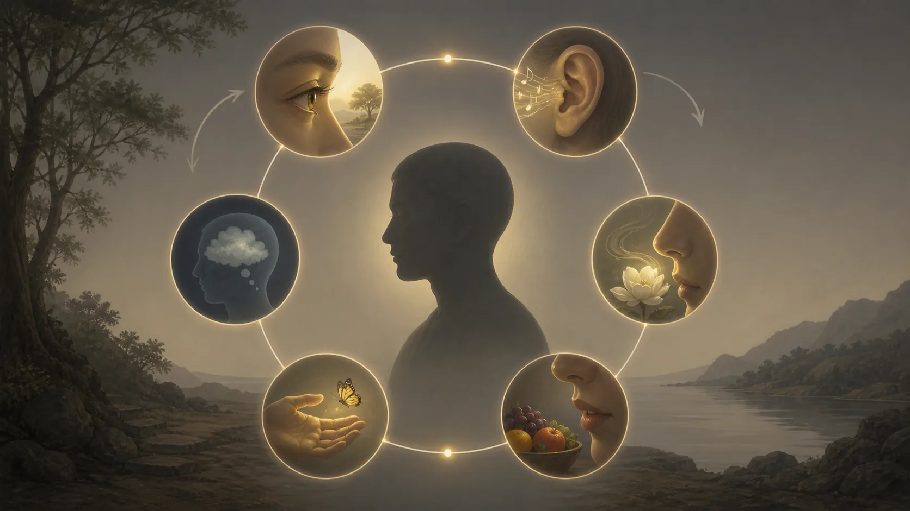

# Năm Uẩn — Con Người Được Lắp Ráp Như Thế Nào

## 1. Một Bản Đồ Kinh Nghiệm, Không Phải Năm Chất

> **Pāli — SN 22.59, đoạn `sn22.59:2.1–2.5`**
> *“Rūpaṁ, bhikkhave, anattā. Rūpañca hidaṁ, bhikkhave, attā abhavissa, nayidaṁ rūpaṁ ābādhāya saṁvatteyya, labbhetha ca rūpe: ‘evaṁ me rūpaṁ hotu, evaṁ me rūpaṁ mā ahosī’ti. Yasmā ca kho, bhikkhave, rūpaṁ anattā, tasmā rūpaṁ ābādhāya saṁvattati, na ca labbhati rūpe: ‘evaṁ me rūpaṁ hotu, evaṁ me rūpaṁ mā ahosī’ti.*
>
> **Bản dịch làm việc:** “Này các tỳ-kheo, sắc là vô ngã. Nếu sắc là tự ngã thì sắc đã không dẫn đến khổ não, và đối với sắc người ta có thể khiến: ‘Sắc của tôi hãy như thế này; sắc của tôi đừng như thế kia.’ Nhưng vì sắc là vô ngã nên sắc dẫn đến khổ não, và không thể khiến sắc theo ý như vậy.”

**Khandha — đọc gần đúng “khan-đa” — uẩn, nhóm hay khối tập hợp** là cách Kinh Pāli gom những gì ta thường nhận làm “tôi” và “của tôi” thành năm phạm vi để khảo sát. Năm phạm vi ấy là **rūpa** (sắc), **vedanā** (thọ), **saññā** (tưởng), **saṅkhāra** (hành) và **viññāṇa** (thức). Chúng không phải năm viên gạch bí mật, năm tầng năng lượng hay năm chất nằm cạnh nhau bên trong một con người. “Uẩn” là công cụ phân tích kinh nghiệm đang đổi thay.

[SN 22.59, Anattalakkhaṇa Sutta](https://suttacentral.net/sn22.59) lần lượt hỏi về từng uẩn: nó thường còn hay vô thường; cái vô thường là dễ chịu hay chịu sức ép; cái vô thường, dukkha và biến đổi có thích hợp để xem “đây là của tôi, đây là tôi, đây là tự ngã của tôi” không. Cấu trúc lặp lại khiến người đọc quan sát thay vì xây một học thuyết vật chất về con người.

[SN 22.95, Pheṇapiṇḍūpama Sutta](https://suttacentral.net/sn22.95) dùng năm ví dụ: sắc như khối bọt, thọ như bong bóng nước, tưởng như ảo ảnh, hành như thân cây chuối không lõi gỗ và thức như trò huyễn. Các ví dụ nói về tính rỗng lõi bền chắc khi được xem xét kỹ. Chúng không nói rằng không có kinh nghiệm, thân không đau, hay hành động không gây hậu quả.

Cụm quan trọng hơn “năm uẩn” trong Tứ Thánh Đế là **pañcupādānakkhandhā**, năm uẩn bị chấp thủ. **Upādāna — “u-pa-đa-na” — thủ, nắm lấy, chiếm hữu hoặc lấy làm nền bản sắc** cho thấy vấn đề không phải năm nhóm là tội lỗi. Vấn đề phát sinh khi những gì có điều kiện bị giao nhiệm vụ làm một cái tôi ổn định và thuộc quyền tuyệt đối.

“Con người được lắp ráp” trong tiêu đề vì thế là ẩn dụ biên tập. Không có người thợ đứng ngoài ghép năm vật liệu. Một đời sống hiện ra qua thân, sắc thái cảm giác, nhận dạng, khuynh hướng tạo tác và nhận biết; các phạm vi này tùy thuộc nhau và thay đổi. Bản đồ giúp tháo câu “tôi đang như vậy” thành những tiến trình có thể quan sát, nhưng không phủ nhận con người quy ước, phẩm giá hay trách nhiệm.

## 2. Sắc Và Thọ: Thân Không Phải Vật Sở Hữu Tuyệt Đối

**Rūpa — “ru-pa” — sắc, phương diện thân thể hay vật chất** không chỉ có nghĩa “hình ảnh”. Trong công thức thường gặp, sắc được trình bày qua bốn đại và sắc do bốn đại tạo. Ở cấp đọc thực hành, đó là thân có nhiệt, độ cứng, chuyển động, kết dính; là mắt tai mũi lưỡi thân; là điều bị đói, bệnh, già và cần chăm sóc. Gọi thân là sắc uẩn không làm nó giả. Trái lại, nó buộc ta thấy thân cụ thể và điều kiện của thân.

SN 22.59 dùng tiêu chí quyền điều khiển: nếu sắc là tự ngã theo nghĩa một chủ thể làm chủ tuyệt đối, ta có thể ra lệnh “thân tôi hãy thế này, đừng thế kia”. Ta có ảnh hưởng tương đối qua dinh dưỡng, luyện tập, thuốc và nghỉ ngơi; nhưng không có chủ quyền tối hậu trước lão hóa, tai nạn hay bệnh. Lập luận không khuyến khích bỏ chăm sóc. Chính vì thân tùy điều kiện, thay điều kiện là hành động có ý nghĩa.

Ví dụ bọt trong SN 22.95 cũng có phạm vi. Nhìn từ xa, khối bọt có hình và gây ấn tượng về một vật đặc; nhìn kỹ, nó là vô số màng nước sinh rồi vỡ. Tương tự, thân có tính liên tục quy ước nhưng không có lõi bất biến nằm ngoài thành phần và điều kiện. Bọt vẫn ướt; thân vẫn có thể bị thương. Ví dụ không cho phép xem nhẹ đau đớn của mình hay người khác.

> **Pāli — SN 22.59, đoạn `sn22.59:3.1`, `sn22.59:4.1–4.2`, `sn22.59:5.1`**
> *Vedanā anattā. … Saññā anattā …pe… saṅkhārā anattā. … Viññāṇaṁ anattā.*
>
> **Bản dịch làm việc:** “Thọ là vô ngã. Tưởng là vô ngã… các hành là vô ngã. Thức là vô ngã.”

**Vedanā — “vê-đa-na” — cảm thọ, sắc thái dễ chịu, khó chịu hoặc trung tính** không đồng nghĩa toàn bộ “cảm xúc”. Một cơn giận có thể gồm khó chịu, nhận dạng một lời là xúc phạm, ý muốn phản công, ký ức và các phản ứng thân. Vedanā chỉ nhấn vào chiều vị: kinh nghiệm đang được nếm là lạc, khổ hay không-lạc-không-khổ. Dịch nó thành toàn bộ cảm xúc sẽ làm mất chính điểm can thiệp tinh tế của các bài sau.

Thọ như bong bóng do giọt mưa nổi lên rồi vỡ. Một cảm giác có thể mãnh liệt mà vẫn ngắn và tùy xúc. “Ngắn” không có nghĩa dễ chịu; đau kéo dài có thể gồm nhiều biến chuyển liên tục. Quan sát thọ là nhận ra sắc thái trước khi câu chuyện sở hữu hoàn chỉnh: dễ chịu không bắt buộc phải nắm, khó chịu không bắt buộc phải ghét, trung tính không bắt buộc phải lơ đãng.

Sắc và thọ cho thấy hai sai lầm đối nghịch. Một bên coi thân và cảm giác là “tôi” tuyệt đối; bên kia coi chúng không quan trọng vì “vô ngã”. Kinh không trao giấy phép cho bên nào. Chăm thân, giảm đau và tôn trọng giới hạn là đáp ứng khéo với pháp có điều kiện; chỉ cần không đòi nó trở thành tài sản vĩnh viễn.

## 3. Tưởng Và Hành: Nhận Ra, Đặt Dấu Và Tạo Hướng

**Saññā — “san-nha” — tưởng, sự nhận dạng, ghi dấu hay tri giác phân loại** giúp ta nhận ra màu, tiếng, gương mặt, từ ngữ và mẫu quen. “Tưởng” trong tiếng Việt dễ bị hiểu chỉ là tưởng tượng sai. Nhưng saññā cũng vận hành khi ta nhận đúng chiếc cốc, nhớ đường hoặc nhận diện một giọng nói. Nó tạo khả năng sống trong một thế giới có tên, đồng thời có thể đóng dấu quá nhanh.

Ảo ảnh của SN 22.95 không hàm ý mọi nhận thức đều dối. Người khát nhìn ánh rung và tưởng nước minh họa khoảng cách giữa dấu hiệu với vật được gán. Ta thường gặp một nét mặt rồi nhận thành “họ khinh tôi”, nghe sự im lặng rồi nhận thành “tôi bị bỏ”. Có khi đúng, có khi sai; saññā cần được kiểm tra bằng văn cảnh và bằng chứng. Cái không đáng tin tuyệt đối vẫn có chức năng quy ước.

**Saṅkhāra — “sang-kha-ra” — hành, tạo tác hoặc yếu tố tạo điều kiện tùy văn cảnh** là từ khó nhất trong năm. Ở vị trí hành uẩn, nó bao quát các tạo tác tâm, đặc biệt những ý hướng, khuynh hướng và phản ứng tạo hình kinh nghiệm. Ở công thức khác, saṅkhāra có thể chỉ rộng hơn mọi pháp hữu vi. Không nên lấy nghĩa từ một câu rồi áp máy móc cho mọi câu.

Ví dụ thân cây chuối nói đến việc bóc hết lớp bẹ mà không tìm thấy lõi gỗ cứng. Hành uẩn cũng gồm nhiều xu hướng, lựa chọn, chú ý và phản ứng nương điều kiện, không phải một “ý chí” đơn nhất ngồi trong đầu. Tuy nhiên, không có lõi cứng không xóa tác ý. Một thói quen được tạo nhiều lần có sức mạnh; một phản ứng có hậu quả; việc huấn luyện điều kiện mới có thể đổi hướng.

Hãy xét một thư điện tử ngắn. Sắc gồm thân đang mệt và chữ trên màn hình; thọ là khó chịu; tưởng nhận dạng giọng điệu như lạnh lùng; hành thúc viết lời phòng vệ; thức nhận biết đối tượng qua mắt và ý. Sự phân tích này không tuyên bố năm sự kiện diễn ra như năm toa tàu tách biệt. Nó chỉ tăng độ phân giải để ta thấy “tôi bị xúc phạm” được tạo bởi nhiều chức năng.

Khi thấy vậy, hành động đạo đức có khoảng trống. Ta có thể kiểm tra lại saññā, nhận thọ, chờ thân bớt căng và không nuôi tạo tác trả đũa. Đây là ứng dụng tổng hợp từ bản đồ uẩn, không phải quy trình nguyên văn trong hai bài kinh. Tiêu chí là nó làm giảm tham, sân, si và tăng khả năng đáp ứng thật, không phải khiến người thực hành phân tích đến tê liệt.

## 4. Thức Là Nhận Biết Phân Biệt, Không Phải Người Quan Sát Vĩnh Cửu

> **Pāli — SN 22.95, đoạn `sn22.95:9.1–9.5`**
> *“Pheṇapiṇḍūpamaṁ rūpaṁ, vedanā bubbuḷūpamā; Marīcikūpamā saññā, saṅkhārā kadalūpamā; Māyūpamañca viññāṇaṁ,*
>
> **Bản dịch làm việc:** “Sắc được ví như khối bọt, thọ như bong bóng nước; tưởng như ảo ảnh, các hành như thân cây chuối, và thức như trò huyễn.”

**Viññāṇa — “vin-nha-na” — thức, sự nhận biết phân biệt** là uẩn thứ năm. Trong nhiều bài kinh, thức được nói theo sáu loại: nhãn thức, nhĩ thức, tỷ thức, thiệt thức, thân thức và ý thức. Tên của nó gắn với căn và đối tượng liên hệ. Cách trình bày ấy không thuận với việc biến thức thành một người quan sát thuần túy, thường hằng, đứng ngoài mọi điều kiện.

Trò huyễn trong SN 22.95 gây ấn tượng về một vật có thật nơi chỉ có thao tác và điều kiện. Ví dụ mời khảo sát thức để tìm cái gì bền chắc, có thể sở hữu và điều khiển; nó không bảo nhận biết hoàn toàn không xảy ra. Khi mắt, hình sắc và các điều kiện thích hợp gặp nhau, nhãn thức hiện hành; khi điều kiện đổi, kiểu nhận biết đổi. Bài 14 sẽ khảo sát kỹ sự sinh khởi tùy thuộc này.

Một lỗi tinh tế là chấp bốn uẩn đầu nhưng giữ thức làm “chân ngã”: thân đổi, thọ đổi, tưởng sai, hành biến, song “người biết” phía sau chắc phải bất biến. SN 22.59 không tạo ngoại lệ. Cùng phép hỏi được áp cho viññāṇa: vô thường, chịu đổi và không thích hợp nhận là tôi hay tự ngã của tôi. Đặt một ý thức vũ trụ vào khoảng trống là thêm học thuyết ngoài văn bản.

Lỗi đối diện là nghe thức vô ngã rồi kết luận con người là máy không có lựa chọn. Năm uẩn không phải mô hình vật lý tất định. Kinh giữ tác ý, huấn luyện, trách nhiệm và giải thoát. Những điều đó không cần một linh hồn bất biến; chúng vận hành trong mạng điều kiện. Đừng dùng một bản đồ hướng đến giải thoát để tuyên bố đã giải xong triết học tâm hay cơ chế não.

Trong kinh nghiệm nghe nhạc, nhĩ thức không phải toàn bộ sự kiện. Có âm thanh, tai, thức liên hệ; có thọ dễ chịu, tưởng nhận giai điệu, hành muốn nghe tiếp và thân phản ứng. Ta vẫn nói quy ước “tôi nghe nhạc”. Phân tích uẩn không cấm đại từ; nó ngăn đại từ biến thành bằng chứng về một thực thể sở hữu nằm ngoài tiến trình.

Vì vậy, năm uẩn là năm cửa khảo sát cùng một kinh nghiệm, không phải cuộc thi chọn “uẩn thật nhất”. Không uẩn nào làm chủ bốn uẩn kia. Cũng không cần tìm uẩn thứ sáu bí mật đứng sau. Điều cần thấy là sự sinh, đổi, sức ép khi bị nắm và khả năng không đồng nhất hóa.

## 5. Ba Câu Sở Hữu Và Phạm Vi Của Các Ví Dụ

SN 22.59 lặp công thức phủ định ba cách chấp: “của tôi” là sở hữu; “tôi” là đồng nhất; “tự ngã của tôi” là dựng một chủ thể nền. Ba cách có thể xuất hiện khác nhau. Ta không nhất thiết nghĩ thân chính là linh hồn nhưng vẫn nói “thân phải phục vụ tôi”; không nói cảm giác là tôi nhưng xem trạng thái vui là bằng chứng giá trị của mình.

Quán uẩn không đòi thay mọi câu nói đời thường. “Tay tôi”, “ký ức của tôi” và “tôi chịu trách nhiệm” là quy ước hữu ích. Vấn đề là mức bám khiến sự thay đổi trở thành đe dọa hiện sinh hoặc khiến ta gây hại để bảo vệ hình ảnh. Kinh làm việc ở chỗ chấp thủ, không tổ chức một cuộc thanh lọc ngữ pháp.

Các ví dụ SN 22.95 phải được giữ đúng mục tiêu: tìm tính bền chắc, thực chất có thể nắm. Bọt có hiện tượng nhưng không lõi đặc; bong bóng xuất hiện rồi vỡ; ảo ảnh tùy góc và điều kiện; thân chuối không có lõi gỗ; trò huyễn đánh lừa nhận dạng. Từ đó không suy ra hiện tượng là hư vô. Một trò huyễn có thể làm người xem sợ; một nhận dạng sai có thể dẫn đến bạo lực; một cảm thọ khó chịu vẫn cần lòng bi.

Cũng không nên biến từng ví dụ thành bản thể luận khoa học. Bài kinh không nói sắc “thực chất là bọt lượng tử”, thức là mô phỏng máy tính hay hành là chương trình thần kinh. So sánh hiện đại có thể gợi câu hỏi, nhưng không chứng minh lời Kinh và không thuộc hai văn bản nền. Bài này không dùng chúng làm bằng chứng.

Thấy uẩn rỗng lõi sở hữu có hệ quả tích cực: thân có thể được chăm mà không tôn thờ; thọ có thể được cảm mà không tuân lệnh; tưởng có thể dùng mà vẫn kiểm tra; hành có thể huấn luyện; thức có thể biết mà không biến thành linh hồn. “Không phải tôi” không đồng nghĩa “không đáng quan tâm”. Nó chuyển quan tâm từ chiếm hữu sang chăm sóc có trí.

Khi gặp sang chấn hoặc phân ly, thực hành phủ định mạnh có thể làm bất ổn. Không nên dùng “không có tôi” để ép người đang cần cảm giác an toàn và tính liên tục. Bản đồ uẩn nên đi cùng giới, từ tâm, thân ổn định và hỗ trợ chuyên môn khi cần. Kinh không yêu cầu gây tổn thương để chứng minh mình hiểu vô ngã.

## 6. Thực Hành: Tách Một Phản Ứng Thành Năm Cửa Quan Sát

Chọn một tình huống cường độ vừa: chờ phản hồi, bị chen hàng, nhận lời khen. Ghi “sắc”: tư thế, nhiệt, căng, đối tượng giác quan. Ghi “thọ”: dễ chịu, khó chịu hay trung tính; nếu pha trộn, ghi sự thay đổi. Ghi “tưởng”: tên và ý nghĩa đang được gán. Ghi “hành”: ý định, xung lực, thói quen, lời sắp nói. Ghi “thức”: cửa nhận biết đang nổi bật.

Đừng cố nhét mọi chi tiết vào đúng một hộp. Các uẩn là phạm vi chức năng giao nhau trong mô tả, không năm chất có ranh giới vật lý. Mục tiêu là thấy câu chuyện đặc “tôi là người bị coi thường” có thể được mở ra. Sau đó hỏi từng phần: nó có đổi không; nó hoàn toàn theo lệnh không; nắm nó làm tôi sẽ dẫn tới hành động gì?

Với lời khen, thân ấm, thọ lạc, tưởng “được công nhận”, hành muốn lặp thành tích, thức mắt hoặc tai hiện hành. Không cần phá niềm vui. Chỉ quan sát lúc lạc trở thành “tôi phải luôn được nhìn như thế”. Nới điểm sở hữu có thể giúp nhận lời khen biết ơn mà ít lệ thuộc hơn.

Với lời chê, đừng dùng phân tích để phủ nhận dữ kiện. Nội dung có thể đúng và cần sửa; cũng có thể sai và cần ranh giới. Hỏi saññā đã thêm gì, hành đang định gây hại gì, thọ có thể được chịu trong vài hơi thở không. Sau đó chọn lời và hành động phù hợp giới. Vô ngã không thay thế sự thật.

Một phép kiểm hữu ích là sau quan sát, ta có rõ hơn và tử tế hơn không. Nếu chỉ tạo cảm giác “tôi đã phân tích được bản thân” rồi tiếp tục phản ứng, bản đồ chưa thành tu tập. Nếu phân loại gây ám ảnh, hãy trở về thân, hơi thở và sinh hoạt bình thường. Công cụ phục vụ giải thoát; người học không phục vụ biểu mẫu.

Bài thực hành này là suy luận biên tập dựa trên hai văn bản nền và bản đồ kinh nghiệm rộng của Kinh sớm. Nó không tự nhận là phương pháp duy nhất của Theravāda. Bước kế tiếp khảo sát sáu căn và sáu trần, nơi điều kiện giác quan làm rõ cách “thế giới” xuất hiện trong kinh nghiệm.

## 7. Kỷ Luật Khẳng Định, Đọc Tiếp Và Nguồn

> [!quote] Văn bản nói gì
> SN 22.59 khảo sát sắc, thọ, tưởng, hành và thức là vô thường, dukkha, chịu biến đổi và không thích hợp xem là “của tôi, tôi, tự ngã của tôi”. SN 22.95 ví năm uẩn với bọt, bong bóng, ảo ảnh, thân chuối và trò huyễn khi được nhìn kỹ để tìm thực chất bền chắc.

> [!info] Truyền thống giải thích gì
> Theravāda dùng năm uẩn như bản đồ phân tích kinh nghiệm và nhấn mạnh năm thủ uẩn trong chẩn đoán dukkha. Các hệ thống hậu kỳ phân loại chi tiết hơn về sắc, tâm và tâm sở; bài này không gán các bảng hậu kỳ ấy thành nguyên văn của hai bài Kinh sớm.

> [!example] Bài này suy luận gì
> Cách đọc thư điện tử, lời khen, lời chê và bài tập năm cửa là tổng hợp thực hành hiện đại. “Được lắp ráp” là ẩn dụ cho tính điều kiện và đa chức năng, không khẳng định có thợ lắp hay năm vật liệu độc lập.

> [!warning] Điều chưa chứng minh
> Năm uẩn không chứng minh con người chỉ là máy, thức là linh hồn, có một chân ngã ẩn ngoài năm uẩn, hay các uẩn là năm chất siêu hình. Các ví dụ không chứng minh vật lý, khoa học thần kinh, mô phỏng máy tính hoặc chủ nghĩa hư vô.

Đọc trước: [[theravada/10 - Trung Đạo - Không Phải Thỏa Hiệp Ở Giữa|Trung Đạo — Không Phải Thỏa Hiệp Ở Giữa]]. Đọc tiếp: [[theravada/12 - Sáu Căn Và Sáu Trần - Thế Giới Xuất Hiện Ở Đâu|Sáu Căn Và Sáu Trần — Thế Giới Xuất Hiện Ở Đâu]].

**Nguồn kinh chính xác**

- [SN 22.59: Anattalakkhaṇa Sutta](https://suttacentral.net/sn22.59), nguồn cho phép khảo sát năm uẩn qua vô thường, dukkha và không thích hợp nhận làm tự ngã.
- [SN 22.95: Pheṇapiṇḍūpama Sutta](https://suttacentral.net/sn22.95), nguồn cho năm ví dụ và phạm vi xem xét tính rỗng lõi bền chắc.

**Đối chiếu thuật ngữ và nghiên cứu có tên**

- Bhikkhu Bodhi, *The Connected Discourses of the Buddha*, Wisdom Publications, 2000, đối chiếu văn cảnh Khandha Saṃyutta.
- Rupert Gethin, *The Foundations of Buddhism*, Oxford University Press, 1998, về năm uẩn như bản đồ kinh nghiệm và chấp thủ.
- Peter Harvey, *The Selfless Mind*, Curzon Press, 1995, về uẩn, thức và các cách đọc anattā trong Kinh sớm.
- [SuttaCentral Editions](https://suttacentral.net/editions), thông tin ấn bản, người dịch và giấy phép theo từng tài nguyên.

Pāli làm việc là văn bản Bilara phân đoạn trên SuttaCentral, truy cập ngày 2026-08-18. Các bản dịch của Bhikkhu Sujato, Bhikkhu Bodhi và Ṭhānissaro Bhikkhu chỉ dùng để đối chiếu. Toàn bộ văn xuôi tiếng Việt và các diễn ý ngắn là bản dịch làm việc của redpill.wiki; không sao chép dài bản dịch bên ngoài.
