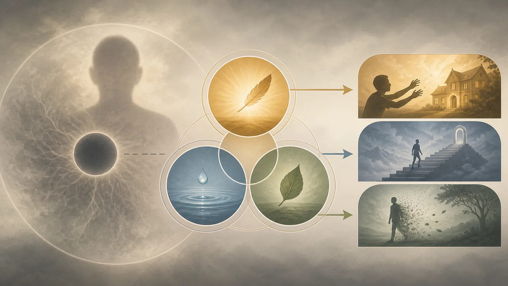

# Xúc → Thọ → Ái — Khoảnh Khắc Vòng Lặp Bắt Đầu

<!-- vault-voice-opening:v1 -->

Một notification sáng lên. Trước khi bạn kịp nghĩ, thân đã hơi căng, thọ đã nghiêng, tay đã muốn chạm. Vòng lặp thường không bắt đầu ở quyết định lớn; nó bắt đầu trong vài phần giây rất nhỏ mà mình gọi chung là “tôi muốn”.

Xúc → thọ → ái không phải định mệnh. Nó là bản đồ để tìm khoảnh khắc nơi một điều được cảm nhận chưa cần trở thành một mệnh lệnh phải làm theo.

## 1. Ba Mắt Xích Không Phải Ba Giây Máy Móc

> [!quote] Kinh về sáu nhóm sáu của kinh nghiệm giác quan — Trung Bộ Kinh
> Đoạn Kinh nêu rằng do duyên mắt và các hình sắc, nhãn thức sinh khởi; sự gặp nhau của ba là xúc; do duyên xúc có thọ; do duyên thọ có ái.
>
> **Pāli**
> *Cakkhuñca paṭicca rūpe ca uppajjati cakkhuviññāṇaṁ, tiṇṇaṁ saṅgati phasso, phassapaccayā vedanā, vedanāpaccayā taṇhā;*
>
> **Dịch Việt**
> “Do duyên mắt và các hình sắc, nhãn thức sinh khởi; sự gặp nhau của ba là xúc; do duyên xúc có thọ; do duyên thọ có ái.”
>
> <small>Nguồn kiểm chứng: <a href="https://suttacentral.net/mn148">MN 148, đoạn 9.3</a> · <i>Chachakka Sutta</i></small>

**Phassa — đọc gần đúng “phát-sa” — xúc, sự tiếp chạm do căn, đối tượng và thức tương ứng gặp nhau**; **vedanā — “vê-đa-na” — cảm thọ dễ chịu, khó chịu hoặc trung tính**; **taṇhā — “tan-ha” — ái, cơn khát muốn có, muốn tiếp tục hoặc muốn thoát**. Ba thuật ngữ thường được rút thành mũi tên “xúc → thọ → ái”. Mũi tên hữu ích nếu nhắc điều kiện; nguy hiểm nếu bị hiểu như ba viên bi buộc phải đẩy nhau.

[Định nghĩa các mắt xích duyên khởi — Tương Ưng Bộ Kinh](https://suttacentral.net/sn12.2) định nghĩa các chi duyên khởi: sáu xúc thân là xúc; sáu thọ thân là thọ; dục ái, hữu ái và phi hữu ái là ái. Công thức “do duyên xúc, thọ; do duyên thọ, ái” đặt chúng trong chuỗi rộng từ vô minh đến già chết. Bài kinh trình bày quan hệ có điều kiện, không đồng hồ đo từng bước.

[Sáu nhóm sáu của kinh nghiệm giác quan — Trung Bộ Kinh](https://suttacentral.net/mn148) cho độ phân giải theo sáu cửa. Do mắt và hình sắc, nhãn thức sinh; ba yếu tố gặp nhau là nhãn xúc; do nhãn xúc có thọ; do thọ có ái liên hệ. Cấu trúc lặp cho tai, mũi, lưỡi, thân và ý. Như vậy, một suy nghĩ có thể tham gia chuỗi giống một âm thanh hay xúc chạm.

Vedanā không phải toàn bộ “cảm xúc”. Một cảm xúc phức tạp như ghen gồm thọ khó chịu, tưởng, ký ức, ý định, thân và câu chuyện bản sắc. Nếu gọi toàn bộ là thọ, người học khó thấy khoảnh khắc đơn giản hơn: cái đang được nếm là dễ chịu, khó chịu hay trung tính. Chính sự đơn giản ấy cho phép nhận ra ái đang đòi kéo gần, đẩy xa hoặc bỏ qua.

“Khoảnh khắc vòng lặp bắt đầu” trong tiêu đề là ẩn dụ thực hành. Chuỗi đã có điều kiện trước xúc, gồm sáu xứ và rộng hơn là vô minh; thọ không phải thủ phạm đầu tiên. Đồng thời, một phản ứng nuôi điều kiện cho phản ứng sau. Ta khảo sát một điểm có thể thấy, không tuyên bố tìm được nguyên nhân đầu tiên hay cơ chế tất định.

## 2. Xúc Là Sự Gặp, Không Chỉ Là Da Chạm Vật

Trong tiếng Việt, “xúc” dễ gợi tiếp xúc thân thể. Phassa trong Kinh rộng hơn: nhãn xúc, nhĩ xúc, tỷ xúc, thiệt xúc, thân xúc và ý xúc. Một ký ức đi vào ý có thể tạo ý xúc; một dòng chữ qua mắt tạo nhãn xúc. Không cần hai vật thể cọ nhau. Điều quyết định là ba điều kiện căn–đối tượng–thức gặp trong một sự kiện nhận biết.

[Sáu nhóm sáu của kinh nghiệm giác quan](https://suttacentral.net/mn148) không nói căn tự tạo thức. Mắt mà không có hình sắc thích hợp không tạo nhãn thức liên hệ; hình mà không có căn vận hành cũng không thành cái được thấy. Thức không đứng ngoài thu dữ liệu như linh hồn. Xúc gọi tên sự hội đủ. Đây là cách đọc quan hệ, không phải mô hình giải phẫu hay vật lý.

Phân biệt này giúp trong đời thường. Một tin nhắn nằm trên máy nhiều giờ, nhưng chuỗi liên hệ chưa hiện trong kinh nghiệm của ta cho đến khi mắt thấy hoặc ý nhớ. Khi thấy, kiểu chữ là đối tượng mắt; nghĩa và ký ức tiếp tục qua ý. “Tin nhắn làm tôi giận” nén nhiều quan hệ thành một nhân đơn. Mở nó ra tạo cơ hội kiểm tra nghĩa và phản ứng.

Xúc không tự mang đạo đức tốt xấu. Nghe lời khen, tiếng còi hoặc tiếng khóc đều là xúc theo cửa. Hậu quả phụ thuộc thọ, nhận dạng, khuynh hướng, ái và hành động. Vì vậy hộ trì căn không phải ghét thế giới hay tránh mọi xúc; nó là biết cách tiếp chạm đang được nuôi và không để tâm chạy theo dấu hiệu gây tham sân.

Ta cũng không thể kiểm soát mọi xúc. Thành phố ồn, thân bệnh, ký ức xâm nhập và lời gây hại là điều kiện thật. Nói với người bị tổn thương rằng họ chỉ cần “đừng xúc” là vô nghĩa và có thể đổ lỗi nạn nhân. Thực hành gồm thay môi trường khi có thể, đặt ranh giới và tìm hỗ trợ, đồng thời học biết phản ứng nội tâm.

Khi xúc đã sinh, nó không cần trở thành câu chuyện “tôi đã thất bại”. Thấy một đối tượng khó chịu là chức năng của hệ giác quan; giới không yêu cầu gây tê. Kỷ luật bắt đầu bằng phân biệt cái đã xảy ra với cái tâm sắp làm từ nó.

## 3. Thọ Là Sắc Thái, Không Phải Toàn Bộ Cảm Xúc

> [!quote] Kinh về sáu nhóm sáu của kinh nghiệm giác quan — Trung Bộ Kinh
> Đoạn Kinh nêu rằng do duyên mắt và các hình sắc, nhãn thức sinh khởi; sự gặp nhau của ba là xúc; do duyên xúc có thọ.
>
> **Pāli**
> *Cakkhuñca paṭicca rūpe ca uppajjati cakkhuviññāṇaṁ, tiṇṇaṁ saṅgati phasso, phassapaccayā vedanā;*
>
> **Dịch Việt**
> “Do duyên mắt và các hình sắc, nhãn thức sinh khởi; sự gặp nhau của ba là xúc; do duyên xúc có thọ.”
>
> <small>Nguồn kiểm chứng: <a href="https://suttacentral.net/mn148">MN 148, đoạn 8.3</a> · <i>Chachakka Sutta</i></small>

[Định nghĩa các mắt xích duyên khởi](https://suttacentral.net/sn12.2) nói sáu nhóm thọ theo cửa; [Sáu nhóm sáu của kinh nghiệm giác quan](https://suttacentral.net/mn148) khảo sát thọ do từng loại xúc sinh. Các bài khác phân loại ba thọ: lạc, khổ, không-lạc-không-khổ; đôi nơi phân biệt thân và tâm. Mẫu số chung là chiều dễ chịu–khó chịu–trung tính, không phải danh sách vui buồn giận sợ như tâm lý học phổ thông.

Một niềm vui có thể gồm lạc thọ và ý nghĩa “tôi thuộc về”; nỗi buồn gồm khổ thọ, ký ức mất mát, tưởng và ý muốn. Gọi đúng vedanā không làm cảm xúc nghèo đi. Nó tách một thành phần để thấy cảm xúc được cấu tạo, qua đó có nhiều chỗ chăm sóc hơn: thân cần nghỉ, nhận dạng cần kiểm, mất mát cần được thương tiếc.

Thọ trung tính đặc biệt dễ bỏ qua. Khi không rõ vui hay đau, tâm tìm kích thích, lướt màn hình hoặc mơ màng. Ái không chỉ chạy theo lạc và chống khổ; nó có thể vận hành như không chịu nổi sự bình thường. Biết trung tính giúp nhìn cơn đói kích thích trước khi hành vi thành tự động.

Không phải mọi lạc thọ đều bất thiện. Niềm vui từ bố thí, không hối hận do giữ giới, an tịnh và định được Kinh đánh giá tích cực. Vấn đề là ái và chấp, không phải màu dễ chịu tự nó. Tương tự, khổ thọ không tự chứng minh hành vi sai; nỗ lực giữ giới hoặc trị bệnh có thể khó chịu mà khéo.

Thọ cũng không chỉ “thái độ”. Đau thân có thực và cần điều trị. Quán thọ không thay thuốc, dinh dưỡng, an toàn hay công lý. Nó thêm câu hỏi: ngoài đau đang có, tâm đòi gì, sợ gì, ghét gì? Tách hai tầng ngăn giáo lý thành cách phủ nhận thân.

Trong một cuộc họp, lời phản bác tạo xúc; thọ khó chịu có thể xuất hiện trước câu trả lời. Biết “khó chịu” chính xác hơn “họ làm nhục tôi”. Sau đó ta kiểm nội dung, thừa nhận sai hoặc bảo vệ quan điểm bằng chứng. Sự tinh tế ở thọ không loại bỏ hành động; nó giảm khả năng thọ bí mật chỉ huy lời nói.

## 4. Từ Thọ Đến Ái Dưới Điều Kiện Vô Minh

> [!quote] Kinh về định nghĩa các mắt xích duyên khởi — Tương Ưng Bộ Kinh
> Đoạn Kinh nêu rằng do duyên sáu xứ có xúc; do duyên xúc có thọ; do duyên thọ có ái.
>
> **Pāli**
> *saḷāyatanapaccayā phasso; phassapaccayā vedanā; vedanāpaccayā taṇhā;*
>
> **Dịch Việt**
> “Do duyên sáu xứ có xúc; do duyên xúc có thọ; do duyên thọ có ái.”
>
> <small>Nguồn kiểm chứng: <a href="https://suttacentral.net/sn12.2">SN 12.2, đoạn 2.6–2.8</a> · <i>Vibhaṅga Sutta</i></small>

Taṇhā trong [Định nghĩa các mắt xích duyên khởi](https://suttacentral.net/sn12.2) có ba: **kāma-taṇhā**, dục ái đối với khoái lạc giác quan; **bhava-taṇhā**, hữu ái, khát tồn tại hay trở thành; **vibhava-taṇhā**, phi hữu ái, khát không tồn tại hoặc loại bỏ. Một lạc thọ có thể nuôi “thêm nữa”; khổ thọ nuôi “phải biến mất”; thọ trung tính nuôi “tôi cần thành ai đó để thấy sống”.

Nhưng câu “thọ duyên ái” không có nghĩa mọi thọ tất yếu tạo ái trong mọi người ở mọi lúc. Toàn chuỗi duyên khởi vận hành với vô minh. [Sáu nhóm sáu của kinh nghiệm giác quan](https://suttacentral.net/mn148) đối lập người không được học, phát ái với người được học thấy vô thường và ly tham. Nếu chuyển tiếp hoàn toàn bắt buộc, giải thoát sẽ không thể có.

“Điểm can thiệp” vì vậy không phải khe vật lý giữa hai mili-giây. Đó là khả năng nhận biết thọ mà không nuôi cơn khát. Khả năng này tùy giới, định, niệm, chánh kiến, sức khỏe và môi trường. Không nên biến nó thành ý chí cá nhân: “nếu còn ái là chưa đủ tỉnh”. Các điều kiện huấn luyện phải được xây lâu dài.

Hữu ái và phi hữu ái cho thấy ái sâu hơn muốn đồ vật. Khi bị chê, ta có thể muốn trở thành người chiến thắng, hoặc muốn biến mất khỏi cuộc đời xã hội. Cả hai lấy thọ làm nhiên liệu cho dự án bản sắc. Nhận diện không có nghĩa kết án nhu cầu an toàn; cần phân biệt rời nguy hiểm với khát hủy chính mình.

Ái cũng không phải mọi mong muốn. Ý muốn học, chăm con, trị bệnh hoặc thực hành có thể khéo tùy tác ý. Kinh dùng các từ khác nhau cho dục cầu và quyết tâm; không thể dịch taṇhā thành “mong muốn” rồi kết luận mọi mục tiêu phải bỏ. Tiêu chí là khát khao được nuôi bởi tham, đồng nhất và yêu sách chiếm hữu.

Khi thọ được biết như thọ—sinh do xúc, đổi và không phải mệnh lệnh—ái mất phần ngụy trang. Lạc vẫn lạc; đau vẫn đau. Tự do không phải chọn thọ, mà là tăng khả năng không biến nó ngay thành “tôi phải có” hoặc “tôi không được chịu”.

## 5. Không Tuyến Tính Cứng, Không Đổ Lỗi Cá Nhân

Sơ đồ mũi tên dễ khiến ta tưởng một nguyên nhân đơn sản xuất một kết quả đơn. Trong đời sống, thọ hiện giữa ký ức, thói quen, quan hệ quyền lực, thiếu ngủ và văn hóa. Văn bản kinh nền nêu quan hệ duyên; nó không phủ nhận điều kiện đồng thời. Dùng nó như công thức duy nhất giải thích trầm cảm, nghiện hoặc bạo lực là vượt phạm vi.

Đặc biệt, không được nói người chịu áp bức khổ chỉ vì họ “ái”. Chính sách, nghèo đói, bạo lực và bệnh là điều kiện có hậu quả. Giáo lý cung cấp bản đồ cho cách dukkha được tiếp tục trong kinh nghiệm, không xóa trách nhiệm của thủ phạm hay nghĩa vụ thay cấu trúc. Nội tâm và xã hội không loại trừ nhau.

Ngược lại, chỉ thay cấu trúc không tự động chấm dứt tham sân si; chỉ quan sát tâm không tự động sửa bất công. Người thực hành cần hai độ phân giải: điều kiện ngoài nào cần hành động, và thọ–ái nào đang làm phản ứng mù. Trung đạo tránh cả tâm lý hóa mọi khổ lẫn phủ nhận khả năng huấn luyện.

Một vòng cũng có phản hồi. Ái dẫn đến thủ và hữu; lựa chọn lặp tạo môi trường cùng thói quen cho xúc sau. Người nghiện điện thoại sắp ứng dụng để dễ chạm; xúc mới tạo thọ và ái tiếp. Thay vị trí điện thoại là thay điều kiện, không phải gian lận thực hành.

Đừng tuyên bố khoa học thần kinh chứng minh chuỗi này. Các nghiên cứu thói quen có thể tạo so sánh hiện đại, nhưng thuật ngữ, phép đo và mục tiêu khác. [Sáu nhóm sáu của kinh nghiệm giác quan](https://suttacentral.net/mn148) và [Định nghĩa các mắt xích duyên khởi](https://suttacentral.net/sn12.2) đủ làm nguồn kinh; bằng chứng khoa học không cần để ban tính hợp pháp cho giáo pháp và cũng không bị giáo pháp thay thế.

Kỷ luật nhân quả làm lòng bi thực tế hơn. Khi phản ứng lặp, thay câu “tôi hỏng” bằng “những điều kiện nào đang nuôi nó?”. Câu hỏi không miễn trách nhiệm; nó chỉ chuyển trách nhiệm từ tự kết án sang thay điều kiện và sửa hậu quả.

## 6. Thực Hành Ở Thọ: Biết, Chờ, Chọn Điều Kiện

Chọn một kích thích vừa. Khi xúc rõ, gọi cửa: thấy, nghe, chạm hoặc nghĩ. Gọi thọ bằng một từ: dễ chịu, khó chịu, trung tính. Sau đó nhận hướng ái: kéo về, đẩy đi, tìm tê, muốn thành, muốn biến mất. Không cần dập nó; gọi đúng đã làm lộ cấu trúc.

Chờ ba hơi thở nếu an toàn. Cảm vị trí thọ trong thân nhưng không đồng nhất thọ với cảm xúc toàn bộ. Hỏi dữ kiện bên ngoài cần hành động gì. Nếu bếp cháy, dập lửa; nếu bị xâm hại, rời đi; bài tập không yêu cầu đứng quan sát trong nguy hiểm.

Sau đó chọn một điều kiện nhỏ: trì hoãn gửi tin, uống nước, hỏi rõ, cất ứng dụng, gọi người hỗ trợ. Tự do trong duyên khởi thường là nghệ thuật xây điều kiện, không màn trình diễn ý chí. Nếu ái vẫn mạnh, biết nó như hiện tượng; thất bại một lần không biến thành căn tính.

Với lạc, thử tận hưởng mà không thêm “phải kéo dài”. Với khổ, tìm chăm sóc mà không thêm “điều này phá toàn bộ tôi”. Với trung tính, ở lại vài nhịp trước khi tìm kích thích. Ba thực hành không làm thọ biến mất; chúng kiểm tra liệu ái có bắt buộc không.

Ghi nhật ký ngắn: xúc nào, thọ nào, ái hướng nào, hành động nào, hậu quả nào. Tránh suy đoán từng sát-na hoặc tự chẩn đoán bằng Abhidhamma nếu chưa học hệ đó. Đây là bài tập biên tập từ Kinh sớm, không bảng tâm pháp hậu kỳ.

Sau một tuần, tìm mẫu thay vì điểm số. Cửa nào thường dẫn đến ái; điều kiện thân nào làm khoảng chọn hẹp; giới nào bảo vệ tốt nhất? Kết quả nên là ít hại và rõ hơn. Bài tiếp sẽ khảo sát viññāṇa để tránh biến chính “người đang biết thọ” thành linh hồn.

## 7. Kỷ Luật Khẳng Định, Đọc Tiếp Và Nguồn

> [!quote] Văn bản nói gì
> [Định nghĩa các mắt xích duyên khởi](https://suttacentral.net/sn12.2) định nghĩa sáu xúc thân, sáu thọ thân và ba loại ái, đồng thời đặt xúc duyên thọ và thọ duyên ái trong duyên khởi. [Sáu nhóm sáu của kinh nghiệm giác quan](https://suttacentral.net/mn148) triển khai chuỗi theo sáu căn và đối lập chấp ái với cái thấy vô thường dẫn đến ly tham.

> [!info] Truyền thống giải thích gì
> Theravāda xem thọ là vị lạc, khổ, trung tính và thường nhấn mạnh đây là nơi niệm có thể ngăn phản ứng thành ái. Các phân tích sát-na chi tiết thuộc hệ thống hậu kỳ phải được gắn nhãn riêng.

> [!example] Bài này suy luận gì
> “Biết–chờ–chọn điều kiện”, ví dụ tin nhắn, cuộc họp và điện thoại là tổng hợp ứng dụng. “Điểm can thiệp” là ngôn ngữ thực hành cho khả năng được huấn luyện, không phải một khe thời gian mà hai văn bản nền đo được.

> [!warning] Điều chưa chứng minh
> Chuỗi không chứng minh mọi thọ tất định thành ái, mọi khổ do thái độ cá nhân, hay bất công chỉ là nhận thức. Vedanā không đồng nghĩa cảm xúc; hai văn bản nền không phải lý thuyết não và không được khoa học thần kinh chứng minh.

Đọc trước: [[theravada/12 - Sáu Căn Và Sáu Trần - Thế Giới Xuất Hiện Ở Đâu|Sáu Căn Và Sáu Trần — Thế Giới Xuất Hiện Ở Đâu]]. Đọc tiếp: [[theravada/14 - Viññāṇa - Thức Không Phải Linh Hồn|Viññāṇa — Thức Không Phải Linh Hồn]].

**Nguồn kinh chính xác**

- [Định nghĩa các mắt xích duyên khởi — Tương Ưng Bộ Kinh](https://suttacentral.net/sn12.2), nguồn định nghĩa xúc, thọ, ba ái và quan hệ trong duyên khởi.
- [Sáu nhóm sáu của kinh nghiệm giác quan — Trung Bộ Kinh](https://suttacentral.net/mn148), nguồn cho chuỗi sáu cửa và khả năng ly tham.

**Đối chiếu thuật ngữ và nghiên cứu có tên**

- Bhikkhu Bodhi, *The Connected Discourses of the Buddha*, Wisdom Publications, 2000, đối chiếu Nidāna Saṃyutta.
- Bhikkhu Ñāṇamoli và Bhikkhu Bodhi, *The Middle Length Discourses of the Buddha*, Wisdom Publications, 1995, đối chiếu [Sáu nhóm sáu của kinh nghiệm giác quan](https://suttacentral.net/mn148).
- Bhikkhu Anālayo, *Satipaṭṭhāna: The Direct Path to Realization*, Windhorse, 2003, đối chiếu phạm vi vedanā trong thực hành.
- [SuttaCentral Editions](https://suttacentral.net/editions), thông tin ấn bản và giấy phép.

Pāli làm việc là văn bản Bilara phân đoạn trên SuttaCentral, truy cập ngày 2026-08-18. Các bản dịch của Bhikkhu Sujato, Bhikkhu Bodhi và Ṭhānissaro Bhikkhu chỉ dùng đối chiếu. Văn xuôi tiếng Việt và diễn ý ngắn là bản dịch làm việc của redpill.wiki; không sao chép dài bản dịch ngoài.
