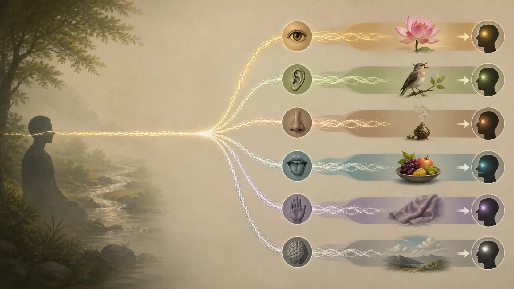
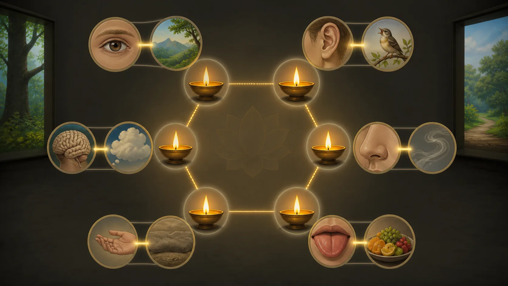

# Viññāṇa — Thức Không Phải Linh Hồn

## 1. Sai Lầm Của Sāti Và Câu Hỏi Về Cái Tiếp Tục

**Viññāṇa — đọc gần đúng “vin-nha-na” — thức, sự nhận biết phân biệt** dễ bị dịch thành “consciousness” rồi lặng lẽ gán mọi nghĩa hiện đại: chủ thể thuần túy, linh hồn, kho ý thức, hay nền vũ trụ. [MN 38, Mahātaṇhāsaṅkhaya Sutta](https://suttacentral.net/mn38) trực tiếp chặn một cách đọc như vậy qua câu chuyện vị tỳ-kheo Sāti.

Sāti tuyên bố theo điều mình hiểu rằng chính “thức này” chạy và luân chuyển, không phải cái khác. Khi được hỏi thức nào, ông mô tả cái nói, cảm nhận và trải nghiệm quả của nghiệp thiện ác. Đức Phật quở trách cách hiểu ấy và hỏi Ngài đã chẳng nói bằng nhiều cách rằng thức sinh do duyên, không có thức sinh nếu thiếu điều kiện hay sao.

> **Pāli — MN 38:5.12 (Bilara)**
> *Anekapariyāyena hi vo, moghapurisa, paṭiccasamuppannaṁ viññāṇaṁ vuttaṁ mayā, aññatra paccayā natthi viññāṇassa sambhavo.*
>
> **Bản dịch làm việc:** “Này người rỗng không, chẳng phải Ta đã nói bằng nhiều cách rằng thức do duyên mà sinh, rằng ngoài điều kiện thì thức không thể sinh khởi hay sao?”

Điểm bác bỏ rất chính xác. Sai không phải dùng từ “liên tục” trong mọi nghĩa; sai là biến viññāṇa thành cùng một chủ thể trải nghiệm đi xuyên các điều kiện. Bài kinh không thay nó bằng linh hồn tinh tế hơn, “kho chứa” bí mật hay ánh sáng thường hằng. Nó định danh thức theo duyên mà nhờ đó thức sinh.

[DN 15, Mahānidāna Sutta](https://suttacentral.net/dn15) trình bày thức và danh–sắc nương nhau trong giải thích duyên khởi. Nếu thức không đi vào thai mẹ, danh–sắc không hình thành; nếu thức bị cắt đứt ở người trẻ, danh–sắc không tăng trưởng; nếu thức không có chỗ đứng trong danh–sắc, sự sinh của khổ tương lai không được nhận biết. Đoạn khó này cần giữ văn cảnh tái sinh của Kinh mà không biến thành cơ học vật lý.

[SN 12.2](https://suttacentral.net/sn12.2) cho định nghĩa gọn: sáu thức thân—nhãn, nhĩ, tỷ, thiệt, thân, ý thức. Ba đoạn kinh trụ cột cùng chống hình ảnh một chất nhận biết không phân biệt: thức có loại, có điều kiện và tham gia duyên khởi. Bài học sẽ nói về tính tiếp nối mà không nhập lậu một tự ngã.

## 2. Sáu Thức Được Gọi Tên Theo Điều Kiện

MN 38 dùng ví dụ lửa: lửa cháy nhờ củi được gọi là lửa củi; nhờ rơm là lửa rơm; nhờ cỏ, phân bò, trấu hay rác thì được gọi theo nhiên liệu. Tương tự, thức sinh nhờ mắt và hình sắc được gọi nhãn thức; nhờ tai và tiếng là nhĩ thức; rồi mũi, lưỡi, thân, ý.

> **Pāli — MN 38:8.1–8.7 (Bilara)**
> *Yaṁ yadeva, bhikkhave, paccayaṁ paṭicca uppajjati viññāṇaṁ, tena teneva viññāṇantveva saṅkhyaṁ gacchati. Cakkhuñca paṭicca rūpe ca uppajjati viññāṇaṁ, cakkhuviññāṇantveva saṅkhyaṁ gacchati; sotañca paṭicca sadde ca uppajjati viññāṇaṁ, sotaviññāṇantveva saṅkhyaṁ gacchati; ghānañca paṭicca gandhe ca uppajjati viññāṇaṁ, ghānaviññāṇantveva saṅkhyaṁ gacchati; jivhañca paṭicca rase ca uppajjati viññāṇaṁ, jivhāviññāṇantveva saṅkhyaṁ gacchati; kāyañca paṭicca phoṭṭhabbe ca uppajjati viññāṇaṁ, kāyaviññāṇantveva saṅkhyaṁ gacchati; manañca paṭicca dhamme ca uppajjati viññāṇaṁ, manoviññāṇantveva saṅkhyaṁ gacchati.*
>
> **Bản dịch làm việc:** “Này các tỳ-kheo, thức sinh lên tùy thuộc chính điều kiện nào thì được gọi tên theo chính điều kiện ấy. Thức sinh tùy thuộc mắt và các sắc được gọi là nhãn thức; tùy thuộc tai và âm thanh là nhĩ thức; tùy thuộc mũi và mùi là tỷ thức; tùy thuộc lưỡi và vị là thiệt thức; tùy thuộc thân và vật chạm là thân thức; tùy thuộc ý và các pháp là ý thức.”

Ví dụ không bảo thức là một “ngọn lửa” nguyên chất chuyển từ nhiên liệu này sang nhiên liệu khác. Chính cách đặt tên theo điều kiện sửa ý tưởng ấy. Khi điều kiện khác, sự kiện thức được định danh khác. Lửa là ví dụ về duyên và tên gọi, không bằng chứng về năng lượng tinh thần.

Sáu thức cũng không phải sáu linh hồn. Chúng là sáu loại nhận biết phân biệt theo cửa. Nhãn thức biết cái thấy; ý thức biết pháp thuộc ý. Một trải nghiệm phức tạp có thể chuyển nhanh giữa cửa: mắt thấy chữ, ý nhận nghĩa, thân căng, ý nhớ. Tính trôi chảy khiến ta tưởng có một người xem duy nhất không đổi, nhưng Kinh mời khảo sát điều kiện thay vì suy thực thể.

Thức không hoạt động một mình. MN 38 triển khai từ sáu xứ tới xúc, thọ, ái; DN 15 nối thức với danh–sắc. Vì vậy nói “chỉ có ý thức” bỏ các quan hệ mà đoạn kinh trụ cột nhấn mạnh. Cũng không thể lấy viññāṇa làm chất sản sinh mọi vật nếu văn bản đang mô tả nó nương căn, đối tượng và danh–sắc.

Điều này không phủ nhận chiều sâu của kinh nghiệm chủ quan. Màu được thấy, đau được biết, ý nghĩ xuất hiện—đó là dữ kiện. Câu hỏi khác là dữ kiện ấy có cần một chủ thể bất biến hay không. MN 38 trả lời bằng sự sinh tùy điều kiện, không bằng phủ nhận hiện tượng.

Khi đọc, giữ hai tầng: quy ước “tôi thấy” giúp giao tiếp; phân tích “nhãn thức sinh do điều kiện” ngăn đồng nhất. Xóa tầng quy ước dẫn đến ngôn ngữ kỳ quặc và né trách nhiệm. Tuyệt đối hóa tầng quy ước dẫn đến linh hồn hóa một chức năng.

## 3. Thức Và Danh–Sắc Nương Nhau Trong DN 15

**Nāmarūpa — “na-ma ru-pa” — danh–sắc**, trong DN 15, chỉ cấu trúc tâm–thân có điều kiện; cách phân tích cụ thể thay theo văn bản. Bài kinh hỏi nếu thức không đi vào thai mẹ, danh–sắc có hình thành không; nếu thức rời, nó có tăng trưởng không. Câu trả lời là không. Sau đó bài xác định phạm vi sinh, già, chết và tái hiện hữu qua sự nương nhau này.

> **Pāli — DN 15:2.15–2.17 (Bilara)**
> *“Nāmarūpaṁ kissa paccayā”ti iti ce vadeyyuṁ, “viññāṇapaccayā nāmarūpan”ti iccassa vacanīyaṁ. “Viññāṇaṁ kissa paccayā”ti iti ce vadeyyuṁ, “nāmarūpapaccayā viññāṇan”ti iccassa vacanīyaṁ.*
>
> **Bản dịch làm việc:** “Nếu được hỏi: ‘Danh–sắc do duyên gì?’, cần đáp: ‘Danh–sắc do duyên thức.’ Nếu được hỏi: ‘Thức do duyên gì?’, cần đáp: ‘Thức do duyên danh–sắc.’”

Không nên đọc đoạn ấy như mô tả một linh hồn bay vào phôi. Chính MN 38 bác “thức này” đi xuyên. “Đi vào” là ngôn ngữ kinh điển trong trình bày tái sinh, nhưng cái được nói vẫn là thức tùy duyên. Cơ chế nối đời là chủ đề tranh luận; đoạn kinh không trao một hạt vật chất hay thực thể mang ký ức để ta chỉ ra.

DN 15 cũng nói danh–sắc là điều kiện cho thức và thức là điều kiện cho danh–sắc, làm chuỗi bớt giống hàng domino một chiều. Sự tương thuộc không có nghĩa chúng là cùng một thứ; cũng không nói hai chất độc lập tạo người. Nó cho thấy không thể đặt thức làm nền vô điều kiện nếu thức được mô tả nương cấu trúc tâm–thân.

Trong đời hiện tại, tính nương nhau dễ quan sát ở cấp khiêm tốn: thân kiệt sức làm kiểu nhận biết đổi; nhận biết và ý hướng ảnh hưởng cách thân hành động; ngôn ngữ và tri giác tổ chức trải nghiệm. Nhưng quan sát ấy chỉ minh họa, không chứng minh toàn bộ đoạn về tái sinh. Ta không thay lời kinh khẳng định bằng sinh lý học.

Một truyền thống có thể giải thích tục sinh, hữu phần hoặc chuỗi sát-na bằng Vi Diệu Pháp và chú giải. Những mô hình đó thuộc lớp hậu kỳ hoặc Vi Diệu Pháp riêng trong kinh điển, không được MN 38 và DN 15 trình bày nguyên dạng. Bài này giữ trọng tâm Kinh sớm và không chọn một cơ chế kỹ thuật.

Giữ giới hạn giúp tránh hai cực. Không khẳng định một linh hồn chuyển sinh; cũng không tuyên bố vì không có linh hồn nên Kinh chỉ nói ẩn dụ tâm lý. DN 15 có văn cảnh sinh và tái hiện hữu rõ. Người đọc có thể phân biệt điều văn bản tuyên bố với mức độ mình chấp nhận nó.

## 4. Tính Tiếp Nối Không Đòi Một Vật Bất Biến

Khi bác linh hồn, câu hỏi tự nhiên là: cái gì nối hôm qua với hôm nay, và theo Kinh cái gì liên hệ đời sau? Câu trả lời thận trọng không phải “không có liên tục”, mà “liên tục không đồng nhất với một vật bất biến”. Ký ức, thói quen, tác ý, thân và hậu quả tạo tính tiếp nối nhân quả dù mọi thành phần đổi.

Một giai điệu tiếp tục qua nhiều nốt; không có một nốt duy nhất chạy xuyên bài. Ví dụ này chỉ giúp hình dung quan hệ, không phải ví dụ trong kinh và không giải thích tái sinh. Nó cho thấy về lý lẽ, chuỗi có hình thức và hậu quả không bắt buộc chứa một hạt trường tồn.

Trong MN 38, sự tiếp nối được đặt trong duyên khởi: thức, danh–sắc, sáu xứ, xúc, thọ, ái, thủ, hữu và sinh. Cái sau nương cái trước; điều kiện được truyền mà không cần cùng một chủ thể. Nghiệp sẽ được học ở bài riêng; ở đây không nên rút gọn thành thức “mang” một sổ điểm.

Trách nhiệm đạo đức vẫn có nghĩa. Người ngày mai không hoàn toàn đồng nhất từng phân tử với người hôm nay, nhưng hành động hôm nay định hình điều kiện họ nhận. Nói “không có tôi nên chẳng ai chịu quả” là đoạn kiến và trái mục tiêu của duyên khởi. Không có tự ngã bất biến không đồng nghĩa không có quan hệ nhân quả.

Ngược lại, chưa biết cơ chế không cho phép lấp bằng các từ như “tần số”, “trường lượng tử”, “DNA tinh thần” hay “ý thức vũ trụ”. Những từ ấy có thể tạo cảm giác giải thích nhưng không xuất hiện trong các đoạn kinh trụ cột. Cần trung thực: Kinh khẳng định duyên và tái hiện hữu; cơ chế vật lý không được cung cấp.

Tính tiếp nối thực hành quan trọng hơn tranh thắng siêu hình. Mỗi lần ái được nuôi, khuynh hướng tiếp tục; mỗi lần giới được giữ, điều kiện khác được xây. Ta không cần tìm một chủ thể nằm sau chuỗi mới có thể sửa chuỗi. Nhưng cũng không biến người thành cỗ máy: chánh kiến và tác ý là điều kiện có hiệu lực.

## 5. Không Phải Kho Chứa, Ý Thức Vũ Trụ Hay Người Biết Thuần Túy

Một cách cứu linh hồn là đổi tên nó thành “dòng thức”: tưởng một dòng đồng nhất chảy qua mọi cửa và đời. MN 38 đặc biệt không cho phép nói chính thức ấy chạy và luân chuyển. “Dòng” chỉ an toàn nếu chỉ chuỗi sự kiện tùy duyên, không nếu nó là vật mang căn tính.

Cách khác là đặt một kho thức sau sáu thức. Một số truyền thống Phật giáo khác có khái niệm riêng; không nên nhập chúng vào Theravāda Kinh sớm mà không gắn nhãn so sánh. MN 38, SN 12.2 và DN 15 không giới thiệu ālayavijñāna hay kho chứa thường tồn.

“Ý thức vũ trụ” còn đi xa hơn. Cảm giác hợp nhất trong thiền có thể sâu, nhưng trải nghiệm cá nhân không chứng minh bản thể chung của vũ trụ. Kinh có các tầng định và thức vô biên trong văn cảnh riêng; tên một thiền chứng không biến viññāṇa thường ngày thành Thượng ngã.

“Người biết thuần túy” có thể là hướng dẫn thiền hữu ích để không dính nội dung. Nhưng nếu nó được tuyên bố bất sinh, bất diệt và là bản ngã thật, đó là bước siêu hình ngoài các đoạn kinh trụ cột. SN 22.59 đã áp vô ngã cho thức; MN 38 áp duyên sinh. Ngôn ngữ thực hành không nên bí mật đảo kết luận.

Cũng không cần đối cực bằng chủ nghĩa duy vật giản lược. Hai bài kinh không chứng minh thức chỉ là não; chúng không đặt câu hỏi theo thuật ngữ đó. Nghiên cứu não có miền bằng chứng riêng nhưng không xác nhận hay bác toàn bộ duyên khởi bằng vài tương quan. Kỷ luật nguồn giữ hai cuộc điều tra không giả làm nhau.

Điểm cân bằng là khiêm tốn có nội dung: thức xảy ra; được phân sáu; sinh theo duyên; nương và làm duyên cho danh–sắc; không thích hợp làm linh hồn. Những gì xa hơn cần nguồn và lập luận riêng.

## 6. Thực Hành Nhận Biết Thức Theo Cửa Và Duyên

Trong năm phút, khi một kinh nghiệm rõ, ghi “nhãn thức”, “nhĩ thức”, “thân thức” hoặc “ý thức”. Không cố bắt mọi khoảnh khắc. Sau mỗi nhãn, hỏi điều kiện nào hiện: căn, đối tượng, ánh sáng, chú ý, ký ức, tình trạng thân. Bài tập chuyển trọng tâm từ “tôi đang biết” sang “biết này đang nương gì”.

Quan sát sự đổi cửa. Đang nghe tiếng quạt, ý bình luận “ồn”, thân cảm căng, ý nhớ cuộc cãi. Không có yêu cầu tìm một cái biết đứng sau tất cả. Cũng không cần phủ nhận tính liên tục quy ước. Chỉ thấy mỗi kiểu thức có đối tượng và điều kiện riêng.

Khi câu “tôi là người quan sát” xuất hiện, nhận nó là đối tượng của ý thức. Câu này có thể hữu ích để tạo khoảng cách, nhưng nó cũng là pháp sinh rồi đổi. Đừng lập tức thay nó bằng “không có ai”. Phủ định trừu tượng thường chỉ là một ý nghĩ khác.

Trong xung đột, phân biệt cái mắt thấy, tai nghe và ý suy. Kiểm tra phần suy bằng câu hỏi. Thực hành có hệ quả đạo đức: bớt tuyên bố ý diễn giải là dữ kiện trực tiếp. Nếu bằng chứng đủ, vẫn kết luận rõ; vô ngã không đòi mập mờ.

Nếu quan sát làm phát sinh cảm giác mất thực tại, sợ hãi hoặc phân ly, dừng, cảm bàn chân, nhìn vật quen và tìm hỗ trợ. Không có thành tích nào trong việc phá cảm giác an toàn. Con đường tuần tự gồm giới, ổn định và trí tuệ, không phải cưỡng ép một kết luận.

Cuối buổi hỏi: thức nào nổi bật, điều kiện nào đổi nó, có “chủ thể” nào được trực tiếp tìm thấy ngoài các sự kiện hay chỉ là ý niệm tiếp theo? Câu hỏi để quan sát, không buộc trả lời triết học. Bài 15 sẽ đặt phép khảo sát “của tôi, tôi, tự ngã của tôi” vào toàn bộ năm uẩn.

## 7. Kỷ Luật Khẳng Định, Đọc Tiếp Và Nguồn

> [!quote] Văn bản nói gì
> MN 38 bác quan điểm chính thức ấy chạy và luân chuyển, rồi nói thức sinh tùy duyên và gọi tên theo sáu cửa. SN 12.2 định nghĩa sáu thức thân. DN 15 trình bày thức và danh–sắc trong quan hệ điều kiện gắn với sinh và khổ.

> [!info] Truyền thống giải thích gì
> Theravāda giải thích tính tiếp nối bằng nhân quả không có tự ngã và phát triển các mô hình chi tiết trong Abhidhamma/chú giải. Những mô hình như tục sinh hay hữu phần phải mang đúng nhãn, không giả làm nguyên văn MN 38 hoặc DN 15.

> [!example] Bài này suy luận gì
> Ví dụ giai điệu, bài tập gọi thức theo cửa và cách nói “điều kiện được truyền” là tổng hợp giải thích. Chúng minh họa khả năng tiếp nối không vật bất biến nhưng không giải thích cơ chế tái sinh.

> [!warning] Điều chưa chứng minh
> Các đoạn kinh trụ cột không chứng minh thức là linh hồn, kho chứa, ý thức vũ trụ, chân ngã hay năng lượng vật lý. Chúng cũng không chứng minh duy vật thần kinh, không cung cấp cơ chế vật lý cho tái sinh và không xóa trách nhiệm.

Đọc trước: [[theravada/13 - Xúc → Thọ → Ái - Khoảnh Khắc Vòng Lặp Bắt Đầu|Xúc → Thọ → Ái — Khoảnh Khắc Vòng Lặp Bắt Đầu]]. Đọc tiếp: [[theravada/15 - Vô Ngã - Đức Phật Phủ Định Điều Gì|Vô Ngã — Đức Phật Phủ Định Điều Gì?]].

**Nguồn kinh điển chính xác**

- [MN 38: Mahātaṇhāsaṅkhaya Sutta](https://suttacentral.net/mn38), nguồn cho việc bác thức đồng nhất luân chuyển và sáu thức tùy duyên.
- [DN 15: Mahānidāna Sutta](https://suttacentral.net/dn15), nguồn cho quan hệ thức–danh sắc trong duyên khởi.
- [SN 12.2: Vibhaṅga Sutta](https://suttacentral.net/sn12.2), nguồn định nghĩa sáu thức thân.

**Đối chiếu thuật ngữ và nghiên cứu có tên**

- Bhikkhu Ñāṇamoli và Bhikkhu Bodhi, *The Middle Length Discourses of the Buddha*, Wisdom Publications, 1995, đối chiếu MN 38.
- Maurice Walshe, *The Long Discourses of the Buddha*, Wisdom Publications, 1995, đối chiếu DN 15.
- Peter Harvey, *The Selfless Mind*, Curzon Press, 1995, về thức, tính tiếp nối và vô ngã trong Kinh sớm.
- [SuttaCentral Editions](https://suttacentral.net/editions), thông tin ấn bản và giấy phép.

Pāli làm việc là văn bản Bilara phân đoạn trên SuttaCentral, truy cập ngày 2026-08-18. Các bản dịch của Bhikkhu Sujato, Bhikkhu Bodhi, Maurice Walshe và Ṭhānissaro Bhikkhu chỉ dùng đối chiếu. Văn xuôi tiếng Việt và diễn ý ngắn là bản dịch làm việc của redpill.wiki; không sao chép dài bản dịch ngoài.
