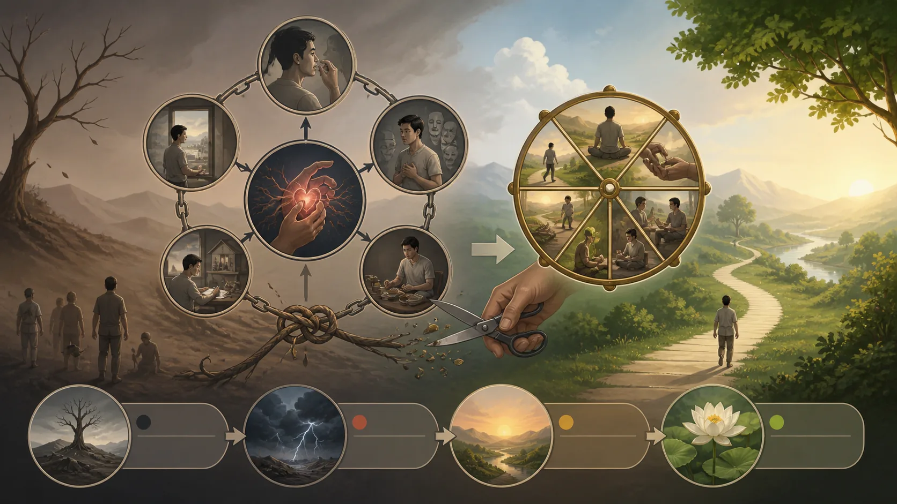
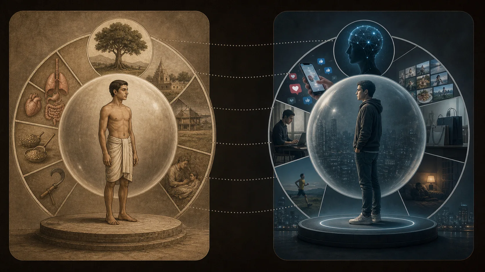

# Bản Sắc Được Kiến Tạo — Tôi Sinh Lại Trong Từng Phản Ứng

## 1. Từ “Tôi Là” Đến Một Cấu Trúc Có Thể Quan Sát

**Sakkāyadiṭṭhi — đọc gần đúng “sắc-ca-ya-đít-thi” — thân kiến, quan điểm về một tự thân hay căn tính trên năm thủ uẩn** không chỉ là câu triết học “tôi có linh hồn”. [Thân bệnh nhưng tâm không nhất thiết bệnh — Tương Ưng Bộ Kinh](https://suttacentral.net/sn22.1) và [Hỏi đáp về thân kiến và thiền — Trung Bộ Kinh](https://suttacentral.net/mn44) phân tích nó thành những cách rất cụ thể để đặt “tôi” quanh mỗi uẩn.

Với sắc, người không được học có thể xem sắc là tự ngã; tự ngã sở hữu sắc; sắc nằm trong tự ngã; hoặc tự ngã nằm trong sắc. Bốn vị trí lặp với thọ, tưởng, hành và thức, thành hai mươi dạng thân kiến. Đây không phải hai mươi linh hồn khác nhau mà là ma trận của đồng nhất, sở hữu và quan hệ chứa đựng.

[Thân bệnh nhưng tâm không nhất thiết bệnh](https://suttacentral.net/sn22.1) đặt phân tích trong câu chuyện rất đời: gia chủ Nakulapitā già, bệnh và đau. Đức Phật khuyên dù thân bệnh, tâm đừng bệnh. Tôn giả Sāriputta giải thích tâm bệnh qua hai mươi dạng chấp; khi uẩn đổi, sầu và khổ sinh vì người ấy bị ám bởi “tôi là cái này” và “cái này của tôi”. Tâm không bệnh là không đặt tự ngã theo các cách ấy.

> [!quote] Kinh về thân bệnh nhưng tâm không nhất thiết bệnh — Tương Ưng Bộ Kinh
> Đoạn Kinh nêu rằng vì vậy, này gia chủ, ông nên học như sau: ‘Dù thân tôi bệnh, tâm tôi sẽ không bệnh.’ Này gia chủ, ông nên học như vậy.
>
> **Pāli**
> *Tasmātiha te, gahapati, evaṁ sikkhitabbaṁ: ‘āturakāyassa me sato cittaṁ anāturaṁ bhavissatī’ti. Evañhi te, gahapati, sikkhitabban”ti.*
>
> **Dịch Việt**
> “Vì vậy, này gia chủ, ông nên học như sau: ‘Dù thân tôi bệnh, tâm tôi sẽ không bệnh.’ Này gia chủ, ông nên học như vậy.”
>
> <small>Nguồn kiểm chứng: <a href="https://suttacentral.net/sn22.1">SN 22.1, đoạn 3.4–3.6</a> · <i>Nakulapitu Sutta</i></small>

> [!quote] Kinh về hỏi đáp về thân kiến và thiền — Trung Bộ Kinh
> Đoạn Kinh nêu rằng ‘Sakkāya, sakkāya’—người ta nói như vậy; thưa ni sư, sakkāya nào được Thế Tôn nói đến?”—“Này hiền hữu Visākha, năm thủ uẩn này được Thế Tôn gọi là sakkāya: thủ uẩn sắc, thủ uẩn thọ, thủ uẩn tưởng, thủ uẩn hành và thủ….
>
> **Pāli**
> *“‘sakkāyo sakkāyo’ti, ayye, vuccati. Katamo nu kho, ayye, sakkāyo vutto bhagavatā”ti? “Pañca kho ime, āvuso visākha, upādānakkhandhā sakkāyo vutto bhagavatā, seyyathidaṁ—rūpupādānakkhandho, vedanupādānakkhandho, saññupādānakkhandho, saṅkhārupādānakkhandho, viññāṇupādānakkhandho. Ime kho, āvuso visākha, pañcupādānakkhandhā sakkāyo vutto bhagavatā”ti.*
>
> **Dịch Việt**
> “‘Sakkāya, sakkāya’—người ta nói như vậy. Thưa ni sư, sakkāya nào được Thế Tôn nói đến?”—“Này hiền hữu Visākha, năm thủ uẩn này được Thế Tôn gọi là sakkāya: thủ uẩn sắc, thủ uẩn thọ, thủ uẩn tưởng, thủ uẩn hành và thủ uẩn thức.”
>
> <small>Nguồn kiểm chứng: <a href="https://suttacentral.net/mn44">MN 44, đoạn 2.1–2.5</a> · <i>Cūḷavedalla Sutta</i></small>

[Hỏi đáp về thân kiến và thiền](https://suttacentral.net/mn44) là cuộc đối thoại giữa nam cư sĩ Visākha và ni sư Dhammadinnā. Bà định nghĩa năm thủ uẩn là sakkāya, ái dẫn tái hữu đi cùng hỷ tham là nguồn sinh của sakkāya, sự đoạn ái là đoạn diệt, và Bát Chánh Đạo là con đường. Sau đó bà nêu hai mươi dạng thân kiến. Bản sắc nằm ngay trong cấu trúc Tứ Đế, không chỉ là vấn đề kể chuyện xã hội.

“Tôi sinh lại trong từng phản ứng” là ẩn dụ biên tập cho sự tái tạo căn tính: một lời chê chạm nhãn “người giỏi”, tâm dựng lại người cần chiến thắng. Nó không thay nghĩa kinh điển của tái sinh và không tuyên bố mỗi phản ứng là một đời sinh học. Bài 17 mới chuyển sang duyên khởi sinh–diệt với phạm vi rộng hơn.

## 2. Hai Mươi Cách Dựng Tự Ngã Quanh Năm Uẩn

Cột thứ nhất là đồng nhất: “sắc là tự ngã”, “thọ là tự ngã”. Trong đời thường: “tôi chính là cơ thể này”, “tôi là cảm giác buồn này”, “tôi là ký ức và quan điểm này”. Mô tả quy ước không luôn là tà kiến; dấu hiệu chấp là khi thay đổi của một thuộc tính được trải như sự hủy toàn bộ người.

> [!quote] Kinh về thân bệnh nhưng tâm không nhất thiết bệnh — Tương Ưng Bộ Kinh
> Đoạn Kinh nêu rằng người ấy xem sắc là tự ngã, hoặc xem tự ngã có sắc, hoặc sắc ở trong tự ngã, hoặc tự ngã ở trong sắc.
>
> **Pāli**
> *Idha, gahapati, assutavā puthujjano ariyānaṁ adassāvī ariyadhammassa akovido ariyadhamme avinīto sappurisānaṁ adassāvī sappurisadhammassa akovido sappurisadhamme avinīto rūpaṁ attato samanupassati, rūpavantaṁ vā attānaṁ; attani vā rūpaṁ, rūpasmiṁ vā attānaṁ. ‘Ahaṁ rūpaṁ, mama rūpan’ti pariyuṭṭhaṭṭhāyī hoti. Tassa ‘ahaṁ rūpaṁ, mama rūpan’ti pariyuṭṭhaṭṭhāyino taṁ rūpaṁ vipariṇamati aññathā hoti. Tassa rūpavipariṇāmaññathābhāvā uppajjanti sokaparidevadukkhadomanassupāyāsā.*
>
> **Dịch Việt**
> “Người ấy xem sắc là tự ngã, hoặc xem tự ngã có sắc, hoặc sắc ở trong tự ngã, hoặc tự ngã ở trong sắc. Người ấy bị ý niệm ‘tôi là sắc, sắc là của tôi’ chiếm cứ. Khi sắc ấy biến đổi và trở thành khác, do sắc biến đổi mà sầu, than, đau, ưu và tuyệt vọng sinh lên.”
>
> <small>Nguồn kiểm chứng: <a href="https://suttacentral.net/sn22.1">SN 22.1, đoạn 9.2–9.6</a> · <i>Nakulapitu Sutta</i></small>

Cột thứ hai là sở hữu: “tự ngã có sắc”. Ta có thể không nói thân là linh hồn nhưng tưởng một chủ thể đứng ngoài sở hữu thân như đồ vật. Khi thân bệnh, câu hỏi không chỉ “chăm thế nào” mà thành “tại sao tài sản của tôi phản tôi?”. Sở hữu quy ước cần cho trách nhiệm; sở hữu siêu hình đòi quyền tuyệt đối.

Cột thứ ba xem uẩn nằm trong tự ngã: một cái tôi lớn chứa thân, thọ hay thức. Cột thứ tư xem tự ngã nằm trong uẩn: người tí hon hoặc tinh chất nằm trong thân hay nhận biết. Hai cách chứa đựng cho thấy loại bỏ câu “uẩn là tôi” chưa đủ; tự ngã có thể lùi ra ngoài hoặc ẩn vào trong.

Lặp qua năm uẩn tạo hai mươi. Với thức, ta có thể nói thức là tôi; tôi sở hữu thức; thức nằm trong tôi; tôi nằm trong thức. Các học thuyết “người biết” thường di chuyển giữa bốn vị trí. Ma trận giúp nhận ra thao tác thay vì chỉ tranh tên gọi.

Không cần thuộc lòng hai mươi như giáo lý số học. Chọn một chấp đang hoạt động và hỏi nó thuộc đồng nhất, sở hữu hay chứa đựng. Cái thấy này làm cấu trúc có thể quan sát. Nếu biến bảng thành bài thi căn tính “tôi không được có thân kiến”, một bản sắc tu hành mới lại được dựng.

[Hỏi đáp về thân kiến và thiền](https://suttacentral.net/mn44) cũng phân biệt thân kiến với các uẩn: năm thủ uẩn là cơ sở được nắm, còn quan điểm là cách nắm. Không nên gọi năm uẩn tự chúng là “cái tôi giả”. Thân, thọ, tưởng, hành và thức là pháp có điều kiện; cái giả định nằm ở việc giao chúng vai trò tự ngã bền chắc.

## 3. Khi Uẩn Đổi, Căn Tính Bị Thương Như Thế Nào

[Thân bệnh nhưng tâm không nhất thiết bệnh](https://suttacentral.net/sn22.1) nối thân kiến với đau tâm rất trực tiếp. Người xem sắc là tự ngã sống bị ám bởi ý tưởng ấy; sắc biến đổi thì sầu, than, đau, ưu và tuyệt vọng sinh. Cùng công thức áp cho thọ, tưởng, hành, thức. Uẩn đổi là điều bình thường; căn tính đòi nó không đổi nên bị thương.

Một vận động viên chấn thương có đau thân, mất nghề và khó khăn kinh tế thật. Nếu sắc còn là toàn bộ “tôi”, chấn thương thêm phán quyết “tôi không còn là ai”. Giáo pháp không phủ nhận ba mất mát đầu và không bảo chỉ đổi thái độ. Nó nhận diện tầng đồng nhất để người ấy có thể chăm thân, thương tiếc và xây đời mà không tự xóa.

Với thọ, “tôi là người hạnh phúc” khiến buồn thành thất bại bản thể; “tôi là người tổn thương” khiến một khoảnh khắc an vui có vẻ phản bội câu chuyện. Với tưởng, nhãn chính trị hay nghề nghiệp có thể biến bằng chứng trái ý thành đe dọa. Với hành, thói quen giận được gọi “tính tôi”. Với thức, trạng thái sáng rõ được đòi phải ở lại.

Bản sắc không chỉ tiêu cực. “Người tốt”, “người chữa lành”, “thiền giả sâu” cũng có thể được nắm. Khi ai góp ý, tâm bảo vệ nhãn thay vì hành vi thiện. Vấn đề không phải bỏ lời cam kết tốt; nó là không biến cam kết thành bằng chứng một bản chất miễn kiểm tra.

Tâm không bệnh trong [Thân bệnh nhưng tâm không nhất thiết bệnh](https://suttacentral.net/sn22.1) không có nghĩa vô cảm trước thân bệnh. Người không chấp vẫn cảm thọ và xử lý thực tế. Khác biệt là uẩn không còn kéo theo sự sụp đổ của chủ thể sở hữu. Đây là hướng tu, không tiêu chuẩn dùng để phán người bệnh “tâm yếu”.

Trong quan hệ, bản sắc tập thể cũng vận hành: “phe tôi”, “gia đình tôi”, “truyền thống tôi”. Hai đoạn kinh trụ cột nói trực tiếp cá nhân quanh uẩn; áp sang tập thể là suy luận hiện đại cần gắn nhãn. Nó hữu ích nếu giúp thấy sở hữu, nhưng không được nói [Thân bệnh nhưng tâm không nhất thiết bệnh](https://suttacentral.net/sn22.1) đã trình bày xã hội học bản sắc.

## 4. Nguồn Sinh Và Đoạn Diệt Của Sakkāya Trong [Hỏi đáp về thân kiến và thiền](https://suttacentral.net/mn44)

Dhammadinnā trả lời bốn câu theo cấu trúc Tứ Đế. Sakkāya là năm thủ uẩn; nguồn sinh là ái dẫn đến tái hữu, đi cùng hỷ và tham, tìm vui chỗ này chỗ kia—dục ái, hữu ái, phi hữu ái. Đoạn diệt là ly tham và đoạn ái không dư; con đường là Bát Chánh Đạo.

Như vậy, bản sắc không chỉ do câu chuyện ngôn ngữ. Câu chuyện mạnh vì ái đầu tư: muốn được thấy như thế, muốn tiếp tục là thế, muốn diệt điều trái nhãn. Chỉ sửa câu tự thoại mà không chạm cơn khát có thể thay một thương hiệu tôi bằng thương hiệu khác.

Upādāna làm năm uẩn thành năm thủ uẩn: thân, thọ, tưởng, hành, thức được nắm như nền. Khi ái muốn lạc và hữu, nó tìm chỗ đứng; quan điểm tổ chức chỗ đứng thành “tôi”. Chuỗi này không phải máy một chiều. Giới, niệm và chánh kiến tạo điều kiện cho không nắm.

Đoạn diệt không phải tiêu diệt con người. [Hỏi đáp về thân kiến và thiền](https://suttacentral.net/mn44) định nghĩa nó là đoạn ái; [Thân bệnh nhưng tâm không nhất thiết bệnh](https://suttacentral.net/sn22.1) mô tả không xem uẩn theo bốn vị trí. Thân vẫn hiện, giao tiếp vẫn dùng tên, nghề vẫn được làm. Cái chấm dứt là cách chiếm hữu tạo tâm bệnh. Phi hữu ái muốn “xóa tôi” lại là một loại ái, không phải vô ngã.

Bát Chánh Đạo ngăn việc nghiên cứu bản sắc thành tự phân tích vô tận. Chánh kiến thấy điều kiện; chánh ý hướng giảm sân; chánh ngữ sửa cách bảo vệ nhãn; chánh nghiệp và mạng giữ trách nhiệm; tinh tấn, niệm, định làm tâm đủ ổn để không phản ứng. Bản sắc được tháo trong đời sống đạo đức, không chỉ bằng khái niệm.

Tiêu đề “sinh lại” vì phản ứng dựng hữu nhỏ: tôi trở thành người bị xúc phạm, người chiến thắng, người thất bại. Đây là cầu nối hiện đại đến bài duyên khởi, không thay thế nghĩa tái hữu trong [Hỏi đáp về thân kiến và thiền](https://suttacentral.net/mn44). Kỷ luật nguồn giữ cả giá trị thực hành lẫn văn cảnh kinh điển.

## 5. So Sánh Hiện Đại: cái tôi tự sự Chỉ Là Cộng Hưởng

Trong tâm lý học và triết học hiện đại, “cái tôi tự sự” thường chỉ cảm giác về bản thân được duy trì bằng ký ức, câu chuyện và vai trò. Khái niệm này cộng hưởng với việc tưởng, hành và chấp tạo căn tính. Nó có thể giúp người đọc nhận ra bản sắc không phải khối tự nhiên bất biến.

Nhưng cái tôi tự sự không đồng nghĩa sakkāyadiṭṭhi. [Hỏi đáp về thân kiến và thiền](https://suttacentral.net/mn44) phân tích hai mươi vị trí quanh năm uẩn và đặt chúng trong Tứ Đế, tái hữu, ly tham. Mô hình hiện đại thường có mục tiêu sức khỏe, tính nhất quán hoặc triết học tâm, không nhất thiết giải thoát khỏi tái sinh. Hai hệ có thể đối thoại nhưng không chứng minh nhau.

Một câu chuyện bản thân cũng không mặc nhiên xấu. Người phục hồi sang chấn có thể cần dựng tự sự có trật tự và quyền hành động. Phật pháp không đòi phá cấu trúc tâm lý đang giữ an toàn. Vấn đề là nắm câu chuyện như bản chất tối hậu, không việc sử dụng nó khéo trong trị liệu và đạo đức.

Khoa học thần kinh nghiên cứu mạng não liên hệ tự quy chiếu, nhưng không chứng minh anattā. Một tương quan thần kinh không giải quyết tự ngã siêu hình; một bài kinh không dự đoán ảnh chụp não. Bài này chủ ý giữ so sánh trong mục riêng và không dùng từ “não đã xác nhận Đức Phật”.

Các thuật toán và mạng xã hội cũng định hình vai trò, nhưng [Thân bệnh nhưng tâm không nhất thiết bệnh](https://suttacentral.net/sn22.1) không nói về hồ sơ số. Có thể suy luận rằng lượt thích nuôi thọ, ái và nhãn; cần gọi đó là ứng dụng biên tập. Phê bình nền tảng cần dữ liệu riêng, không mượn uy kinh điển.

Cộng hưởng tốt đặt câu hỏi mới và giữ khác biệt; cộng hưởng xấu đổi tên thuật ngữ rồi tuyên bố đồng nhất. Ở đây, cái tôi tự sự là một thấu kính phụ. Trụ cột vẫn là hai mươi dạng thân kiến và cấu trúc nguồn sinh–đoạn diệt của [Hỏi đáp về thân kiến và thiền](https://suttacentral.net/mn44).

## 6. Thực Hành Bản Đồ Bản Sắc Trong Một Phản Ứng

Chọn một phản ứng vừa xảy ra. Viết kích thích kiểm được: câu nói, email, đau thân. Ghi uẩn nổi bật: sắc, thọ, tưởng, hành, thức. Ghi vị trí chấp: “uẩn là tôi”, “tôi sở hữu uẩn”, “uẩn trong tôi” hay “tôi trong uẩn”. Không cần tìm đủ bốn.

Tiếp theo ghi ái: muốn có khoái lạc, muốn trở thành ai, muốn biến mất điều gì. Ghi hành động sắp làm và hậu quả có thể. Ví dụ lời chê tạo khổ thọ; tưởng đặt nhãn thất bại; “tôi là thất bại” đồng nhất; phi hữu ái muốn trốn; hành định cắt quan hệ. Chỉ khi mở chuỗi, lựa chọn khác mới hiện.

Đặt câu [Thân bệnh nhưng tâm không nhất thiết bệnh](https://suttacentral.net/sn22.1): uẩn đang đổi có cần làm tâm bệnh không? Điều kiện ngoài nào phải sửa? Có thể thừa nhận lỗi, đặt ranh giới hoặc nghỉ mà không dựng một tự ngã không? Nới chấp không đồng nghĩa thụ động. Nó cho hành động bớt bị dự án bảo vệ hình ảnh chi phối.

Sau đó chọn một chi Bát Đạo. Chánh ngữ: chờ và nói đúng dữ kiện. Chánh tinh tấn: không nuôi tưởng thù. Chánh niệm: biết thọ. Chánh định: ổn định trước quyết định. Bản sắc được tháo bằng hành động lặp, không chỉ nhận xét thông minh.

Với bản sắc tích cực, thử tương tự. “Tôi là người luôn giúp” có thể che kiệt sức; đặt ranh giới không làm lòng tốt biến mất. “Tôi là thiền giả” có thể che kiêu. Giữ phẩm chất như hướng hành động, không tài sản chứng minh giá trị.

Nếu bài tập chạm sang chấn mạnh, dừng và tìm hỗ trợ. Không dùng vô ngã để tháo ranh giới cần thiết. Đánh giá sau một tuần: phản ứng có ít tái tạo vai cứng, lời nói có thật hơn, trách nhiệm có tăng không? Đó là chuẩn thực hành; không phải cảm giác mình không còn danh tính.

## 7. Kỷ Luật Khẳng Định, Đọc Tiếp Và Nguồn

> [!quote] Văn bản nói gì
> [Thân bệnh nhưng tâm không nhất thiết bệnh](https://suttacentral.net/sn22.1) giải thích tâm bệnh qua việc xem mỗi uẩn là tự ngã, tự ngã sở hữu uẩn, uẩn ở trong tự ngã hoặc tự ngã ở trong uẩn. [Hỏi đáp về thân kiến và thiền](https://suttacentral.net/mn44) định nghĩa sakkāya là năm thủ uẩn, nguồn sinh là ba ái, đoạn diệt là đoạn ái và con đường là Bát Chánh Đạo.

> [!info] Truyền thống giải thích gì
> Theravāda gọi ma trận năm uẩn nhân bốn vị trí là hai mươi dạng thân kiến và xem việc đoạn thân kiến là một mốc quan trọng trên đường. Các triển khai hậu kỳ về kiết sử và sát-na cần nguồn riêng ngoài hai đoạn kinh trụ cột.

> [!example] Bài này suy luận gì
> “Sinh lại trong từng phản ứng”, bản đồ kích thích–uẩn–vị trí chấp–ái–hành động, và ứng dụng vào vai nghề, mạng xã hội là tổng hợp hiện đại. Cái tôi tự sự chỉ là so sánh cộng hưởng trong mục riêng.

> [!warning] Điều chưa chứng minh
> Hai đoạn kinh trụ cột không nói mỗi phản ứng là một đời sinh học, không bảo câu chuyện bản thân hoàn toàn xấu và không chứng minh anattā bằng khoa học thần kinh. Không có lõi tự ngã không đồng nghĩa con người, trách nhiệm hay đau khổ không tồn tại.

Đọc trước: [[theravada/15 - Vô Ngã - Đức Phật Phủ Định Điều Gì|Vô Ngã — Đức Phật Phủ Định Điều Gì?]]. Đọc tiếp: [[17 - Duyên Khởi - Chiều Sinh Khởi Và Chiều Đoạn Diệt|Duyên Khởi — Chiều Sinh Khởi Và Chiều Đoạn Diệt]].

**Nguồn kinh điển chính xác**

- [Thân bệnh nhưng tâm không nhất thiết bệnh — Tương Ưng Bộ Kinh](https://suttacentral.net/sn22.1), nguồn cho thân bệnh–tâm bệnh và hai mươi vị trí chấp quanh uẩn.
- [Hỏi đáp về thân kiến và thiền — Trung Bộ Kinh](https://suttacentral.net/mn44), nguồn cho định nghĩa sakkāya, nguồn sinh, đoạn diệt, con đường và thân kiến.

**Đối chiếu thuật ngữ và nghiên cứu có tên**

- Bhikkhu Bodhi, *The Connected Discourses of the Buddha*, Wisdom Publications, 2000, đối chiếu [Thân bệnh nhưng tâm không nhất thiết bệnh](https://suttacentral.net/sn22.1).
- Bhikkhu Ñāṇamoli và Bhikkhu Bodhi, *The Middle Length Discourses of the Buddha*, Wisdom Publications, 1995, đối chiếu [Hỏi đáp về thân kiến và thiền](https://suttacentral.net/mn44).
- Peter Harvey, *The Selfless Mind*, Curzon Press, 1995, về sakkāyadiṭṭhi và các cách chấp tự ngã.
- [SuttaCentral Editions](https://suttacentral.net/editions), thông tin ấn bản và giấy phép.

Pāli làm việc là văn bản Bilara phân đoạn trên SuttaCentral, truy cập ngày 2026-08-18. Các bản dịch của Bhikkhu Sujato, Bhikkhu Bodhi và Ṭhānissaro Bhikkhu chỉ dùng đối chiếu. Văn xuôi tiếng Việt và diễn ý ngắn là bản dịch làm việc của redpill.wiki; không sao chép dài bản dịch ngoài.
