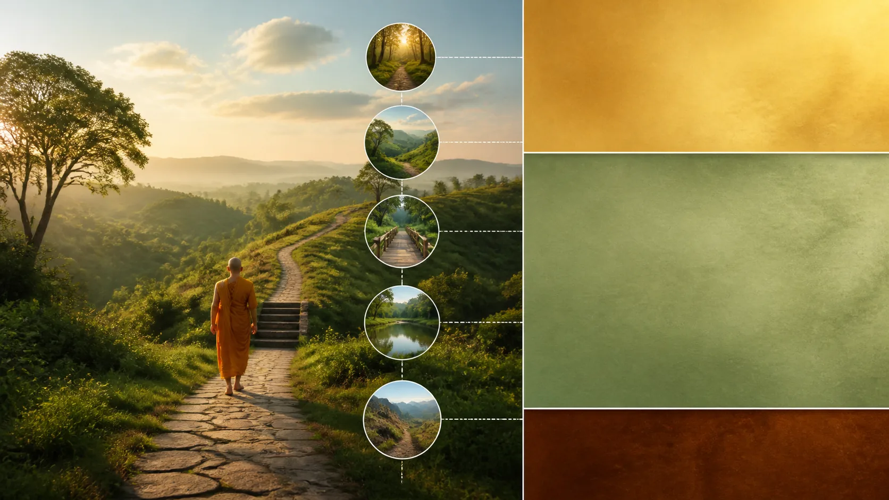

# Bản Đồ 31 Cõi — 11 Dục, 16 Sắc, 4 Vô Sắc

## 1. Hai Bản Đồ Có Hai Độ Phân Giải Khác Nhau

> **Pāli — MN 12, các đoạn `mn12:35.1`, `mn12:35.2`**
> *Pañca kho imā, sāriputta, gatiyo. Katamā pañca?*
>
> **Dịch nghĩa làm việc:** Này Sāriputta, có năm cảnh đến này. Năm là những gì?

> **Pāli — MN 12, đoạn `mn12:35.3`**
> *Nirayo, tiracchānayoni, pettivisayo, manussā, devā.*
>
> **Dịch nghĩa làm việc:** Địa ngục, loài vật, cảnh giới ngạ quỷ, loài người và chư thiên.

**Gati — đọc gần đúng “ga-ti” — cảnh đến hay hướng tái sinh** trong MN 12 được trình bày thành năm nhóm rộng. Đây không phải bảng 31 hàng. Chính điểm đơn giản ấy là chìa khóa đọc bài: Kinh sớm có nhiều tên cảnh giới, nhiều nhóm chư thiên và Phạm thiên, nhưng nguồn được dẫn ở đây không gom chúng thành một danh sách 31 cõi hoàn chỉnh.

Con số 31 thuộc một độ phân giải khác. Nó là bản đồ giáo khoa Theravāda hình thành bằng cách hệ thống hóa dữ liệu kinh điển qua Vi Diệu Pháp và truyền thống chú giải. Bản đồ ấy có giá trị nội bộ lớn: nó giúp sắp quan hệ giữa dục, các tầng thiền, quả nghiệp và tái sinh. Giá trị đó không cần được bảo vệ bằng tuyên bố sai rằng MN 12 tự liệt kê đủ 31 cõi.

Hai sơ đồ cũng trả lời hai câu hỏi khác nhau. Năm **gati** hỏi hữu tình đi về loại cảnh nào; bảng 31 phân loại các bình diện tồn tại chi tiết hơn theo dục giới, sắc giới và vô sắc giới. Một nhóm “chư thiên” trong sơ đồ năm cảnh có thể bao trùm nhiều mục của sơ đồ 31. Vì vậy, năm và 31 không phải hai phép đếm cạnh tranh của cùng một danh sách phẳng.

## 2. Mười Một Cõi Dục: Nơi Dục Cảm Còn Là Trục Chính

**Kāmaloka — đọc gần đúng “kaa-ma-lô-ka” — dục giới** là nhãn hệ thống chỉ các cảnh nơi dục cảm vẫn giữ vai trò cấu trúc. Theo bảng 31 truyền thống, mười một cõi này gồm bốn đọa xứ, cõi người và sáu cõi trời dục. “Dục” ở đây không chỉ có tình dục; nó chỉ sức hút của các đối tượng giác quan và sự tìm khoái lạc qua chúng.

Bốn đọa xứ thường được kể là địa ngục, súc sinh, ngạ quỷ và a-tu-la. Cõi người đứng riêng. Sáu cõi trời dục được hệ thống hóa từ nhiều tên xuất hiện rải rác trong Kinh: Tứ Đại Thiên Vương, Tam Thập Tam, Dạ-ma, Đâu-suất, Hóa Lạc và Tha Hóa Tự Tại. Đây là **lớp Vi Diệu Pháp/chú giải** khi chúng được xếp thành đúng một tổng số 11.

“Cõi cao hơn” không đồng nghĩa tốt tuyệt đối hoặc giải thoát. Hỷ lạc, tuổi thọ hay quyền lực lớn vẫn hữu hạn và có thể nuôi phóng dật. “Cõi thấp hơn” cũng không cho phép khinh miệt một loài hay một người đang khổ. Bản đồ nghiệp quả nhằm tăng trách nhiệm đối với tác ý, không cung cấp hệ đẳng cấp để hợp thức hóa bạo lực.

Không nên biến mười một cõi thành địa lý vật chất mà khoa học phải tìm bằng kính thiên văn. Kinh và hệ thống Theravāda đang dùng một vũ trụ luận tôn giáo về tái sinh. Khoa học hiện đại không xác nhận bảng này; khoảng trống dữ liệu vật lý cũng không phải bằng chứng cho nó.

## 3. Mười Sáu Cõi Sắc: Quan Hệ Với Jhāna Nhưng Không Phải Thang Máy Tự Động

> **Pāli — AN 4.123, các đoạn `an4.123:1.3`, `an4.123:1.5`**
> *Idha, bhikkhave, ekacco puggalo vivicceva kāmehi vivicca akusalehi dhammehi savitakkaṁ savicāraṁ vivekajaṁ pītisukhaṁ paṭhamaṁ jhānaṁ upasampajja viharati. Tattha ṭhito tadadhimutto tabbahulavihārī aparihīno kālaṁ kurumāno brahmakāyikānaṁ devānaṁ sahabyataṁ upapajjati.*
>
> **Dịch nghĩa làm việc:** Ở đây, này các tỳ-kheo, một người ly các dục và ly các pháp bất thiện, chứng và an trú sơ thiền, có tầm, có tứ, với hỷ lạc do ly sinh. Nếu đứng vững ở đó, hướng về đó, thường trú như vậy, không suy giảm, khi mạng chung người ấy tái sinh cộng trú với chư thiên thuộc chúng Phạm thiên.

**Rūpaloka — đọc gần đúng “ruu-pa-lô-ka” — sắc giới** trong hệ thống 31 cõi gồm mười sáu cảnh Phạm thiên. AN 4.123 là một mỏ neo Kinh sớm quan trọng: bài kinh nối sơ thiền với tái sinh giữa **brahmakāyika — chúng Phạm thiên**, rồi nối các jhāna sau với những nhóm khác. Nó chứng minh rằng quan hệ giữa định và cảnh Phạm thiên không phải hoàn toàn do sách giáo khoa muộn sáng tạo.

Nhưng AN 4.123 không tự đưa ra bảng mười sáu hàng. Cách chia ba cảnh tương ứng sơ thiền, ba cảnh tương ứng nhị thiền, ba cảnh tương ứng tam thiền, rồi bảy cảnh liên hệ tứ thiền là **sự hệ thống hóa Theravāda hậu kỳ**. Trong bảy cảnh cuối có các cõi Tịnh Cư dành cho bậc bất lai theo cách trình bày truyền thống.

Không nên đọc quan hệ này như máy bán vé: có một trải nghiệm dễ chịu rồi chắc chắn được “nâng cấp”. Chính đoạn Kinh có các điều kiện đứng vững, hướng tâm, thường trú và không suy giảm. Toàn bộ con đường còn đặt jhāna trên nền giới, chánh kiến và tuệ. Trạng thái tự báo cáo trên mạng không đủ xác định jhāna hay cảnh tái sinh.

## 4. Bốn Cõi Vô Sắc: Đối Tượng Tinh Tế Vẫn Thuộc Hữu

**Arūpaloka — đọc gần đúng “a-ruu-pa-lô-ka” — vô sắc giới** gồm bốn cảnh tương ứng bốn chứng đạt vô sắc: không gian vô biên, thức vô biên, vô sở hữu và phi tưởng phi phi tưởng. Tên các chứng này có mặt trong Kinh; việc đóng chúng thành bốn cõi cuối của bảng 31 là cách tổ chức Vi Diệu Pháp/chú giải.

“Vô sắc” không có nghĩa linh hồn thuần khiết thoát khỏi nhân quả. Trong Theravāda, đây vẫn là **bhava — hữu, sự hiện hữu có điều kiện**; tuổi thọ dù cực dài vẫn kết thúc. Một trạng thái không có kinh nghiệm thân thể theo mô tả truyền thống không trở thành Nibbāna. Bài 32 sẽ xử lý riêng đường biên này.

Cũng không nên đồng nhất bốn vô sắc với hôn mê, gây mê, phân ly, trải nghiệm cận tử hay “bardo”. Các hiện tượng ấy có văn cảnh và tiêu chuẩn khác. Một sự giống nhau về lời kể không thiết lập đồng nhất bản thể, càng không chứng minh một linh hồn rời thân đi qua tầng trung gian.

## 5. Provenance: Kinh Sớm, Vi Diệu Pháp Và Chú Giải Nói Ở Ba Tầng

> [!quote] Kinh sớm
> MN 12 nêu năm cảnh đến; AN 4.123 nối các jhāna với những nhóm Phạm thiên cụ thể. Nhiều kinh khác nhắc các cõi trời, Phạm thiên và chứng vô sắc riêng lẻ. Không đoạn Kinh nào được dùng trong bài này bị trình bày như một bảng 31 cõi hoàn chỉnh.

> [!info] Vi Diệu Pháp và chú giải
> *Vibhaṅga* cung cấp những phân tích canonical của Theravāda; truyền thống chú giải và các bản toát yếu như *Abhidhammattha-saṅgaha* ổn định cách đếm 11 dục, 16 sắc, 4 vô sắc. Bài này diễn giải hệ thống ấy, không trích giả một ấn bản chưa khóa.

> [!example] Diễn giải hiện đại của bài
> Cách gọi “độ phân giải”, cách đặt hai bản đồ cạnh nhau và các cảnh báo về địa lý vật chất là công cụ sư phạm hiện đại. Chúng giúp tránh lẫn nguồn, không phải thuật ngữ nguyên văn của MN 12 hay AN 4.123.

Phân tầng không nhằm hạ thấp Vi Diệu Pháp. Một truyền thống có quyền phát triển hệ thống nhất quán từ kho văn bản của mình. Kỷ luật chỉ yêu cầu gọi đúng tên: canonical không đồng nghĩa Kinh sớm; chú giải được tôn trọng không đồng nghĩa nguyên văn lời Phật trong một bài kinh.

## 6. Dùng Bản Đồ Để Tu, Không Dùng Nó Để Suy Đoán Người Khác

Giá trị thực hành trực tiếp nhất của bản đồ là phá ảo tưởng rằng khoái lạc, tuổi thọ và định sâu đồng nghĩa giải thoát. Mọi mục trong 31 cõi đều thuộc saṃsāra. Câu hỏi không chỉ là “làm sao lên cao?” mà là tham, sân, si có đang được nuôi không và con đường chấm dứt chúng có đang được thực hành không.

Không ai có đủ căn cứ từ bệnh tật, nghèo khó, khuyết tật hay hoàn cảnh sinh để kết luận nghiệp quá khứ hoặc “cõi trước” của người khác. Kamma trong Kinh không phải giấy phép quy lỗi nạn nhân. Khi một người khổ, nhiệm vụ trước mắt là không hại, giúp trong năng lực và hành động công bằng; không phải dựng tiểu sử siêu hình cho họ.

Nếu chọn tiếp nhận vũ trụ luận này theo niềm tin Theravāda, hãy giữ nó cùng thái độ khiêm tốn về điều chưa trực tiếp biết. Nếu tạm đình chỉ phán đoán, vẫn có thể hiểu cấu trúc văn bản và mục đích đạo đức của nó. Cả hai thái độ đều tốt hơn việc dùng vật lý lượng tử, vật chất tối, sóng vô tuyến hay trải nghiệm cá nhân làm “bằng chứng”.

## 7. Kỷ Luật Khẳng Định, Chuỗi Đọc Và Nguồn

> [!quote] Văn bản nói gì
> MN 12 liệt kê năm cảnh đến: địa ngục, loài vật, ngạ quỷ, người và chư thiên. AN 4.123 mô tả sơ thiền và sự tái sinh cộng trú với chúng Phạm thiên trong các điều kiện được nêu.

> [!info] Truyền thống giải thích gì
> Vi Diệu Pháp và chú giải Theravāda hệ thống hóa nhiều dữ liệu thành bảng 31 cõi: 11 dục, 16 sắc, 4 vô sắc. Đây là bản đồ truyền thống có nguồn riêng, không phải một danh sách được chép nguyên từ MN 12.

> [!example] Bài này suy luận gì
> Hai sơ đồ có độ phân giải và chức năng khác nhau; dùng chúng cùng nhau không tạo mâu thuẫn nếu không ép năm nhóm và 31 mục thành cùng một loại danh sách.

> [!warning] Điều chưa chứng minh
> Kính thiên văn, vật chất tối, cơ học lượng tử, hồi quy tiền kiếp hoặc cảm giác trong thiền không chứng minh bảng 31 cõi. Bản đồ không chứng minh linh hồn, bardo, “ma trận nhà tù”, địa vị bẩm sinh hay quyền phán nghiệp của người khác.

Đọc trước: [[28 - Bốn Tâm Vô Lượng Và Upekkhā]]. Đọc tiếp: [[30 - Chư Thiên, Phạm Thiên, A-tu-la Và Bốn Đọa Xứ]].

**Nguồn kinh điển chính xác**

- [MN 12, Mahāsīhanāda Sutta](https://suttacentral.net/mn12), đoạn 35.1–35.3 về năm cảnh đến.
- [AN 4.123, Paṭhamanānākaraṇa Sutta](https://suttacentral.net/an4.123), đoạn 1.3 và 1.5 về sơ thiền và chúng Phạm thiên.
- *Vibhaṅga*, nguồn Vi Diệu Pháp canonical; *Abhidhammattha-saṅgaha*, bản toát yếu hậu kỳ dùng ở đây để nhận diện truyền thống hệ thống hóa, chỉ diễn giải vì chưa khóa ấn bản trích.
- [SuttaCentral Editions](https://suttacentral.net/editions), thông tin ấn bản và giấy phép theo từng tài nguyên.

Ba khối Pāli được ghép theo thứ tự segment từ dữ liệu Bilara của ấn bản Mahāsaṅgīti trên SuttaCentral, kiểm tra ngày 2026-08-20. Bản Việt là bản dịch làm việc nguyên thủy của redpill.wiki đặt ngay dưới nguyên văn. `source_license_checked: true` được giữ có chủ ý cho đến khi hồ sơ giấy phép toàn bài được duyệt.
