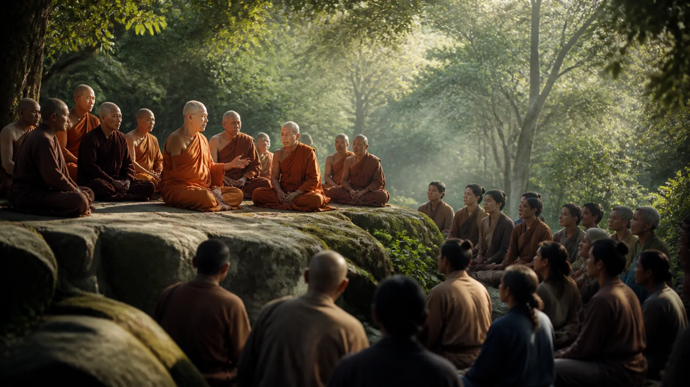
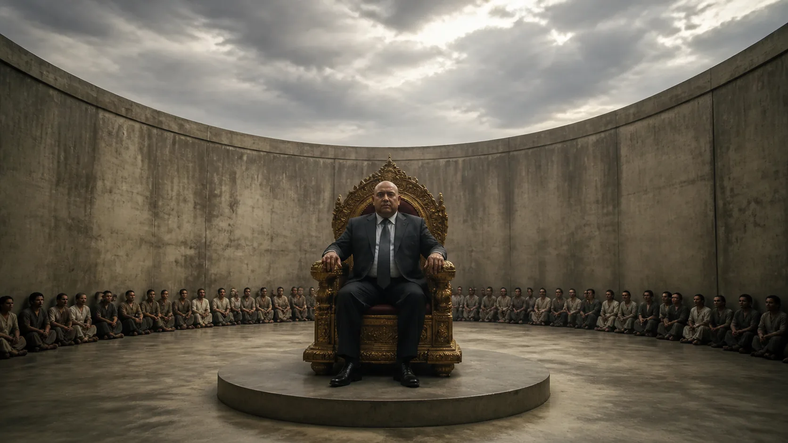
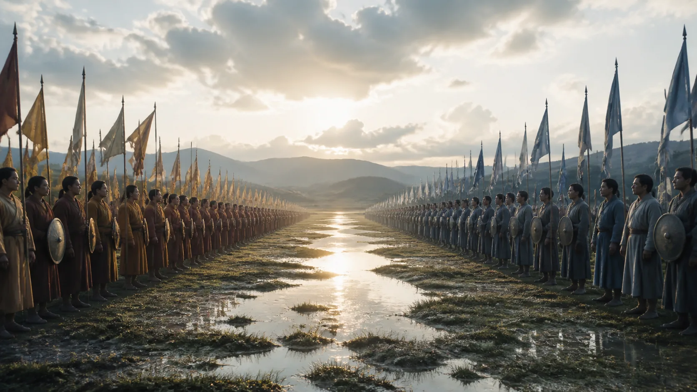
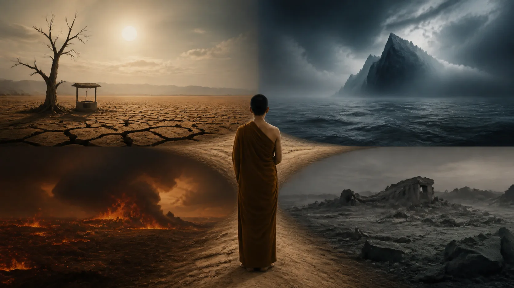
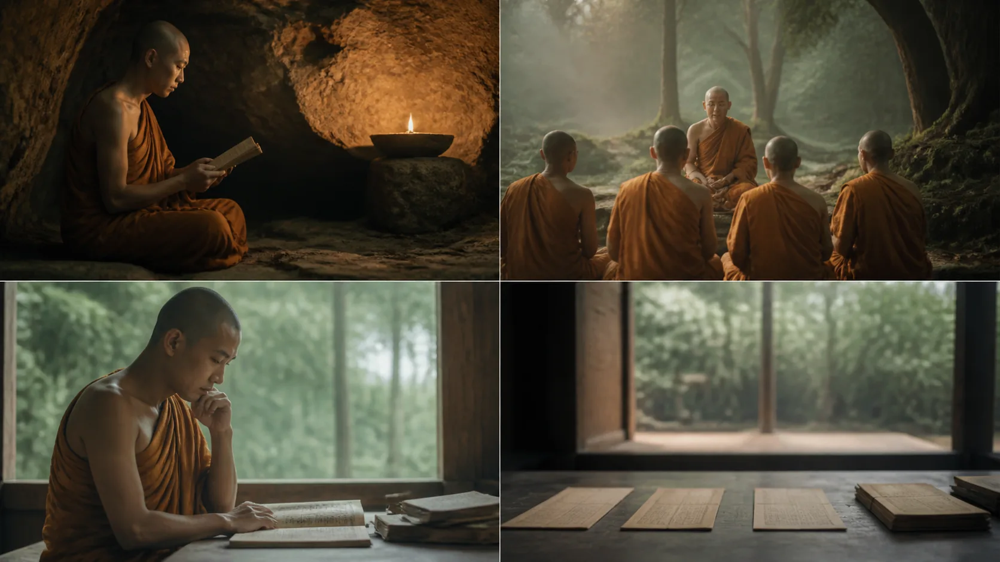

# Chư Thiên, Phạm Thiên, A-tu-la Và Bốn Đọa Xứ

<!-- vault-voice-opening:v1 -->

Trong vũ trụ Phật giáo, chư thiên vẫn chết, Phạm thiên vẫn có thể nhầm giới hạn của mình là tuyệt đối, A-tu-la vẫn bị xung đột kéo đi. Có quyền lực, ánh sáng hoặc tuổi thọ dài không đồng nghĩa giải thoát.

Điểm này đáng nhớ ngoài vũ trụ luận: trải nghiệm lớn, địa vị cao và cảm giác “mình đã thấy chân lý” đều có thể trở thành một cõi để cái tôi trú vào. Cao hơn không tự động là tự do hơn.

## 1. Deva Không Đồng Nghĩa Thượng Đế Sáng Tạo

**Deva — đọc gần đúng “đê-va” — thiên hay vị trời** là một hạng hữu tình trong vũ trụ luận Kinh Pāli, không phải từ mặc định chỉ một Thượng đế duy nhất, toàn năng và sáng tạo mọi vật. Chư thiên có thể sống lâu, có lạc và năng lực khác người, nhưng vẫn thuộc sinh tử. Họ xuất hiện như người nghe Pháp, người hộ trì, người còn tham-sân-si hoặc nhân vật trong truyện giáo giới.

Điểm này giúp tránh hai phép đồng nhất vội. Một là dịch mọi **deva** thành “God”, rồi gắn toàn bộ thần học sáng tạo vào Kinh. Hai là hạ tất cả xuống thành “ẩn dụ tâm lý” dù văn bản kể họ như tác nhân trong vũ trụ luận. Đọc có kỷ luật trước hết ghi nhận thể loại và cách Kinh tự trình bày, sau đó mới nói mình tin, đình chỉ phán đoán hay diễn giải biểu tượng.

Trong bản đồ 31 cõi, “chư thiên” là từ rộng: sáu nhóm trời dục, nhiều nhóm thuộc sắc giới và các hữu tình vô sắc đều được phân biệt kỹ. Nhưng bảng ấy là tầng hệ thống hóa. Một đoạn Kinh nói “devā” không tự động mang toàn bộ 31 hàng vào từng câu.

## 2. Baka Brahmā: Quyền Lực Và Tuổi Thọ Không Bảo Đảm Chánh Kiến

> [!quote] Kinh về ảo tưởng của Phạm thiên Baka — Trung Bộ Kinh
> Đoạn Kinh nêu rằng khi điều ấy được nói, này các tỳ-kheo, ta nói với Baka Phạm thiên: “Quả thật, Baka Phạm thiên đã rơi vào vô minh; quả thật, Baka Phạm thiên đã rơi vào vô minh.
>
> **Pāli**
> *Evaṁ vutte, ahaṁ, bhikkhave, bakaṁ brahmānaṁ etadavocaṁ: ‘avijjāgato vata bho bako brahmā, avijjāgato vata bho bako brahmā;*
>
> **Dịch Việt**
> Khi điều ấy được nói, này các tỳ-kheo, ta nói với Baka Phạm thiên: “Quả thật, Baka Phạm thiên đã rơi vào vô minh; quả thật, Baka Phạm thiên đã rơi vào vô minh.”
>
> <small>Nguồn kiểm chứng: <a href="https://suttacentral.net/mn49">MN 49, các đoạn 4.1, 4.2</a> · <i>Brahmanimantanika Sutta</i></small>

**Brahmā — đọc gần đúng “brăm-maa” — Phạm thiên** có thể chỉ một hạng hữu tình cao hoặc tên gọi một nhân vật trong Phạm giới. Trong [Ảo tưởng của Phạm thiên Baka](https://suttacentral.net/mn49), Baka cho cảnh giới của mình là thường còn, bền vững và không còn lối thoát nào cao hơn. Đức Phật không xác nhận tuyên bố ấy; Ngài gọi nó là vô minh.

Văn cảnh vì vậy bác cách dùng Baka làm bằng chứng cho một Đấng sáng tạo toàn tri. Bài Kinh mô tả một hữu tình quyền lực nhưng nhận thức bị giới hạn bởi cư trú quá lâu và quên nguồn gốc trước đó. Cao hơn người không đồng nghĩa tuyệt đối; sống lâu không đồng nghĩa bất tử; được tùy tùng tôn kính không đồng nghĩa thấy đúng.

Đây cũng là một bài học về quyền lực tôn giáo. Danh xưng lớn, trải nghiệm đặc biệt và hội chúng đông không miễn một tuyên bố khỏi thẩm tra. Tuy nhiên, bài không cho phép đồng nhất bất kỳ tôn giáo hữu thần hiện đại nào với Baka. So sánh liên truyền thống cần nghiên cứu riêng, không thể được suy ra từ hai segment.

## 3. Năm Cảnh Đến Và Trọng Tâm Tác Ý Trong [Các sứ giả của già, bệnh và chết](https://suttacentral.net/mn130)

> [!quote] Kinh về các sứ giả của già, bệnh và chết — Trung Bộ Kinh
> Đoạn Kinh nêu rằng cũng vậy, này các tỳ-kheo, với thiên nhãn thanh tịnh vượt quá loài người, ta thấy các hữu tình chết đi và tái sinh, thấp kém và cao quý, đẹp và xấu, đi đến cảnh lành và cảnh dữ; ta hiểu các hữu tình đi theo nghiệp.
>
> **Pāli**
> *evameva kho ahaṁ, bhikkhave, dibbena cakkhunā visuddhena atikkantamānusakena satte passāmi cavamāne upapajjamāne hīne paṇīte suvaṇṇe dubbaṇṇe, sugate duggate yathākammūpage satte pajānāmi: ‘ime vata bhonto sattā kāyasucaritena samannāgatā vacīsucaritena samannāgatā manosucaritena samannāgatā ariyānaṁ anupavādakā sammādiṭṭhikā sammādiṭṭhikammasamādānā; te kāyassa bhedā paraṁ maraṇā sugatiṁ saggaṁ lokaṁ upapannā. Ime vā pana bhonto sattā kāyasucaritena samannāgatā vacīsucaritena samannāgatā manosucaritena samannāgatā ariyānaṁ anupavādakā sammādiṭṭhikā sammādiṭṭhikammasamādānā; te kāyassa bhedā paraṁ maraṇā manussesu upapannā. Ime vata bhonto sattā kāyaduccaritena samannāgatā vacīduccaritena samannāgatā manoduccaritena samannāgatā ariyānaṁ upavādakā micchādiṭṭhikā micchādiṭṭhikammasamādānā; te kāyassa bhedā paraṁ maraṇā pettivisayaṁ upapannā. Ime vā pana bhonto sattā kāyaduccaritena samannāgatā vacīduccaritena samannāgatā manoduccaritena samannāgatā ariyānaṁ upavādakā micchādiṭṭhikā micchādiṭṭhikammasamādānā; te kāyassa bhedā paraṁ maraṇā tiracchānayoniṁ upapannā. Ime vā pana bhonto sattā kāyaduccaritena samannāgatā vacīduccaritena samannāgatā manoduccaritena samannāgatā ariyānaṁ upavādakā micchādiṭṭhikā micchādiṭṭhikammasamādānā; te kāyassa bhedā paraṁ maraṇā apāyaṁ duggatiṁ vinipātaṁ nirayaṁ upapannā’ti.*
>
> **Dịch Việt**
> Cũng vậy, này các tỳ-kheo, với thiên nhãn thanh tịnh vượt quá loài người, ta thấy các hữu tình chết đi và tái sinh, thấp kém và cao quý, đẹp và xấu, đi đến cảnh lành và cảnh dữ; ta hiểu các hữu tình đi theo nghiệp. Những vị có thân hành, khẩu hành, ý hành tốt, không phỉ báng các bậc cao quý, có chánh kiến và nhận làm hành động phù hợp chánh kiến, sau khi thân hoại mạng chung sinh vào cõi trời hoặc giữa loài người. Những vị có thân hành, khẩu hành, ý hành xấu, phỉ báng các bậc cao quý, có tà kiến và nhận làm hành động phù hợp tà kiến, sinh vào cảnh ngạ quỷ, loài vật hoặc cảnh khổ, cảnh dữ, đọa xứ, địa ngục.
>
> <small>Nguồn kiểm chứng: <a href="https://suttacentral.net/mn130">MN 130, đoạn 2.2</a> · <i>Devadūta Sutta</i></small>

[Các sứ giả của già, bệnh và chết](https://suttacentral.net/mn130) nêu trời, người, ngạ quỷ, loài vật và địa ngục trong một đoạn nhân quả đạo đức. Trọng tâm là **yathākammūpaga — đi theo nghiệp**, không phải một linh hồn bị vị thần xét xử và chuyển phòng. Nghiệp được mô tả qua hành vi thân, lời và ý cùng kiến chấp; bài không thiết lập “sổ điểm vũ trụ” có một quản trị viên toàn năng.

Đoạn Kinh không cấp cho người đọc năng lực chẩn đoán cảnh tái sinh của cá nhân. Ta không được nhìn một tai nạn, bệnh tật hay nghèo khó rồi tuyên bố đó là quả của một tội cụ thể. Các kinh khác cũng cảnh báo tính phức tạp của quả nghiệp. Giá trị gần nhất là xem lựa chọn hiện tại của chính mình, không biến vũ trụ luận thành công cụ làm nhục người đang khổ.

## 4. A-tu-la Trong [Các bài kinh về Sakka, chư thiên và a-tu-la](https://suttacentral.net/sn11): Đối Thủ Của Chư Thiên, Không Phải Quỷ Tuyệt Đối

> [!quote] Kinh về tinh tấn giữa cuộc chiến trời và a-tu-la — Tương Ưng Bộ Kinh
> Đoạn Kinh nêu rằng thuở trước, này các tỳ-kheo, một trận chiến giữa chư thiên và a-tu-la đã dàn ra; rồi Sakka, vua chư thiên, nói với chư thiên cõi Tam Thập Tam: “Này các bạn, nếu khi ra trận, chư thiên khởi sợ hãi, kinh hoàng hay dựng…
>
> **Pāli**
> *“Bhūtapubbaṁ, bhikkhave, asurā deve abhiyaṁsu. ‘ete, tāta suvīra, asurā deve abhiyanti. Gaccha, tāta suvīra, asure paccuyyāhī’ti.*
>
> **Dịch Việt**
> Thuở trước, này các tỳ-kheo, một trận chiến giữa chư thiên và a-tu-la đã dàn ra. Rồi Sakka, vua chư thiên, nói với chư thiên cõi Tam Thập Tam: “Này các bạn, nếu khi ra trận, chư thiên khởi sợ hãi, kinh hoàng hay dựng tóc gáy, lúc ấy hãy nhìn lên đỉnh cờ của ta.”
>
> <small>Nguồn kiểm chứng: <a href="https://suttacentral.net/sn11.1">SN 11.1, các đoạn 2.1, 2.3, 2.4</a> · <i>Suvīra Sutta</i></small>

**Asura — đọc gần đúng “a-su-ra” — a-tu-la** trong [Các bài kinh về Sakka, chư thiên và a-tu-la](https://suttacentral.net/sn11) xuất hiện như một tập thể đối địch với chư thiên trong vũ trụ luận tự sự. Họ không đơn giản là Satan hay một chủng quỷ ác tuyệt đối. Các truyện trong phẩm này dùng chiến tranh, quyền lực, nhẫn nhục và lãnh đạo để dạy; không phải mọi hành vi của phe trời vì thế đều tự động thành chuẩn đạo đức.

Trong bảng 31 cõi Theravāda phổ biến, a-tu-la được đặt trong bốn đọa xứ. Đây là **lớp Vi Diệu Pháp/chú giải**. [Tinh tấn giữa cuộc chiến trời và a-tu-la](https://suttacentral.net/sn11.1) cho thấy deva và asura là hai lớp đối thủ trong truyện, nhưng ba segment không tự nói “a-tu-la là hàng thứ tư trong bảng 31”. Ghép hai nguồn được phép khi nhãn xuất xứ vẫn còn nhìn thấy.

Không nên đồng nhất a-tu-la với người ngoài tôn giáo, kẻ thù chính trị hay một nhóm sắc tộc. Vũ trụ luận không cung cấp nhãn phi nhân hóa cho người sống. Càng không có cơ sở biến truyện chiến trận thành chỉ dẫn bạo lực hiện đại.

## 5. Bốn Đọa Xứ: Khổ Không Phải Bản Án Vĩnh Viễn

**Apāya — đọc gần đúng “a-paa-ya” — cảnh suy đọa hay đọa xứ** trong hệ thống truyền thống gồm địa ngục, súc sinh, ngạ quỷ và a-tu-la. [Lời tuyên bố lớn về năng lực giác ngộ](https://suttacentral.net/mn12) và [Các sứ giả của già, bệnh và chết](https://suttacentral.net/mn130) nêu ba nhóm đầu rõ trong danh sách cảnh đến; việc đặt a-tu-la làm mục thứ tư trong một bộ cố định thuộc hệ thống Theravāda được chuẩn hóa về sau.

Địa ngục Theravāda không phải án vĩnh cửu do một đấng sáng tạo tuyên. Quả khổ có thể kéo dài nhưng hữu hạn theo điều kiện nghiệp. Súc sinh là một cảnh tái sinh, không phải lý do coi động vật chỉ như đồ vật. Ngạ quỷ được triển khai phong phú trong *Petavatthu* và chú giải; không phải mọi chuyện người chết đều là dữ kiện lịch sử có thể kiểm tra. A-tu-la gắn với xung đột, ganh cạnh và thất thế trong nhiều cách kể.

Ngôn ngữ “đọa” dễ bị lạm dụng để gây sợ. Bài học đạo đức không cần hình ảnh tra tấn đồ họa hay lời dọa trẻ em. Khi giảng, nên nhấn mạnh tác ý, khả năng đổi hướng hiện tại, lòng bi đối với hữu tình khổ và mục tiêu vượt toàn bộ sinh tử. Không ai bị kết án bằng một bản chất bất biến.

## 6. Provenance Và Cách Đọc Hiện Đại Có Giới Hạn

> [!quote] Kinh sớm
> [Ảo tưởng của Phạm thiên Baka](https://suttacentral.net/mn49) phê phán chấp thường của Baka Phạm thiên. [Các sứ giả của già, bệnh và chết](https://suttacentral.net/mn130) đặt trời, người, ngạ quỷ, loài vật và địa ngục trong quan hệ với hành vi và kiến. [Tinh tấn giữa cuộc chiến trời và a-tu-la](https://suttacentral.net/sn11.1) kể chư thiên và a-tu-la như hai bên của một trận chiến.

> [!info] Vi Diệu Pháp và chú giải
> Truyền thống hệ thống hóa các hạng hữu tình vào bảng 31 cõi, đặt a-tu-la trong bốn đọa xứ và khai triển chi tiết từng cảnh. *Petavatthu* thuộc Tiểu Bộ của truyền thống Pāli; các lớp chú giải tiếp tục mở rộng truyện và cơ chế. Không trộn tất cả thành một niên đại hay một giọng nguồn.

> [!example] Diễn giải hiện đại
> Có thể dùng các nhân vật như gương soi cho kiêu mạn, ganh cạnh hoặc thiếu thốn, nhưng đó là phép đọc ứng dụng. Nó không chứng minh các cảnh chỉ là trạng thái tâm, cũng không chứng minh chúng là địa điểm vật lý.

Khoa học hiện đại không phải trọng tài xác nhận hay bác bỏ bằng vài phép so sánh tùy tiện. Tâm lý học về quyền lực có thể làm rõ một mẫu hành vi, nhưng không chứng minh Baka tồn tại. Thiên văn học không tìm thấy “tọa độ” cũng không tự bác một vũ trụ luận tái sinh; đồng thời, vật chất tối và đa vũ trụ không hề chứng minh chư thiên.

## 7. Kỷ Luật Khẳng Định, An Toàn Và Chuỗi Đọc

> [!quote] Văn bản nói gì
> [Ảo tưởng của Phạm thiên Baka](https://suttacentral.net/mn49) gọi chấp thường của Baka là vô minh. [Các sứ giả của già, bệnh và chết](https://suttacentral.net/mn130) mô tả hữu tình đi đến trời, người, ngạ quỷ, loài vật và địa ngục theo nghiệp. [Tinh tấn giữa cuộc chiến trời và a-tu-la](https://suttacentral.net/sn11.1) kể một trận chiến giữa chư thiên và a-tu-la.

> [!info] Truyền thống giải thích gì
> Vi Diệu Pháp và chú giải đặt các hạng này vào bản đồ chi tiết, trong đó a-tu-la cùng địa ngục, súc sinh và ngạ quỷ tạo thành bốn đọa xứ. Hệ thống ấy không được giả làm nguyên văn của riêng [Các sứ giả của già, bệnh và chết](https://suttacentral.net/mn130) hay [Tinh tấn giữa cuộc chiến trời và a-tu-la](https://suttacentral.net/sn11.1).

> [!example] Bài này suy luận gì
> Các cảnh báo về quyền lực tôn giáo, phi nhân hóa đối thủ và dạy trẻ không bằng kinh hãi là ứng dụng đạo đức hiện đại. Chúng phù hợp nguyên tắc không hại nhưng không phải câu chữ cổ.

> [!warning] Điều chưa chứng minh
> Ba bài Kinh không chứng minh một Thượng đế sáng tạo, linh hồn, bardo, “ma trận nhà tù”, quỷ tuyệt đối hay quyền đoán nghiệp người khác. Tâm lý học, thiên văn, vật lý lượng tử, trải nghiệm cận tử và trải nghiệm thiền không được dùng làm bằng chứng thay văn bản.

Nếu giáo lý địa ngục bị dùng để đe dọa, cưỡng phục, lấy tiền, cắt chăm sóc y tế hoặc giữ ai trong quan hệ bạo lực, hãy ưu tiên an toàn và tìm hỗ trợ thích hợp. Một giáo thọ không có quyền tuyên bố chắc chắn cảnh tái sinh của học viên hay người thân họ. Nỗi sợ dai dẳng, hoảng loạn hoặc ý nghĩ tự hại cần hỗ trợ sức khỏe tâm thần hay dịch vụ khẩn cấp địa phương, không phải tăng hình ảnh trừng phạt.

Đọc trước: [[29 - Bản Đồ 31 Cõi - 11 Dục, 16 Sắc, 4 Vô Sắc]]. Đọc tiếp: [[31 - Bốn Thánh Quả Và Mười Kiết Sử]].

**Nguồn kinh điển chính xác**

- [Ảo tưởng của Phạm thiên Baka — Trung Bộ Kinh](https://suttacentral.net/mn49), đoạn 4.1–4.2 về Baka Phạm thiên và vô minh.
- [Các sứ giả của già, bệnh và chết — Trung Bộ Kinh](https://suttacentral.net/mn130), đoạn 2.2 về các cảnh đến theo nghiệp.
- [Tinh tấn giữa cuộc chiến trời và a-tu-la — Tương Ưng Bộ Kinh](https://suttacentral.net/sn11.1), đoạn 2.1, 2.3–2.4 về chư thiên và a-tu-la trong trận chiến.
- *Petavatthu*, nguồn Tiểu Bộ về ngạ quỷ; chỉ được nhắc theo lớp nguồn, không trích một ấn bản chưa khóa.
- [SuttaCentral Editions](https://suttacentral.net/editions), thông tin ấn bản và giấy phép theo từng tài nguyên.

Ba khối Pāli được ghép theo thứ tự segment từ dữ liệu Bilara của ấn bản Mahāsaṅgīti trên SuttaCentral, kiểm tra ngày 2026-08-20. Bản Việt là bản dịch làm việc nguyên thủy của redpill.wiki đặt ngay dưới nguyên văn. `source_license_checked: true` được giữ có chủ ý cho đến khi hồ sơ giấy phép toàn bài được duyệt.
