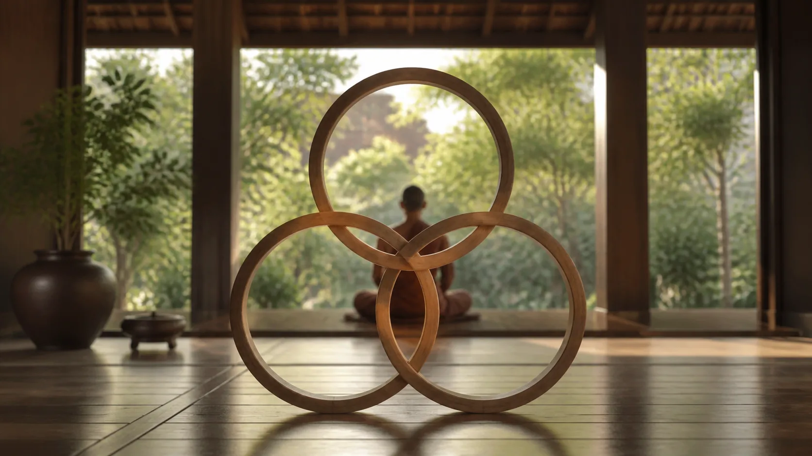
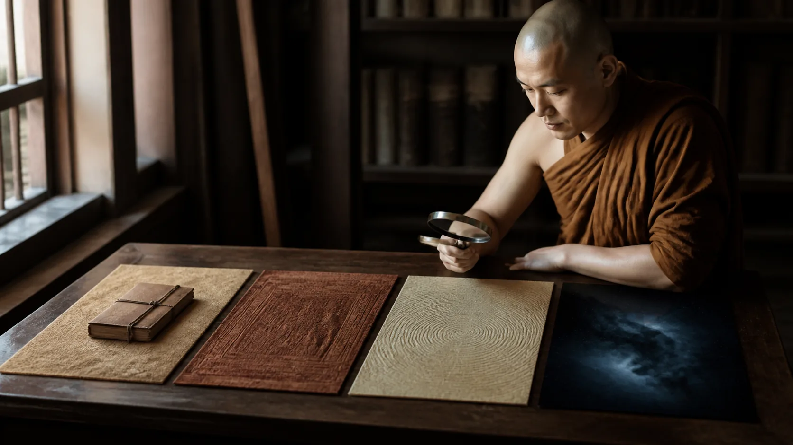

# Bốn Thánh Quả Và Mười Kiết Sử

<!-- vault-voice-opening:v1 -->

Các tầng Thánh quả rất dễ biến thành rank system tâm linh: ai ở tầng nào, ai đủ chuẩn, ai chỉ tưởng mình chứng. Khi quả vị thành status, con đường giải thoát lại cung cấp vật liệu cho so sánh và tự tôn.

Bốn quả và mười kiết sử hữu ích khi được đọc như bản đồ những trói buộc đang rơi, không phải bảng tên để tự phong. Câu hỏi gần hơn là: điều gì từng kéo mình đi mà bây giờ đã thật sự mất quyền lực?

## 1. Bốn Đạo-Quả Là Bản Đồ Chuyển Hóa, Không Phải Bốn Huy Hiệu

**Magga — đọc gần đúng “mắc-ga” — đạo, con đường hay sát-na con đường** và **phala — “pha-la” — quả, kết quả** là hai từ cần giữ cùng nhau. Truyền thống Theravāda nói bốn đạo và bốn quả: nhập lưu, nhất lai, bất lai và A-la-hán. Trong bài nhập môn, điều quan trọng hơn phép đếm tám là hướng vận hành: thực hành có cấu trúc làm suy yếu rồi đoạn trừ những ràng buộc cụ thể. Quả không phải phần thưởng do một quyền lực trao, còn đạo không phải một câu tự tuyên bố.

Bốn mức thường được gọi bằng tên người: **sotāpanna — người nhập lưu**, **sakadāgāmī — người trở lại một lần**, **anāgāmī — người không trở lại**, **arahant — bậc xứng đáng, đã hoàn tất việc cần làm**. Ngôn ngữ ấy dễ bị biến thành căn cước: “Tôi thuộc tầng nào?”, “Ai cao hơn ai?”. Nhưng mục đích sư phạm của bản đồ là nhận diện cái gì còn trói buộc, cái gì đã được tháo và việc học nào cần tiếp tục. Nếu danh hiệu làm tăng so sánh, phòng thủ và đòi đặc quyền, cách dùng ấy đang nuôi **māna — mạn**, một kiết sử trong chính bản đồ.

Kinh không cho phép suy ra quả vị chỉ từ cảm giác mạnh, ánh sáng nội tâm, vài ngày an lạc hay khả năng nói giáo lý trôi chảy. Một kinh nghiệm có thể có giá trị mà không cần nâng thành chứng đắc không thể đảo ngược. Tiêu chí an toàn hơn là thay đổi bền trong chánh kiến, giới hạnh, tham-sân-si và cách sống. Ngay cả việc đánh giá đó cũng cần khiêm tốn: người ngoài không thấy hết nội tâm; người trong cuộc lại dễ bị mong muốn và thiên kiến đánh lừa.

> [!provenance] Phân lớp xuất xứ
> **Kinh sớm:** các bài được dẫn dưới đây nói về dòng Bát chánh đạo, ba sự học, các kiết sử và những mức thành tựu. **Chú giải Theravāda:** hệ thống hóa quan hệ giữa từng sát-na đạo, quả và sự đoạn trừ kiết sử với độ chính xác kỹ thuật cao hơn. **Diễn giải của bài:** đọc bản đồ như công cụ kiểm tra chuyển hóa thay vì thang địa vị. Ba lớp này liên hệ nhưng không đồng nhất.

Không nên dùng quả vị để thiết lập quyền miễn trừ. Một giáo thọ tự nhận chứng đắc vẫn phải chịu chuẩn mực về tiền bạc, tình dục, quyền lực, sự thật và an toàn. Người học không mắc nợ sự phục tùng vì lời tuyên bố tâm linh. Trong Vinaya, việc tuyên bố sai thành tựu siêu nhân là vấn đề nghiêm trọng; trong đời sống hiện đại, cách xử lý là kiểm chứng hành vi và giữ ranh giới, không tổ chức săn phù thủy hay chẩn đoán tâm người khác.

## 2. “Dòng” Chính Là Bát Chánh Đạo

> [!quote] Kinh về dòng nhập lưu chính là Bát Chánh Đạo — Tương Ưng Bộ Kinh
> Đoạn Kinh nêu rằng này Sāriputta, người ta nói ‘dòng, dòng’; vậy dòng là gì?” “Bạch Thế Tôn, chính Bát chánh đạo cao quý này là dòng, tức là—
>
> **Pāli**
> *‘Soto, soto’ti hidaṁ, sāriputta, vuccati. Katamo nu kho, sāriputta, soto”ti? “Ayameva hi, bhante, ariyo aṭṭhaṅgiko maggo soto, seyyathidaṁ—*
>
> **Dịch Việt**
> “Này Sāriputta, người ta nói ‘dòng, dòng’. Vậy dòng là gì?” “Bạch Thế Tôn, chính Bát chánh đạo cao quý này là dòng, tức là—”
>
> <small>Nguồn kiểm chứng: <a href="https://suttacentral.net/sn55.5">SN 55.5, các đoạn 2.1, 2.2, 2.3</a> · <i>Dutiyasāriputta Sutta</i></small>

Đoạn ngắn này đặt trọng tâm rất rõ: **sota — dòng** không phải dòng năng lượng bí mật, huyết thống thiêng hay cộng đồng độc quyền; đó là Bát chánh đạo. “Nhập lưu” vì thế phải được hiểu trong quan hệ với chánh kiến, chánh tư duy, chánh ngữ, chánh nghiệp, chánh mạng, chánh tinh tấn, chánh niệm và chánh định. Cắt bỏ đạo đức hay trí tuệ rồi lấy một trải nghiệm làm toàn bộ tiêu chuẩn là rời phép định nghĩa của đoạn kinh.

Trong cùng bài, [Dòng nhập lưu chính là Bát Chánh Đạo](https://suttacentral.net/sn55.5) còn nêu bốn yếu tố hỗ trợ nhập lưu: gần gũi người chân chánh, nghe Chánh pháp, tác ý như lý và thực hành đúng pháp. Đây là một sinh thái học của việc học. Người học cần nguồn đáng tin, năng lực nghe, cách đặt câu hỏi đi đến nguyên nhân và một đời sống thử nghiệm điều đã hiểu. Không yếu tố nào tương đương việc sùng bái cá nhân.

**Sotāpatti — nhập lưu** chỉ một thay đổi về hướng và cấu trúc cái thấy, không phải nhân cách bỗng hoàn hảo. Công thức kiết sử thường gắn nhập lưu với đoạn trừ thân kiến, hoài nghi và chấp thủ giới-cấm. Người nhập lưu vẫn cần học; các phản ứng tham và sân chưa được mô tả là đã hết. Vì vậy, gắn cho họ sự toàn tri, bất khả sai hay kỹ năng ở mọi lĩnh vực là thêm điều Kinh không nói.

Đừng biến sự dè dặt thành phủ nhận mọi khả năng chuyển hóa. Bản đồ tuyên bố rằng có những bước ngoặt không chỉ là tâm trạng thoáng qua. Nhưng thái độ đúng với người chưa có thẩm quyền kiểm chứng là giữ hai điều cùng lúc: nghiêm túc với khả năng giải thoát và thận trọng với lời nhận cấp bậc. Ta có thể học đạo mà không cần chốt hồ sơ siêu hình của mình hay người khác.

Trong thực hành hằng ngày, câu hỏi hữu ích không phải “Tôi đã vào dòng chưa?” mà là: quyết định này có nằm trong tám chi không; cái thấy này làm tham-sân-si giảm hay tăng; khi bị sửa, tôi tìm sự thật hay bảo vệ hình ảnh? Những câu hỏi ấy không thay tiêu chuẩn kinh điển, nhưng đưa bản đồ trở lại chức năng đào luyện.

## 3. Mười Kiết Sử: Năm Thấp Và Năm Cao

> [!quote] Kinh về mười kiết sử gồm năm thấp và năm cao — Tăng Chi Bộ Kinh
> Đoạn Kinh nêu rằng có năm kiết sử thấp và năm kiết sử cao; năm kiết sử thấp là gì.
>
> **Pāli**
> *Pañcorambhāgiyāni saṁyojanāni, pañcuddhambhāgiyāni saṁyojanāni. Katamāni pañcorambhāgiyāni saṁyojanāni? Sakkāyadiṭṭhi, vicikicchā, sīlabbataparāmāso, kāmacchando, byāpādo— imāni pañcorambhāgiyāni saṁyojanāni. Katamāni pañcuddhambhāgiyāni saṁyojanāni? Rūparāgo, arūparāgo, māno, uddhaccaṁ, avijjā— imāni pañcuddhambhāgiyāni saṁyojanāni.*
>
> **Dịch Việt**
> Có năm kiết sử thấp và năm kiết sử cao. Năm kiết sử thấp là gì? Thân kiến, hoài nghi, chấp thủ giới và nghi thức, dục tham, sân: đó là năm kiết sử thấp. Năm kiết sử cao là gì? Tham đối với sắc, tham đối với vô sắc, mạn, trạo cử và vô minh: đó là năm kiết sử cao.
>
> <small>Nguồn kiểm chứng: <a href="https://suttacentral.net/an10.13">AN 10.13, các đoạn 1.3, 1.4, 1.5, 1.6, 2.1, 2.2, 2.3</a> · <i>Saṁyojana Sutta</i></small>

**Saṁyojana — đọc gần đúng “săm-yô-gia-na” — sự trói buộc, kiết sử** không phải vật thể ẩn trong thân. Đó là cách gọi các cấu trúc nhận thức và xu hướng khiến hữu tiếp tục bị buộc vào khổ. “Thấp” và “cao” không phải xấu hổ và sang trọng; chúng phân nhóm những ràng buộc thuộc dục giới và những ràng buộc vi tế còn lại.

Ba kiết sử đầu cần đọc cẩn thận. **Sakkāyadiṭṭhi** là quan điểm đồng nhất một hay nhiều uẩn với tự ngã hoặc sở hữu của tự ngã, không đơn giản là dùng đại từ “tôi”. **Vicikicchā** là hoài nghi làm tê liệt đối với Phật, Pháp, Tăng và sự học, không phải cấm đặt câu hỏi. **Sīlabbataparāmāsa** là nắm giữ giới và nghi thức như tự chúng đủ sức thanh tịnh, không phải từ bỏ giới. Đoạn ba điều này không cho phép người ta sống vô trách nhiệm rồi gọi đó là “vượt nghi thức”.

Hai kiết sử thấp còn lại là **kāmacchanda — dục tham** và **byāpāda — ác ý, sân hại**. Trong lộ trình bốn quả, nhất lai gắn với việc tham, sân, si trở nên mỏng; bất lai gắn với việc năm kiết sử thấp được đoạn. “Mỏng” khác “hết”: điểm này bảo vệ người học khỏi lý tưởng hóa một mức giữa thành vô nhiễm hoàn toàn.

Năm kiết sử cao cho thấy định sâu và cõi sống tinh tế vẫn không đồng nghĩa giải thoát. Tham sắc và tham vô sắc có thể là dính mắc vào các trạng thái thiền hay kiểu hiện hữu thanh cao; mạn vẫn tạo phép đo “tôi hơn, bằng, kém”; trạo cử là bất ổn vi tế; vô minh là không thấy đúng thực tại theo bốn sự thật. Bản đồ kết thúc không ở trải nghiệm cao mà ở hết tham, sân và si.

## 4. Bốn Mức Và Những Gì Được Tháo Gỡ

Ở mức **nhập lưu**, ba kiết sử đầu được nói là đoạn trừ. Đây là việc thay đổi nền của cái thấy và niềm tin thực hành, không phải xóa mọi thói quen tâm lý. Các mô tả kinh điển còn nói số lần tái sinh được giới hạn và không rơi vào đọa xứ. Những mệnh đề ấy thuộc thế giới quan nghiệp-tái sinh của Kinh; không nên đổi chúng thành dự báo tâm lý học rồi tuyên bố khoa học đã xác nhận.

Ở mức **nhất lai**, ba kiết sử đầu đã đoạn và tham-sân-si được làm mỏng. Tên gọi gắn với “trở lại thế giới này một lần nữa”. Điều đáng thực hành là sự suy giảm sức thống trị của tham và sân; điều không nên làm là lập bảng điểm cảm xúc. Một cơn giận xuất hiện, cường độ của nó, thời gian kéo dài và hành vi theo sau là các biến khác nhau. Kinh không cung cấp một ứng dụng đo phần trăm giác ngộ.

Ở mức **bất lai**, năm kiết sử thấp được đoạn: ba điều đầu cộng dục tham và sân. “Không trở lại” trong mô tả truyền thống có nghĩa không tái sinh trở lại dục giới, chứ không phải người ấy rời xã hội, không còn quan tâm gia đình hay có quyền coi thường thân. Người còn sống vẫn ăn, ngủ, bệnh, giao tiếp và chịu hậu quả thực tế.

Ở mức **A-la-hán**, năm kiết sử cao cũng được đoạn. Tham sắc, tham vô sắc, mạn, trạo cử và vô minh không còn buộc. Đây là hoàn tất lộ trình giải thoát trong Theravāda, không phải trở thành một linh hồn tối cao hay hợp nhất một Đại Ngã. Vì học thuyết vô ngã, không nên lén đưa một bản thể vĩnh cửu vào sau danh từ “A-la-hán”.

Truyền thống chú giải phân biệt mỗi **đạo** là nhận biết và đoạn trừ, mỗi **quả** là hưởng kết quả giải thoát tương ứng; từ đó thành bốn cặp, tám hạng thánh. Đây là hệ thống giải thích Theravāda có ảnh hưởng lớn. Các bài kinh thường trình bày nhiều công thức và góc nhìn hơn, nên không được lấy mọi chi tiết sát-na học hậu kỳ rồi gắn nhãn “nguyên văn Kinh sớm”.

> [!provenance] Chú giải và hệ thống hậu kỳ
> Cách ghép chính xác từng sát-na đạo-quả, số tâm và cơ chế đoạn kiết sử thuộc lớp Abhidhamma/chú giải được hệ thống hóa về sau. Bài này dùng hệ ấy như bản đồ Theravāda, đồng thời giữ riêng bằng chứng trực tiếp từ [Dòng nhập lưu chính là Bát Chánh Đạo](https://suttacentral.net/sn55.5), [Mười kiết sử gồm năm thấp và năm cao](https://suttacentral.net/an10.13) và [Ba sự học gom toàn bộ việc tu](https://suttacentral.net/an3.88).

## 5. Ba Sự Học Gom Toàn Bộ Việc Tu

> [!quote] Kinh về ba sự học gom toàn bộ việc tu — Tăng Chi Bộ Kinh
> Đoạn Kinh nêu rằng có ba sự học mà toàn bộ điều ấy được quy tụ vào: học về giới cao hơn, học về tâm cao hơn và học về tuệ cao hơn.
>
> **Pāli**
> *Tisso imā, bhikkhave, sikkhā yatthetaṁ sabbaṁ samodhānaṁ gacchati. Adhisīlasikkhā, adhicittasikkhā, adhipaññāsikkhā—*
>
> **Dịch Việt**
> Này các tỳ-kheo, có ba sự học mà toàn bộ điều ấy được quy tụ vào: học về giới cao hơn, học về tâm cao hơn và học về tuệ cao hơn.
>
> <small>Nguồn kiểm chứng: <a href="https://suttacentral.net/an3.88">AN 3.88, các đoạn 1.2, 1.4</a> · <i>Tatiyasikkhā Sutta</i></small>

Ba sự học ngăn bản đồ quả vị biến thành suy đoán. **Adhisīla** hỏi hành vi và quan hệ đã bớt gây hại chưa. **Adhicitta** hỏi tâm có được huấn luyện để không bị triền cái và phản ứng kéo đi không. **Adhipaññā** hỏi vô thường, khổ, vô ngã và duyên khởi có được thấy đến mức buông chấp không. Chúng là ba mặt hỗ trợ nhau, không phải ba môn học để thi lấy chứng chỉ.

Giới mà thiếu định có thể trở thành căng cứng; định thiếu giới có thể làm quyền lực tinh thần nguy hiểm hơn; cả hai thiếu tuệ có thể chỉ tạo một bản ngã “thanh tịnh”. Ngược lại, nói tuệ cao mà hành vi lừa dối, bóc lột và không chịu sửa là dấu hiệu cần dừng lại. Quả của việc học phải hiện trong cách ta sử dụng lời nói, dục, tiền, quyền và sự chú ý.

Một chương trình tuần có thể rất bình thường: giữ năm giới có chủ ý; mỗi ngày dành thời gian ổn định tâm; đọc một đoạn kinh có mã; xem lại một phản ứng tham hoặc sân theo điều kiện sinh-diệt; sửa một hậu quả đã gây. Không bước nào tự chứng minh quả vị. Chúng chỉ xây điều kiện để con đường thực sự được sống.

Nếu thiền gây mất ngủ kéo dài, hưng cảm, hoảng loạn, phân ly hay nghe-thấy điều thúc ép hành vi nguy hiểm, hãy giảm hoặc dừng, tìm giáo thọ có đạo đức và hỗ trợ y tế phù hợp. Gọi mọi bất ổn là “phá kiết sử” có thể trì hoãn chăm sóc. Bản đồ giải thoát không thay thế chẩn đoán sức khỏe.

## 6. Tự Đánh Giá Mà Không Tự Phong Hay Săn Cấp Bậc

Có thể dùng mười kiết sử như danh sách quan sát, nhưng không như bảng tự cấp bằng. Khi ý kiến bị bác, thân kiến và mạn vận hành ra sao? Khi chưa biết, hoài nghi dẫn đến khảo sát hay tê liệt? Khi giữ một nghi thức, ta hiểu mục đích hay mặc cả để được thanh tịnh? Khi dễ chịu sâu xuất hiện, tham sắc-vô sắc có đang xây một căn cước mới? Đây là câu hỏi tiến trình.

Một dấu hiệu lành là khả năng sửa sai mà không sụp đổ hay phản công. Người học thấy hành vi bất thiện, nhận trách nhiệm, bồi hoàn khi thích hợp và điều chỉnh điều kiện. Họ không cần dùng “vô ngã” để phủ nhận nạn nhân, “nghiệp” để đổ lỗi, hay “quả vị” để đóng cuộc đối thoại. Đó chưa phải phép chứng nhận thánh quả; chỉ là đất tốt cho ba sự học.

Trong cộng đồng, không nên mở trò đoán cấp bậc. Nó khuyến khích trình diễn, bè phái và xâm phạm đời tư. Hãy đánh giá giáo thọ bằng điều có thể quan sát: nguồn được dẫn đúng không, tiền và quyền có minh bạch không, ranh giới tình dục có rõ không, phản hồi về tổn hại có được tiếp nhận không. Một cộng đồng an toàn không cần biết nội chứng để áp dụng chuẩn đạo đức.

Nếu chính mình có trải nghiệm dường như thay đổi tận gốc, hãy để thời gian kiểm nghiệm. Ghi văn cảnh, điều gì thật sự đã đổi, điều gì còn nguyên; tiếp tục giữ giới và tránh công bố vội. Trao đổi kín với người hướng dẫn đáng tin có thể hữu ích, nhưng không giao quyền tự chủ, tài sản hay thân thể để đổi lấy xác nhận.

> [!interpretation] Diễn giải hiện đại có giới hạn
> Nhật ký, tiêu chí an toàn cộng đồng và ngôn ngữ về thiên kiến là phương tiện hiện đại của bài này. Chúng không phải thước đo canonical và không chứng minh hay bác bỏ quả vị; chúng giúp ngăn bản đồ tôn giáo bị dùng để thao túng.

## 7. Kỷ Luật Khẳng Định, Chuỗi Đọc Và Nguồn

**Văn bản nói gì?** [Dòng nhập lưu chính là Bát Chánh Đạo](https://suttacentral.net/sn55.5) gọi Bát chánh đạo là “dòng”; [Mười kiết sử gồm năm thấp và năm cao](https://suttacentral.net/an10.13) chia mười kiết sử thành năm thấp và năm cao; [Ba sự học gom toàn bộ việc tu](https://suttacentral.net/an3.88) gom việc học vào giới cao hơn, tâm cao hơn và tuệ cao hơn. Các kinh khác triển khai đặc điểm bốn mức, nhưng ba trích đoạn ở đây là các neo nguồn đã khóa cho bài.

**Truyền thống giải thích gì?** Theravāda ghép bốn đạo với bốn quả, liên hệ từng mức với sự đoạn trừ kiết sử và hệ thống hóa chúng trong Abhidhamma/chú giải. Hệ thống ấy là phần quan trọng của truyền thống, nhưng không nên được trình bày như thể toàn bộ chi tiết nằm trong một đoạn Kinh sớm duy nhất.

**Bài này suy luận gì?** Cách đọc ít gây hại nhất là xem bốn mức như bản đồ chuyển hóa và trách nhiệm, không như huy hiệu căn cước. Đây là lựa chọn biên tập và thực hành, không phải một câu trích nguyên văn.

**Điều gì chưa được chứng minh?** Khoa học hiện đại chưa chứng minh bốn quả, số lần tái sinh hay việc đoạn kiết sử bằng thiết bị đo. Trạng thái não, báo cáo chủ quan và thay đổi hành vi có thể được nghiên cứu, nhưng không đồng nhất với tiêu chuẩn giải thoát của Kinh. Không nên dùng khoa học thần kinh để cấp hoặc tước quả vị.

Đọc trước: [[30 - Chư Thiên, Phạm Thiên, A-tu-la Và Bốn Đọa Xứ]]. Đọc tiếp: [[32 - Nibbāna - Không Phải Cõi Thứ 32]].

**Nguồn và giấy phép:** Pāli lấy theo đúng segment ID từ Bilara/SuttaCentral, nhánh `published`, root Pāli MS, truy cập ngày 2026-08-20: [Mười kiết sử gồm năm thấp và năm cao](https://suttacentral.net/an10.13) (`an10.13:1.3–2.3` theo danh sách ID ở khối trích), [Ba sự học gom toàn bộ việc tu](https://suttacentral.net/an3.88) (`an3.88:1.2`, `1.4`), [Dòng nhập lưu chính là Bát Chánh Đạo](https://suttacentral.net/sn55.5) (`sn55.5:2.1–2.3`). Các bản dịch tiếng Việt ngay dưới Pāli là bản dịch làm việc nguyên gốc của redpill.wiki, không sao chép bản dịch hiện đại. Trạng thái kiểm tra giấy phép toàn bộ nguồn vẫn là `source_license_checked: true`; vì vậy bài chỉ trích root Pāli và chưa tái bản bản dịch bên thứ ba.
