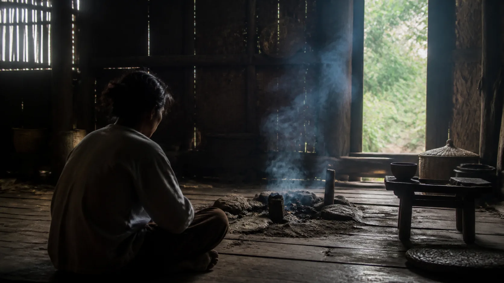

# Nibbāna — Không Phải Cõi Thứ 32

## 1. Đừng Đặt Nibbāna Lên Trên Cùng Một Tấm Bản Đồ Cõi

**Nibbāna — đọc gần đúng “níp-ba-na” — sự tắt nguội, giải thoát** là đích của con đường Theravāda, nhưng gọi nó “cõi thứ 32” làm sai loại khái niệm. Các cõi là những kiểu tái sinh hay hiện hữu có điều kiện; chúng thuộc **saṅkhata — cái được tạo tác, có điều kiện**. Nibbāna được gọi **asaṅkhata — không bị tạo tác, vô vi**. Thêm nó như tầng cao nhất của cùng bảng là biến điều vượt ngoài tiến trình sinh-diệt thành một mục nữa trong tiến trình ấy.

Ẩn dụ “tắt” cũng dễ bị hiểu sai. Trong bối cảnh Ấn Độ cổ, lửa tắt khi không còn nhiên liệu; trọng tâm là hết điều kiện nuôi cháy, không phải một vật thể bị tiêu hủy thành hư vô. Trong thực hành, nhiên liệu được nêu rõ là tham, sân và si. Vì thế, Nibbāna không đồng nghĩa cái chết, gây tê cảm xúc hay trốn khỏi đời.

Nibbāna cũng không phải một **self**, **soul**, linh hồn hay chân ngã bất tử được tìm thấy sau khi năm uẩn rơi đi. Nếu ta nói “một cái tôi thật đi vào Nibbāna”, ta đã mang đúng cấu trúc sở hữu và đồng nhất mà vô ngã thẩm tra. Kinh dùng nhiều phủ định để chặn sự nắm bắt, nhưng phủ định không cấp giấy phép lén đặt một bản thể thường hằng phía sau ngôn từ.

Ngược lại, không nên kết luận Nibbāna là hư vô hoặc sự tiêu diệt một con người có thật. Quan điểm đoạn diệt giả định trước một tự ngã thật rồi nói tự ngã ấy bị hủy. Phật giáo từ chối tiền đề ấy: con người quy ước vận hành theo duyên, không có linh hồn độc lập để bị tiêu diệt. Sự chấm dứt được nhắm đến là chấm dứt tham ái, chấp thủ, hữu và khổ.

> [!provenance] Phân lớp xuất xứ
> **Kinh sớm:** Ud 8.3, Iti 44 và SN 43.1 cung cấp ba neo ngôn ngữ: không sinh/không tạo tác, hai yếu tố Nibbāna, và sự tận tham-sân-si. **Chú giải Theravāda:** phân tích chi tiết Nibbāna như một pháp vô vi và quan hệ với tâm đạo-quả. **Diễn giải hiện đại:** các cảnh báo về “địa điểm”, “hư vô” và chủ nghĩa khoa học là cách bài này bảo vệ ranh giới khái niệm.

## 2. “Không Sinh, Không Trở Thành, Không Làm Ra, Không Tạo Tác”

> **Pāli — Ud 8.3, các đoạn `ud8.3:3.1`, `ud8.3:3.2`**
> *“Atthi, bhikkhave, ajātaṁ abhūtaṁ akataṁ asaṅkhataṁ. No cetaṁ, bhikkhave, abhavissa ajātaṁ abhūtaṁ akataṁ asaṅkhataṁ, nayidha jātassa bhūtassa katassa saṅkhatassa nissaraṇaṁ paññāyetha.*
>
> **Bản dịch làm việc của redpill.wiki:** Này các tỳ-kheo, có cái không sinh, không trở thành, không được làm ra, không bị tạo tác. Nếu không có cái không sinh, không trở thành, không được làm ra, không bị tạo tác ấy, thì ở đây sẽ không nhận ra lối thoát khỏi cái đã sinh, đã trở thành, đã được làm ra, bị tạo tác.

Ud 8.3 không đưa tọa độ của một nơi. Bốn từ **ajāta, abhūta, akata, asaṅkhata** phủ định sinh, trở thành, được làm và bị điều kiện tạo tác. Câu kế nói đến **nissaraṇa — lối thoát** khỏi cái có điều kiện. Ngữ pháp tồn tại “atthi” không tự động biến đối tượng thành một vật, một thế giới hay một chủ thể vĩnh cửu.

Ngôn ngữ về vô vi có chức năng giải thoát: nếu chỉ có những gì sinh và diệt trong vòng điều kiện, sẽ không có lối ra. Tuy nhiên, mô tả bằng phủ định giới hạn khả năng tưởng tượng. Ta quen biết vật bằng hình, chỗ, thời gian, sở hữu và tương phản; đem các khuôn ấy áp vào vô vi dễ tạo một thiên đường tinh tế, một trường năng lượng hoặc tâm thức vũ trụ. Đó là phần thêm, không nằm trong hai segment.

MN 26 gọi Nibbāna là điều không sinh, không già, không bệnh, không chết, không sầu, không ô nhiễm và là an ổn tối thượng khỏi các trói buộc. Bài này giữ MN 26 trong danh mục canonical để đặt Ud 8.3 trong toàn lộ trình, nhưng không tạo thêm khối Pāli ngoài ba neo đã chỉ định. “Bất tử” trong ngôn ngữ ấy không nên bị đổi thành sự bất tử của một linh hồn cá nhân.

Nói “không thể nói gì” cũng quá sớm. Kinh nói khá nhiều bằng tên, đồng nghĩa, điều kiện thực hành và những gì chấm dứt. Điều cần tránh là biến mỗi từ thành bản thể luận vượt quá văn cảnh. Ta có thể biết phương hướng của sự giải thoát qua hết tham-sân-si mà không dựng mô hình vật lý của Nibbāna.

## 3. Hai Yếu Tố Nibbāna Không Phải Hai Niết-bàn

> **Pāli — Iti 44, các đoạn `iti44:2.1`, `iti44:2.3`**
> *“Dvemā, bhikkhave, nibbānadhātuyo. Saupādisesā ca nibbānadhātu, anupādisesā ca nibbānadhātu.*
>
> **Bản dịch làm việc của redpill.wiki:** Này các tỳ-kheo, có hai yếu tố Nibbāna: yếu tố Nibbāna còn dư y và yếu tố Nibbāna không còn dư y.

**Nibbānadhātu — yếu tố Nibbāna** được Iti 44 trình bày theo hai phương diện. **Saupādisesa** là “còn dư y”: vị A-la-hán đã hết tham, sân, si nhưng năm căn còn hoạt động, vẫn cảm nhận dễ chịu, khó chịu, lạc và khổ. Giải thoát khi đang sống không biến thân thành đá, không xóa cảm giác và không tạo miễn dịch với bệnh hay tuổi già.

**Anupādisesa** là “không còn dư y”: khi đời sống vị A-la-hán kết thúc, mọi điều được cảm thọ mà không còn được hoan hỷ sẽ nguội. Cách diễn đạt này không bảo một linh hồn rời thân đến một nơi. Nó cũng không nói một tự ngã bị tiêu diệt. Những câu hỏi “vị ấy đi đâu?” thường mang giả định rằng phải có một vật đồng nhất tiếp tục hoặc mất đi; chính giả định ấy cần được xem xét.

Hai yếu tố không phải hai Nibbāna cạnh tranh, một tạm và một thật. Chúng phân biệt giải thoát được chứng khi các uẩn còn vận hành với sự chấm dứt của tiến trình uẩn khi vị giải thoát qua đời. Truyền thống đôi khi dùng “Nibbāna khi sống” và “parinibbāna”; cách nói thuận tiện phải được giữ khỏi ý tưởng có một người sở hữu trạng thái rồi chuyển nhà.

> [!provenance] Kinh và chú giải
> Iti 44 tự nêu hai `nibbānadhātu` và giải thích trong văn cảnh vị A-la-hán. Abhidhamma/chú giải tiếp tục phân tích “dư y”, đối tượng của tâm đạo-quả và tính vô vi. Những phân tích ấy thuộc hệ thống Theravāda hậu kỳ; chúng không được nhét ngược vào hai câu Pāli như thể là nghĩa từ vựng duy nhất.

Điểm thực hành rất cụ thể: hết tham-sân-si không đòi thân hết đau. Đau và sự chiếm hữu “đau của tôi, bằng chứng tôi thất bại” không phải một việc. Điều này không có nghĩa bỏ thuốc hay chăm sóc giảm đau; bậc giải thoát trong Iti 44 vẫn có cảm thọ. Chăm thân đúng mức không trái buông chấp.

## 4. Vô Vi Được Giải Thích Bằng Sự Tận Tham, Sân Và Si

> **Pāli — SN 43.1, các đoạn `sn43.1:1.2`, `sn43.1:1.5`**
> *“Asaṅkhatañca vo, bhikkhave, desessāmi asaṅkhatagāmiñca maggaṁ. Yo, bhikkhave, rāgakkhayo dosakkhayo mohakkhayo—*
>
> **Bản dịch làm việc của redpill.wiki:** Này các tỳ-kheo, Ta sẽ dạy các thầy cái vô vi và con đường đi đến vô vi. Này các tỳ-kheo, đó là sự tận diệt tham, sự tận diệt sân và sự tận diệt si—

SN 43.1 giữ Nibbāna khỏi trôi thành suy đoán thuần túy. **Rāgakkhaya, dosakkhaya, mohakkhaya** — tận tham, tận sân, tận si — là cách giải thích vô vi. “Tận” không chỉ là tạm vắng khi hoàn cảnh thuận lợi. Một tâm yên trong phòng thiền có thể vẫn bùng tham-sân-si khi bị đụng đến tiền, dục, danh và quan điểm. Con đường phải đi qua đời sống.

“Tham” ở đây rộng hơn ham vật chất; nó là sức dính và chiếm hữu. “Sân” rộng hơn giận dữ có ý thức; nó gồm ác ý và xung lực đẩy-diệt. “Si” không phải thiếu dữ kiện mà là không thấy đúng khổ, nguồn gốc, sự đoạn diệt và con đường. Nibbāna vì thế không phải khoái cảm tối đa. Nếu còn người sở hữu khoái cảm và chống mọi điều làm nó mất, nhiên liệu chưa hết.

Trong cùng kinh, con đường đến vô vi được nêu là niệm thân. Các bài tiếp theo của SN 43 đưa nhiều pháp tu khác. Điều này ngăn độc quyền kỹ thuật: không một nhãn thiền hiện đại có quyền tuyên bố nó là cánh cửa duy nhất chỉ dựa trên SN 43.1. Phương pháp cần được đặt trong Bát chánh đạo và ba sự học.

Khi thực hành, có thể quan sát một vòng nhỏ: xúc chạm; cảm thọ; muốn giữ hoặc đẩy; câu chuyện “tôi”; hành động. Thấy điều kiện không phải Nibbāna, nhưng nó mở khả năng không cấp thêm nhiên liệu. Giữ giới ngăn hành động thô; định tạo khoảng nhìn; tuệ thấy cái sinh do duyên không đáng nhận làm tôi hay của tôi.

Nói “Nibbāna ngay trong từng khoảnh khắc không phản ứng” có thể là ẩn dụ khuyến tu, nhưng không nên đồng nhất một giây bình tĩnh với giải thoát hoàn tất. Hãy ghi nhãn đó là diễn giải hiện đại. Kinh phân biệt rõ sự tu tập với sự tận diệt không đảo ngược.

## 5. Bốn Sai Loại: Nơi Chốn, Hư Vô, Tự Ngã Và Bằng Chứng Khoa Học

Sai loại thứ nhất là **nơi chốn**. Ngôn ngữ “đạt”, “đến”, “bờ kia” là ẩn dụ lộ trình; không tự nó chứng minh địa lý. Nibbāna không phải hành tinh, chiều không gian, tần số hay cõi thứ 32. Một cõi dù lâu bền vẫn là hữu có điều kiện; vô vi không là cõi cao nhất trong cùng chuỗi.

Sai loại thứ hai là **hư vô hay đoạn diệt**. Nibbāna không phải chủ trương “không gì có nghĩa” và không phải tự sát. Tự sát chấm dứt một đời sống, không được Kinh định nghĩa là tận tham-sân-si; hành động do tuyệt vọng còn nằm trong khổ và điều kiện. Nếu có ý nghĩ tự hại, cần tìm người an toàn và dịch vụ khẩn cấp địa phương, không dùng giáo lý làm lý do trì hoãn hỗ trợ.

Sai loại thứ ba là **self/soul/tự ngã/linh hồn**. Không thể vừa nói các uẩn không phải tự ngã vừa dựng Nibbāna thành “cái Tôi thật” mà không cung cấp nguồn và lập luận. Một số truyền thống hoặc giáo thọ hiện đại có ngôn ngữ dương tính mạnh; bài này không chế giễu họ, nhưng không trình bày cách đọc ấy như kết luận bắt buộc của các đoạn Pāli đã dẫn.

Sai loại thứ tư là **được khoa học chứng minh**. Máy EEG, fMRI, chỉ dấu sinh học hay nghiên cứu tâm lý có thể khảo sát người thiền, sự chú ý và hành vi. Chúng đo tương quan có điều kiện, không đo “vô vi”. Không có tín hiệu não nào tự xác lập Nibbāna; cũng không thể lấy việc máy không đo được để chứng minh một thực tại siêu nhiên.

> [!interpretation] Cộng hưởng khái niệm, không phải bằng chứng
> Tâm lý học có thể dùng từ “buông dính mắc”, khoa học thần kinh có thể mô tả thay đổi khi thiền, triết học có thể so sánh vô vi với các khái niệm khác. Mọi liên hệ ấy thuộc diễn giải hiện đại. Chúng không chứng minh Nibbāna, tái sinh hay quả vị và không được dùng để thay thế tiêu chuẩn nguồn Pāli.

Giữ ranh giới này không hạ thấp khoa học hay Pháp. Nó chỉ tránh bắt một phương pháp trả lời câu hỏi ngoài phạm vi đo của nó, đồng thời tránh dùng uy tín khoa học trang trí một niềm tin. Người đọc có thể thực hành và thẩm tra tác dụng đạo đức-tâm lý mà không tuyên bố phòng thí nghiệm đã xác nhận đích giải thoát.

## 6. Thực Hành Hướng Về Tắt Nhiên Liệu, Không Săn Một Trạng Thái

Bắt đầu bằng một trường hợp tham nhỏ. Khi muốn kiểm tra điện thoại, mua, thắng tranh luận hoặc giữ cảm giác dễ chịu, đừng đàn áp; nhận cảm thọ, xung lực, hình ảnh phần thưởng và căng trong thân. Hỏi điều kiện nào nuôi nó, điều gì xảy ra nếu không hành động ngay. Một lần không cấp nhiên liệu chưa phải tận tham, nhưng là học cơ chế cháy.

Với sân, ưu tiên an toàn. Dừng lời hoặc hành động gây hại, rời tình huống nếu cần, ổn định thân rồi mới khảo sát. “Không sân” không buộc chịu bạo lực, bỏ pháp luật hay hòa giải. Có thể ngăn một người bằng hành động kiên quyết mà không nuôi ý muốn họ đau khổ. Ranh giới là phần của giới, không phải thất bại của xả ly.

Với si, đọc có nguồn và đối chiếu kinh nghiệm. Phân biệt điều trực tiếp thấy — cảm thọ đổi, ham muốn có điều kiện, bám giữ làm căng — với điều đang tin theo truyền thống — nghiệp nhiều đời, tái sinh, các cõi. Không cần giả rằng hai loại có cùng mức kiểm chứng. Đức tin có thể là giả thuyết dẫn đường mà không được khoác áo khoa học.

Thiền không nên biến thành săn “trạng thái Nibbāna”. Săn trạng thái là một dạng tham; ghét tạp niệm là sân; gọi cảm giác lạ là tối hậu có thể là si. Trở về ba sự học: hành vi không hại, tâm có thể ở yên và trí thấy sinh-diệt. Kinh nghiệm sáng rõ được tiếp nhận rồi buông, không đóng khung thành sở hữu.

Nếu thực hành làm giảm ngủ, tăng hoảng, hưng cảm, phân ly hoặc niềm tin mình có sứ mệnh đặc biệt, hãy dừng tăng cường, ngủ và ăn đều, nói với người đáng tin và tìm chuyên gia y tế khi cần. Không có giáo lý nào đòi đánh đổi khả năng thực tại để chứng minh tinh tấn. Một giáo thọ có trách nhiệm sẽ không dùng Nibbāna để ngăn chăm sóc.

## 7. Kỷ Luật Khẳng Định, Chuỗi Đọc Và Nguồn

**Văn bản nói gì?** Ud 8.3 nói có cái không sinh, không trở thành, không làm ra, không tạo tác và do đó có lối thoát khỏi cái hữu vi. Iti 44 phân hai yếu tố Nibbāna theo còn hay không còn dư y. SN 43.1 giải thích vô vi bằng sự tận tham, sân và si. Không đoạn nào trong ba neo gọi Nibbāna là một cõi, linh hồn hay sự tự hủy.

**Truyền thống giải thích gì?** Theravāda xem Nibbāna là pháp vô vi duy nhất và chú giải quan hệ của nó với tâm đạo-quả, hai yếu tố Nibbāna và parinibbāna. Đây là hệ thống có thẩm quyền trong truyền thống, nhưng chi tiết kỹ thuật phải mang nhãn Abhidhamma/chú giải thay vì hòa vào giọng Kinh sớm.

**Bài này suy luận gì?** “Không phải cõi thứ 32” là kết luận phân loại dựa trên đối lập hữu vi/vô vi. Các ví dụ lửa-nhiên liệu, cảnh báo an toàn và cách quan sát vòng phản ứng là diễn giải sư phạm hiện đại, không phải nguyên văn kinh.

**Điều gì chưa được chứng minh?** Khoa học chưa chứng minh Nibbāna là nơi, năng lượng, chiều không gian hay trạng thái não; cũng chưa chứng minh hoặc bác bỏ vô vi bằng thiết bị hiện có. Trải nghiệm thiền cá nhân không đủ làm bằng chứng phổ quát. Bài không tuyên bố biết điều nằm ngoài các giới hạn nguồn ấy.

Đọc trước: [[31 - Bốn Thánh Quả Và Mười Kiết Sử]]. Đọc tiếp: [[33 - Vi Diệu Pháp Nhập Môn - Tâm, Tâm Sở, Sắc, Nibbāna]].

**Nguồn và giấy phép:** Pāli lấy theo đúng segment ID từ Bilara/SuttaCentral, nhánh `published`, root Pāli MS, truy cập ngày 2026-08-20: Ud 8.3 (`ud8.3:3.1–3.2`), Iti 44 (`iti44:2.1`, `2.3`), SN 43.1 (`sn43.1:1.2`, `1.5`). Các bản dịch tiếng Việt ngay dưới Pāli là bản dịch làm việc nguyên gốc của redpill.wiki, không sao chép bản dịch hiện đại. Trạng thái kiểm tra giấy phép toàn bộ nguồn vẫn là `source_license_checked: true`; vì vậy bài chỉ trích root Pāli và chưa tái bản bản dịch bên thứ ba.
