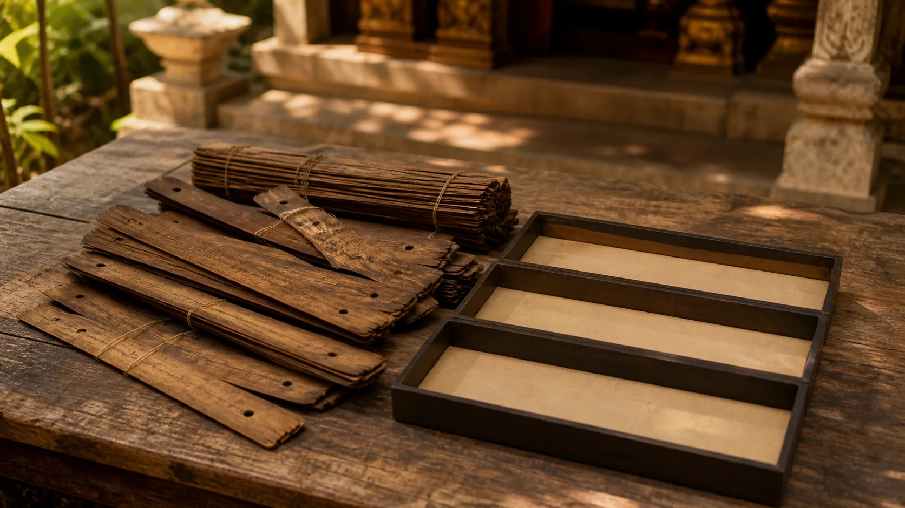

# Vi Diệu Pháp Nhập Môn — Tâm, Tâm Sở, Sắc, Nibbāna

## 1. Vi Diệu Pháp Đổi Độ Phân Giải Của Câu Hỏi

**Abhidhamma — đọc gần đúng “a-bhi-đăm-ma” — pháp được phân tích theo hệ thống** là một bộ phận canonical của Tam Tạng Theravāda. “Canonical” ở đây có nghĩa truyền thống Theravāda tiếp nhận bảy bộ Vi Diệu Pháp vào Kinh điển Pāli; nó không có nghĩa mọi bảng phân loại của Abhidhamma đều là câu chữ xuất hiện trong các bài Kinh sớm.

Kinh thường nói bằng ngôn ngữ của con người đang khổ, đang hành động và đang tu: năm uẩn, sáu căn, duyên khởi, giới-định-tuệ. Abhidhamma đổi độ phân giải, hỏi một kinh nghiệm có thể được phân tích thành những pháp nào, thuộc nhóm thiện, bất thiện hay bất định nào, và liên hệ ra sao. Đây là một phương pháp phân tích trong truyền thống, không phải ảnh chụp vật lý của não.

Ba lớp phải được giữ riêng trong suốt bài. **Kinh sớm** cung cấp các neo như năm uẩn và vô vi. **Abhidhamma canonical** triển khai ma trận và phân tích các pháp trong *Dhammasaṅgaṇī*, *Vibhaṅga* cùng năm bộ khác. **Sách thủ bản/chú giải hậu kỳ** cô đọng thành bản đồ bốn pháp tối hậu: tâm, tâm sở, sắc và Nibbāna. Lớp sau có giá trị giáo khoa lớn nhưng không được giả làm nguyên văn của một bài Kinh sớm.

## 2. Dhammasaṅgaṇī Mở Bằng Một Ma Trận, Không Bằng Một Linh Hồn

> **Pāli — Dhammasaṅgaṇī 1.1, các đoạn `ds1.1:1.1`, `ds1.1:2.1`, `ds1.1:3.1`**
> *Kusalā dhammā. Akusalā dhammā. Abyākatā dhammā.*
>
> **Bản dịch làm việc của redpill.wiki:** Các pháp thiện. Các pháp bất thiện. Các pháp không được xác định theo hai loại ấy.

Ba dòng mở đầu đặt **dhammā — các pháp hay hiện tượng được phân loại** vào ba ô: *kusala*, *akusala*, *abyākata*. Tùy văn cảnh, *kusala* có thể dịch là thiện, lành hay khéo; *abyākata* ở đây không nên hiểu là “bí ẩn”, mà là không được định danh thiện hoặc bất thiện trong phép chia này. Ma trận tiếp tục bằng nhiều bộ ba và bộ đôi để cung cấp các trục phân tích khác nhau.

Đây là **Abhidhamma canonical**, không phải Kinh sớm. Nó cũng không tuyên bố có một người điều khiển đứng sau các pháp. Phương pháp làm việc là xác định tính chất và quan hệ của hiện tượng thay vì bắt đầu từ một bản thể “tôi”. Nhưng từ đó chưa thể suy ra Abhidhamma đã chứng minh chủ nghĩa duy vật, chủ nghĩa duy tâm hay một lý thuyết khoa học về ý thức.

Một hiện tượng có thể đi qua nhiều trục phân loại. “Thiện/bất thiện/bất định” không phải bốn pháp tối hậu; đó là một ma trận canonical. Bản đồ *citta–cetasika–rūpa–Nibbāna* là cách tổng hợp khác, được các sách thủ bản Theravāda hậu kỳ trình bày đặc biệt rõ. Trộn hai loại bảng sẽ làm người học tưởng mọi danh sách có cùng chức năng.

## 3. Vibhaṅga Giữ Cầu Nối Với Năm Uẩn

> **Pāli — Vibhaṅga 1, các đoạn `vb1:2.1`, `vb1:2.2`**
> *Pañcakkhandhā— rūpakkhandho, vedanākkhandho, saññākkhandho, saṅkhārakkhandho, viññāṇakkhandho.*
>
> **Bản dịch làm việc của redpill.wiki:** Có năm uẩn: sắc uẩn, thọ uẩn, tưởng uẩn, hành uẩn và thức uẩn. Trong đó, sắc uẩn là gì?

*Vibhaṅga* không vứt bỏ ngôn ngữ Kinh để dựng một thế giới hoàn toàn khác. Nó lấy những đề mục quen thuộc — ở đây là năm uẩn — rồi phân tích theo nhiều phương thức. Vì vậy, học Abhidhamma tốt nhất là thấy cả tính liên tục lẫn sự đổi phương pháp: đề mục có thể đến từ Kinh, còn độ chi tiết và kiến trúc phân loại thuộc tạng phân tích canonical.

**Rūpa — đọc gần đúng “ruu-pa” — sắc hay phương diện vật chất**, **vedanā — thọ**, **saññā — tưởng**, **saṅkhāra — hành**, **viññāṇa — thức** không tạo thành năm mảnh bất biến. Câu hỏi “trong đó, sắc uẩn là gì?” mở một thao tác định nghĩa và triển khai phạm vi, chứ không tìm một hạt vật chất cuối cùng theo nghĩa vật lý hiện đại.

Không nên ép sơ đồ năm uẩn và sơ đồ bốn pháp tối hậu thành phép ghép một-một. Trong sách thủ bản, *citta* gần phạm vi thức, nhiều nội dung của thọ-tưởng-hành được phân phối vào *cetasika*, *rūpa* là một phạm trù riêng, còn Nibbāna không phải một uẩn. Đây là quan hệ sư phạm giữa hai hệ phân tích, không phải công thức được hai segment trên phát biểu trực tiếp.

## 4. Bốn Pháp Tối Hậu Là Bản Đồ Giáo Khoa Hậu Kỳ

Trong *Abhidhammattha-saṅgaha* và truyền thống giảng giải của nó, **paramattha-dhamma — pháp theo nghĩa tối hậu trong hệ phân tích** được gom thành bốn loại: **citta — tâm**, **cetasika — tâm sở**, **rūpa — sắc**, và **Nibbāna**. *A Comprehensive Manual of Abhidhamma* được dùng ở đây để kiểm tra bản đồ và thuật ngữ, chỉ bằng diễn giải; bài không sao chép bản dịch tiếng Anh có bản quyền.

**Citta** là sự biết một đối tượng trong mô hình; **cetasika** là các yếu tố tâm lý đồng sinh và cùng hướng đến đối tượng; **rūpa** là phạm vi sắc pháp; **Nibbāna** là vô vi. Ba loại đầu là hữu vi. Nibbāna không phải một loại vật chất tinh tế, không phải “tâm vũ trụ”, và không phải một cõi đứng cạnh ba loại còn lại.

Nhãn “tối hậu” dễ gây hiểu lầm như tuyên bố về các hạt cơ bản mà mọi khoa học buộc phải chấp nhận. Trong văn cảnh Abhidhamma, nó chỉ cấp phân tích không tiếp tục chia theo những thực thể quy ước như “người”, “xe” hay “cái ghế”. Nó là cam kết nội bộ của một hệ thống hiện tượng học-giải thoát, không phải kết quả máy gia tốc hạt hoặc máy quét não.

Quan trọng nhất: bản đồ bốn phần này là **tổng hợp sách thủ bản/chú giải hậu kỳ**, dù các thành phần có neo trong Kinh điển và Nibbāna có neo Kinh sớm. Không viết “Kinh sớm dạy bốn thực tại tối hậu” nếu không có bài Kinh và câu chữ tương ứng; nguồn đã khóa cho bài không cung cấp câu ấy.

## 5. Nibbāna Có Neo Kinh Sớm Nhưng Vị Trí Trong Bản Đồ Là Một Bước Hệ Thống Hóa

> **Pāli — Ud 8.3, các đoạn `ud8.3:3.1`, `ud8.3:3.2`**
> *“Atthi, bhikkhave, ajātaṁ abhūtaṁ akataṁ asaṅkhataṁ. No cetaṁ, bhikkhave, abhavissa ajātaṁ abhūtaṁ akataṁ asaṅkhataṁ, nayidha jātassa bhūtassa katassa saṅkhatassa nissaraṇaṁ paññāyetha.*
>
> **Bản dịch làm việc của redpill.wiki:** Này các tỳ-kheo, có cái không sinh, không trở thành, không được làm ra, không bị tạo tác. Nếu không có cái không sinh, không trở thành, không được làm ra, không bị tạo tác ấy, thì ở đây sẽ không nhận ra lối thoát khỏi cái đã sinh, đã trở thành, đã được làm ra, bị tạo tác.

Ud 8.3 là **neo Kinh sớm** cho đối lập *saṅkhata/asaṅkhata* — hữu vi/vô vi. Nó không nêu bốn mục *citta, cetasika, rūpa, Nibbāna*. Khi sách thủ bản xếp Nibbāna làm mục thứ tư và vô vi duy nhất, đó là một bước hệ thống hóa Theravāda dựa trên nhiều nguồn, không phải bản dịch của riêng hai segment này.

Ranh giới ấy bảo vệ cả Kinh lẫn Abhidhamma. Kinh không bị bắt nói chi tiết nó không nói; truyền thống hậu kỳ cũng được nhìn đúng như một công trình phân tích có mục đích. Nibbāna trong bài này không phải cõi, linh hồn, hư vô hay trạng thái não. Bài 32 đã giải thích sâu hơn; ở đây chỉ cần thấy nó không cùng loại với ba phạm trù hữu vi.

## 6. Dùng Bản Đồ Như Dụng Cụ Quan Sát, Không Như Máy Chụp Não

Trong một lần bực, có thể thử đổi câu “tôi là người giận” thành một chuỗi câu hỏi: đối tượng nào đang được biết; cảm thọ nào đi cùng; tác ý đẩy hay đánh đang mạnh ra sao; thân có nóng, co hay rung; yếu tố nào đổi khi không nói ngay? Cách hỏi này mượn tinh thần phân tích mà không cần tự nhận đang trực tiếp thấy toàn bộ đơn vị Abhidhamma.

Phân tích không thay thế giới. Nhận diện “sân” rất tinh mà vẫn gửi lời làm hại là chưa hoàn thành việc tu. Cũng không nên dùng thuật ngữ để phân ly khỏi cảm xúc, phủ nhận sang chấn hay bỏ chăm sóc y tế. Bản đồ tốt phải đưa về giảm tham-sân-si, trách nhiệm và khả năng đáp ứng khéo hơn.

Khoa học thần kinh có thể nghiên cứu tương quan giữa báo cáo, hành vi và hoạt động sinh học. Nó không đo trực tiếp *citta* hay *cetasika* theo định nghĩa truyền thống, không xác nhận bốn pháp tối hậu, và không chứng minh Nibbāna. Ngược lại, việc một thuật ngữ không nằm trong máy đo cũng không tự chứng minh nó siêu nhiên.

## 7. Kỷ Luật Khẳng Định, Chuỗi Đọc Và Nguồn

**Văn bản nói gì?** *Dhammasaṅgaṇī* mở ma trận bằng các pháp thiện, bất thiện và bất định; *Vibhaṅga* nêu năm uẩn rồi bắt đầu phân tích; Ud 8.3 nói có cái không sinh, không trở thành, không làm ra, không tạo tác và do đó có lối thoát khỏi hữu vi.

**Truyền thống giải thích gì?** Sách thủ bản/chú giải Theravāda cô đọng phạm vi phân tích thành bốn pháp tối hậu: tâm, tâm sở, sắc và Nibbāna. Ba loại đầu hữu vi, Nibbāna vô vi. Đây là bản đồ hậu kỳ có nguồn riêng, không phải nguyên văn Kinh sớm.

**Bài này suy luận gì?** Cách đọc hữu ích là xem các bảng như những dụng cụ có độ phân giải và chức năng khác nhau. Bài dùng ví dụ cơn giận để nối phân tích với giới và quan sát, không tuyên bố ví dụ ấy là kỹ thuật canonical hoàn chỉnh.

**Điều gì chưa được chứng minh?** Các trích đoạn không chứng minh bốn pháp tối hậu là cấu trúc vật lý của vũ trụ hay não. Khoa học thần kinh không xác nhận Nibbāna, tâm sở hoặc sát-na tâm; tương đồng từ vựng không phải đồng nhất thực thể.

Đọc trước: [[32 - Nibbāna - Không Phải Cõi Thứ 32]]. Đọc tiếp: [[34 - Tâm Sở Và Sát-na Tâm - Bản Đồ Vi Mô Của Kinh Nghiệm]].

**Nguồn và giấy phép:** Pāli lấy theo đúng segment ID từ Bilara/SuttaCentral, nhánh `published`, root Pāli MS, truy cập ngày 2026-08-20: Dhammasaṅgaṇī 1.1 (`ds1.1:1.1`, `2.1`, `3.1`), Vibhaṅga 1 (`vb1:2.1`, `2.2`), Ud 8.3 (`ud8.3:3.1`, `3.2`). Bản đồ bốn pháp tối hậu được đối chiếu với *A Comprehensive Manual of Abhidhamma*, chương I–II và VI, chỉ diễn giải. Các bản Việt ngay dưới Pāli là bản dịch làm việc nguyên gốc của redpill.wiki. Hồ sơ toàn bài chưa qua đủ kiểm toán nên `source_license_checked: true`.
