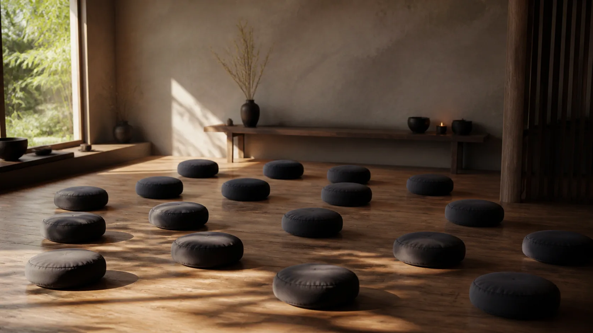
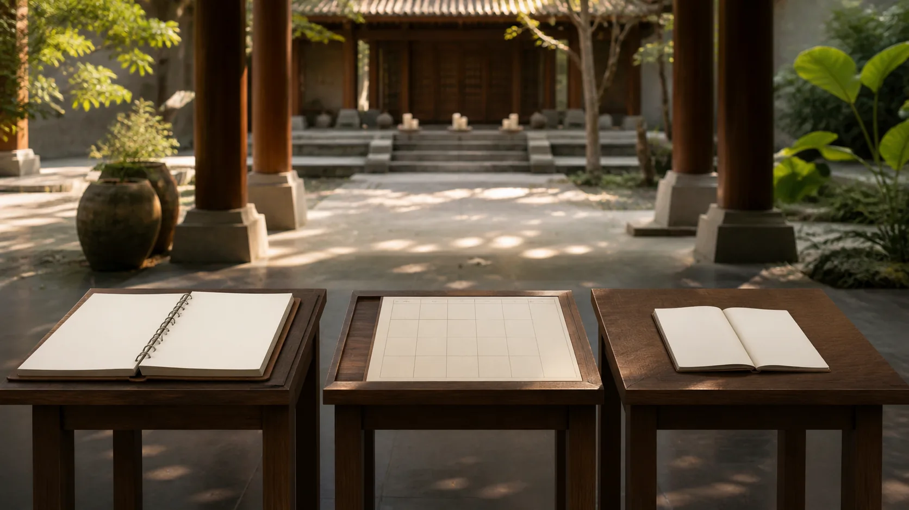

# Tâm Sở Và Sát-na Tâm — Bản Đồ Vi Mô Của Kinh Nghiệm

## 1. Một “Tâm” Không Phải Một Khối Đơn Độc

Trong bản đồ sách thủ bản Theravāda, **citta — tâm, một lần biết đối tượng** không xuất hiện trơ trọi. Nó đồng sinh với **cetasika — đọc gần đúng “chê-ta-si-ka” — yếu tố hay tâm sở đi cùng tâm**. Cùng một đối tượng có thể được biết với tham, sân, niệm, hỷ, xả hoặc nhiều cấu hình khác; phẩm chất của kinh nghiệm tùy tổ hợp điều kiện.

Đây cần được phân tầng ngay từ đầu. **Kinh sớm** có nhiều danh sách yếu tố tâm và mô tả tâm sinh-diệt. **Dhammasaṅgaṇī canonical** phân loại các pháp và phân tích những gì đi cùng một loại tâm. **Abhidhammattha-saṅgaha cùng truyền thống chú giải hậu kỳ** chuẩn hóa danh sách 52 tâm sở, các nhóm tâm và những tổ hợp rất chi tiết. Ba lớp liên tục về vấn đề nhưng không đồng nhất về câu chữ hay niên đại.

“Vi mô” trong tiêu đề là ẩn dụ sư phạm, không phải kính hiển vi thần kinh. Tâm sở không được bài này đồng nhất với neuron, chất dẫn truyền, mô-đun nhận thức hay vùng não. Khoa học có thể xây mô hình riêng; việc hai hệ cùng phân biệt chú ý, cảm thọ hoặc ý định không khiến các đơn vị trở thành một.

## 2. [Nhận biết từng yếu tố trong các tầng thiền](https://suttacentral.net/mn111) Cho Một Danh Sách Yếu Tố, Không Cho Con Số 52

> [!quote] Kinh về nhận biết từng yếu tố trong các tầng thiền — Trung Bộ Kinh
> Đoạn Kinh nêu rằng những pháp có trong sơ thiền — tầm, tứ, hỷ, lạc và nhất tâm; xúc, thọ, tưởng, tác ý, tâm, ước muốn, quyết định, tinh tấn, niệm, xả và hướng tâm — được vị ấy xác định lần lượt.
>
> **Pāli**
> *Ye ca paṭhame jhāne dhammā vitakko ca vicāro ca pīti ca sukhañca cittekaggatā ca, phasso vedanā saññā cetanā cittaṁ chando adhimokkho vīriyaṁ sati upekkhā manasikāro—tyāssa dhammā anupadavavatthitā honti.*
>
> **Dịch Việt**
> Những pháp có trong sơ thiền — tầm, tứ, hỷ, lạc và nhất tâm; xúc, thọ, tưởng, tác ý, tâm, ước muốn, quyết định, tinh tấn, niệm, xả và hướng tâm — được vị ấy xác định lần lượt.
>
> <small>Nguồn kiểm chứng: <a href="https://suttacentral.net/mn111">MN 111, đoạn 4.1</a> · <i>Anupada Sutta</i></small>

[Nhận biết từng yếu tố trong các tầng thiền](https://suttacentral.net/mn111) là **Kinh sớm** và là neo mạnh cho việc phân biệt nhiều yếu tố trong một kinh nghiệm thiền. Danh sách có **phassa — xúc**, **vedanā — thọ**, **saññā — tưởng**, **cetanā — tác ý**, cùng niệm, tinh tấn, xả và những yếu tố khác. Nó cho thấy ngôn ngữ phân tích tâm không bắt đầu hoàn toàn ở sách thủ bản muộn.

Nhưng đoạn này không nói “có đúng 52 tâm sở”, không chia chúng thành bảy biến hành, sáu biệt cảnh, mười bốn bất thiện và hai mươi lăm tịnh hảo, cũng không đưa toàn bộ ma trận tổ hợp với các loại tâm. Danh sách đang mô tả các pháp được Sāriputta xác định trong sơ thiền; biến nó thành bảng 52 là thêm một hệ thống hậu kỳ vào câu Kinh.

Từ *anupada* nhấn mạnh việc xác định lần lượt; nó không bắt buộc phải hiểu mỗi mục là một vật thể độc lập trong não. Bài Kinh nói về sự phân định có tuệ trong thiền và hướng đến xuất ly. Bối cảnh giải thoát ấy quan trọng hơn việc dùng danh sách để khoe khả năng đếm nội tâm.

## 3. Dhammasaṅgaṇī Phân Loại Tầm Và Tứ Theo Ma Trận Canonical

> [!quote] Bảng phân loại các pháp thiện và các tâm sở đi kèm — Vi Diệu Pháp tạng Theravāda
> Đoạn Kinh nêu rằng các pháp có tầm và có tứ; các pháp không tầm, chỉ có tứ.
>
> **Pāli**
> *Savitakkasavicārā dhammā. Avitakkavicāramattā dhammā. Avitakkaavicārā dhammā.*
>
> **Dịch Việt**
> Các pháp có tầm và có tứ. Các pháp không tầm, chỉ có tứ. Các pháp không tầm và không tứ.
>
> <small>Nguồn kiểm chứng: <a href="https://suttacentral.net/ds1.1">Dhammasaṅgaṇī 1.1, các đoạn 16.1, 17.1, 18.1</a> · <i>Dhammasaṅgaṇī</i></small>

Đây là **Abhidhamma canonical**. Ma trận không kể một câu chuyện về người suy nghĩ; nó dựng ba phạm vi theo sự hiện diện hay vắng mặt của *vitakka* và *vicāra*. Hai từ này có sắc thái khác nhau theo văn cảnh; trong thiền thường được dịch làm việc là tầm và tứ, không nên mặc định đồng nhất với mọi loại “suy nghĩ” đời thường.

So với [Nhận biết từng yếu tố trong các tầng thiền](https://suttacentral.net/mn111), ta thấy cả cầu nối lẫn khác biệt. Kinh nêu tầm và tứ trong một danh sách cụ thể của sơ thiền. *Dhammasaṅgaṇī* dùng chúng làm trục phân loại tổng quát trong ma trận. Việc một thuật ngữ xuất hiện ở cả hai không xóa ranh giới giữa một bài Kinh sớm và một bộ Abhidhamma canonical.

Các phân tích sâu hơn của *Dhammasaṅgaṇī* liệt kê nhiều pháp đồng hiện khi một loại tâm sinh khởi. Tuy nhiên, ba segment đã khóa ở đây chỉ phát biểu bộ ba trên. Bài không dùng chúng để “chứng minh” toàn bộ bảng 52 hay một lộ trình sát-na chi tiết mà câu chữ không chứa.

## 4. Hệ 52 Tâm Sở Và Tổ Hợp Chi Tiết Thuộc Sách Thủ Bản Hậu Kỳ

*Abhidhammattha-saṅgaha* và truyền thống giảng giải chuẩn hóa **52 cetasika** thành bốn cụm lớn: 13 tâm sở “tợ tha” có thể đi với nhiều loại tâm, gồm bảy biến hành và sáu biệt cảnh; 14 tâm sở bất thiện; 25 tâm sở tịnh hảo. Các tên nhóm và con số này được đối chiếu qua *A Comprehensive Manual of Abhidhamma*, chương II, chỉ diễn giải chứ không sao chép bản dịch.

Bảy biến hành được hệ thống nêu là xúc, thọ, tưởng, tác ý, nhất tâm, mạng quyền và hướng tâm. Sáu biệt cảnh gồm tầm, tứ, thắng giải, tinh tấn, hỷ và dục. Nhóm bất thiện triển khai các gốc và tùy phiền não; nhóm tịnh hảo gồm các yếu tố chung của tâm đẹp cùng những yếu tố tiết chế, vô lượng và trí tuệ. Danh sách đầy đủ hữu ích để tra cứu, nhưng học thuộc tên không thay thế nhận biết tham-sân-si và hành động có trách nhiệm.

Hệ thống còn hỏi tâm sở nào **luôn** đi với một tâm, tâm sở nào chỉ xuất hiện trong điều kiện nhất định, và cấu hình nào không thể cùng tồn tại. Nhờ đó, nó tạo một ngữ pháp tổ hợp tinh vi hơn danh sách phẳng. Song các tổ hợp này là **sự hệ thống hóa sách thủ bản/chú giải hậu kỳ**; không được nói [Nhận biết từng yếu tố trong các tầng thiền](https://suttacentral.net/mn111) trực tiếp liệt kê 52 yếu tố hoặc mô tả từng cấu hình.

Cũng cần tránh biến “đồng sinh, cùng đối tượng” thành phát biểu về đồng bộ điện não. Đó là quan hệ được định nghĩa trong mô hình Abhidhamma. Muốn so với khoa học nhận thức phải thiết kế phép chuyển khái niệm, thước đo và giả thuyết riêng; tương đồng tên gọi không đủ.

## 5. [Tâm và thức sinh diệt suốt ngày đêm](https://suttacentral.net/sn12.61) Dạy Tâm Sinh-Diệt, Không Phát Biểu Sát-na Học Chi Tiết

> [!quote] Kinh về tâm và thức sinh diệt suốt ngày đêm — Tương Ưng Bộ Kinh
> Đoạn Kinh nêu rằng cái được gọi là tâm, cũng gọi là ý, cũng gọi là thức, cả đêm lẫn ngày sinh lên như một cái và diệt đi như một cái khác.
>
> **Pāli**
> *Yañca kho etaṁ, bhikkhave, vuccati cittaṁ itipi, mano itipi, viññāṇaṁ itipi, taṁ rattiyā ca divasassa ca aññadeva uppajjati aññaṁ nirujjhati. evameva kho, bhikkhave, yamidaṁ vuccati cittaṁ itipi, mano itipi, viññāṇaṁ itipi, taṁ rattiyā ca divasassa ca aññadeva uppajjati aññaṁ nirujjhati.*
>
> **Dịch Việt**
> Cái được gọi là tâm, cũng gọi là ý, cũng gọi là thức, cả đêm lẫn ngày sinh lên như một cái và diệt đi như một cái khác. Ví như con khỉ đi trong rừng, nắm một cành rồi buông cành ấy để nắm cành khác, lại buông cành ấy để nắm cành khác; cũng vậy, cái được gọi là tâm, là ý, là thức, cả đêm lẫn ngày sinh lên như một cái và diệt đi như một cái khác.
>
> <small>Nguồn kiểm chứng: <a href="https://suttacentral.net/sn12.61">SN 12.61, các đoạn 4.1, 4.3</a> · <i>Assutavā Sutta</i></small>

Đoạn **Kinh sớm** này phá trực giác về một tâm đồng nhất đứng yên lâu dài. Nó nêu sinh và diệt suốt đêm ngày, dùng con khỉ đổi cành làm ví dụ. Đây là nền mạnh cho vô thường của tâm, nhưng không cho số lượng sát-na trong một cái búng tay, không mô tả ba tiểu pha sinh-trụ-diệt, và không trình bày toàn bộ lộ trình tâm qua các cửa giác quan.

**Khaṇa — sát-na hay khoảnh khắc** trở thành đơn vị kỹ thuật rất tinh trong các lớp Abhidhamma/chú giải. Truyền thống hậu kỳ trình bày dòng tâm thành những tâm riêng nối tiếp, và sách thủ bản mô tả các chuỗi chức năng chi tiết. Bài tôn trọng mô hình ấy nhưng không đặt nó vào miệng [Tâm và thức sinh diệt suốt ngày đêm](https://suttacentral.net/sn12.61). “Sinh cái này, diệt cái khác” không tự cung cấp mọi thông số của sát-na học.

## 6. Khoảnh Khắc Tâm Không Phải Khung Hình Não

Trong truyền thống thủ bản, một tâm sinh với tổ hợp tâm sở phù hợp, thực hiện chức năng rồi diệt, nhường điều kiện cho tâm kế. Những mô tả về hộ kiếp, hướng tâm, nhãn thức, tiếp thọ, suy đạc, xác định, tốc hành và đăng ký tạo một bản đồ tiến trình rất chi tiết. Đó là công cụ nội bộ để giải thích kinh nghiệm và nghiệp, không phải dữ liệu trực tiếp của hai segment [Tâm và thức sinh diệt suốt ngày đêm](https://suttacentral.net/sn12.61).

**Momentariness — thuyết sát-na hay tính khoảnh khắc** cũng không được bài trình bày như kết luận của neuroscience. EEG, MEG, fMRI và thí nghiệm thời gian phản ứng có độ phân giải, biến số và lý thuyết đo khác nhau; không thiết bị nào vì phát hiện xử lý nhanh mà xác nhận các tâm Abhidhamma hoặc đúng số pha truyền thống. Không nên chuyển “rất nhanh” thành “cùng một thực thể”.

Ứng dụng thận trọng hơn là quan sát sự thay đổi. Khi nghe một lời chê: xúc, khó chịu, nhận diện, ý muốn phản công và câu chuyện bản ngã có thể được phân biệt; một yếu tố đổi thì hành động sau đó cũng có thể đổi. Đây là bài tập hiện đại lấy cảm hứng từ phân tích, không phải tuyên bố người mới đã thấy trực tiếp mọi sát-na hay 52 tâm sở.

Nếu quan sát vi mô làm tăng ám ảnh, mất ngủ, phân ly hoặc cảm giác thế giới không thật, hãy trở lại thân, sinh hoạt đều, giảm cường độ và tìm hỗ trợ phù hợp. Mục đích là bớt chấp và bớt hại, không phá khả năng vận hành để đạt một bản mô tả lý thuyết.

## 7. Kỷ Luật Khẳng Định, Chuỗi Đọc Và Nguồn

**Văn bản nói gì?** [Nhận biết từng yếu tố trong các tầng thiền](https://suttacentral.net/mn111) nêu các yếu tố được xác định lần lượt trong sơ thiền. *Dhammasaṅgaṇī* chia các pháp theo có tầm-tứ, không tầm chỉ tứ, và không tầm-không tứ. [Tâm và thức sinh diệt suốt ngày đêm](https://suttacentral.net/sn12.61) nói tâm, ý, thức sinh cái này và diệt cái khác suốt đêm ngày, ví như khỉ đổi cành.

**Truyền thống giải thích gì?** Sách thủ bản/chú giải Theravāda chuẩn hóa 52 tâm sở, quy tắc chúng kết hợp với các loại tâm và những lộ trình sát-na chi tiết. Đây là lớp hậu kỳ, dù dựa trên và hệ thống hóa nhiều vật liệu canonical.

**Bài này suy luận gì?** “Ngữ pháp tổ hợp” và bài tập tách một phản ứng thành xúc-thọ-nhận diện-tác ý là cách giảng hiện đại. Chúng giúp dùng bản đồ mà không tự phong khả năng nội quán vi mô.

**Điều gì chưa được chứng minh?** [Nhận biết từng yếu tố trong các tầng thiền](https://suttacentral.net/mn111) không trực tiếp dạy con số 52; [Tâm và thức sinh diệt suốt ngày đêm](https://suttacentral.net/sn12.61) không nêu tốc độ hay toàn bộ lộ trình tâm. Khoa học thần kinh không chứng minh tâm sở, tổ hợp tâm, sát-na học hay tính khoảnh khắc theo định nghĩa Theravāda.

Đọc trước: [[33 - Vi Diệu Pháp Nhập Môn - Tâm, Tâm Sở, Sắc, Nibbāna]]. Đọc tiếp: [[35 - Paṭṭhāna - Hai Mươi Bốn Duyên Và Mạng Điều Kiện]].

**Nguồn và giấy phép:** Pāli lấy theo đúng segment ID từ Bilara/SuttaCentral, nhánh `published`, root Pāli MS, truy cập ngày 2026-08-20: [Nhận biết từng yếu tố trong các tầng thiền](https://suttacentral.net/mn111) (`mn111:4.1`), [Tâm và thức sinh diệt suốt ngày đêm](https://suttacentral.net/sn12.61) (`sn12.61:4.1`, `4.3`), Dhammasaṅgaṇī 1.1 (`ds1.1:16.1`, `17.1`, `18.1`). Hệ 52 tâm sở và các tổ hợp được đối chiếu với *A Comprehensive Manual of Abhidhamma*, chương II, chỉ diễn giải. Các bản Việt ngay dưới Pāli là bản dịch làm việc nguyên gốc của redpill.wiki. Hồ sơ toàn bài chưa qua đủ kiểm toán nên `source_license_checked: true`.
