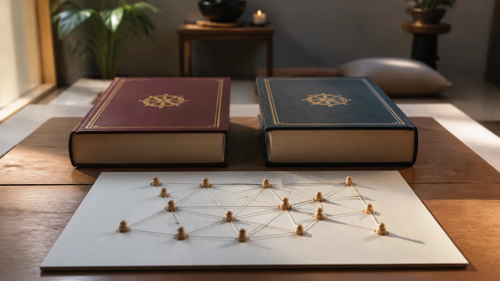

# Paṭṭhāna — Hai Mươi Bốn Duyên Và Mạng Điều Kiện

## 1. Từ Một Chuỗi Duyên Khởi Đến Một Ngữ Pháp Quan Hệ

**Paṭṭhāna — đọc gần đúng “pa-tha-na” — sự thiết lập hay bộ Phân Tích Các Duyên** là sách cuối của Vi Diệu Pháp tạng Theravāda. Nó không chỉ hỏi cái gì đứng trước cái gì. Nó hỏi một pháp có thể hỗ trợ pháp khác theo kiểu nào: làm gốc, làm đối tượng, cùng sinh, đi trước, đi sau, lặp lại, cho quả, hiện hữu hoặc vắng mặt.

Đây là bước đổi độ phân giải. Công thức duyên khởi trong Kinh thường dẫn người đọc thấy khổ sinh và diệt theo điều kiện. Paṭṭhāna xây một ma trận phân tích rộng hơn cho các pháp trong hệ Vi Diệu Pháp. Vì vậy, “hai mươi bốn duyên” không phải hai mươi bốn mắt xích nối thành một hàng, cũng không phải hai mươi bốn nguyên nhân đầu tiên của vũ trụ.

**Paccaya — đọc gần đúng “pát-cha-ya” — duyên, điều kiện hỗ trợ** không đồng nghĩa một nguyên nhân duy nhất đủ sức tạo ra kết quả. Một sự kiện có thể phụ thuộc đồng thời vào nền vật chất, đối tượng được biết, thói quen đã lặp, tác ý và các pháp cùng hiện diện. Ngôn ngữ mạng phù hợp hơn ngôn ngữ quân cờ domino, miễn nhớ rằng “mạng” là ẩn dụ sư phạm hiện đại chứ không phải thuật ngữ nguyên văn của Paṭṭhāna.

## 2. Nền Kinh Sớm: Tính Có Điều Kiện Không Do Ai Sáng Chế

> [!quote] Kinh về nguyên lý mọi pháp sinh theo điều kiện — Tương Ưng Bộ Kinh
> Đoạn Kinh nêu rằng dù các Như Lai xuất hiện hay không xuất hiện, tính chất ấy vẫn đứng vững: sự ổn định của pháp, tính quy luật của pháp, tính điều kiện cụ thể này.
>
> **Pāli**
> *Uppādā vā tathāgatānaṁ anuppādā vā tathāgatānaṁ, ṭhitāva sā dhātu dhammaṭṭhitatā dhammaniyāmatā idappaccayatā. Iti kho, bhikkhave, yā tatra tathatā avitathatā anaññathatā idappaccayatā—*
>
> **Dịch Việt**
> Dù các Như Lai xuất hiện hay không xuất hiện, tính chất ấy vẫn đứng vững: sự ổn định của pháp, tính quy luật của pháp, tính điều kiện cụ thể này. Như vậy, này các tỳ-kheo, ở đó có tính như vậy, tính không sai khác, tính không khác đi, tính điều kiện cụ thể này—
>
> <small>Nguồn kiểm chứng: <a href="https://suttacentral.net/sn12.20">SN 12.20, các đoạn 2.3, 3.16</a> · <i>Paccaya Sutta</i></small>

**Idappaccayatā — đọc gần đúng “i-đáp-pát-cha-ya-taa” — tính điều kiện cụ thể này** chặn hai cực đoan. Quan hệ không tùy thuộc một vị thầy phát minh; nhưng câu Kinh cũng không nói có một Định luật siêu hình điều khiển mọi chi tiết theo một nguyên nhân đơn nhất. Văn cảnh [Nguyên lý mọi pháp sinh theo điều kiện](https://suttacentral.net/sn12.20) triển khai các quan hệ duyên khởi cụ thể.

Khoảng dòng trong khối Pāli đánh dấu các segment trung gian không nằm trong phạm vi trích. Hai đoạn Kinh là nền cho cách nhìn theo điều kiện, không phải bằng chứng rằng chính [Nguyên lý mọi pháp sinh theo điều kiện](https://suttacentral.net/sn12.20) đã liệt kê hai mươi bốn **paccaya**. Bảng hai mươi bốn thuộc Paṭṭhāna, lớp canonical Vi Diệu Pháp của Theravāda. Nối hai lớp có trách nhiệm nghĩa là nhận ra họ hàng về câu hỏi mà không xóa khác biệt lịch sử và thể loại.

## 3. [Từ khổ đau đến giải thoát theo chuỗi hỗ trợ](https://suttacentral.net/sn12.23): Một Chuỗi Hỗ Trợ Không Chỉ Đi Từ Vô Minh Đến Khổ

> [!quote] Kinh về từ khổ đau đến giải thoát theo chuỗi hỗ trợ — Tương Ưng Bộ Kinh
> Đoạn Kinh nêu rằng như vậy, này các tỳ-kheo, hành có vô minh làm điều kiện hỗ trợ; thức có hành làm điều kiện hỗ trợ; danh-sắc có thức làm điều kiện hỗ trợ; sáu xứ có danh-sắc làm điều kiện hỗ trợ; xúc có sáu xứ làm điều kiện hỗ trợ;…
>
> **Pāli**
> *Evameva kho, bhikkhave, avijjūpanisā saṅkhārā, saṅkhārūpanisaṁ viññāṇaṁ, viññāṇūpanisaṁ nāmarūpaṁ, nāmarūpūpanisaṁ saḷāyatanaṁ, saḷāyatanūpaniso phasso, phassūpanisā vedanā, vedanūpanisā taṇhā, taṇhūpanisaṁ upādānaṁ, upādānūpaniso bhavo, bhavūpanisā jāti, jātūpanisaṁ dukkhaṁ, dukkhūpanisā saddhā, saddhūpanisaṁ pāmojjaṁ, pāmojjūpanisā pīti, pītūpanisā passaddhi, passaddhūpanisaṁ sukhaṁ, sukhūpaniso samādhi, samādhūpanisaṁ yathābhūtañāṇadassanaṁ, yathābhūtañāṇadassanūpanisā nibbidā, nibbidūpaniso virāgo, virāgūpanisā vimutti, vimuttūpanisaṁ khaye ñāṇan”ti.*
>
> **Dịch Việt**
> Như vậy, này các tỳ-kheo, hành có vô minh làm điều kiện hỗ trợ; thức có hành làm điều kiện hỗ trợ; danh-sắc có thức làm điều kiện hỗ trợ; sáu xứ có danh-sắc làm điều kiện hỗ trợ; xúc có sáu xứ làm điều kiện hỗ trợ; thọ có xúc làm điều kiện hỗ trợ; ái có thọ làm điều kiện hỗ trợ; thủ có ái làm điều kiện hỗ trợ; hữu có thủ làm điều kiện hỗ trợ; sinh có hữu làm điều kiện hỗ trợ; khổ có sinh làm điều kiện hỗ trợ; tín có khổ làm điều kiện hỗ trợ; hân hoan có tín làm điều kiện hỗ trợ; hỷ có hân hoan làm điều kiện hỗ trợ; an tịnh có hỷ làm điều kiện hỗ trợ; lạc có an tịnh làm điều kiện hỗ trợ; định có lạc làm điều kiện hỗ trợ; tri kiến như thật có định làm điều kiện hỗ trợ; nhàm lìa và ly tham có tri kiến như thật làm điều kiện hỗ trợ; giải thoát có nhàm lìa và ly tham làm điều kiện hỗ trợ; trí về sự đoạn tận có giải thoát làm điều kiện hỗ trợ.
>
> <small>Nguồn kiểm chứng: <a href="https://suttacentral.net/sn12.23">SN 12.23, đoạn 8.1</a> · <i>Upanisa Sutta</i></small>

**Upanisā — đọc gần đúng “u-pa-ni-xaa” — điều kiện nâng đỡ hay nền hỗ trợ** cho thấy khổ không chỉ là điểm cuối đáng ghét. Khi được gặp Chánh pháp và thực hành đúng, nhận biết khổ có thể làm nền cho tín, hân hoan, định và tri kiến. Đây không phải lời hứa rằng đau khổ tự động làm người ta khôn ngoan; thiếu an toàn và hỗ trợ, khổ cũng có thể làm tăng sợ hãi hay tuyệt vọng.

[Từ khổ đau đến giải thoát theo chuỗi hỗ trợ](https://suttacentral.net/sn12.23) mở rộng trí tưởng tượng nhân quả của người học: một chuỗi điều kiện có thể chuyển hướng. Tuy nhiên, đoạn này vẫn là một trình tự giảng dạy trong Kinh sớm, không phải bản tóm tắt hai mươi bốn duyên của Paṭṭhāna.

## 4. Hai Mươi Bốn Duyên: Danh Sách Vi Diệu Pháp, Không Phải Trích Dẫn Giả

Theo *Conditional Relations (Paṭṭhāna)*, quyển I, phần trình bày **Paccayaniddesa**, bản dịch của U Nārada với sự hỗ trợ của Thein Nyun, Pali Text Society, hệ thống phân tích hai mươi bốn duyên. Phần sau đây là **diễn giải thư mục bằng tiếng Việt**, không phải nguyên văn Pāli hay bản dịch tiếng Anh của ấn bản PTS:

1. **hetu** — gốc; **ārammaṇa** — đối tượng; **adhipati** — ưu thế/chủ đạo; **anantara** — vô gián; **samanantara** — tiếp nối liền kề; **sahajāta** — đồng sinh.
2. **aññamañña** — hỗ tương; **nissaya** — nương tựa; **upanissaya** — y chỉ mạnh; **purejāta** — tiền sinh; **pacchājāta** — hậu sinh; **āsevana** — lặp lại/tập hành.
3. **kamma** — nghiệp; **vipāka** — quả; **āhāra** — vật thực/dinh dưỡng; **indriya** — quyền; **jhāna** — thiền; **magga** — đạo.
4. **sampayutta** — tương ưng; **vippayutta** — bất tương ưng; **atthi** — hiện hữu; **natthi** — không hiện hữu; **vigata** — đã lìa/vắng; **avigata** — chưa lìa/còn hiện diện.

Tên ngắn chỉ là nhãn vào cửa. Chẳng hạn, “nghiệp duyên” không có nghĩa mọi việc đều do nghiệp; “đối tượng duyên” cho biết đối tượng có thể hỗ trợ tâm; “đồng sinh” và “hỗ tương” làm nổi bật quan hệ không thể giản lược thành trước–sau. Muốn áp dụng chính xác phải xét bộ pháp, chiều quan hệ và tổ hợp trong chính hệ Paṭṭhāna.

## 5. Bốn Họ Quan Hệ Để Học Mà Không Làm Phẳng Hệ Thống

Có thể gom tạm danh sách thành bốn họ để ghi nhớ. Thứ nhất là các duyên mô tả **vai trò định hướng**, như gốc, đối tượng và ưu thế. Thứ hai là các duyên **thời gian và tiếp nối**, như vô gián, tiền sinh, hậu sinh và tập hành. Thứ ba là các duyên **đồng hiện và cấu trúc**, như đồng sinh, hỗ tương, nương tựa, tương ưng và bất tương ưng. Thứ tư là các duyên **chức năng và trạng thái**, như nghiệp, quả, vật thực, quyền, thiền, đạo, hiện hữu và vắng mặt.

Phép gom này là công cụ sư phạm của bài, không phải một bảng phân loại canonical thứ hai. Một duyên có thể vượt ranh nhóm tùy cách phân tích. Đặc biệt, **upanissaya** không nên bị dịch thành “nguyên nhân quyết định”: nó nói sức nâng đỡ mạnh, còn mạng điều kiện vẫn có nhiều thành phần.

Paṭṭhāna nhắc người đọc rằng sự vắng mặt cũng có thể là điều kiện. Khi một tâm vừa diệt, sự không còn của nó tạo chỗ cho tâm kế tiếp theo mô hình Vi Diệu Pháp. Nhưng không được lấy điều này để tuyên bố khoa học đã đo được sát-na tâm; độ phân giải và tiêu chuẩn của hai hệ khác nhau.

## 6. Thực Hành: Lập Bản Đồ Một Phản Ứng, Không Đổ Cho Một Nguyên Nhân

Chọn một phản ứng lặp lại, chẳng hạn mở điện thoại khi khó chịu. Ghi riêng: đối tượng kích hoạt; cảm thọ; câu chuyện; thói quen được tập; điều kiện thân thể như thiếu ngủ; người và môi trường nâng đỡ; hành động; hậu quả. Sau đó hỏi điều kiện nào có thể được giảm, điều kiện lành nào có thể được thêm và mắt xích nào hiện dễ can thiệp nhất.

Bài tập này lấy cảm hứng từ tư duy đa điều kiện, không phải một phép phân tích Paṭṭhāna đầy đủ. Nó có lợi đạo đức vì giảm hai phản xạ: “tôi xấu nên thế” và “chỉ người kia làm tôi thế”. Trách nhiệm vẫn còn, nhưng trách nhiệm trở thành khả năng sửa các điều kiện thay vì kết án một bản chất cố định.

Không dùng hai mươi bốn duyên để chẩn đoán bệnh, quy nghiệp cho nạn nhân hay thay điều trị. Khi phản ứng liên quan bạo lực, nghiện, hoảng loạn, hưng cảm, phân ly hoặc ý nghĩ tự hại, ưu tiên an toàn và hỗ trợ chuyên môn. Bản đồ giáo pháp không thay bác sĩ, nhà trị liệu hay dịch vụ khẩn cấp.

## 7. Kỷ Luật Khẳng Định, Chuỗi Đọc Và Nguồn

**Văn bản nói gì?** [Nguyên lý mọi pháp sinh theo điều kiện](https://suttacentral.net/sn12.20) nói tính điều kiện cụ thể vẫn đứng vững dù Như Lai xuất hiện hay không. [Từ khổ đau đến giải thoát theo chuỗi hỗ trợ](https://suttacentral.net/sn12.23) trình bày một chuỗi hỗ trợ từ vô minh đến khổ rồi từ khổ đến tín, định, giải thoát và trí đoạn tận.

**Truyền thống giải thích gì?** Paṭṭhāna, thuộc Vi Diệu Pháp canonical Theravāda, phân tích hai mươi bốn loại duyên. Danh sách trong bài được diễn giải từ ấn bản PTS; bài không dựng một “nguyên văn Paṭṭhāna” khi chưa khóa bản Pāli máy đọc ổn định.

**Bài này suy luận gì?** “Mạng điều kiện” và bốn họ quan hệ là phương tiện dạy học hiện đại. Chúng giúp chống mô hình một nguyên nhân nhưng không thay cấu trúc kỹ thuật của Paṭṭhāna.

**Điều gì chưa được chứng minh?** Hai mươi bốn duyên không chứng minh kamma nhiều đời, tái sinh, Nibbāna, vũ trụ luận, anattā hay sát-na tâm bằng phương pháp khoa học. Một tương đồng với lý thuyết hệ thống cũng không xác nhận toàn bộ siêu hình học Theravāda.

Đọc trước: [[34 - Tâm Sở Và Sát-na Tâm - Bản Đồ Vi Mô Của Kinh Nghiệm]]. Đọc tiếp: [[36 - Theravāda Và Khoa Học Hiện Đại - Điểm Gặp, Giới Hạn Và Lối Tắt Sai]].

**Nguồn và giấy phép:** Pāli chỉ lấy từ đúng Bilara root Pāli MS, nhánh `published`, truy cập ngày 2026-08-20: [Nguyên lý mọi pháp sinh theo điều kiện](https://suttacentral.net/sn12.20) (`sn12.20:2.3`, `sn12.20:3.16`) và [Từ khổ đau đến giải thoát theo chuỗi hỗ trợ](https://suttacentral.net/sn12.23) (`sn12.23:8.1`), giấy phép CC0 1.0. Bản Việt là bản dịch làm việc nguyên gốc của redpill.wiki. Phần Paṭṭhāna tham chiếu *Conditional Relations*, 2 tập, U Nārada dịch với Thein Nyun hỗ trợ, Pali Text Society; chỉ dùng để kiểm thư mục và diễn giải, không sao chép bản dịch có bản quyền. Trạng thái toàn bài giữ `source_license_checked: true` cho đến khi hoàn tất kiểm toán xuất bản.
