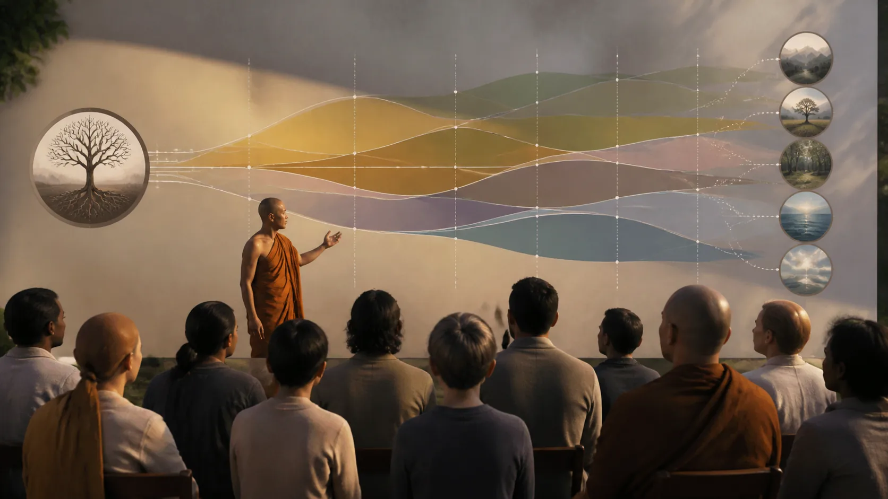

# Theravāda Và Khoa Học Hiện Đại — Điểm Gặp, Giới Hạn Và Lối Tắt Sai

## 1. Hai Phương Pháp Có Thể Đối Thoại Mà Không Hóa Thành Một

Theravāda và khoa học hiện đại có thể gặp nhau ở những câu hỏi có thể vận hành hóa: một chương trình thiền ảnh hưởng thế nào đến triệu chứng lo âu, đau, chú ý hay chất lượng sống; người tham gia gặp tác dụng bất lợi nào; thay đổi tự báo cáo có đi cùng chỉ dấu sinh lý hoặc thần kinh nào. Khoa học mạnh khi câu hỏi, phép đo, nhóm so sánh và độ bất định được nêu rõ.

Giáo pháp lại đặt các phép thực hành trong giới, định, tuệ và mục tiêu chấm dứt khổ. **Sati — đọc gần đúng “sa-ti” — niệm, khả năng nhớ biết đúng đối tượng và mục tiêu** không nhất thiết đồng nghĩa “mindfulness” trong mọi can thiệp lâm sàng. Một chương trình tám tuần, một bài tập chú ý và một con đường giải thoát không phải ba tên của cùng một vật.

Đối thoại tốt bắt đầu bằng câu hỏi vừa cỡ. “Thiền có giúp một số người giảm một số triệu chứng không?” có thể nghiên cứu. “Máy quét não đã chứng minh toàn bộ Phật pháp chưa?” là câu hỏi lẫn phạm vi. Cộng hưởng khái niệm có thể gợi giả thuyết; nó không tự trở thành xác nhận thực nghiệm.

## 2. [Thẩm tra lời dạy qua hậu quả thiện và bất thiện](https://suttacentral.net/an3.65): Thẩm Tra Không Đồng Nghĩa Chỉ Tin Điều Phòng Thí Nghiệm Đo Được

> [!quote] Nguồn Kinh dễ hiểu
> **Tên dễ hiểu:** Thẩm tra lời dạy qua hậu quả thiện và bất thiện
> **Nằm ở đâu:** *Kesamutti Sutta*, bài 3.65 của Tăng Chi Bộ Kinh (*Aṅguttara Nikāya*)
> **Đoạn này nói gì:** Đoạn Kinh bảo người Kālāma không dựa riêng vào truyền khẩu, truyền thống, suy luận hay uy tín của thầy; khi tự biết một pháp bất thiện, đáng chê và dẫn đến khổ thì hãy từ bỏ.
> **Mã kiểm chứng:** [`AN 3.65`, đoạn `an3.65:4.1–4.3`](https://suttacentral.net/an3.65)
> **Pāli gốc:** *Etha tumhe, kālāmā, mā anussavena, mā paramparāya, mā itikirāya, mā piṭakasampadānena, mā takkahetu, mā nayahetu, mā ākāraparivitakkena, mā diṭṭhinijjhānakkhantiyā, mā bhabbarūpatāya, mā samaṇo no garūti. Yadā tumhe, kālāmā, attanāva jāneyyātha: ‘ime dhammā akusalā, ime dhammā sāvajjā, ime dhammā viññugarahitā, ime dhammā samattā samādinnā ahitāya dukkhāya saṁvattantī’ti, atha tumhe, kālāmā, pajaheyyātha.*
> **Dịch sát nghĩa:** Này những người Kālāma, chớ chỉ dựa vào truyền khẩu, truyền thống, lời đồn, sự lưu truyền trong tuyển tập, suy luận logic, suy diễn, cân nhắc vẻ ngoài, sự chấp thuận một quan điểm sau khi suy xét, vẻ có năng lực của người nói, hay ý nghĩ “vị sa-môn này là thầy của chúng ta”. Khi chính các vị biết: “Các pháp này là bất thiện, đáng chê, bị người trí khiển trách; khi được thực hiện và tiếp nhận, chúng dẫn đến bất lợi và khổ”, khi ấy hãy từ bỏ chúng.
> **Nói nôm na:** Đừng tin chỉ vì điều đó lâu đời, nghe hợp lý hoặc do người có uy tín nói. Hãy kiểm tra tác động đạo đức, hậu quả và lời đánh giá của người có trí.
> **Vì sao dùng ở đây:** Đoạn này cung cấp kỷ luật thẩm tra cho cuộc đối thoại với khoa học, nhưng không biến Kinh thành khẩu hiệu “chỉ tin điều phòng thí nghiệm đo được”.

[Thẩm tra lời dạy qua hậu quả thiện và bất thiện](https://suttacentral.net/an3.65) không ban khẩu hiệu “hãy tin trải nghiệm cá nhân hơn mọi nguồn”. Danh sách bác việc dựa **chỉ** vào nhiều thẩm quyền nhận thức, rồi văn cảnh đưa thêm hậu quả, đánh giá đạo đức và nhận định của người trí. Trải nghiệm cũng có thể bị kỳ vọng, ký ức, ham muốn và trạng thái bệnh lý làm lệch.

Khoa học có họ hàng với tinh thần thẩm tra ở chỗ công khai phương pháp, cho phép phản biện và sửa sai. Nhưng bài Kinh không phải bản tiên tri về thử nghiệm ngẫu nhiên, và khoa học không độc quyền mọi câu hỏi giá trị. Đạo đức của không tham, không sân, không si không thể giản lược thành một tín hiệu thống kê.

## 3. [Năm uẩn không phải là tự ngã](https://suttacentral.net/sn22.59): Vô Ngã Là Phép Quán, Không Phải Kết Luận Từ Não Bộ

> [!quote] Nguồn Kinh dễ hiểu
> **Tên dễ hiểu:** Năm uẩn không phải là tự ngã
> **Nằm ở đâu:** *Anattalakkhaṇa Sutta*, bài 22.59 của Tương Ưng Bộ Kinh (*Saṁyutta Nikāya*)
> **Đoạn này nói gì:** Đoạn trích nói sắc không phải tự ngã: sắc dẫn đến bức bách và ta không thể ra lệnh “sắc của tôi phải thế này, đừng thế kia”.
> **Mã kiểm chứng:** [`SN 22.59`, các đoạn `sn22.59:2.1`, `sn22.59:2.4`, `sn22.59:2.5`](https://suttacentral.net/sn22.59)
> **Pāli gốc:** *“Rūpaṁ, bhikkhave, anattā. Yasmā ca kho, bhikkhave, rūpaṁ anattā, tasmā rūpaṁ ābādhāya saṁvattati, na ca labbhati rūpe: ‘evaṁ me rūpaṁ hotu, evaṁ me rūpaṁ mā ahosī’ti.*
> **Dịch rút gọn có đánh dấu:** Này các tỳ-kheo, sắc không phải tự ngã. Và vì sắc không phải tự ngã, sắc dẫn đến bức bách, và không thể có quyền đối với sắc rằng: …
> **Nói nôm na:** Thân không phải tài sản nằm hoàn toàn dưới quyền điều khiển của một cái tôi; chính giới hạn ấy là đối tượng để quán sát.
> **Vì sao dùng ở đây:** Đoạn này giữ vô ngã trong đúng phép quán về sắc, thay vì biến một ảnh não hoặc tương quan thần kinh thành bằng chứng cho giáo lý.

**Anattā — đọc gần đúng “a-nát-ta” — không phải tự ngã, vô ngã** trong đoạn này được áp vào sắc và gắn với bức bách cùng việc không thể ra lệnh cho sắc. Khoảng dòng trong khối đánh dấu các segment trung gian không nằm trong phạm vi trích; segment thứ hai được chỉ định dừng ở dấu hai chấm, nên bài không tự điền phần Pāli tiếp theo. Toàn [Năm uẩn không phải là tự ngã](https://suttacentral.net/sn22.59) tiếp tục phép thẩm tra đối với năm uẩn, nhưng khối trên chỉ tái bản đúng phạm vi nguồn đã khóa.

Nghiên cứu thần kinh có thể tìm tương quan giữa thực hành, chú ý, cảm nhận thân và hoạt động hay cấu trúc não. Một tương quan thần kinh không đồng nhất với anattā; nó cũng không chứng minh hay bác bỏ anattā. “Cái tôi được kiến tạo” trong một mô hình nhận thức và “uẩn không nên được xem là tôi/của tôi/tự ngã của tôi” có thể cộng hưởng, nhưng mục tiêu và tiêu chuẩn chứng minh khác nhau.

## 4. Khoa Học Thật Sự Cho Phép Nói Gì Về Thiền

Tổng quan hệ thống và phân tích gộp của Goyal và cộng sự (2014) xem xét các chương trình thiền cho căng thẳng và an sinh. Kết quả cho phép nói thận trọng rằng một số chương trình có bằng chứng mức vừa hoặc thấp cho cải thiện nhỏ đến vừa ở một số kết cục như lo âu, trầm cảm và đau; nó không cho phép tuyên bố thiền chữa mọi bệnh, hiệu quả với mọi người hay vượt mọi điều trị tích cực. [PubMed: Goyal et al., 2014](https://pubmed.ncbi.nlm.nih.gov/24395196/), DOI `10.1001/jamainternmed.2013.13018`.

Tang, Hölzel và Posner (2015) tổng quan các cơ chế và tương quan thần kinh được đề xuất cho thiền chánh niệm. Công trình hữu ích để hình thành mô hình về kiểm soát chú ý, điều hòa cảm xúc và tự nhận biết, đồng thời chính loại bằng chứng này phụ thuộc vào thiết kế nghiên cứu, định nghĩa thực hành và khả năng suy luận từ tương quan. Nó không xác lập một “não giác ngộ”. [PubMed: Tang, Hölzel & Posner, 2015](https://pubmed.ncbi.nlm.nih.gov/25783612/), DOI `10.1038/nrn3916`.

Các kết quả trung bình không dự báo chắc cho từng cá nhân. “Thiền” bao gồm nhiều kỹ thuật, liều lượng, giáo viên và quần thể. Hiệu ứng trong người mới, hành giả lâu năm và bệnh nhân không thể đổi chỗ tùy ý. Lợi ích về triệu chứng cũng không phải bằng chứng cho quả vị, Chánh kiến hay sự tận tham-sân-si.

## 5. Phương Pháp Luận: Định Nghĩa, Nhóm Đối Chứng Và Sự Cường Điệu

Van Dam và cộng sự (2018) cảnh báo rằng nghiên cứu mindfulness thường gặp sự mơ hồ về khái niệm, phép đo tự báo cáo không đồng nhất, nhóm đối chứng yếu, thiên lệch xuất bản và diễn giải vượt dữ liệu. Một nghiên cứu cho thấy thay đổi sau khóa học chưa đủ tách hiệu ứng của kỹ thuật khỏi kỳ vọng, hỗ trợ nhóm, thời gian nghỉ, quan hệ với giáo viên hoặc hồi quy về trung bình. [PubMed: Van Dam et al., 2018](https://pubmed.ncbi.nlm.nih.gov/29016274/), DOI `10.1177/1745691617709589`.

Ảnh não đặc biệt dễ bị kể chuyện quá mức. Khác biệt giữa hai nhóm có thể là tương quan với tự chọn, lối sống hoặc kinh nghiệm trước đó. Ngay cả thiết kế dọc cũng cần cỡ mẫu, tiền đăng ký, hiệu chỉnh nhiều phép thử và tái lập. Một vùng não “sáng lên” không cho biết một mệnh đề Phật học là đúng.

Kỷ luật tốt gồm: định nghĩa chính xác can thiệp; nêu quần thể; ưu tiên đối chứng tích cực phù hợp; báo cả kết quả âm và bất lợi; phân biệt ý nghĩa thống kê với ý nghĩa lâm sàng; tránh chuyển từ “liên hệ” sang “gây ra”. Khi bằng chứng hỗn hợp, câu trả lời trung thực là hỗn hợp.

## 6. Tác Dụng Bất Lợi Và Hướng Dẫn An Toàn

Tổng quan hệ thống của Farias và cộng sự (2020) ghi nhận các tác dụng bất lợi liên quan thực hành thiền và nhấn mạnh nhu cầu báo cáo an toàn tốt hơn. Những trải nghiệm được báo cáo có thể gồm lo âu, trầm cảm, bất thường nhận thức, suy giảm chức năng và các vấn đề khác; tỷ lệ rất khó ước tính chắc vì định nghĩa và cách theo dõi không đồng nhất. Không nên dùng dữ liệu này để dọa mọi người bỏ thiền, cũng không nên giấu nó để bảo vệ hình ảnh của thiền. [PubMed: Farias et al., 2020](https://pubmed.ncbi.nlm.nih.gov/32820538/), DOI `10.1111/acps.13225`.

Khởi đầu bằng thời lượng vừa phải, giữ ngủ, ăn, vận động và liên hệ xã hội ổn định. Người có tiền sử chấn thương, hoảng loạn, phân ly, hưng cảm hoặc loạn thần nên trao đổi với chuyên gia y tế hiểu hoàn cảnh của mình và giáo viên có năng lực; không tự tăng cường nhập thất hay thiếu ngủ. Thực hành không thay thuốc hoặc trị liệu đã được kê mà không có trao đổi chuyên môn.

Nếu xuất hiện mất ngủ tăng dần, hoảng, phân ly, cảm giác mất thực tại, hưng phấn bất thường, niềm tin mình có quyền năng/sứ mệnh đặc biệt, suy giảm khả năng làm việc hoặc ý nghĩ tự hại: dừng tăng cường, giảm hoặc tạm ngưng thực hành, tìm người đáng tin, giáo viên có trách nhiệm và chuyên gia y tế. Với nguy cơ tự hại hay gây hại tức thời, liên hệ dịch vụ khẩn cấp địa phương. Không diễn giải một cơn khủng hoảng mặc nhiên là “thanh lọc” hay “tiến bộ tâm linh”.

## 7. Kỷ Luật Khẳng Định Và Sổ Nguồn

**Văn bản nói gì?** [Thẩm tra lời dạy qua hậu quả thiện và bất thiện](https://suttacentral.net/an3.65) bác việc dựa độc nhất vào truyền thống, suy luận, vẻ ngoài hay uy tín thầy và hướng đến tự biết hậu quả bất thiện, đáng chê, bị người trí khiển trách. [Năm uẩn không phải là tự ngã](https://suttacentral.net/sn22.59) áp phép thẩm tra không phải tự ngã vào sắc; đó là giáo huấn giải thoát, không phải giả thuyết khoa học thần kinh.

**Khoa học nói gì?** Ledger của bài hỗ trợ các tuyên bố giới hạn về một số kết cục lo âu, trầm cảm và đau; mô hình cơ chế thần kinh còn cần thận trọng; lĩnh vực có vấn đề định nghĩa, đối chứng và cường điệu; tác dụng bất lợi tồn tại và cần theo dõi. Các bài báo đều được dẫn và diễn giải, không sao chép văn bản có bản quyền.

**Bài này suy luận gì?** Theravāda và khoa học có thể hợp tác ở câu hỏi sức khỏe, nhận thức và an toàn đã vận hành hóa. Sự tương đồng giữa mô hình tâm lý, não bộ và ngôn ngữ Phật học là cầu tạo giả thuyết, không phải dấu bằng bản thể.

**Điều gì chưa được chứng minh?** Khoa học thiền không chứng minh kamma, tái sinh, Nibbāna, vũ trụ luận, anattā hay các sát-na tâm của Vi Diệu Pháp. Dữ liệu thần kinh không biến tương quan thành đồng nhất; khoảng trống khoa học cũng không phải bằng chứng cho một tuyên bố siêu hình.

Đọc trước: [[35 - Paṭṭhāna - Hai Mươi Bốn Duyên Và Mạng Điều Kiện]]. Đọc tiếp: Hoàn tất chương trình 36 bài; quay về [[theravada/index|cổng Theravāda]].

**Nguồn và giấy phép:** Hai và chỉ hai khối Pāli lấy từ Bilara root Pāli MS, nhánh `published`, truy cập ngày 2026-08-20: [Thẩm tra lời dạy qua hậu quả thiện và bất thiện](https://suttacentral.net/an3.65) (`an3.65:4.1–4.2`) và [Năm uẩn không phải là tự ngã](https://suttacentral.net/sn22.59) (`sn22.59:2.1`, `sn22.59:2.4`), giấy phép CC0 1.0. Bản Việt là bản dịch làm việc nguyên gốc của redpill.wiki. Đối chiếu khoa học dùng bốn mục trong `_docs/theravada-batch6-science-evidence.json`: Goyal et al. (2014), Tang–Hölzel–Posner (2015), Van Dam et al. (2018), Farias et al. (2020); chỉ dẫn và diễn giải theo giấy phép tạp chí. Trạng thái toàn bài giữ `source_license_checked: true` cho đến khi hoàn tất kiểm toán xuất bản.
